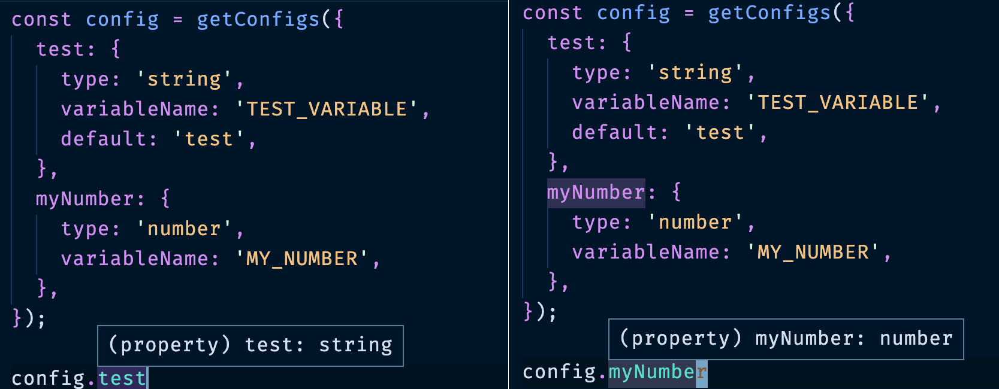

[Typescript](https://www.typescriptlang.org/) has been a huge introduction in the JS world, this language allows to have all the
benefit of javascript and the benefit of typed languages at the same time.

For me, it is really important since it was the technology that convinced me to
start work in nodejs and in web technology seriously (I come from static typed languages
such as C++).

Working on complex typescript project with lot's of configurations coming from
environment variables, I was looking for a good typescript library that allowed me
to manage configurations over env variables with the power of typescript.

Unfortunatly, after some research, I wasn't able to find a library that was able to
satisfy me need. So I start implementing a very simple one with the following goals:

1. Allow me to configure with a simple object expected environment varaible names,
2. Allow me to specify the expected type of the configuration,
3. Panic if variable is not found or the contained values does not match confiured type.

# [env-ts-conf](https://github.com/ludusrusso/env-ts-conf)

[env-ts-conf](https://github.com/ludusrusso/env-ts-conf) is a simple typescript library that
satisfy my need.

You can define a simple configuration object as following

```typescript
import { getConfigs } from "env-ts-conf"

const config = getConfigs({
  test: {
    type: "string",
    variableName: "TEST_VARIABLE",
    default: "test",
  },
  myNumber: {
    type: "number",
    variableName: "MY_NUMBER",
  },
})
```

and get back a typed object `config` with the following interface:

```typescript
interface Config {
  test: string
  myNumber: number
}
```



# Features

1. Simple to use
2. Configuration output is typed
3. Supports `number`, `string` and `boolean`
4. Supports default values,
5. Panic at starup if configuration is not found

# Contribution

The library has been just released and is not yet super perferct. If you like
to help me improve it, feel free to [submit an issue or a pull request on github](https://github.com/ludusrusso/env-ts-conf)!
