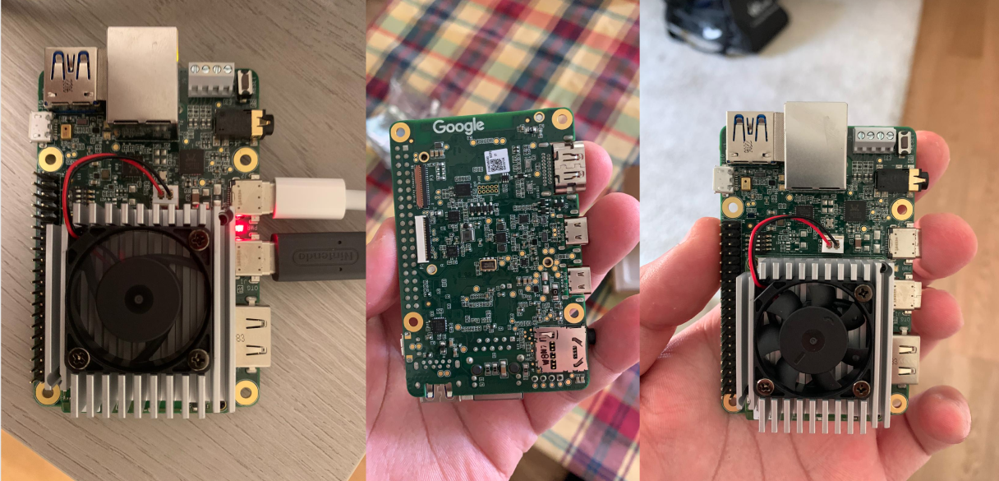
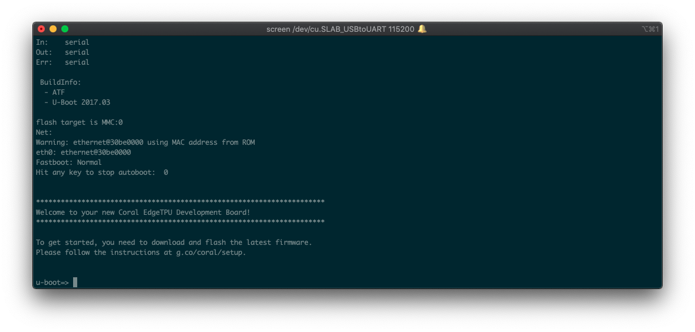

I heard about Coral AI dev Board during a Google event here in Milan last February.

Coral AI dev Board is a Raspberry Pi like board with an embedded TPU on board.
TPU are a new kind of processing unit optimized for Tensor processing (i.e., matrix multiplication)
and are super suitable to run deep learning and AI algorithms.

In particular, the Coral dev board is able to run tensorflow light, a light version of tensorflow
designed for embedded and low power computation. You cannot (or better, it is not good for) model
training onboard, but once you trained a model on a laptop or a cloud system, you can export it and run
efficielty on the board.

# Testing and getting started

I did not have much time to work on my new Coral, but I was able to run it and start some demo
to start learning how is working. Here are some impressions.

## Not easy to start

The dev board is not super easy to start.
It's not a plut&play device but you need to flash the board with
the operative system (Mendel Linux) before using it.
[The procedure](https://coral.ai/docs/dev-board/get-started) takes some times (about 10 minutes for me) and requires
some proficiency with linux and low level OS operations (and 3 USB cables). Anyway, I was able to complete
it 😀

## TPU for Computer Vision

Once flashed, you can log in on the device using the terminal over serial communication and start
interact with the board. I've run the getting started example that runs a webserver were you can see
a real time video elaboration performed by the board using the onboard TPU and compare the performance
with the same algorithm runned on the board CPU.

Here are some results!

  
  

While with the TPU enable video processing reach 70 fps, with only CPU it's around 2.5 fps!

# What should I do?

I need some ideas! What should I do with my new Coral Dev Board? Any ideas?
