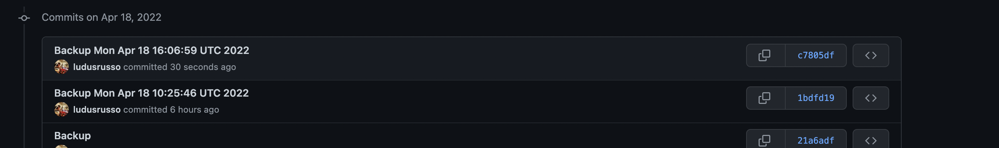
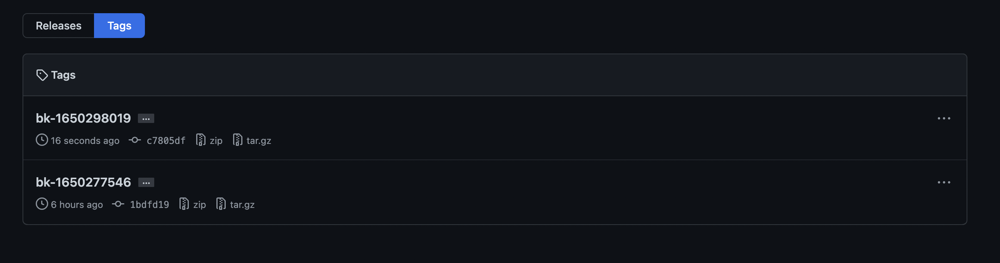
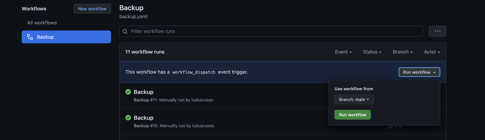

When hosting a server, database backup is an important procedure to run periodically properly reponde to incident or data loss.
Usually, database backup are performed on the same machine where the database is hosted using cronjob or scheduled task and
backups are stored on cloud providers like AWS S3, Google Cloud Storage, etc, where cost is really small (some cents per month).

However, for small applications, like a blog, there is a simpler and cheaper solution (pratically free), that is storing database backup
direcly on a private github repo.

This procedure is even more simple thanks to github actions that allows to run an action periodically.

In this post, I show you how to leverage a scheduled GitHub actions to periodically backup a small database on a github repo.

### Limitaiton

This solutions works with small databases that does not change very often. In my case this is done for a small blog that I've build for
my wife. The blog is hosted on a kubernetes cluster with a dedicated database (I know, it's too much but I've also created it for fun 😅)
and posts are updated few times a month.

If you are curious, you can find the [blog here](https://github.com/farmaceutica-younger/www.farmaceuticayounger.science).

This solutions does not work with big database that change often, this is because github has a limited amount of data you can store on
a single repo, and in general git is not for backups but for code. But if you a have a pet project with a small database, you can use this solution.

## Creating the Action

Les't start creating a new private github repo that will host the database backups and the github action definition.
The action will connect to the database, perform database backup (in my case pg_dump) and commit the changes in the local reposiroty.

We need to create a file in `.github/workflows/` called `backup.yml` that will contain the definition of the action.

We will leverage two open github actions:

- [https://github.com/tj-actions/pg-dump](pg_dump) to perform database backup.
- [Add and Commit](https://github.com/EndBug/add-and-commit) to commit changes on the local repo.

Moreover, to connect to the database on kubernetes, we can leverage the github action service container to perform port forwording as
described in my [previous blog post](/2022/04/github-action-kube-port-fwd).

Here is the complete action

```yaml
name: Backup

on:
  schedule:
    - cron: "0 0 * * *"
  workflow_dispatch:

jobs:
  backup:
    permissions:
      contents: write
    runs-on: ubuntu-latest
    steps:
      - name: Checkout
        uses: actions/checkout@v2
      - name: Get Vars
        id: get_vars
        run: |
          echo "::set-output name=date::$(date)"
          echo "::set-output name=ts::$(date +%s)"
      - run: sleep 2
      - name: Postgres Dump Backup
        uses: tj-actions/pg-dump@v2.3
        with:
          database_url: ${{ secrets.DATABASE_URL }}
          path: "backups/backup.sql"
          options: "-O"
      - uses: EndBug/add-and-commit@v9 # You can change this to use a specific version.
        with:
          add: "backups"
          author_name: <your name>
          author_email: <your email>
          commit: --allow-empty
          default_author: github_actions
          message: "Backup ${{ steps.get_vars.outputs.date }}"
          tag: "bk-${{steps.get_vars.outputs.ts}}"
    services:
      db:
        image: ghcr.io/ludusrusso/kubectl-with-env-config:958062ab64ccfa815aa2f931c03f72a2a670232a
        env:
          KUBECONFIG: "${{ secrets.KUBE_CONFIG }}"
          NAMESPACE: "${{ secrets.NAMESPACE }}"
          POD: "${{ secrets.POD }}"
          PORTS: 5432:5432
        ports:
          - 5432:5432
```

Before pushing to the reposiroty, we also need to create a file `backups/.gitkeep` in order to create the folder `backups` where
the backup will be stored.

## Using the actions

Once committed and pushed, the action will automatically run every day at midnight. Backups will be stored
in the `backups/bakckps.sql` file in the github repo. And each backup will be tagged with timestamp
of the backup itself.




You can also run the action manually on the "action" tab on github.


