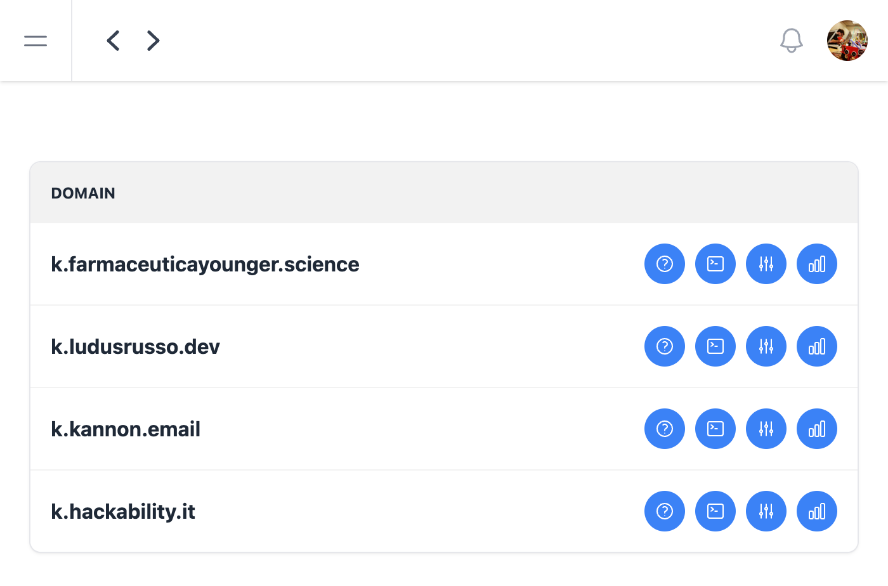
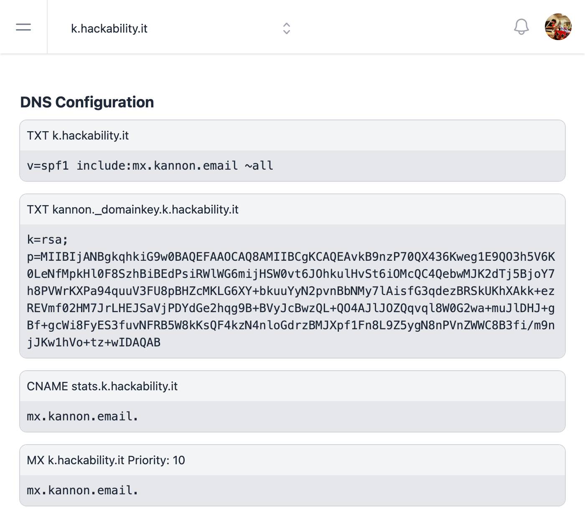
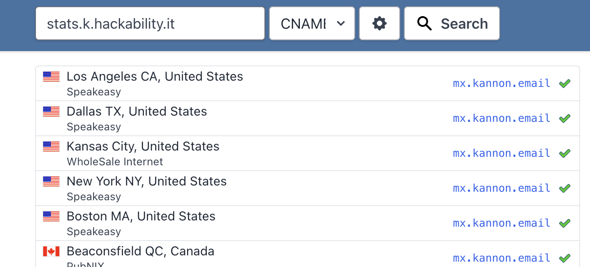
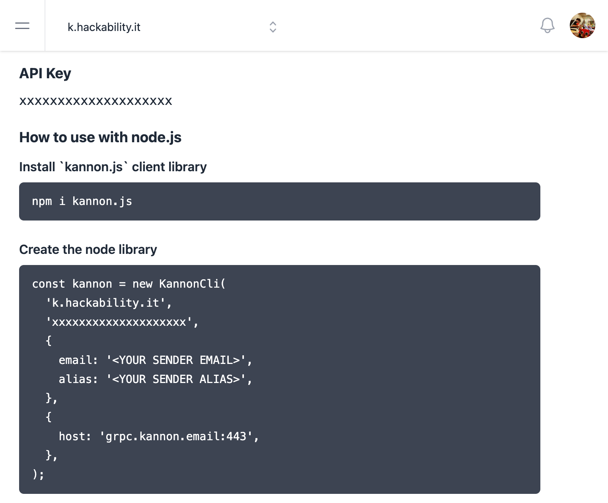
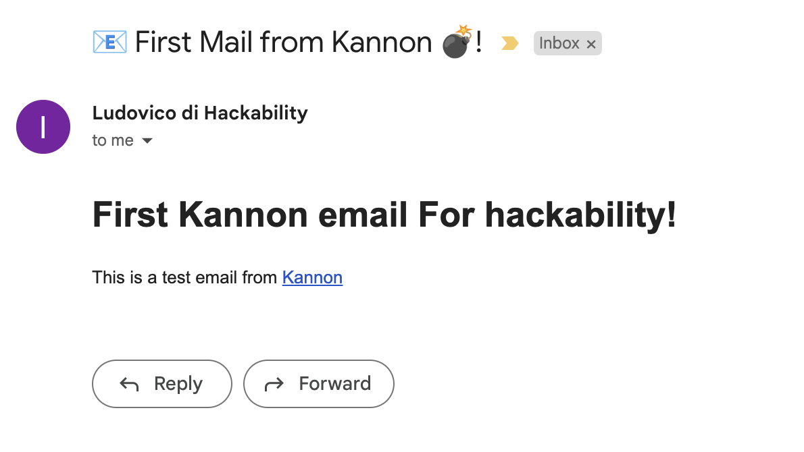
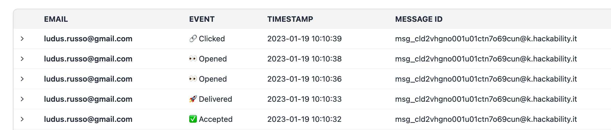
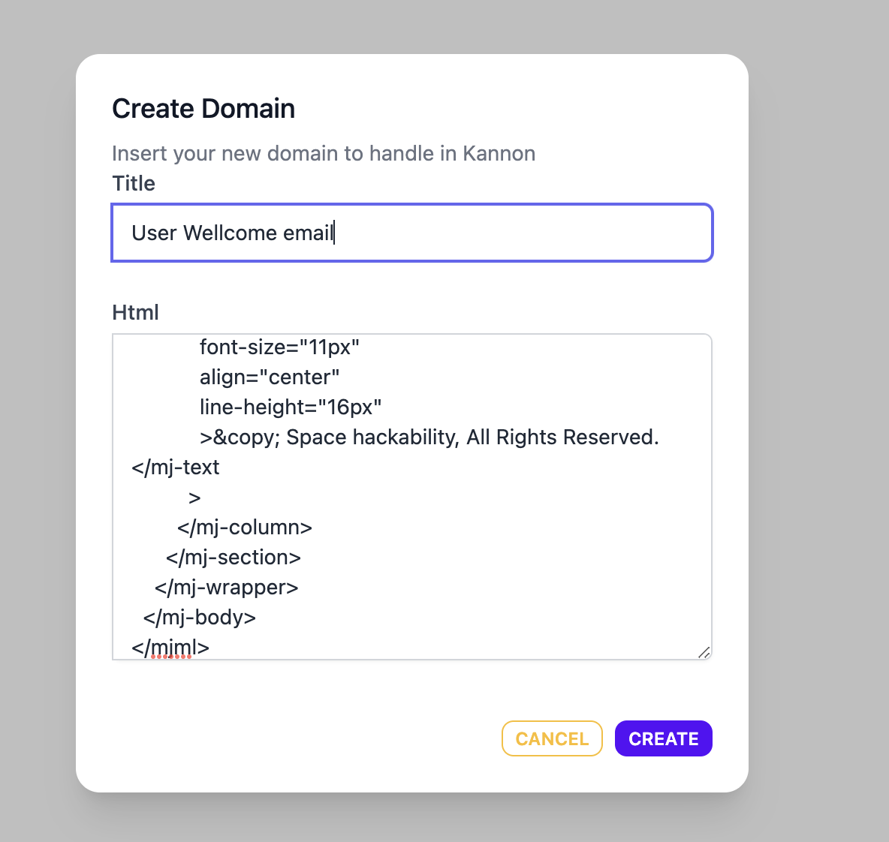
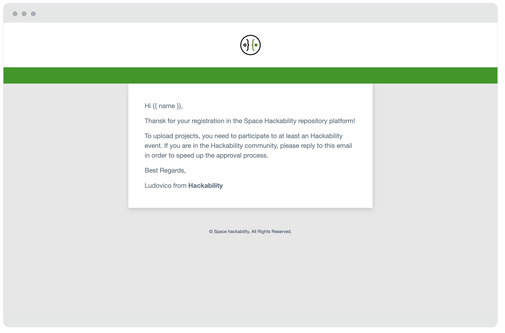
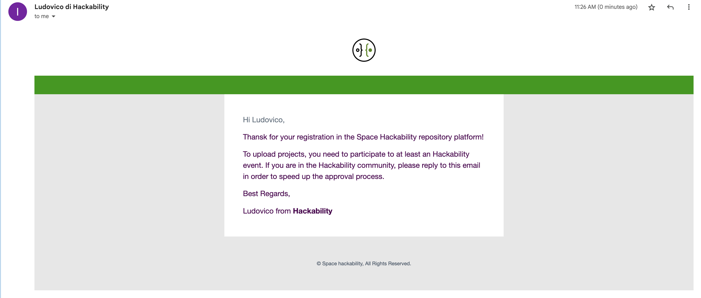

During the last couple of years, I've worked on a side project called [kannon](https://github.com/kannon-email/kannon), an
Open Source massive email sender service based on kubernetes and cloud native technologies.

I've worked on this project mainly for fun, and it was super usefull as a
lab to try new technologies and learn new things. Working on kannon, I've
became proficient in golang and I've experimented with kubernetes, gRPC, nats etc.

When kannon became more stable, I've started using it as main email sender server for other of my personal projects,
I've deployed it on [kuebernello](/2022/09/kubernello) and I've successfully use it to send thousands of emails
from [Farmaceutica Younger](https://www.farmaceuticayounger.science/), the site of an association I've founded with
my wife and some friends.

I was so happy with the experience with kannon that I've started to think about try to create a real service from it,
so I've designed a Web GUI around the Open Source core that I've called [kannon.email](https://www.kannon.email).

In this blog post, I want to show you how to integrate kannon.email in a NextJS project to send transactional emails.
I'm using [Space hackability](https://space.hackability.it) as an example, a platform I'm working on for the [Hackability Association](https://hackability.it/).

Space hackability is a NextJS project based on the t3 stack I'm working on for the Hackability Association.

## Getting started with the domain and DNS configuration

Starting from the Kannon dashboard, I've already created a new domain `k.hackability.it`.

<InfoBox title="Choose a Subdomain">
In order to avoid conflicts with the default email server, I usually prefer to choose a subdomain to send my emails from Kannon. My standard is to use the subdomain in the form `k.<your main domain>`.
</InfoBox>



Once a domain is created, we can access the DNS Configuration page, which helps you to configure DNS in order to send emails correctly from Kannon. You have to configure two TXT DNS records (required to add SPF and DKIM authentication and authorization to Kannon email sender), and a CNAME and an MX server required to track stats.



We should wait for the DNS to propagate correctly before starting to send emails. To check that, I use one of the several DNS track services available on the internet.



## Start Writing Code to Send Email in Kannon with Node.js

Once DNS are propagated, we can start writing our Node.js client with the help of kannon.js, a simple Node library to start using the service.

In the code page of the platform, you will find a simple getting started example code that you can use to implement the client. You need to use your API client available from the console.



We can test if everything is working by writing a simple script in TypeScript that sends a simple email.

```typescript
import { KannonCli } from "kannon.js";

const kannon = new KannonCli(
  "k.hackability.it",
  process.env.KANNON_KEY as string,
  {
    email: "ludovico@hackability.it",
    alias: "Ludovico di Hackability",
  },
  {
    host: "grpc.kannon.email:443",
  }
);

const html = `<html>
<body>
	<h1>First Kannon email For hackability!</h1>
	<p>This is a test email from <a href="https://www.kannon.email">Kannon</a></p>
</body>
</html>`;

async function main() {
  return kannon.sendHtml(
    [
      {
        email: "ludus.russo@gmail.com",
        fields: {},
      },
    ],
    "📧 First Mail from Kannon 💣!",
    html
  );
}

main().then((res) => console.log(res));
```

By running this script, you should be able to receive the email on your client in a few seconds. In addition, you should be able to track stats (delivered, opens, etc.) from the Kannon dashboard in the stats page of your domain.




## Create an email template in MJML

In addition to sending emails directly from HTML, Kannon allows you to create email templates using the MJML syntax. This way, you can easily use the email template ID in the code to send the email, and manage and update the template from the platform.

I've created an MJML template using the [MJML live tool](https://mjml.io/try-it-live). Here is the source code:

```html
<mjml>
  <mj-head>
    <mj-title> Wellcome in Space Hackability </mj-title>
    <mj-preview> 🚀 Wellcome in Space Hackability! </mj-preview>
    <mj-attributes>
      <mj-all
        font-family="'Helvetica Neue', Helvetica, Arial, sans-serif"
      ></mj-all>
      <mj-text
        font-weight="400"
        font-size="16px"
        color="#000000"
        line-height="24px"
        font-family="'Helvetica Neue', Helvetica, Arial, sans-serif"
      ></mj-text>
    </mj-attributes>
    <mj-style inline="inline"
      >.body-section { -webkit-box-shadow: 1px 4px 11px 0px rgba(0, 0, 0, 0.15);
      -moz-box-shadow: 1px 4px 11px 0px rgba(0, 0, 0, 0.15); box-shadow: 1px 4px
      11px 0px rgba(0, 0, 0, 0.15); }</mj-style
    >
    <mj-style inline="inline">.text-link { color: #5e6ebf }</mj-style>
    <mj-style inline="inline">.footer-link { color: #888888 }</mj-style>
  </mj-head>
  <mj-body background-color="#E7E7E7" width="600px">
    <mj-section full-width="full-width" background-color="white">
      <mj-column width="100px">
        <mj-image
          src="https://res.cloudinary.com/hackability/image/upload/v1654158486/space/images/njnb7qeajnrv8pkpeeb1.png"
          alt=""
          align="center"
          width="100px"
        ></mj-image>
      </mj-column>
    </mj-section>
    <mj-section
      full-width="full-width"
      padding-top="20px"
      background-color="#009900"
    >
    </mj-section>
    <mj-wrapper padding-top="0" padding-bottom="0px" css-class="body-section">
      <mj-section
        background-color="#ffffff"
        padding-left="15px"
        padding-right="15px"
      >
        <mj-column width="100%">
          <mj-text color="#637381" font-size="16px">
            <p>Hi {{ name }},</p>
            <p>
              Thanks for your registration in the Space Hackability repository
              platform!
            </p>
            <p>
              To upload projects, you need to participate to at least an
              Hackability event. If you are in the Hackability community, please
              reply to this email in order to speed up the approval process.
            </p>
            <p>Best Regards,</p>
            <p>Ludovico from <strong>Hackability</strong></p>
          </mj-text>
        </mj-column>
      </mj-section>
    </mj-wrapper>
    <mj-wrapper full-width="full-width">
      <mj-section>
        <mj-column width="100%" padding="0px">
          <mj-text
            color="#445566"
            font-size="11px"
            align="center"
            line-height="16px"
            >&copy; Space hackability, All Rights Reserved.</mj-text
          >
        </mj-column>
      </mj-section>
    </mj-wrapper>
  </mj-body>
</mjml>
```

We now need to create a new template in the Template Section



One created, the preview of the Template is visible from the template page.



<InfoBox title="Using custom fields">
  Note that I've used a custom fields `{{ name }}` in the email template. This
  fields can be populated when the email is sended in order to customize the
  email for every customer.
</InfoBox>
Now we can use the tempate_id to send email using our custom script, with just a
small edit in the main funciton

```typescript
async function main() {
  return kannon.sendTemplate(
    [
      {
        email: "ludus.russo@gmail.com",
        fields: {
          name: "Ludovico",
        },
      },
    ],
    "Wellcome in Space Hackability 🔨👨‍🦽!",
    "<TAMPLATE_ID>"
  );
}
```

And this is the email sent by the platform once the script is launched.



## Integrate Kannon in Next.js and NextAuth

What we want to do now is to automatically send emails when a user register to the platform. To do this, we can leverage con the `events` features of [NextAuth](https://next-auth.js.org/), in particular we can listen to the `userCreated` events. But first of all we need to create a class to handle emails.

I suggest to wrap the kannon cli with a class to easly manage emails all in one place, as in the following code:

```typescript
// email-sender.ts

import type { KannonCli } from "kannon.js";

const templates = {
  wellcomeUser: {
    id: "<TAMPLATE_ID>",
    subject: "Wellcome in Space Hackability 🔨👨‍🦽!",
  },
} as const;

export class EmailSender {
  constructor(private readonly kannonCli: KannonCli) {}

  sendWellcomeUserEmail(email: string, name: string) {
    return this.kannonCli.sendTemplate(
      [{ email, fields: { name } }],
      templates.wellcomeUser.subject,
      templates.wellcomeUser.id
    );
  }
}
```

Now we can use the `EmailSender` object to send wellcome emails when a user is created in next auth.

```typescript
const kannon = new KannonCli(
  env.KANNON_DOMAIN,
  env.KANNON_KEY,
  {
    alias: env.KANNON_ALIAS,
    email: env.KANNON_EMAIL,
  },
  {
    host: env.KANNON_HOST,
  }
);
const sender = new EmailSender(kannon);

export const authOptions: NextAuthOptions = {
  // ...
  events: {
    createUser: async ({ user }) => {
      await sender.sendWellcomeUserEmail(user.email, user.name);
    },
  },
};
```

Now, every time a user is created in the platform, it will receive this wellcome email.

## Next Steps

Integrating kannon with a nextjs service is super easy and super fast, from now on, I've configured the structure to add more transactional emails in hackability, like for projects update, request of publishing a new projects etc.

Are you building something interesting? Let me know if you'd like to use kannon and access the beta testing.
