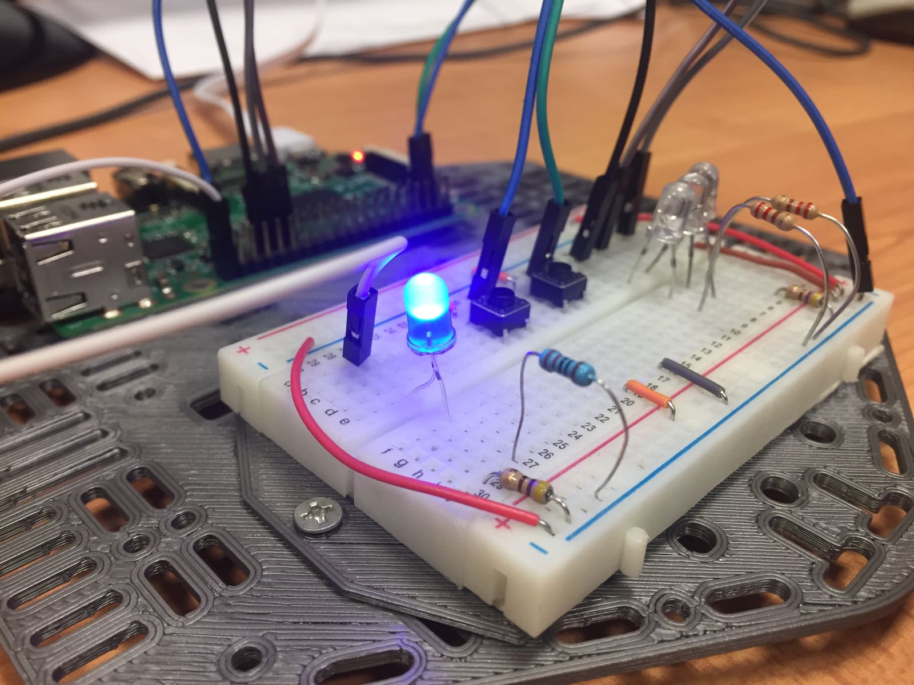

Ciao a tutti, iniziamo oggi questa serie di tutorial per insegnare a programmare i robot DotBot-ROS dalla piattaforma di cloud robotics che stiamo sviluppando: **HB Cloud**.



Questo primo tutorial è dedicato all'accensione e allo spegnimento del Led, e si basa sulla versione beta del sistema operativo **HBrain** (v0.3.2). Scrivo questo tutorial in preparazione al percorso di alternanza scuola lavoro con l'ITIS Avogadro di Torino. Se qualcuno volesse però provare per conto proprio ad utilizzare la piattaforma ci contatti in privato per ricevere supporto.

## Cos’è HB Cloud?

**HB Cloud** è una piattaforma di cloud robotics che stiamo sviluppando in **HB Robotics**. Lo scopo è quello di permettere a makers, studenti e non professionisti di imparare in modo semplice l'utilizzo di tecnologie innovative nel mondo della Cloud Robotics, ed in particolare su ROS.

Il nostro scopo è quello di semplificare lo sviluppo e la gestione di applicazioni robotiche! **HB Cloud** si interfaccia automaticamente con **HBrain**, un sistema operativo da noi sviluppato per Raspberry Pi che include il framework ROS (Robot Operating System).

## Scriviamo il primo codice per accendere un LED

### Circuito Elettrico

Il codice python per la gestione di un led è molto semplice, ma prima di tutto è importante sviluppare il circuito. Colleghiamo l'anodo del Led al Pin GPIO05 del Raspberry Pi. Colleghiamo il catodo ad uno degli estremi di una resistenza da 220Ohm, e mettiamo il secondo estremo della resistenza a massa.

### Codice

A questo punto, siamo pronti a scrivere un semplice programma per far blinkare il led, cioè per farlo accendere e spegnere in modo continuato ad una frequenza fissa. Adremo ad utilizzare le librerie python **gpiozero** e **dotbot_ros**.

- **gpiozero** è una libreria che permette la gestione dei pin GPIO del Raspberry Pi
- **dotbot_ros** è una versione semplificata di ROS appositamente sviluppata per l'applicazione.

### Scheletro dell'applicazione

Lo scheletro dell'applicazione che andremo a sviluppare ha la seguente forma

```python
import dotbot_ros

class Node(dotbot_ros.DotbotNode):
    node_name = 'blink'

    def setup(self):
        pass

    def loop(self):
        pass
```

Come per arduino, dovremmo implementare due funzioni:

- la funzione `setup`, che viene chiamata una volta all'inizio del programma.
- la funzione `loop`, che viene chiamata in modo iterativo fino allo stop forzato del programma.

Bisogna inoltre settare la variabile di classe `node_name`, che rappresenta il nome del nodo che abbiamo sviluppato in ROS. In questo caso, il nostro nodo si chiamerà `blink`.

Nota Bene: In Python, la direttiva `pass` significa letteralmente `non fare niente`.

### Configurazione della frequenza di Iterazione

Utilizzando `dotbot_ros`, possiamo decidere in modo semplice a che frequenza far iterare la funzione `loop`. In altre parole, se settimano la frequenza di iterazione a (per esempio) 10Hz, loop verrà chiamata 10 volte al secondo.

Per farlo, bisogna settare una variabile chiamata `self.loop_rate` all'interno della funzione `setup`. Se questa variabile non viene settata, la funzione loop non verrà mai chiamata.

Implementiamo quindi la funzione `setup` in modo da settare `self.loop_rate` a 2Hz

```python
    def setup(self):
        self.loop_rate = dotbot_ros.Rate(2)
```

Perfetto, adesso siamo certi che la funzione `loop` verrà chiamata 2 volte al secondo!

### Importiamo l'oggetto LED la libreria gpiozero

Possiamo ora iniziare ad usare la libreria **gpiozero** ed in particolare l'oggetto `LED`.
Per farlo, prima di tutto, importiamolo con la seguente linea di codice

```
from gpiozero import LED
```

A questo punto siamo pronti ad inizializzare un oggetto di tipi `LED`. Ricordo che abbiamo collegato il nostro led al pin `GPIO05`. Nella funzione `setup` dovremo quindi creare un nuovo oggetto `self.led` associato al PIN numero 5

```python
    def setup(self):
        self.loop_rate = dotbot_ros.Rate(2)
        self.led = LED(5)
```

Come vedete, il tutto è molto semplice. Si noti che ho "appeso" l'oggetto appena creato (`led`) alla variabile `self`. In questo modo posso utilizzarlo all'interno delle altre funzioni della nostra classe `Node`, ed in particolare all'interno della funzione `loop`.

### Blink del Led

A questo punto non ci resta che far blinkare il led. Per farlo dobbiamo implementare un codice che faccia sì che il led si spenga se è acceso e viceversa ogni volta che la funzione `loop` viene chiamata. Per farlo, **gpiozero** mette a disposizione un utilissimo metodo di LED chiamata `LED.toggle()`, che non fa altro che fargli cambiare stato.

Implementiamo la funzione `loop`, quindi, come segue

```python
    def loop(self):
        self.led.toggle()
```

### Codice completo

Ecco il codice appena sviluppato

```python
import dotbot_ros
from gpiozero import LED

class Node(dotbot_ros.DotbotNode):
    node_name = 'blink'

    def setup(self):
        self.led = LED(5)
        self.loop_rate = dotbot_ros.Rate(2)

    def loop(self):
        self.led.toggle()
```
