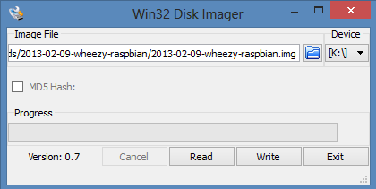

## Immagine SD

Scaricate qui l'immagine.

<a href="https://sourceforge.net/projects/hbrain/" type="button" class="btn btn-lg btn-info">Scarica l'immagine</a>

## Configurazione (Windows)

Scaricate da Internet **Win32DiskImager**.

Inserite l'SD dentro il PC e vi comparirà come nuovo dispositivo. A me prende il nome "G:".

In "Image file" andate ad inserire il percorso file dove avete l'immagine e a fianco nella sezione "Device" mettete il dispositivo relativo alla vostra SD (nel mio caso G:).

Premendo il pulsante "Write" iniziate a scrivere sulla SD!
