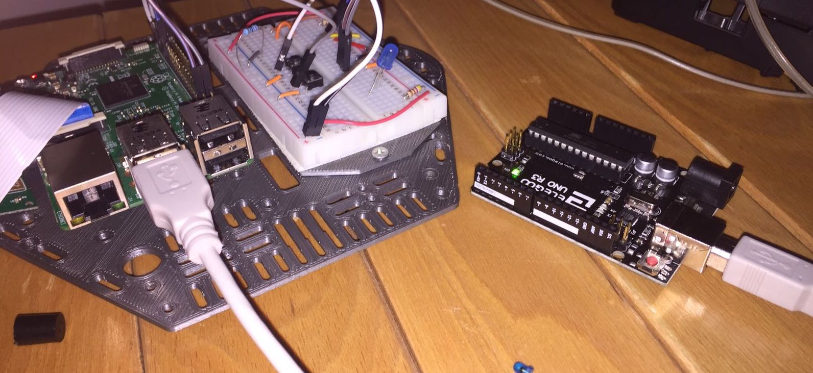

Solitamente, quando devo imparare ad utilizzare una nuova tecnologia, cerco di inventarmi un progetto interessante che potrebbe essere sviluppato con questa tecnologia e mi impegno a portarlo avanti fino alla fine. Quando ho iniziato ad interessarmi a Flask e Python, ho ideato il progetto che vi presento oggi, proprio per motivarmi ad imparare ad utilizzare bene questa libreria.



## Idea e Sviluppo

L'idea di base era quella di sviluppare un semplice IDE web per Arduino, che mi permettesse di sviluppare codice su un Arduino direttamente connesso ad un Raspberry Pi (ormai sapete che utilizzo tantissimo entrambi questi Hardware), ma senza la scomodità di dover utilizzare direttamente l'interfaccia grafica del Raspberry Pi per programmare.

Quindi lo scenario di utilizzo è il seguente (si vede che sono un PhD? Solo i PhD parlano di scenari di utilizzo :D):

- Arduino collegato via USB a Raspberry Pi
- Raspberry Pi connesso ad una rete WiFi o Ethernet local
- Un computer/tablet/smartphone connesso alla stessa rete

Il progetto doveva permettere di programmare Arduino e di accedere al monitor seriale (esattamente come fa l'IDE Arduino ufficiale).

## Installazione

Trovate tutto il codice sviluppato a questo <a href="https://github.com/ludusrusso/arduino-compiler-web">link GitHub</a>. Per utilizzarlo è necessario accedere alla shell del Raspberry Pi e configurarlo come segue:

### Installazione Dipendenze

Prima di tutto dobbiamo installare le dipendenze, che sono:

- Arduino-mk: un progetto che permette di interagire con Arduino da linea di comando
- pySerial: libreria Python per accedere alla porta seriale
- Flask: libreria Python per creare e gestire webapp

Arduino-mk si installa da apt-get da linea di comando

```bash
$ sudo apt-get install arduino-mk
```

Per le librerie Python, invece, conviene creare prima di tutto un virtualenv.

Per installare virtualenv basta eseguire il comando

```bash
$ sudo pip install virtualenv
```

Una volta installato, entriamo nella cartella dove mettiamo solitamente i nostri progetti (nel mio caso è `devs`), creiamo un ambiente virtuale e installiamo le dipendenze Python

```bash
$ virtualenv remote-arduino
$ cd remote-arduino
$ source bin/activate
(remote-arduino)$ pip install flask flask-bootstrap flask-script pyserial
```

A questo punto possiamo clonare la repository GitHub

```bash
git clone https://github.com/ludusrusso/arduino-compiler-web
```

Prima di lancare la webapp, dobbiamo informare il programma della scheda Arduino che utilizziamo e della porta a cui è collegato. Per farlo, bisogna esportare le seguenti variabili d'ambiente:

```bash
(remote-arduino)$ export ARDUINO_PORT=/dev/ttyACM0
(remote-arduino)$ export ARDUINO_BOARD=uno
```

In questo caso, utilizziamo un Arduino UNO collegato alla porta ttyACM0.

### Lanciare l'applicazione

Per lanciare l'app, basta entrare nella cartella `arduino-compiler-web` e lancaire il seguente comando

```bash
./manage.py runserver -h 0.0.0.0 --threaded
```

### Utilizzo della WebApp

A questo punto, da qualsiasi browser, collegandosi all'url `http://<IP RASPBERRY>:5000` accederemo all'applicazione.


Possiamo utilizzare l'editor di testo per scrivere codice


E installarlo su Arduino premendo il tasto <strong>Compile</strong>


Allo stesso modo, possiamo aprire e chiudere il serial monitor dai tasti <strong>Monitor</strong> e <strong>Stop</strong>


## Conclusioni

Questo progetto è ancora molto acerbo, ma mi ha permesso di sviluppare tantissime competenze in ambito di programmazione web in Python e Flask.

Avete dei commenti e suggerimenti su come migliorarlo? Scrivetemi sulla mia pagina <a href="http://facebook.com/ludusrusso.cc">facebook</a>.
