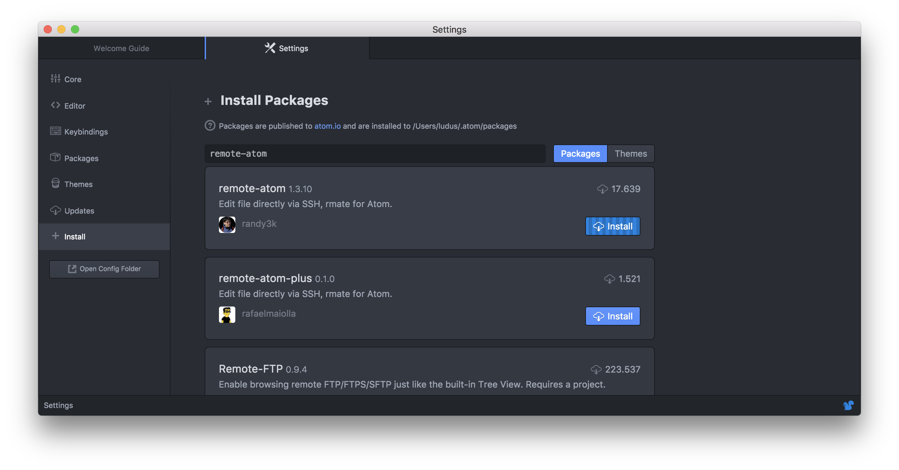
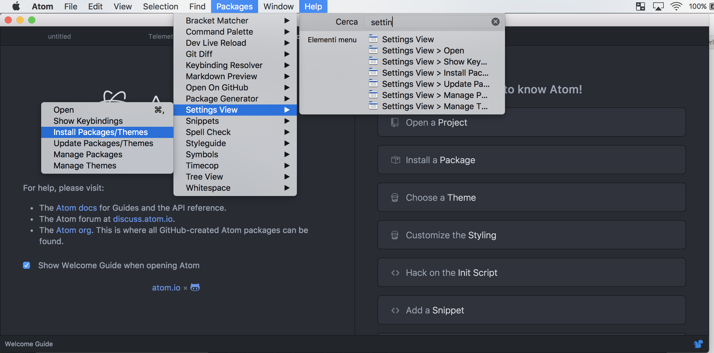
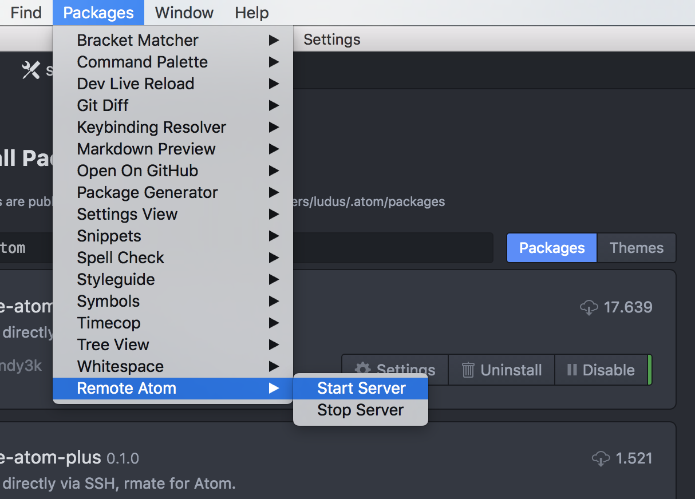
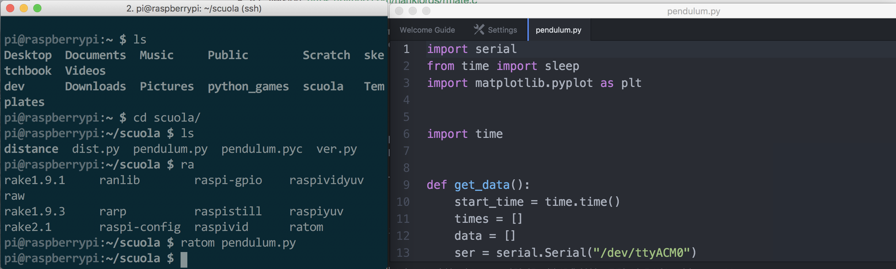

Chi ha letto i pochi articoli del blog che ho scritto, sa già che non sono solito utilizzare direttamente Raspberry Pi collegato ad un monitor, per una serie di motivi legati al fatto che il mio Raspberry è solitamente montato su un robot mobile.

Per questo motivo cerco spesso varie soluzioni per la programmazione remota del Raspberry Pi. Solitamente mi trovo molto bene con l'utilizzo dell'accoppiata Vim+Tmux via SSH (magari farò un post sulla cosa), però recentemente ho iniziato ad utilizzare Atom come editor di testo principale, e oggi voglio parlarvi di [**Remote-Atom**](https://atom.io/packages/remote-atom), un plugin molto semplice che permette di editare file su una macchina remota utilizzando Atom.

## Strumenti

È necessario possedere un Raspberry Pi con abilitato SSH, inoltre serve installare Atom sul computer da cui si vogliono editare i file. Atom si scarica e installa molto semplicemente da questo [link](https://atom.io).

## Configurazione di Remote Atom

Per prima cosa, è necessario installare Remote-Atom, per farlo, accediamo al pannello Packages > Settings Views > Install Packages/Themes



e cerchiamo e installiamo il pacchetto **remote-atom**.



Una volta installato, dobbiamo attivare il server andando su Packages > Remote Atom > Start Server.



## Configurazione Raspberry Pi

A questo punto siamo pronti a configurare il Raspberry Pi. Accediamo (via SSH o interfaccia grafica) al terminale del raspberry ed eseguiamo i seguenti comandi:

```
sudo curl -o /usr/local/bin/rmate https://raw.githubusercontent.com/aurora/rmate/master/rmate
sudo chmod +x /usr/local/bin/rmate
sudo ln -s /usr/local/bin/rmate /usr/local/bin/ratom
```

A questo punto siamo pronti ad utilizzare Atom.

## Utilizzo

Per utilizzare remote-atom, dobbiamo ricordarci di accedere via SSH al Raspberry Pi aggiungendo l'opzione `-R 52698:localhost:52698`. Ad esempio, nel mio caso che ho il Raspberry Pi collegato all'IP 192.168.0.12, utilizzerò il comando

```
ssh -R 52698:localhost:52698 pi@192.168.0.12
```

Una volta dentro, per aprire un file, possiamo usare il comando

```
ratom <filename>
```

e vedremo magicamente aprirsi il file in un nuovo pannello di Atom sul nostro desktop (che deve essere già aperto).


