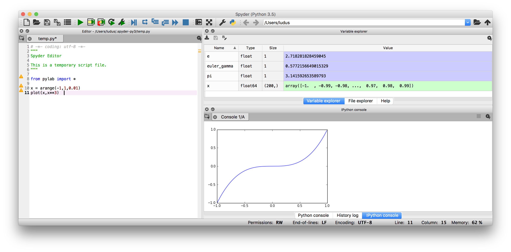

Dopo il mio [post precedente su Canopy](http://www.ludusrusso.cc/posts/2017-01-09-canopy-una-pythonica-alternativa-a-matlab) un utente Facebook mi ha segnalato [**Spyder**](https://pythonhosted.org/spyder/), un altro tool molto interessante per l'analisi scientifica in Python!

Ho fatto un test molto molto veloce dell'utilizzo, ed effettivamente sembra essere molto simile a Canopy con l'unica differenza di essere un software completamente **Open Source**, cosa che prediligo molto.
