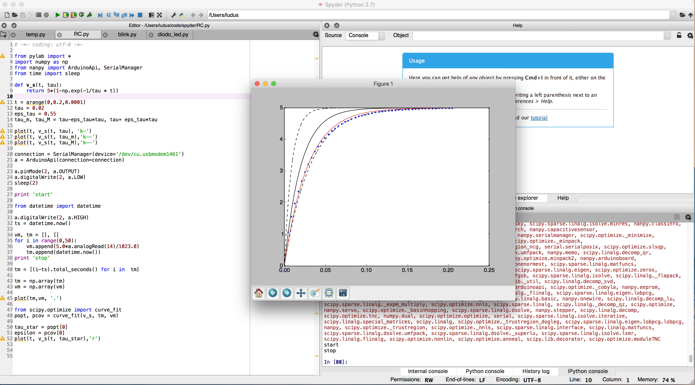
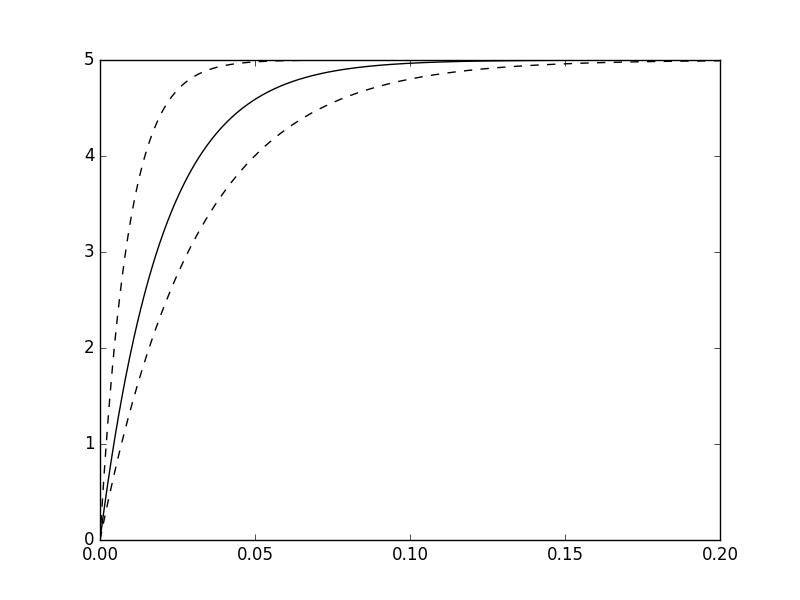
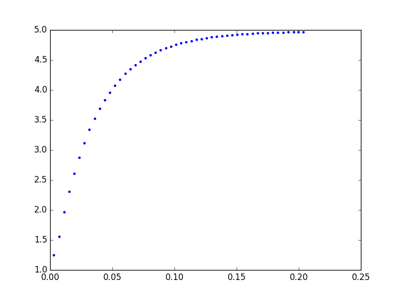
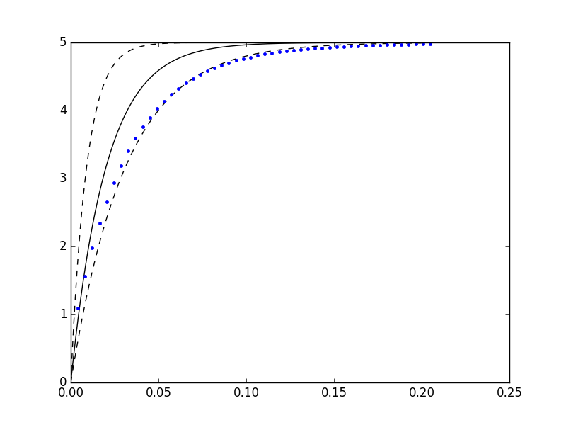
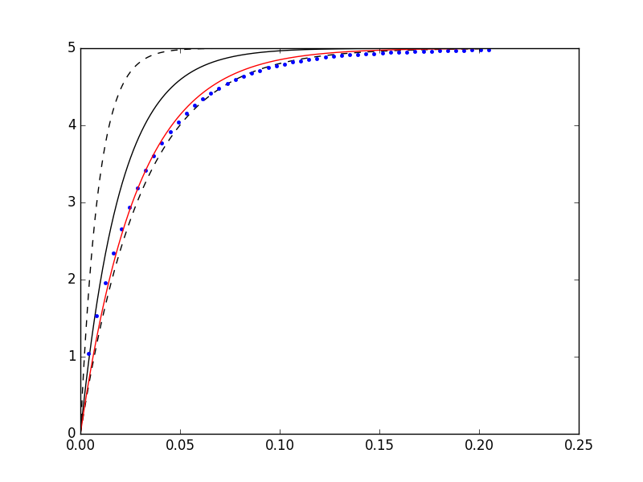

Come premesso, ripropongo oggi l'esperimento sul circuito $RC$ presentato in [questo post](http://www.ludusrusso.cc/posts/2017-01-04-arduino-python-lab-fisica-1) e rivisto utilizzando l'IDE di programmazione scientifica **Spyder** e la libreria per sviluppare programmi Arduino in Python **nanpy**.



Per info sull'accoppiata e su come installare il tutto, rimando al mio [precedente post](http://www.ludusrusso.cc/posts/2017-02-19-python-arduino-nanpy).

## Teoria sul circuito $RC$

Il circuito $RC$ è un semplice circuito elettronico composto da un condensatore (di capacità $C$) in serie ad una resistenza (di valore $R$).

Quando un circuito $RC$ inizialmente spento viene alimentato ad una tensione $V_\infty$, si può verificare che l'andamento nel tempo della tensione ai capi del condensatore rispetta la legge

$$
v(t) = V_\infty \cdot \left(1-e^{-\frac{t}{RC}}\right)
$$

Il valore $\tau = RC$ è anche detto _costante di tempo_.

## Tolleranze dei Componenti

Nell'esperimento che proponiamo oggi, considereremo anche le tolleranze che abbiamo sui componenti elettronici che useremo.
In fisica è noto e accettato dalla comunità l'impossibilità di ottenere misure esatte. Ogni misura ottenuta si trova quindi all'interno di un insieme numerico (range di incertezza) di valori accettabili.

Similmente, riguardo ai componenti elettronici commerciali, è impossibile per i produttori creare componenti sempre uguali: per questo motivo, al valore _nominale_ di un componente è sempre associato una tolleranza, che ne definisce il range di incertezza.

Facciamo un esempio: se prendiamo un resistore $R$ di valore nominale $100k\Omega$ e tolleranza $5\%$, sappiamo che la misura reale della resistenza del componente sarà all'interno del range $100\Omega\pm5\% = [95 - 105]\Omega$.

## Scopo dell'esperimento

Lo scopo dell'esperimento è verificare che la legge delle carica del condensatore è rispettata.
Il procedimento adottato sarà il seguente:

- Utilizziamo la legge della carica del condensatore per simulare l'andamento (considerando le tolleranze dei componenti).
- Misuriamo la carica di un condensatore di un circuito $RC$ reale.
- Confrontiamo la simulazione con i dati reali verificando che la misura ricade all'interno del range di incertezza dei componenti.
- Otteniamo una misura più precisa della costante di tempo $\tau$ utilizzando Python.

## Circuito

Il circuito sviluppato è mostrato nella figura seguente.
Il materiale utilizzato è qui riportato:

- Arduino UNO.
- Condensatore Elettrolitico $C=100\mu F \pm 50\%$).
- Resistore (nel mio caso con $R=200\Omega\pm5\%$).
- Breadboard.

Importante: dato che Arduino (specialmente quando comunica in seriale) non è capace di acquisire dati ad una frequenza molto elevata, per riuscire a prendere un numero adeguato di dati conviene scegliere valori di $R$ e $C$ abbastanza elevati, in modo da avere constanti di tempo dell'ordine di qualche di qualche decina di millisecondi. Nel mio caso, ho scelto $\tau=RC=0.02s$ nominale.


Essendo il condensatore che ho utilizzato elettrolitico, i suoi terminali sono polarizzati, ossia è necessario collegare il terminale positivo (anodo) ad un punto del circuito avente potenziale più elevato rispetto al punto di collegamento del terminale negativo (catodo). Nel caso si utilizzi un condensatore ceramico, non è importante la polarità!

Colleghiamo quindi il catodo ($-$) del condensatore al PIN GND di Arduino ,e l'anodo ($+$) tramite breadboard al pin $A0$. Colleghiamo inoltre, per mezzo di una resistenza, l'anodo del condensatore al PIN $2$ di Arduino.

## Simulazione

Per simulare l'andamento della tensione $v(t)$ dobbiamo considerare il parametro $\tau = RC$. Date le tolleranze dei due circuiti, possiamo stimare la costante di tempo come

$$
\tau = 0.02s \pm 55\% \in [0.09, 0.31]s
$$

Andremo, quindi, a simulare 3 curve, rappresentate dalla $\hat{\tau} = 0.02s$ nominale, e dai valori minimo e massimo che essa può assumere: $\tau_m = 0.009s$ e $\tau_M = 0.031s$.
In questo esperimento non andremo a considerare le altre incertezze, come quella sulla tensione di carica $V_\infty$ o dell'incertezze sulle misure dei sensori.

Per disegnare le tre curve, implementiamo una funzione in Python che calcola i valori della curva data i campioni di tempo in forma di vettore e il valore di $tau$ da utilizzare

```python
def v_s(t, tau):
    return 5*(1-np.exp(-1/tau * t))
```

Andremo quindi ad utilizzare questa funzione all'interno di uno script in **Spyder**.

```python
from pylab import *
import numpy as np

def v_s(t, tau):
    return 5*(1-np.exp(-1/tau * t))

t = arange(0,0.2,0.0001)
tau = 0.02
eps_tau = 0.55
tau_m, tau_M = tau-eps_tau*tau, tau+ eps_tau*tau

plot(t, v_s(t, tau), 'k-')
plot(t, v_s(t, tau_m),'k--')
plot(t, v_s(t, tau_M),'k--')
```

Il cui output sarà il seguente



Si noti che la simulazione viene fatta fino a $0.2s$. Questo valore è calcolato in modo da essere molto più grande (circa 10 volte) la costante di tempo stimata.

## Campionamento del Circuito RC

A questo punto, utilizziamo **nanpy** per campionare i dati utilizzando il seguente script

```python

from datetime import datetime
from nanpy import ArduinoApi, SerialManager
from time import sleep

# connessione ad arduino sulla porta seriale specifica
connection = SerialManager(device='/dev/cu.usbmodem1461')
a = ArduinoApi(connection=connection)

# scarichiamo il condenatore
a.pinMode(2, a.OUTPUT)
a.digitalWrite(2, a.LOW)
sleep(2)

# carichiamo il condensatore e misuriamo l'andamento
a.digitalWrite(2, a.HIGH)
ts = datetime.now()
vm, tm = [], []
for i in range(0,50):
    vm.append(5.0*a.analogRead(14)/1023.0)
    tm.append(datetime.now())
print 'stop'

# convertiamo i dati in numpy
tm = [(i-ts).total_seconds() for i in  tm]
tm = np.array(tm)
vm = np.array(vm)

# plot
plot(tm,vm, '.')
```

Questo semplice script, dopo aver scaricato il condensatore, prevede a misurare la carica sul condensatore nel tempo, salvando anche i valori temporali in cui questi dati vengono campionati.

Alla fine, plotta i valori misura nel tempo, ottenendo questo risultato.



Come si può vedere dal grafico, l'andamento dei campioni è molto simile ad una curva esponenziale negativa.

Come sopra, abbiamo fatto in modo che il campionamento vada avanti per circa 10 volte la stima della costante di tempo. Questo viene fatto modificando il numero di campioni all'interno del ciclo `for`.

## Verifica della legge della carica del circuito e misura sperimentale di $\tau$

Non ci resta che verificare se la legge fisica di carica del condensatore è effettivamente verificata. Per fare questo, per prima cosa è necessario verificare che i campioni siano all'interno delle due curve simulate con i valori limite di $\tau$ considerando le tolleranze. Per fare questo, basta eseguire di seguito i due script ripostati sopra in modo da sovrapporre i plot, ottenendo un risultato simile a questo:



In cui si può effettivamente vedere che l'andamento stimato è rispettato.

Per ultimo, verifichiamo che l'andamento dei campioni sia effettivamente ben approssimato da una curva esponenziale decrescente, e calcoliamo il $tau^*$ che meglio approssima questi campioni.

Per far questo, possiamo utilizzare un interessante modulo chiamato `from scipy.optimize` ed in particolare la funzione `curve_fit` contenuta al suo interno.

Con le seguenti linee di codice, chiediamo alla funzione `curve_fit` di calcolare il miglior `tau` che meglio approssima i dati campionati (`tm` e `vm`), utilizzando la funzione `v_s` implementata prima.

```python
from scipy.optimize import curve_fit
popt, pcov = curve_fit(v_s, tm, vm)
```

La funzione ritorna due valori:

- `popt` è un array contenente il set di parametri di `v_s` che meglio approssima i dati (in questo caso, dato che l'unico parametro utilizzato è $\tau$, `popt` conterrà un solo elemento).
- `pcov` contiene l'errore di approssimazione

Possiamo quindi utilizzare questi dati per estrapolare una misura più precisa del tau reale $\tau^*$ e quindi la curva che meglio approssima i valori ottenuti.

Otteniamo quindi

- $\tau^* = 0.028 \in [0.09, 0.31]$ compatibile con il range di valori stimato all'inizio
- Un errore molto piccolo $\epsilon = 1.62\cdot 10^{-7}$

Che producono la curva rossa nel seguente grafico



## Codice Completo

Di seguito vi riporto il codice completo utilizzato nel tutorial

```python
# -*- coding: utf-8 -*-

from pylab import *
import numpy as np
from nanpy import ArduinoApi, SerialManager
from time import sleep

def v_s(t, tau):
    return 5*(1-np.exp(-1/tau * t))

t = arange(0,0.2,0.0001)
tau = 0.02
eps_tau = 0.55
tau_m, tau_M = tau-eps_tau*tau, tau+ eps_tau*tau

plot(t, v_s(t, tau), 'k-')
plot(t, v_s(t, tau_m),'k--')
plot(t, v_s(t, tau_M),'k--')

connection = SerialManager(device='/dev/cu.usbmodem1461')
a = ArduinoApi(connection=connection)

a.pinMode(2, a.OUTPUT)
a.digitalWrite(2, a.LOW)
sleep(2)

print 'start'

from datetime import datetime

a.digitalWrite(2, a.HIGH)
ts = datetime.now()

vm, tm = [], []
for i in range(0,50):
    vm.append(5.0*a.analogRead(14)/1023.0)
    tm.append(datetime.now())
print 'stop'

tm = [(i-ts).total_seconds() for i in  tm]

tm = np.array(tm)
vm = np.array(vm)

plot(tm,vm, '.')

from scipy.optimize import curve_fit
popt, pcov = curve_fit(v_s, tm, vm)

tau_star = popt[0]
epsilon = pcov[0]
plot(t, v_s(t, tau_star),'r')
```

## Conclusioni

Come potete vedere, utilizzando questi strumenti si può, in pochissimo tempo e con pochissimo materiale, sviluppare un esperimento di elettrotecnica semplice ma completo. È ovviamente possibile complicare a piacere questo esperimento aggiungendo nuovi componenti elettrici al circuito o utilizzando componenti di valori diversi.

Come al solito, gli interessati possono contattarmi sulla mia pagina [facebook](https://www.facebook.com/ludusrusso.cc/?fref=ts) per commenti e/o consigli.
