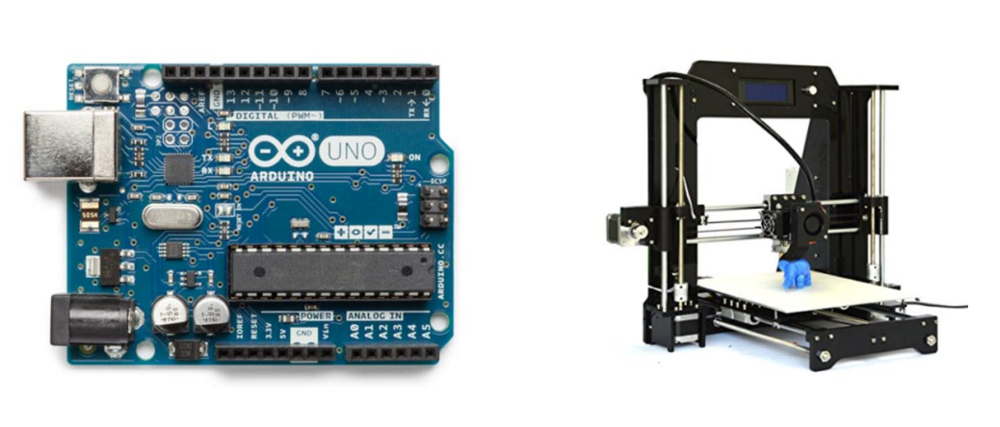

## NUOVI ORARI

**Per problemi logistici, il corso di Stampa 3D è stato cancellato e il corso di Arduino è stato spostato interamente al 14 Aprile 2017, ore 9:00-12:30, 14.30-18.00**

In occasione delle vacanze di Pasqua 2017, il Liceo G. Stampacchia organizza due corsi tenuti da me su Arduino e stampa 3D.
Si è scelto di creare due corsi distinti in modo da dare la libertà a chiunque di partecipare solamente alle tematiche che più gli interessano, considerando anche il poco tempo a disposizione e il periodo. Ciò non toglie che gli interessati possano partecipare ad entrambi i corsi.

_Per info scrivete a ludus.russo@gmail.com_

**Corso Introduttivo ad Arduino e Physical Computing
14 Aprile 2017, ore 9:00-12:30, 14.30-18.00
Liceo Scientifico G. Stampacchia - Tricase (LE)
Prezzo 25€ (Include un Arduino Starter Kit per ogni partecipante)**

**Corso Introduttivo alla progettazione e Stampa 3D (Cancellato)
Liceo Scientifico G. Stampacchia - Tricase (LE)
Prezzo 25€ (Include la stampa di un pezzo progettato durante il corso)**

## Corso Introduttivo ad Arduino e Physical Computing

Il focus del corso è quello di fornire le nozioni di base per la prototipazione elettronica e robotica al fine di fornire le competenze necessarie per sviluppare in autonomia o in corsi successivi sistemi di automazione civili ed industriale.

Tali competenze verranno fornite utilizzate la scheda elettronica Arduino costituito da un microcontrollore e da un’elettronica aggiunta, utile per creare rapidamente prototipi sia per scopi hobbistici e semiprofessionali ma soprattutto utilissima in campo didattico per l’apprendimento della programmazione.

#### Cosa imparerò durante il corso:

- Che cosa è Arduino e cosa vuol dire Physical Computing
- Come programmare Arduino in C++
- Come interfacciare Arduino con Sensore e Attuatori
- Come sviluppare semplici progetti con Arduino
- Come funziona l’ecosistema Arduino
- Come essere autonomi nell’apprendimento di Arduino

#### Kit Arduino in Dotazione

In dotazione ogni partecipante avrà un Kit Arduino compatibile (incluso nel prezzo) contenente i seguenti dispositivi:

- Scheda Arduino UNO compatibile
- Basetta di prototipazione (Breadboard)
- Cavi Jumpers
- Led Colorati
- Sensoristica varia
  - Photoresistori
  - Termoresistori
- Motori

##### Perchè Arduino compatibile?

Il costo del kit Arduino originale è di circa 80€, per ridurre al massimo i costi si è scelto di utilizzare un Kit clone di Arduino (ma 100% compatibile con la scheda originale).

##### Hai già un Kit Arduino?

Segnalo nei commenti in fase di iscrizione, ci metteremo d’accordo su come fare.

## Corso Introduttivo alla progettazione e Stampa 3D

Il focus del corso è quello di fornire le nozioni di base per la prototipazione meccanica sfruttando tecniche di prototipazione rapida FMD (solitamente nota come Stampa 3D) al fine di fornire le competenze necessarie per sviluppare in autonomia o in corsi successivi.

Tali competenze verranno fornite utilizzate sfruttando il software gratuito ThinkerCAD e una piccola ma potente stampante 3D Open Source.

Durante il corso, ogni partecipante riuscirà a progettare e a stampare in 3D un piccolo oggetto reale.

#### Cosa imparerò durante il corso:

- Che cosa è la stampa 3D e cosa vuol dire Artigianato Digitale
- Cosa si può fare con una stampante 3D
- Come funziona una stampante 3D tipo FMD
- Come realizzare un progetto in 3D partendo da un’idea
- Disegnare oggetti in 3D con ThinkerCAD
- Generare codici di Stampa con CURA/Repetier Host
- Stampare un Oggetto

## Partecipanti

Entrambi i corsi sono rivolti a tutti gli interessati alle nuove tecnologie dell’Artigianato Digitale e vogliono essere guidati a fare il primo passo, quindi si rivolgono a tutti, studenti e non, ragazzi ed adulti a tutti coloro che hanno uno spirito maker.

**Unico prerequisito necessario è la curiosità.**

La finalità del corso è permettere di gestire e progettare in autonomia le idee dei partecipanti.

## Metodologie

Il corsi si svolgeranno con metodologia laboratoriale, in modo cooperativo in aula, e l’intero processo di formazione sarà supportato da una piattaforma di formazione on-line, predisposta dal docente, sulla quale sarà realizzata una classe virtuale a cui saranno iscritti tutti i partecipanti al corso.

In questo modo sarà possibile sviluppare sperimentazioni didattiche, nonché fornire indicazioni di articoli di approfondimento e svolgimento di attività pratiche sull’uso di tecnologie che saranno illustrate nei momenti in presenza.

Si cercherà di usare la tecnologia divertendosi, verrà stimolata la creatività la logica e l’autonomia ma anche la capacità di raggiungere un obiettivo e lavorare in team.

## Requisiti tecnici

- Un PC portatile abilitato a navigare in wi-fi, il computer potrà essere dotato di sistema operativo Windows, Mac o Linux, non è necessario disporre di computer con prestazioni elevate.

- Il corso si svolgerà presso un laboratorio informatico attrezzato, quindi per chi non fosse dotato di portatile, sarà possibile utilizzare il computer messo a disposizione dell’organizzazione.

## Modalità di iscrizione

Il costo di ciascun corso è di 25€, inclusi i materiali di utilizzo che verranno poi lasciati ai partecipanti.

# L’iscrizione al corso deve essere fatta on-line cliccando [qui](https://goo.gl/forms/Gv226pPZnTbWX3Xu1)

**Avranno priorità di iscrizione al corso studenti e professori del Liceo Stampacchia.**

In questo blog potranno essere letti avvisi ed indicazioni utili per i corsisti.

**Le iscrizioni termineranno in data 01/04/2017**

I corsi si attiveranno al raggiungimento di 8 partecipanti. Il numero massimo di posti disponibili è 20.

Nel caso sopraggiungano impegni che non permettano la partecipazione al corso si prega di comunicare tempestivamente in modo da permettere ad altri di frequentare il corso.
