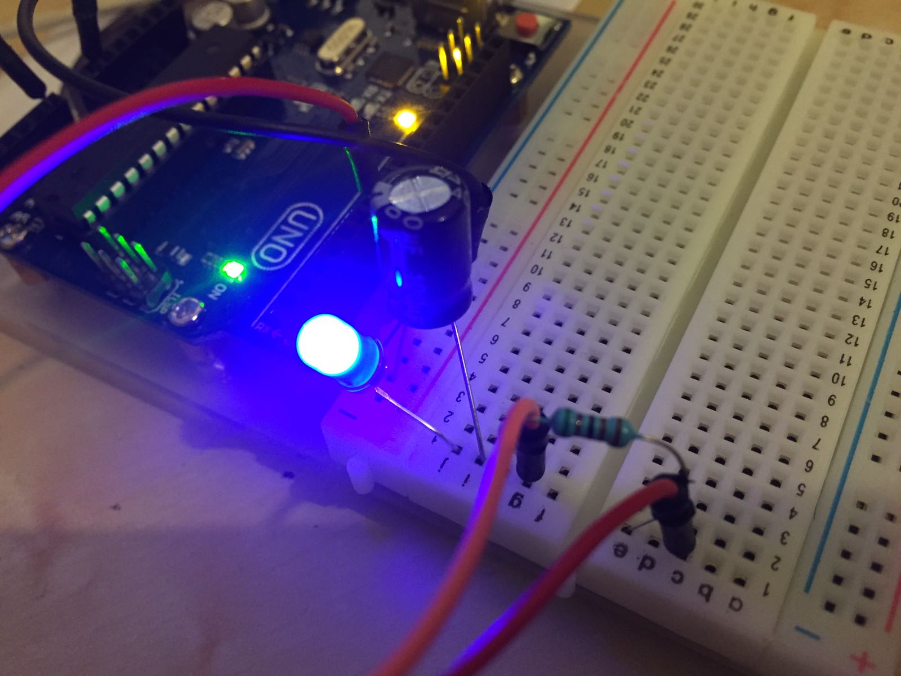
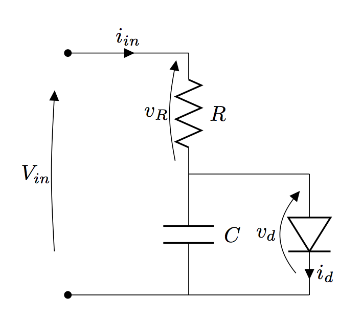
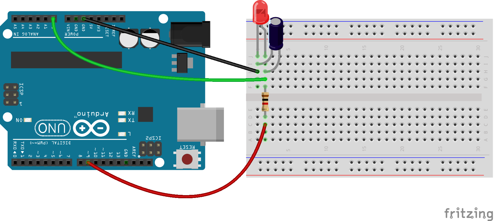
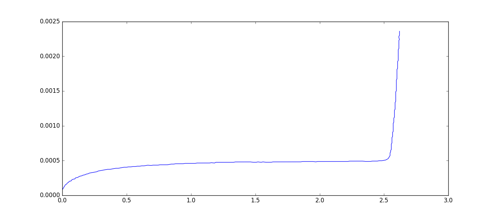
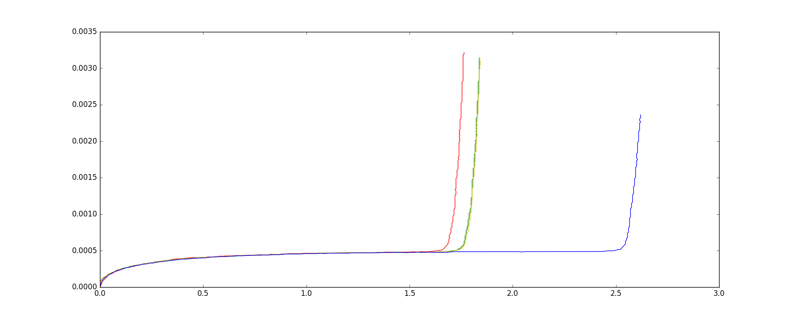

Dopo una lunga pausa, dovuta principalmente al lavoro necessario per la consegna della tesi che mi ha preso tutto il tempo libero delle ultime due settimane, al mio lavoro con HotBlack Robotics che si fa sempre più denso, e ad alcuni progetti che sto facendo partire di cui parlerò a breve, ecco che finalmente trovo il tempo per riprendere in mano questo tutorial lasciato a metà.



Per chi si fosse perso la prima parte (più teorica), può trovarla [cliccando qui](http://www.ludusrusso.cc/posts/2017-02-22-misurare-la-costante-di-plank-con-arduino-e-python-parte-1). In questa seconda parte iniziamo con il vero smanettamente con Aruduino.

## Misura della caratteristica dei Led con Arduino e Nanpy

Iniziamo subito a vedere come è possibile misurare la caratteristica reale di un led sfruttando Arduino, Nanpy e un paio di componente (una resistenza e un condensatore).

In particolare, per misurare la caratteristica del Led (o di un qualsiasi componente), dobbiamo misurare contemporaneamente i valori di corrente e tensione che attraversano il Led stesso, andando a variare nel tempo una di queste due grandezze e misure l'andamento dell'altra.

Riprendendo l'idea del Prof. Alfonso d'Ambrosio, ho utilizzato il semplice circuito sottostante per la misura di queste grandezze con il metodo volt-amperometrico



### Come funziona

L'idea alla base è molto semplice: con Arduino, impostiamo la tensione $V_{in}$ e misuriamo la tensione $v_d$. In questo modo, possiamo variare la tensione in ingresso al circuito e misurare la tensione sul condensatore.

Per misurare la corrente, possiamo sfruttare proprio la tesistenza $R$ (di valore noto). Infatti, $i_{in}$ è semplicemente misurabile con la formula

$$
i_{in} = \frac{V_{in} - v_d}{R}
$$

Il condensatore $C$ si trova in quella posizione per le sue capacità di filtro. Infatti ricordiamo che Arduino non è in grado di generare una tensione variabile, ma sfrutta il [metodo PWM](https://it.wikipedia.org/wiki/Pulse-width_modulation). Il condensatore quindi è necessario per filtrare la tensione in ingresso.

Nel nostro esperimento, supponiamo (un'approssima quasi vera) che tutta la corrente $i_{in}$ fluisce all'interno del Diodo Led, in altre parole, supponiamo che

$$
i_{in} = i_d
$$

### Implementazione in Arduino

Utilizzando Arduino ed una breadboard, implementiamo il circuito sopra indicato. Nel mio circuito ho utilizzato i seguenti componenti:

- Resistenza $R=1k\Omega$
- Condensatore elettrolitico $C=100\mu F$
- Arduino UNO
- Breadboard

Usiamo come input il Pin6 di Arduino, e come lettura il Pin A0, come indicato in figura.



### Codice di Acquisizione

Andiamo quindi ad implementare una funzione per l'aquisizione dei dati.

La funzione deve generare come input tutti i valori di tensione possibili, utilizando il comando `analogWrite` sul Pin 6 (ricordo che i valori di questa funzione sono codificati su 8 bit: $0 \rightarrow 0V$, $253 \rightarrow 5V$).

Per ogni valore, deve misurare la tensione sul Pin A0, usando la funzione `analogRead`, che (a differenza della precedente), è codificata su 10bit: $0 \rightarrow 0V$, $1023 \rightarrow 5V$).

Per ogni coppia di valori $I, O$, andare a misurare le grandezze $V_{in}$, $v_d$ e $i_{in}$, usando le seguenti equzioni:

$$
V_{in} = \frac{5V}{255} \cdot I
$$

$$
v_d = \frac{5V}{1023} \cdot O
$$

$$
i_{in} = \frac{V_{in} - v_d}{R}
$$

Implementiamo questa funzione all'interno di un file `led.py`

```python
from nanpy import ArduinoApi, SerialManager
from time import sleep

import numpy


connection = SerialManager(device='/dev/cu.usbmodem1461')
a = ArduinoApi(connection=connection)

R = 1e3

def characterize_led():
    a.pinMode(6, a.OUTPUT)

    from datetime import datetime
    a.analogWrite(6, 0)
    sleep(5)
    ts = datetime.now()
    v, i = [], []
    for I in range(0,255,1):
        a.analogWrite(6, I)
        O = a.analogRead(14)
        v_d = O * 5/1023.0
        v_in = I * 5.0/255.0
        i_in = (v_in-v_d)/R
        v.append(v_d)
        i.append(i_in)
        sleep(0.01)

    i = numpy.array(i)
    v = numpy.array(v)
    return v, i
```

### Aquisiamo i dati

Una volta implementata la funzione, possiamo aprire una shell python usando il comando `ipython --pylab` (o alternativamente usando un IDE come Spyder) ed eseguire i seguenti comandi

```python
from led import characterize_led
v, i = characterize_led()
plot(v, i)
```

Se tutto è andato bene, dovrette ottenere un grafico simile a seguente (in questo caso ho usato un Led Blu).



Notiamo subito una cosa molto diversa dal caso ideale: quando il led non couduce (è spento), in realtà passa una corrente, molto piccola, nel circuito ($i_in < 0.5mA$). Questa corrente è dovuta alle resistenze interne del condesatore C.

Tuttavia, è facilissimo trovare la tensione di attivazione del Diodo Led, che in questo caso è di circa $V_D = 2.5V$.

Cambiando il led e rieseguendo il codice, potete disegnare sullo stesso grafico le caratteristiche di led colorati diversi. Nell'immagine successiva, trovate le caratteristiche di 4 led (Rosso, Verde, Giallo, Blu) generati dal seguente codice (cambiando manualmente i led).

```python
from led import characterize_led

# Inserisco led blu
vb, ib = characterize_led()
plot(vb, ib, 'b')

# Inserisco led rosso
vr, ir = characterize_led()
plot(vr, ir, 'r')

# Inserisco led giallo
vy, iy = characterize_led()
plot(vy, iy, 'y')

# Inserisco led verde
vg, ig = characterize_led()
plot(vg, ig, 'g')
```



Notare che per ogni led misuriamo una corrente molto bassa in ingresso prima che il led si accenda. Si noti anche che i led verde e giallo hanno una caratteristica quasi identica.

## Conclusioni seconda Parte

Concludo la seconda parte di questa guida a questo punto. Con la promessa che la prossima (e ultima) parte verrà pubblicata a breve.
