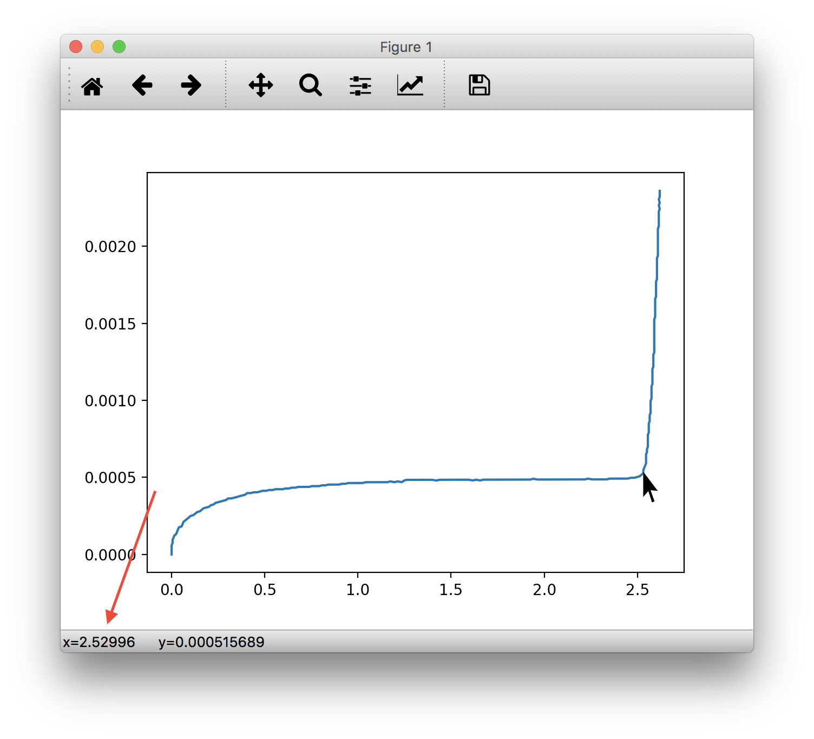
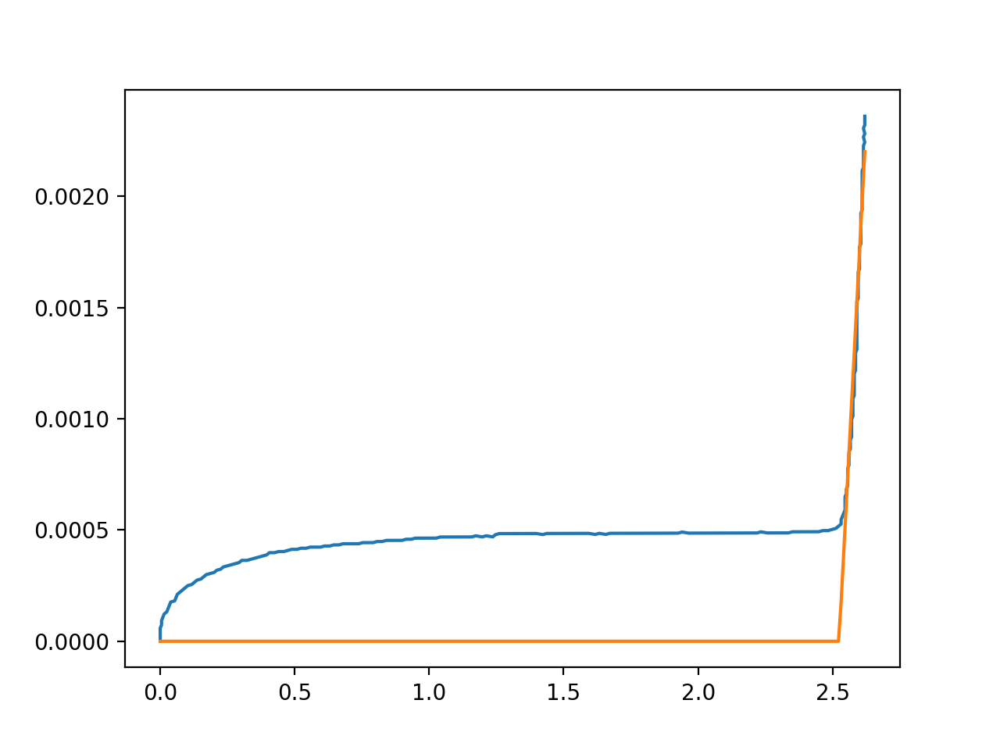
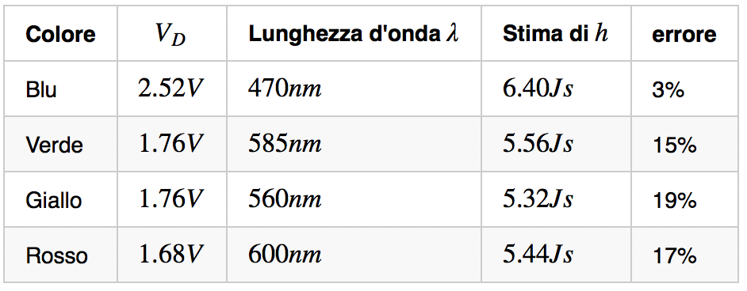

Eccomi qui per la terza ed ultima parte di questo tutorial sulla misura della costante di Planck utilizzando dei led colorati, Arduino e Python.


Se vi siete persi le parti precedenti, le trovate ai seguenti link:

- [Parte 1, modello dei Diodi in Python](http://www.ludusrusso.cc/posts/2017-02-22-misurare-la-costante-di-plank-con-arduino-e-python-parte-1)
- [Parte 2, misura della caratteristica dei diodi](http://www.ludusrusso.cc/posts/2017-03-21-misurare-la-costante-di-plank-con-arduino-e-python-parte-2)

Una volta modellata e misurata la caratteristica del led, come visto nei due tutorial precedenti, possiamo procedere alla stima della tensione di tensione di attivazione $V_D$ del singolo Led, e poi, alla misura della costante di Planck utilizzando la seguente approssimazione:

$$
V_D \simeq \frac{h\gamma}{e}
$$

Dove (ricordiamo) $\gamma$ è la frequenza della radiazione emessa, $h$ è la costante di Planck e $e$ è la carica elettrica dell'elettrone (in valore assoluto).

## Stima della tensione di attivazione $V_D$

Alla fine del tutorial precendete, eravamo arrivati a disegnare la curva caratteristica di vari led colorati.
Tramite l'immagine disegnata in _iPython_ o _Spyder_, possiamo misurare in modo molto accurato il punto in cui la curva inizia a salire, utilizzando il puntatore del mouse del computer e leggendo la sua posizione nel grafico (visualizzata in basso a destra).

Andiamo quindi a posizionare il mouse nel punto del grafico in cui la curva inizia a salire e prendiamo nota del valore $x$ indicato in basso a destra, come segnalato nella figura seguente



Come da immagine, possiamo segnare la tensione $V_x = 2.52996V$.

Salviamo questo valore in python

```python
Vx = 2.52996V
```

Ricordate che questo valore non è esattamente la tensione di attivazione del LED, in quanto non viene misurato a corrente nulla. Per ottenere un valore migliore di $V_D$, ci viene in aiuto l'approssimazione del diodo vista nel primo tutorial, formulata come segue:

$$
i^* =
\begin{cases}
	0 & \text{se $v < V_D$} \\
	\frac{1}{R_D}(v-V_D) & \text{se $v > V_D$}
\end{cases}
$$

dove $V_D$ è detta tensione di attivazione, ed è una costante empirica che rappresenta la minima tensione a partire dalla quale il diodo inizia a condurre. $R_D$ approssima la resistenza interna al diodo.

Adiamo quindi ad apprissimare i punti che sono maggiori della tensione trovata con una retta, ed ad intersecare questa retta con l'asse delle $x$. Il punto di intersezione sarà la nostra migliore misura della tensione di arrivazione $V_D$.

Come visto nel primo tutorial, fortunatamente, abbiamo già pronta una funzione per esegure l'approssimazione. Il tutto si fa eseguente queste due linee di codice:

```python
mask = v > Vx
RD, VD = polyfit(i[mask],v[mask],1)
```

Dove il valore di ritorno `VD` è esattamente il valore $V_D$ che ci interessa.

Per verificare che l'approssimazione sia corretta, andiamo a disegnarla sovrapposta al grafico della carattersticare reale.

Per prima cosa, definiamo la funzione di approssimazione in Python

```python
def diode_approx(v, VD, RD):
    i = np.array(v)

    for k in range(len(v)):
        if v[k] < VD:
            i[k] = 0
        else:
            i[k] = (v[k]-VD)/RD
    return i
```

e usiamola per dignare la curva di approssimazione

```python
plot(v, diode_approx(v, VD, RD))
```

Se tutto va bene, otterrete un'immagine come la seguente



Dato che i due grafici si sovrappongono perfettamente nella parte di crescita, possiamo salvare il valore $V_D$ ottenuto. Nel mio caso, ho visurato $V_D= 2.52V$.

## Misura della costante di Planck

A questo punto, siamo pronti per stimare la costante di Planck dalla misura ottenuta. Dobbiamo prima di tutto trovare il valore della lunghezza d'onda della luce emessa dal led. Ci sono infinte risorse online da cui attinere; da una breve ricerca su google ho trovato [questa pagina](http://www.theledlight.com/color_chart.html), da cui si può anche confrontare il colore del led reale con il colore riportato accanto alla lunghezza d'onda.

Nel mio caso, il led utilizzato risulta essere di colore "super blue", con lunghezza d'onda $\lambda=470nm$. Ricordo che la frequenza $\gamma$ di una radiazione è legata alla sua lunghezza d'onda $\lambda$ dalla seguente relazione

$$
\gamma\cdot\lambda = c
$$

Dove $c$ è la velocità della luce nel vuoto.

Possiamo finalmente stimare la costante invertendo l'equazione sopra riportata:

$$
h \simeq V_D \cdot \frac{e}{\gamma} = V_D \cdot \frac{e\cdot \lambda}{c}
$$

Ricodando che

- $c = 3\cdot10^8\frac{m}{s}$
- $e = 1.621\cdot 10^{-19} C$

Otteniamo come valore

$$
h = 6.40 \cdot 10^{-34} Js
$$

Confrontando questo valore sperimentale con uno delle misure più precise disponibile per la costante di Planck: $h=6.62\cdot 10^{-34}$ otteniamo un errore di circa il $3\%$ (non male no? Con gli altri led mi è andata peggio).

## Misure con differenti Led

Possiamo eseguire la stessa procedura su tutti gli altri Led colorati che abbiamo a dispozione. Dai miei esperimenti, ho ottenuto i seguenti valori:



Notare che, rispetto al led blu (che per caso è stato il primo led con cui ho eseguito il calcolo), le altre misure risultano più lontane rispetto alla stima precisa della costante di Planck. Tuttavia, tutte le misure rientrano all'interno di un errore minore del 20%, che non è decisamente male considerando gli strumenti utilizzati.

## Ora tocca a voi

Provate ad eseguire questo esperimento con i vostri led colorati per vedere se ottenete risultati simili. Cosa cambia? Riuscite ad ottenere misure simili alla mia?
