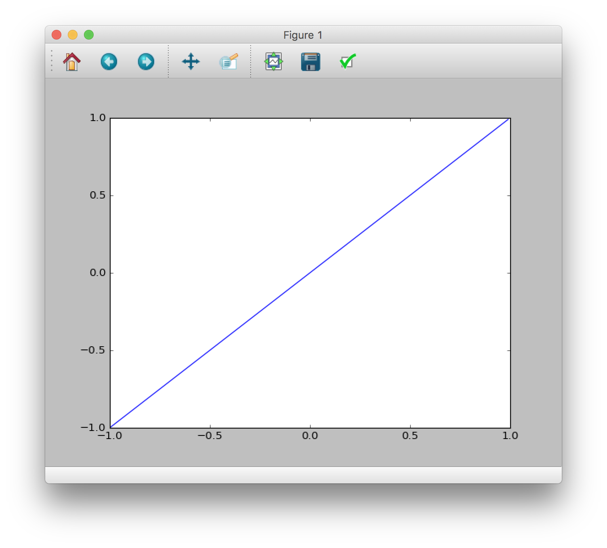
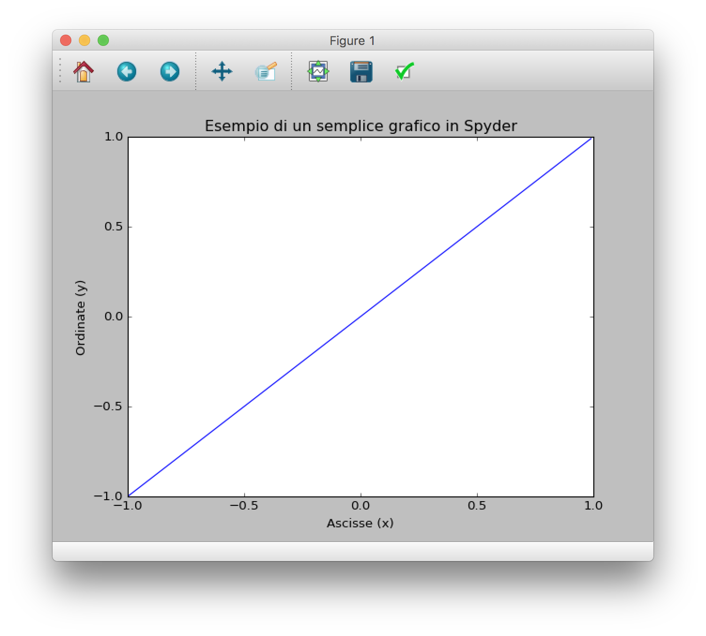
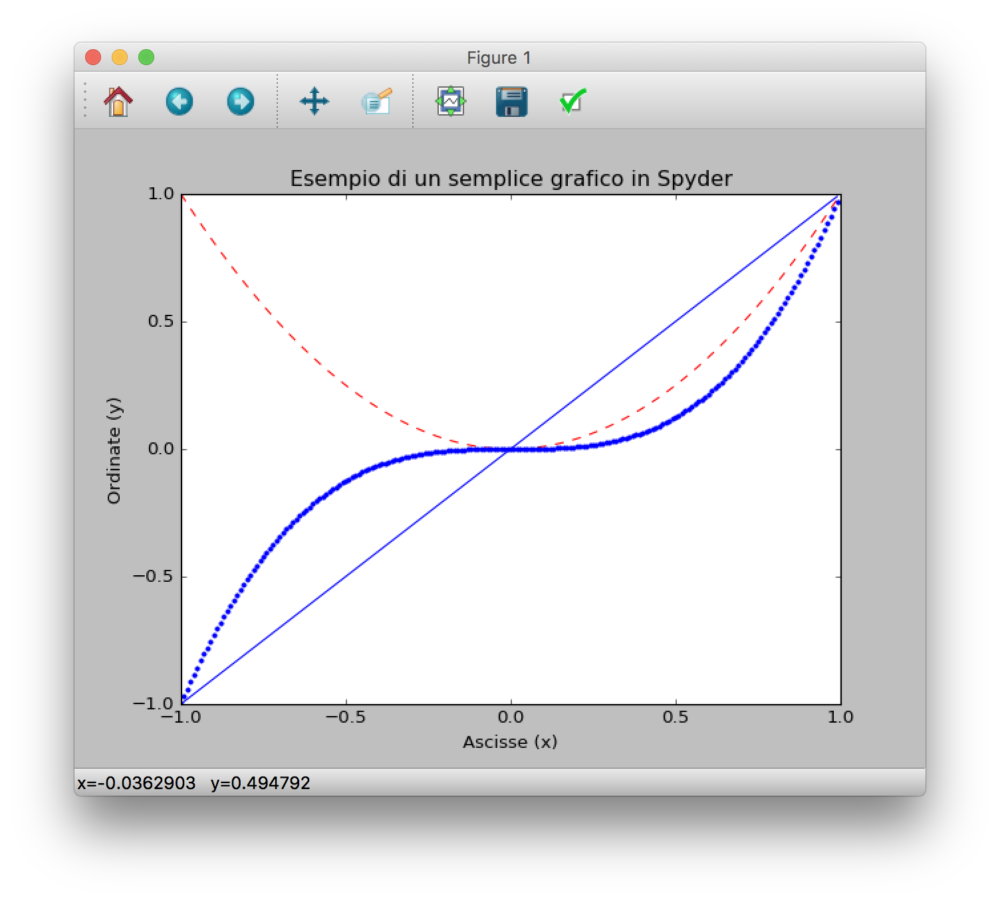

Questa breve introduzione a Spyder è scritta come supporto per il corso _Costruiamo un Laboratorio di Fisica con Arduino e Python_ tenuto durante Pycon8 a Firenze il 6 Aprile 2017. È mia intenzione ampliare e completare questa guida appena avrò un po' di tempo.

## Spyder

Spyder è un IDE per la programmazione scientifica che fa parte per tool Anaconda. È completamente basato in Python è può essere installato in modo semplice installando Anaconda [questo link](https://www.continuum.io/downloads).

## PyLab

Spyder viene installato insieme a Pylab, un modulo python molto utile per la programmazione scientifica e il plot di dati su un grafico.

Per abilitare PyLab all'avvio di Spyder (in modo da non doverlo importare manualmente ogni volta) basta abilitarlo da importazioni, accedendo (da barra dei menu) a **Tool > Preference** e selezionando il pannello **IPython Console > Graphics**, e abilitando _Automatically load PyLab and Numpy Modules_.

Dallo stesso pannello, conviene anche selezionare (sotto la voce _backend_) il tool grafico **Qt5**, che permette una migliore visualizzazione dei dati.

A questo punto, è necessario riavviare Spyder per abilitare le impostazioni.

## Utilizzo di Spyder per disegnare i dati su un grafico 2D

Per disegnare dei dati, è ovviamente necessario prima di tutto crearli. Nei corsi che faccio, solitamente questi dati vengono misurati da un sistema di campionamento reale, tuttavia in questo corso genereremo questi dati direttamente da Python.

### Generare dati in Python

Per disegnare un grafico 2D, servono due serie numeriche, una per l'asse delle ascisse ($x$) e una per l'asse delle ordinate ($y$). Utilizzeremo il comando `arange` per ottenere una serie di numeri su un intervallo con campionamento regolare. Se, ad esempio, vogliamo generare una serie di dati nell'intervallo $[-1 ,  1]$ con passo di campionamento di $0.01$, useremo il comando

```python
x = arange(-1,1,0.01)
```

Andiamo poi a generare la serie per l'asse $y$. Facciamo in modo di disegnare la bisettrice di primo e terzo quadrante, che si ottiene dalla banalissima equazione $y=x$. In Spyder, basta digitare

```python
y = x
```

### Il comando `plot`

A questo punto, possiamo disegnare i nostri dati usando il comando `plot`, come segue

```python
plot(x,y)
```

Che aprirà una finestra con il grafico che abbiamo realizzato.



### Dare un titolo al grafico e dei nomi agli assi

Il grafico realizzato non è ovviamente dei migliori. In Spyder, possiamo però anche dare un titolo al grafico e agli assi, in modo da dare informazioni al lettore su che tipo di dati sta visualizzando. Per fare questo, useremo i comandi `title`, `xlabel` e `ylabel`.

Per fare questo, ritorniamo alla finestra di Spyder **senza chiudere la finestra dell'immagine**, e digitiamo i seguenti comandi

```python
title('Esempio di un semplice grafico in Spyder')
xlabel('Ascisse (x)')
ylabel('Ordinate (y)')
```

Se ritorniamo alla finestra del grafico, vedremo che questo è cambiato in accordo con i nostri comandi.



### Stile del disegno

Spyder permette anche di disegnare i grafici con stile diversi, sia per questione estetiche, ma anche per diversificare diverse linee che vengono visualizzate sullo stesso grafico.

Per dimostrare questo, creiamo altre due serie di punti, per disegnare le funzioni $y=x^2$ e $y=x^3$. Ricordate che in python, l'operatore _elevamento a potenza_ è rappresentato dal simbolo `**`.

```python
y2 = x**2
y3 = x**3
```

Ogni linea disegnata com plot può avere un marker e un colore. I colori si indicato con una lettera, ad esempio `r` sta per _rosso_, `k` sta per _nero_, ecc.
I maker si indicato con uno o più simboli, ad esempio `--` sta per _tratteggiato_ e `.` sta per _puntinato_. Trovare [qui tutti i colori disponibili](http://matplotlib.org/api/colors_api.html) e [qui tutti i maker disponibili](http://matplotlib.org/api/markers_api.html).

Vediamo come utilizzare i maker. Torniamo nuovamente alla finestra di Spyder (senza chiudere quella del grafico), e disegniamo la parabola in rosso tratteggiato e la cubica in blu puntinato:

```python
plot(x,y2, 'r--')
plot(x,y3, 'b.')
```


