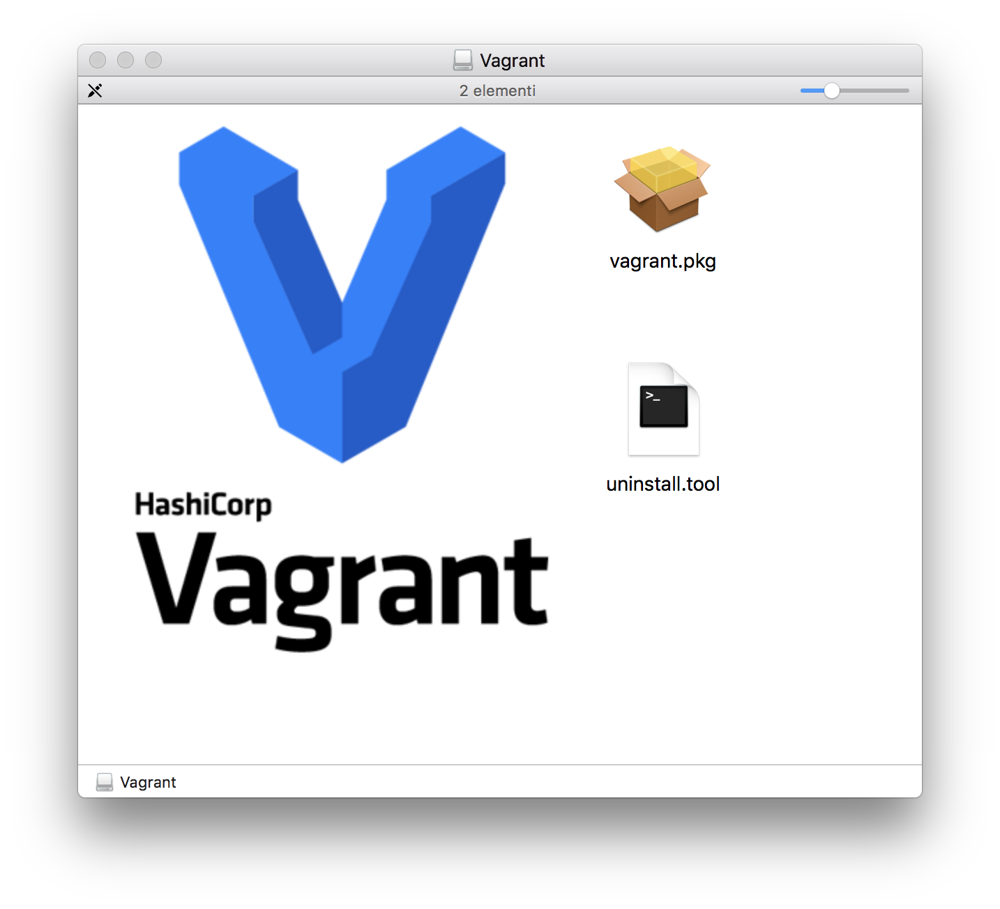
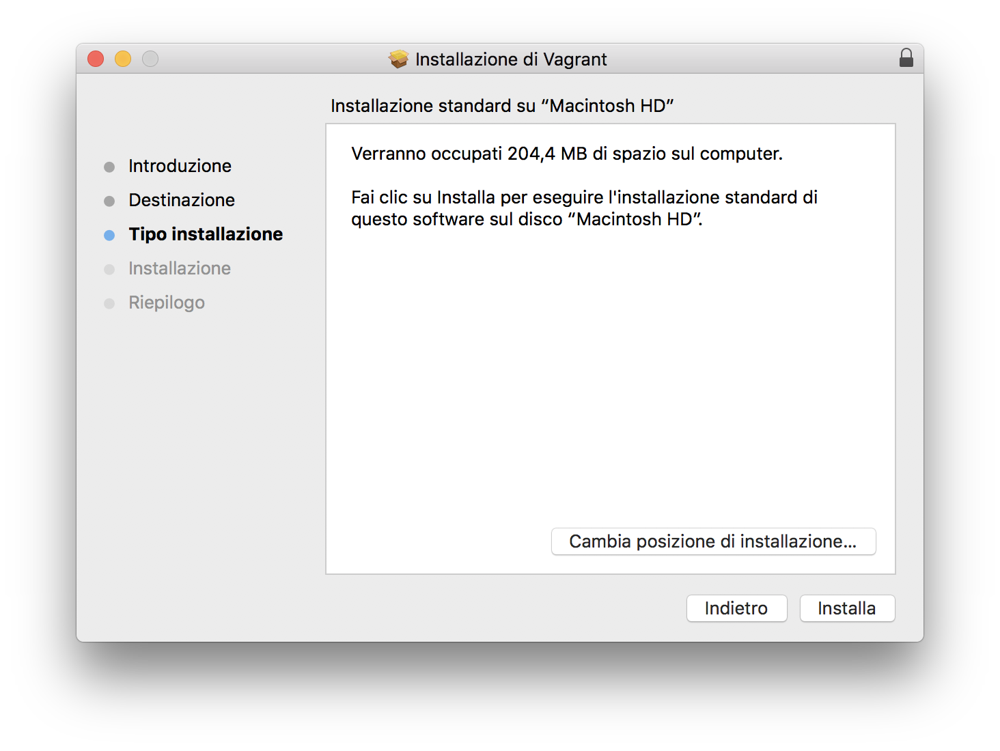
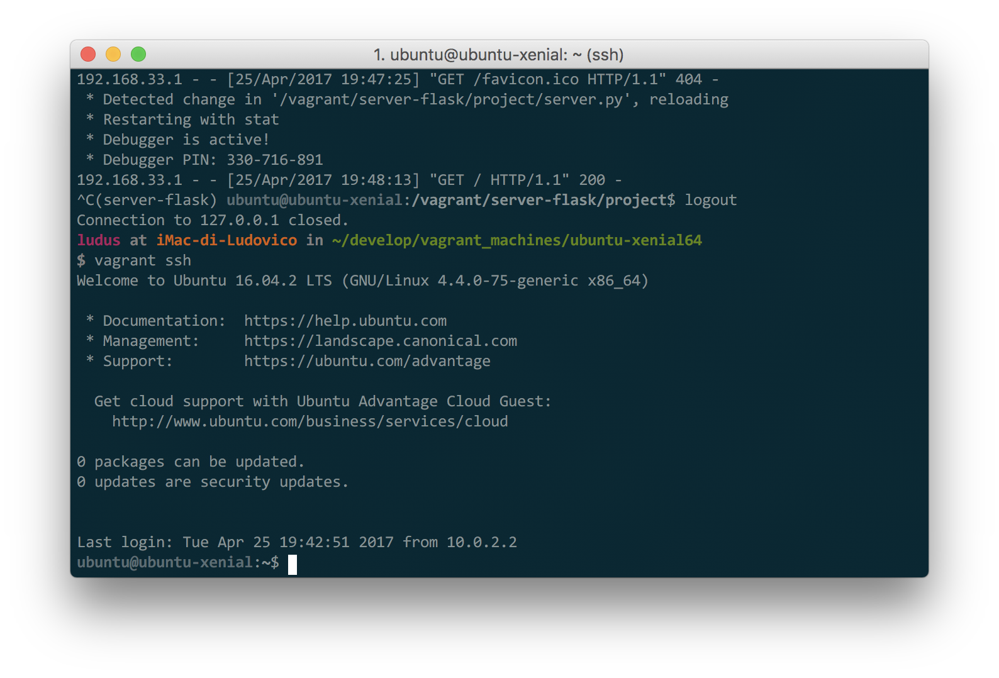
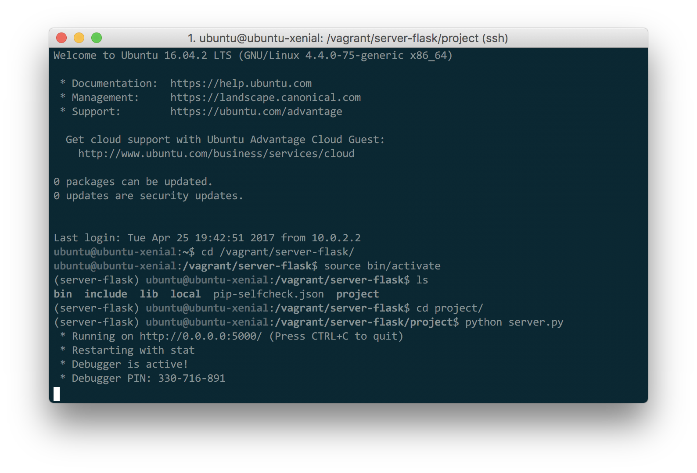
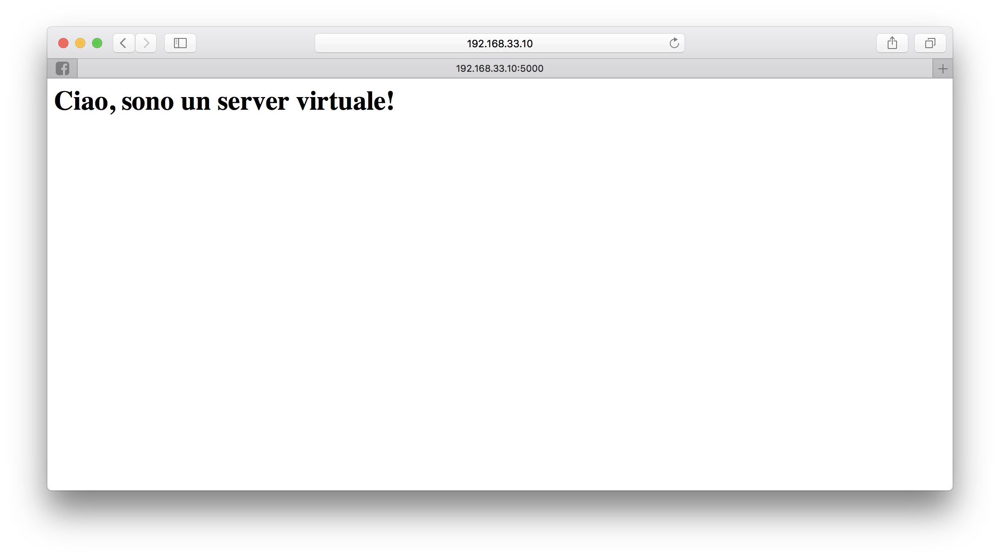

Scrivo questo post come introduzione all'utilizzo di Vagrant per la gestione di Macchine virtuali. Ho scoperto Vagrant qualche mese fa e mi è subito sembrato un ottimissimo tool per gestione progetti e per muovere i primi passi con Linux senza necessariamente avere un computer Linux e senza dover usare Macchine Virtuali con interfaccia grafica.

## Perchè Vagrant?

La risposta è molto semplice.. Da anni lavoro spesso con macchine virtuali (solitamente Linux) su host diversi, per vari motivi ma principalmente per fare prove senza dover necessariamente tirare su una partizione o un nuovo computer.

Utilizzare VirtualBox è la soluzione migliore. Ciò che però odio di VirtualBox è la necessità di tirare su anche l'interfaccia grafica per lavorare con la macchina virtuale, cosa molto scomoda per chi lavora principalmente da terminale come il sottoscritto. Il problema quindi è dovuto al fatto che devo editare file con un editor di testo sulla macchina virtuale...

In questo contesto ci aiuta Vagrant. Questo progetto ha tantissime features che ancora non uso, ma ce ne sono alcune che lo rendono per me super interessante:

- creare e gestire macchine virtuali da linea di comando in modo semplice e veloce
- condivere immagini di macchine virtuali
- lavorare sulla macchina virtuale via terminale per mezzo di SSH
- gestione semplificata di una cartella condivisa per editare file da host (e non da macchina virtuale).

### Scopo di questo tutorial

Lo scopo del tutorial è il seguente:

- mostrare come installare Vagrant
- proporre un esempio del normale utilizzo di Vagrant

## Installazione

L'installazione di Vagrant è estramemente semplice, per farlo, basta scaricare il pacchetto per il vostro sistema operativo da [qui](https://www.vagrantup.com/downloads.html), e seguire la procedura di installazione.




In alcuni casi, sarà necessario installare manualmente anche virtualbox, che può essere scaricato da [qui](https://www.virtualbox.org/).

## Utilizzo

Veniamo al cuore di questo tutorial. La mia idea è di installare una macchina virtuale contenente Ubuntu 16.06 (Xenial) e poi giorcarci un po' per farci girare una semplice applicazione in Flask.

Per un elenco di macchine virtuali disponibili, potete accedere a [questo link](https://atlas.hashicorp.com/boxes/search), messo a disposizione dagli sviluppatori di Vagrant. Ad ogni modo, online si trovano tantissime altre immagini disponibili.

### Installazione macchina virtuale

Per vagrant, ogni macchina virtuale corrisponde ad una cartella nel nostro computer. Iniziamo quindi a creare uno spazio di lavoro in cui mettere le nostre macchine virtuali, io solitamente lavoro all'interno di una cartella chiamata `~/develop` e, per l'occasione, ho creato una cartella chiamata `~/develop/vagrant_machines` in cui mettere le nostre macchine virtuali.

Accediamo quindi alla cartella e creiamo una nuova cartella chiamata `ubuntu-xenial64` in cui metteremo la nostra macchina.

```shell
$ cd ~/develop/vagrant_machines
$ mkdir ubuntu-xenial64
$ cd ubuntu-xenial64
```

Una volta all'interno della cartella, lanciamo il comando per la creazione della nostra macchia virtuale:

```shell
$ vagrant init ubuntu/xenial64
```

il cui output sarà il seguente:

```shell
A `Vagrantfile` has been placed in this directory. You are now
ready to `vagrant up` your first virtual environment! Please read
the comments in the Vagrantfile as well as documentation on
`vagrantup.com` for more information on using Vagrant.
```

In questo modo, abbiamo creato un file chiamato `Vagrantfile` all'interno della nostra cartella. Questo file indica le varie impostazioni della macchina. Per ora non ci interessa troppo il suo contenuto e quindi possiamo semplicemente tenerlo così come è.

Per info, il suo contenuto (a parte i commenti) è il seguente:

```
Vagrant.configure("2") do |config|
  config.vm.box = "ubuntu/xenial64"
end
```

### Lanciamo la macchina virtuale

A questo punto, siamo pronti per far partire la nostra macchina virtuale. Per farlo, basta eseguire il comando

```shell
$ vagrant up
```

Questo comando controlla che all'interno della cartella in cui viene lanciato esista un file `Vagrantfile`, ed esegue tutte le istruzioni per far partire la macchiana virtuale secondo le istruzioni che esso contiene.

La prima volta che viene eseguito il comando, impiegherà qualche minuto, in quanto deve scaricare la macchina virtuale ed installarla. Le altre volte, sarà molto veloce in quanto dovrà solamente far partire la macchiana virtuale.

Una volta terminata la procedura, la macchina virtuale sarà funzionante e pronta per essere utilizzata. Notate inoltre che è stata creata una cartella nascosta nella nostra cartella di lavoro chiamata `.vagrant`. Al suo interno è contenuta l'immagine della macchina virtuale e tutti i file ad essa associata.

### Giochiamo con Vagrant

Adesso vediamo alcuni comandi base di Vagrant per gestire la macchina virtuale.

- `vagrant status` vi da informaizoni sulla macchina virtuale attuale (nella cartella in cui vi trovate).

  ```bash
  $ vagrant status
  Current machine states:

  default                   running (virtualbox)

  The VM is running. To stop this VM, you can run `vagrant halt` to
  shut it down forcefully, or you can run `vagrant suspend` to simply
  suspend the virtual machine. In either case, to restart it again,
  simply run `vagrant up`.
  ```

- `vagrant global-status` è molto utile se avete più di una macchiana virtuale Vagrant da gestire, in quanto vi da informazioni su tutte le macchine installate sul vostro computer

  ```bash
  $ vagrant global-status
  id       name    provider   state    directory
  -----------------------------------------------------------------------------------------
  f8b13dd  default virtualbox saved    /Users/ludus/code/projects/dotbot/vagrant
  96c2ff0  default virtualbox aborted  /Users/ludus/code/dotbot_ws/emulations/dotbot_emu1
  9b1f914  default virtualbox poweroff /Users/ludus/code/virtualmachines/ubuntu_ros
  85e93d5  default virtualbox poweroff /Users/ludus/code/virtualmachines/cloud_platform
  6ff7199  default virtualbox running  /Users/ludus/develop/vagrant_machines/ubuntu-xenial64

  The above shows information about all known Vagrant environments
  on this machine. This data is cached and may not be completely
  up-to-date. To interact with any of the machines, you can go to
  that directory and run Vagrant, or you can use the ID directly
  with Vagrant commands from any directory. For example:
  "vagrant destroy 1a2b3c4d"
  ```

- `vagrant suspend` e `vagrant halt` servono rispettivamente per sospendere e spegnere la nostra macchina virtuale.
- `vagrant reload` riavvia la macchiana virtuale.
- `vagrant destroy` serve per cancellare definitivamente la macchina (non eseguite questo comando a meno che non siate certi di quello che fate).

### Accediamo alla macchina virtuale tramite SSH

Ok perfetto, a questo punto siamo pronti ad accedere alla macchina virtuale. Per prima cosa, controlliamo che la macchina sia accesa, eseguendo il `vagrant status`. Se la macchina non risulta in _running_, allora accendiamola col comando `vagrant up`.



Per accedere quindi alla macchina virtuale, basta eseguire il comando `vagrant ssh`, che automaticamente porterà la shell all'interno della macchina tramite protocollo SSH.

Una volta eseguito questo comando, infatti, accederemo alla nuova shell di Ubuntu, saremo quindi nella nostra macchina virtuale.

Per uscire dalla macchina, basta eseguire il comando `exit` o premere ctrl+D.

## Creiamo un server Web in Flask sulla macchina virtuale

A questo punto, siamo pronti per sfruttare la macchina virtuale per implementare un semplicissimo server flask.

Per prima cosa, dobbiamo installare le dipendenze e creare il nostro ambiente virtuale su cui lavorare.

Installiamo `pip` usando il comando linux `apt-get` e poi installiamo `virtualenv` usando pip.

```bash
$ sudo apt-get install python-pip
$ sudo pip install virtualenv
```

### Cartella condivisa con l'Host

A questo punto, possiamo creare il nostro ambiente virtuale e iniziare ad implementare il server in flask. Per prima cosa, però, vorrei far notare una delle più importanti features in Vagrant che migliorerà notevolmente la vostra produzione.

In particolare, all'interno della macchina virtuale che abbiamo creato, esiste una cartella (chiamata `/vagrant`) che è esattamente la stessa cartella su cui si trova il nostro `VagrantFile` nell'host.

Per fare una prova, creiamo dei file all'interno di questa cartella, e vedrete che questi magicamente appariranno anche nella cartella principale.

Quel è il vantaggio? Semplice, possiamo lavorare all'interno di questa cartella con un editor di testo sul computer principale e con il terminale sulla macchina virtuale (in questo modo, l'editor che usiamo per lavorare non deve essere un editor virtualizzato).

Scegliete l'editor di testo che preferite, io mi trovo molto bene con [Atom](https://atom.io/).

Per iniziare a lavorare, quindi, apriamo atom nella cartella `~/develop/vagrant_machines/ubuntu-xenial64` e posizioniamoci all'interno della cartella `/vagrant` dalla macchina virtuale

```bash
$ cd /vagrant
```

### Creazione di un ambiente virtuale e installazione dipendenze

All'interno della cartella condivisa, creiamo un nuovo ambiente virtuale, digitando

```
$ virtualenv server-flask
```

Questo comando, creerà una nuova cartella chiamata `server-flask`. Accediamoci e attiviamo il virtual env

```bash
$ cd server-flask/
$ source bin/activate
```

Una volta eseguito questo comando, apparirà all'inizio della nuova riga della shell, la scritta `(server-flask)`, ad indicare che ci troviamo all'interno dell'ambiente virtuale.

A questo punto, installiamo Flask usando pip (senza sudo).

```bash
(server-flask)$ pip install flask
```

Per finire, creiamo una cartella chiama `project` in cui sviluppare il nostro server, e accediamo a questa cartella:

```bash
(server-flask)$ mkdir project
(server-flask)$ cd project/
```

### Sviluppo di un semplicissimo webserver in Flask

Una volta creata la cartella, possiamo accedere ad essa dalla macchina principale e lavorare direttamente da li con il nostro editor di testo (e ambiente di sviluppo) preferito.

Utilizzando Atom (nel mio caso) creiamo un file chiamato `server.py` all'interno della cartella `project` e inseriamo il seguente codice:

```python
from flask import Flask
app = Flask(__name__)

@app.route('/')
def hello_world():
    return '<h1>Ciao, sono un server virtuale!</h1>'

if __name__ == '__main__':
    app.run(debug=True, host='0.0.0.0')
```

Questo semplicissimo server flask risponde all'indirizzo principale con la stringa html `<h1>Ciao, sono un server virtuale!</h1>`.

Per eseguirlo, da macchina virtuale, basta lanciare il comando

```bash
(server-flask)$ python server.py
```



### Configurare una rete virtuale per l'accesso alla macchina da host

Prima di testare l'applicazione, dobbiamo fare in modo che la macchina virtuale sia raggiungibile dall'host. Per fare questo, dobbiamo configurare vagrant in modo da creare una rete privata.

Con vagrant questo è semplicissimo, basta modificare il `Vagrantfile` aggiungendo la stringa

```ruby
config.vm.network "private_network", ip: "192.168.33.10"
```

In modo che il file (tolti i commenti) sia come segue

```ruby
Vagrant.configure("2") do |config|
  config.vm.box = "ubuntu/xenial64"
  config.vm.network "private_network", ip: "192.168.33.10"
end
```

In particolare, in questo modo, diciamo a vagrant di creare una rete condivisa con l'host e di assegnare come indirizzo ip alla macchina virtuale l'ip `192.168.33.10` (ovviamente potete scegliere un ip diverso).

A questo punto, è necessario riavviare la macchina per permettere a vagrant di aggiornare le impostazioni:

- Eseguiamo il logout dalla macchina virtuale con il comando `exit`
- riavviamo la macchina con `vagrant reload`
- riaccendiamo alla macchina con `vagrant ssh`
- lanciamo il server, eseguendo i seguenti comandi

  ```bash
  $ cd /vagrant/server-flask/
  $ source bin/activate
  (server-flask)$ cd project
  (server-flask)$ python server.py
  ```

Una volta partito, apriamo un browser qualsiasi e accediamo all'url `http://192.168.33.10:5000`.

Se tutto va bene, dovreste vedere il server ed otterrete la seguente pagina web.



## Conclusioni

Questo è un banalissimo esempio di cosa si può fare con Vagrant.. Ovviamente quello fatto qui si può benissimo fare con una qualsiasi macchina, senza dover necessariamente virtualizzare. Ma ci sono ben due vantaggi non da poco:

1. Si può lavorare su un ambiente che è sempre uguale indipendentemente dalla macchina che si possiede (quindi possiamo sviluppare sempre Linux su una qualsiasi macchina, anche Mac o Windows).
2. Quello che facciamo non intaccherà il nostro SO, quindi possiamo fare tutte le cose che vogliamo (compreso cancellare interamente il filesystem per sbaglio) senza però avere l'ansia di aver rovinato qualcosa sul nostro computer principale.
