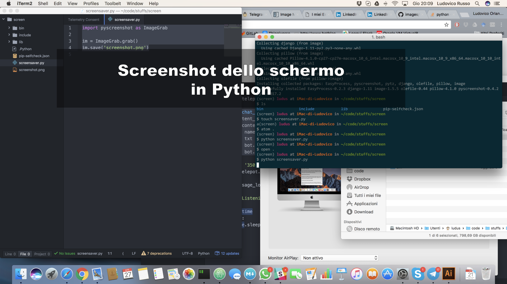
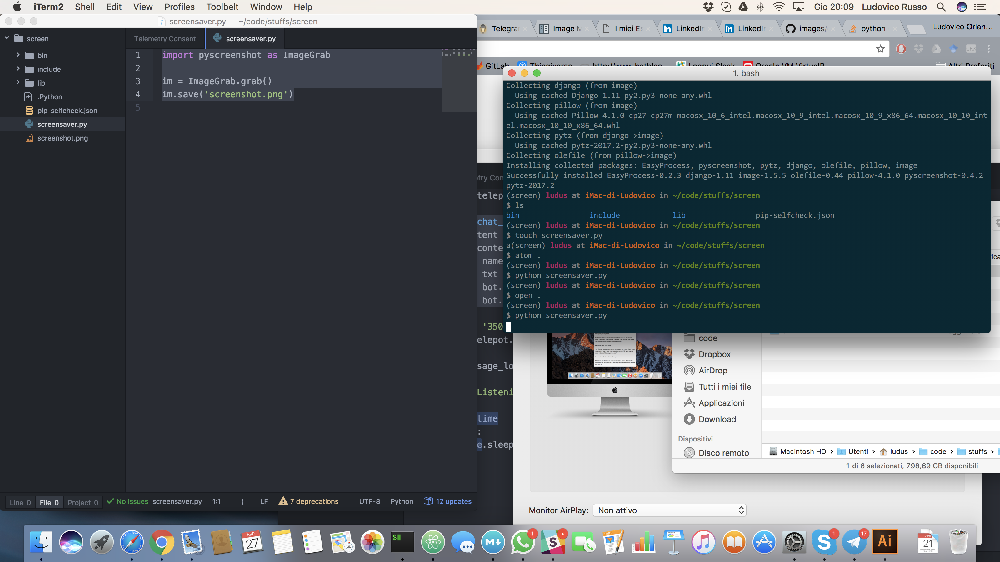

Dopo un mio recente post, mi è stato chiesto se fosse possibile creare uno script python in grado di catturare uno screenshot dello schermo del computer. Dopo una breve ricerca ho trovato il modulo [pyscreenshot](http://pyscreenshot.readthedocs.io/en/latest/) che promette di risolvere questo problema.



Scrivo questo brevissimo tutorial per far vedere come è possibile, in pochissime linee di codice, scrivere un semplice programma che cattura lo schermo del computer e salva l'immagine su un file .png.

## Installazione

Creiamo un ambiente virtuale chiamato (ad esempio) `screen` e installiamo i due moduli python che usaremo per lo sviluppo del programma, cioè `pyscreenshot` e `image` (un modulo per la gestione delle immagini in python).

```bash
$ virtualenv screen
$ cd screen
$ source bin/activate
(screen)$ pip install pyscreenshot image
```

## Utilizzo della libreria

Una volta installato il tutto, creiamo un file `screensaver.py` ed inseriamoci il seguente codice:

```python
import pyscreenshot as ImageGrab

im = ImageGrab.grab()
im.save('screenshot.png')
```

Salviamo ed eseguiamo il programma con il comando

```bash
(screen)$ screensaver.py
```

e vedremo apparire un nuovo file, nella cartella di lavoro, contenente lo screenshot del vostro computer (trovate il mio sotto).



### Analizziamo il codice

Il codice è molto semplice, ma andiamo ad analizzarlo riga per riga:

- La prima riga importa il modulo `pyscreenshot` sotto il nome si `ImageGrab`. Questo viene fatto tramite il costrutto `import .. as ..`, che permette di rinominare come preferiamo in nomi dei moduli.

  ```python
  import pyscreenshot as ImageGrab
  ```

- La seconda riga cattura l'immagine dello schermo e la salva all'interno della variabile `im`

  ```python
  im = ImageGrab.grab()
  ```

- Infine, la terza riga salva l'immagine contenuta nella variabile `im` all'interno del file `screenshot.png`.

      ```python

  im.save('screenshot.png')

  ```

  ```

## Conclusioni

Come potete vedere, questa libreria è veramente semplice da usare, però abilita tantissime possibilità se usata in modo adeguato.. Avete qualche idea su cosa farci? Scrivetemi su [Facebook](https://www.facebook.com/ludusrusso.cc/).
