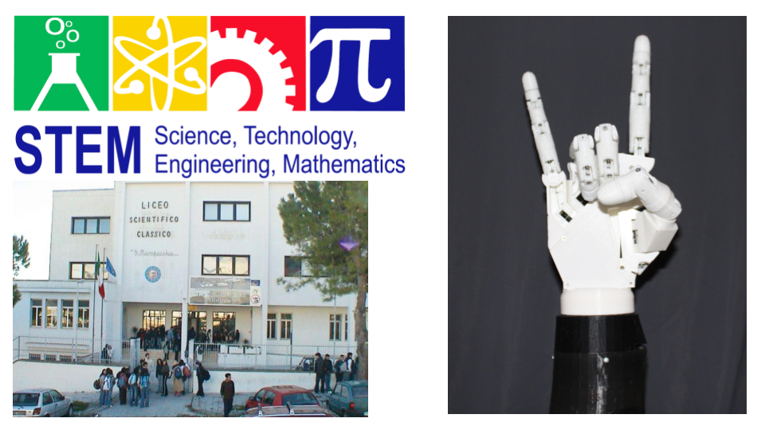

Sono felice di informarvi che è stato finalmente attivato un corso di robotica presso il Liceo G. Stampacchia di Tricase (Lecce) per due settimane di Agosto.

Il corso, introdurrà i partecipanti alle tecnologie di **making**, **fabbricazione digitale** e **robotica**.

Di seguito l'avviso ufficiale.

Sono aperte le iscrizioni al corso **Laboratorio di Robotica** autorizzato dalla Presidenza del Consiglio dei Ministri – Dipartimento per le Pari Opportunità.

Rivolto prioritariamente a ragazzi di terza media (iscritti per l’A.S. 2017/2018 al primo anno di Scuola Superiore).
Il numero di partecipanti è 20, selezionati secondo le seguenti priorità:

1.  Iscritti alla curvatura "Robotica" del Liceo "G. Stampacchia"
2.  Iscritti al Liceo "G. Stampacchia"
3.  Iscritti presso altri istituti

Il corso, completamente **gratuito** per n. 40 ore, si terrà presso il centro ACAIT di Tricase, dal 10/08/2017 al 30/08/2017, secondo il calendario seguente:

- 11/08/2917 dalle 16:30 alle 20:30
- 12/08/2017 dalle 8:30 alle 12:30
- 17/08/2017 dalle 16:30 alle 20:30
- 18/08/2017 dalle 16:30 alle 20:30
- 19/08/2017 dalle 8:30 alle 12:30
- 21/08/2017 dalle 16:30 alle 20:30
- 22/08/2017 dalle 16:30 alle 20:30
- 23/08/2017 dalle 16:30 alle 20:30
- 24/08/2017 dalle 16:30 alle 20:30
- 25/08/2017 dalle 16:30 alle 20:30

Al calendario potranno essere apportate lievi modifiche in accordo con il Docente formatore.
Si allega modulo di iscrizione da consegnare alla segreteria alunni entro e non oltre il 30.07.2017.
Per la relativa graduatoria si terrà conto:

1. delle percentuali previste dal bando: 40% ragazzi - 60% ragazze;
2. delle priorità su elencate
3. dell’ordine cronologico di arrivo delle domande.

Il modulo di iscrizione è scaricabile da [qui](https://www.dropbox.com/s/93r4dqtq8qsvb4w/avviso-di-ROBOTICA-e-domanda.pdf?dl=1)
