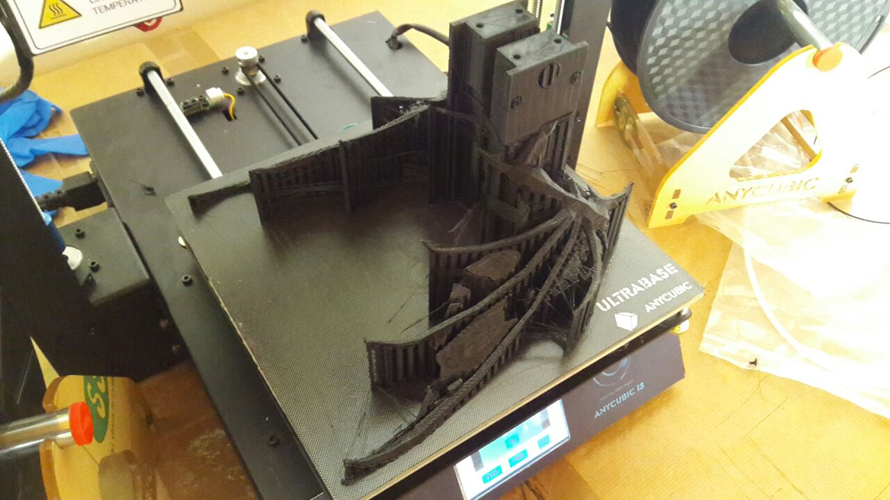
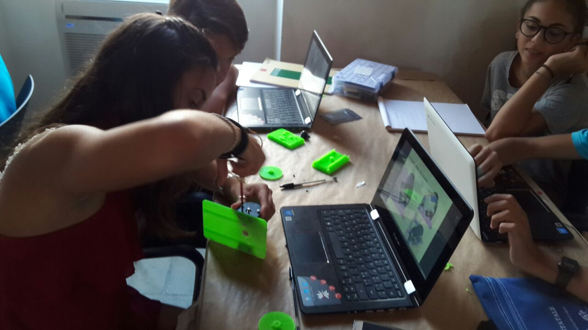
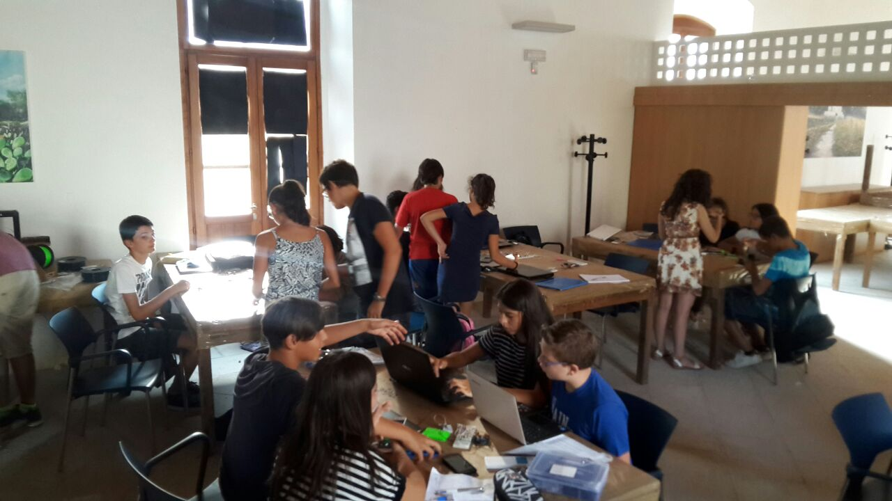
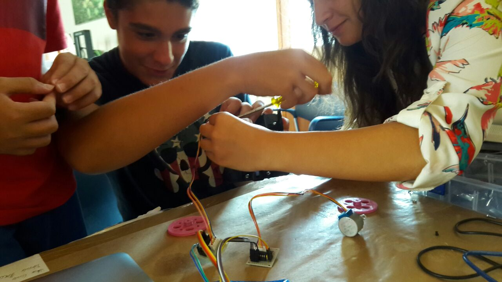
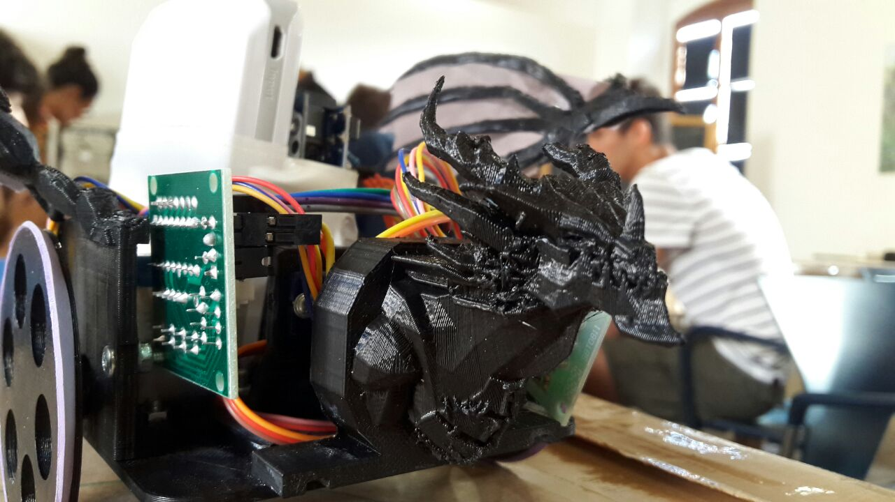
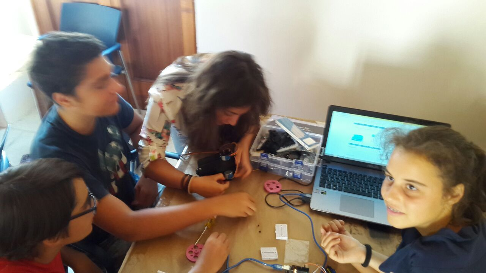

Con un po' di dispiacere, qualche giorno fa si è concluso il corso "Laboratorio di Robotica", organizzato dal mio vecchio Liceo (il Liceo Stampacchia di Tricase) a cui io ho partecipato come docente!

Il corso è stato organizzato dal Liceo Stampacchia di Tricase in collaborazione con il CINI (Consorzio Interuniversitario Nazionale di Informatica). Durante il corso, gli studenti hanno potuto imparare ad utilizzare tecnologie innovative come Stampa 3D e programmazione Arduino per costruire (partendo da zero) un robot in grado di disegnare.

È stata una bellissima esperienza, e sono stato felicemente stupito dalla capacità dei ragazzi (tra i 13 e i 15 anni) di riuscire ad imparare tante cose in così poco tempo! Il loro lavoro, è disponibile al seguente [link](https://t.co/NOuODheJbA).

Un ringraziamento particolare va al Preside Mauro Polimento, alla professoressa Greco, che mi ha supportanto durante tutto il corso (rinunciando alle vacanze :D) e a tutti gli aiutanti che mi hanno permesso di gestire un numero così alto di studenti!

Vi lascio con un video, realizzato da [Davide Marra](https://www.youtube.com/channel/UCX0qIlG6xtKAzsXIl1uGrhg), ed alcune foto del corso.

  <iframe width="100%" src="https://www.youtube.com/embed/NG4cZG6Y9Wo" frameborder="0">
</iframe>

