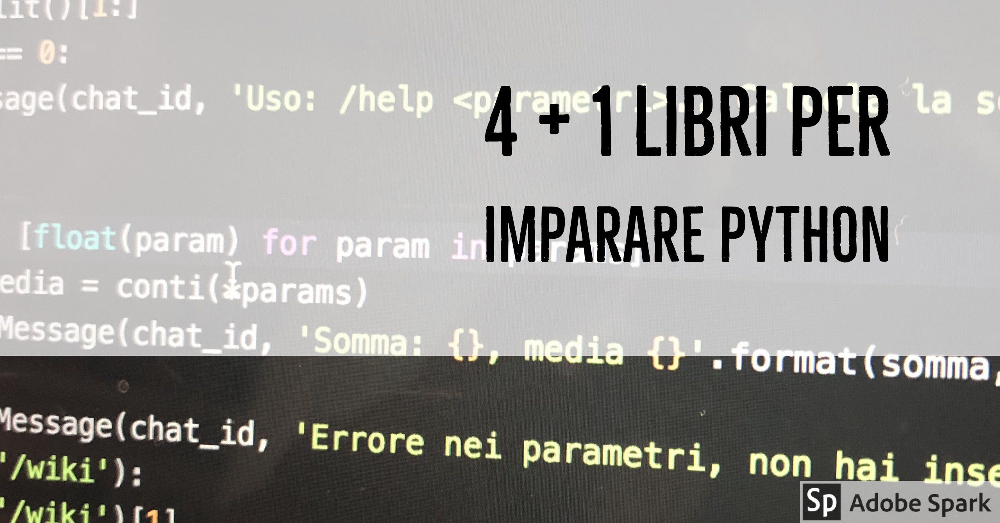

So che molti programmatori preferiscono imparare da autodidatta, e che
solitamente le informazioni che imparano arrivano da internet, navigando tra
varie risorse online come blog e documentazione ufficiale.
Tuttavia, io trovo veramente utile, una volta superato lo scoglio iniziale in
cui le risorse online
sono le migliori, approfondire utilizzando risorse a pagamento (tra cui libri) in
cui le informazioni che ci servono vengono riportate in modo organico e sono
più fruibili e comprensibili.

Inoltre, sono in generare un patito della lettura, e ho scoperto che leggere libri tecnici,
se sono scritti bene, diventa piacevole.

In questo post vi voglio consigliare alcuni libri su Python che ho letto negli ultimi due anni e
da cui ho imparato molte delle cose che conosco.
La lista è in ordine casuale, non c'è un libro preferito al momento.
Sono tutti libri che ritengo ottime
risorse per approfondire molti concetti del linguaggio.

Inoltre, tutti i libri che riporto qui sono in inglese. So che molte delle persone
che mi seguono apprezzano il mio blog principalmente per fatto che scrivo in italiano, tuttavia
ogni buon programmatore di dovrà scontrare con la lingua inglese se vuole intraprendere
questa carriera.

- [Flask Web Development: Developing Web Applications with Python](http://amzn.to/2zauw1q)
- [Test-Driven Development With Python](http://amzn.to/2zbOqJy)
- [Fluent Python](http://amzn.to/2zfpAdv)
- [Learning Python](http://amzn.to/2iXwfCY)
- [The Clean Coder: A Code of Conduct for Professional Programmers](http://amzn.to/2zcn9qp)

## Flask Web Development: Developing Web Applications with Python

<iframe style="width:120px;height:240px;" marginwidth="0" marginheight="0" scrolling="no" frameborder="0" src="//rcm-eu.amazon-adsystem.com/e/cm?lt1=_blank&bc1=000000&IS2=1&bg1=FFFFFF&fc1=000000&lc1=0000FF&t=ludusrusso-21&o=29&p=8&l=as4&m=amazon&f=ifr&ref=as_ss_li_til&asins=1449372627&linkId=78204e2f826d85185dac4023e5e8269b"></iframe>

[Flask Web Development: Developing Web Applications with Python](http://amzn.to/2zauw1q)
è il secondo
libro su Python che ho leggo. Parto da questo per un motivo specifico: è stato il
libro che mi ha spinto ad iniziare questo blog, in quanto al suo interno è presentato
lo sviluppo di un blog interamente scritto in _Flask_.

Chi mi segue da un po' di tempo ricorderà la prima versione di questo blog implementata
proprio in _Flask_, insieme ad una [guida](/2016/12/27/tutorial-flask/) che prende spunto
proprio da questo libro.

Il libro richiede una conoscenza almeno base di Python, e si incentra principalmente
sull'utilizzo di _Flask_ come libreria per sviluppare applicazioni Web. Tuttavia, per chi
non vuole spendere soldi per il libro ma comunque è interessato all'argomento, consiglio
il blog di [Miguel Gringberg](https://blog.miguelgrinberg.com/), autore del libro,
all'interno del quale trovate tanti spunti interessanti più un'intera guida, [Flask Mega Tutorial](https://blog.miguelgrinberg.com/post/the-flask-mega-tutorial-part-i-hello-world)
che è una vera e propria versione preliminare del libro.

## Test-Driven Development with Python

<iframe style="width:120px;height:240px;" marginwidth="0" marginheight="0" scrolling="no" frameborder="0" src="//rcm-eu.amazon-adsystem.com/e/cm?lt1=_blank&bc1=000000&IS2=1&bg1=FFFFFF&fc1=000000&lc1=0000FF&t=ludusrusso-21&o=29&p=8&l=as4&m=amazon&f=ifr&ref=as_ss_li_til&asins=1491958707&linkId=cc18d2d51e02cfac42ea5bfcd276cb35"></iframe>

[Test-Driven Development With Python](http://amzn.to/2zbOqJy) è l'ultimo libro su
Python da me letto (notare la data di uscita della seconda edizione, che è Agosto 2017).

Ho comprato questo libro principalmente per il mio interesse verso la filosofia del [Test Driven Development](/2017/10/03/tdd-intro/), e ne ho apprezzato molto la prima parte,
in cui ci si addentra principalmente sull'utilizzo pratico di questo modello di programmazione.

La seconda parte, che si specializza di più sulla programmazione e
lo sviluppo di applicazioni web in Django, l'ho ritenuta invece meno interessante... Ma questo
è forse dovuto al fatto che sono un patito di Flask, un "concorrente" di Django.

## Fluent Python

<iframe style="width:120px;height:240px;" marginwidth="0" marginheight="0" scrolling="no" frameborder="0" src="//rcm-eu.amazon-adsystem.com/e/cm?lt1=_blank&bc1=000000&IS2=1&bg1=FFFFFF&fc1=000000&lc1=0000FF&t=ludusrusso-21&o=29&p=8&l=as4&m=amazon&f=ifr&ref=as_ss_li_til&asins=1491946008&linkId=90ef440b9d7f7c1826779c634b9c83bb"></iframe>

[Fluent Python](http://amzn.to/2zfpAdv) è probabilmente uno dei libri più interessanti
e ben scritti su Python da me letti, risulta anche essere uno dei best seller
su questa categoria.

L'unico problema, almeno nel mio caso, è averlo scoperto e letto nel momento sbagliato: quando
avevo raggiunto una conoscenza delle dinamiche e dell'implementazione Python
abbastanza profonda da trovare il libro poco utile nella mia formazione. Nonostante
questo, lo reputo uno strumento veramente interessante, e spesso lo consulto per
approfondire l'utilizzo di alcune strutture dati che non uso spesso.

Il libro parte spiegando il funzionamento del _Python Data Model_, cioè l'implementazione
della filosofia di Python. Il libro quindi continua facendo interessanti esempi
su come implementare codice python pulito e "_Pythonico_", sfruttando tutte le
funzionalità e i pattern che questo linguaggio mette a disposizione.

Lo considero un libro intermedio, pensato per qualcuno che già conosce Python ma
vuole approfondire l'utilizzo di tale linguaggio.

## Learning Python

<iframe style="width:120px;height:240px;" marginwidth="0" marginheight="0" scrolling="no" frameborder="0" src="//rcm-eu.amazon-adsystem.com/e/cm?lt1=_blank&bc1=000000&IS2=1&bg1=FFFFFF&fc1=000000&lc1=0000FF&t=ludusrusso-21&o=29&p=8&l=as4&m=amazon&f=ifr&ref=as_ss_li_til&asins=1449355730&linkId=051066c07f60c2a5d4a14d6deba8164b"></iframe>

[Learning Python](http://amzn.to/2iXwfCY), di cui esiste anche una [versione italiana](http://amzn.to/2zahocJ) è un libro introduttivo su Python molto molto voluminoso (conta circa 1500 pagina, sembra di leggere un romanzo di Ken Follett).
Non ho mai comprato questo libro, ma l'ho consultato
tempo fa perché è stato comprato dal professor Basilio Bona, che lo teneva gelosamente
in ufficio.

Nonostante sia un libro introduttivo sul Python, si concentra principalmente sugli
aspetti teorici della programmazione, scavalcando quelli pratici, e portando pochi esempi
interessanti. Lo reputo un ottimo libro per imparare a programmare in generale, quindi
se non conoscete nessun linguaggio di programmazione e siete veramente alle prime armi,
allora è un ottimo libro per voi!

In caso contrario, se conoscete già un altro linguaggio di programmazione,vi consiglio
di seguire la filosofia del _Learning by Doing_, cioè imparare
facendo, e poi approfondire in seguito. Se volete quindi iniziare ad imparare Python,
partite da un progetto, e poi approfondite con libri di livello intermedio!

## Bonus: The Clean Coder

<iframe style="width:120px;height:240px;" marginwidth="0" marginheight="0" scrolling="no" frameborder="0" src="//rcm-eu.amazon-adsystem.com/e/cm?lt1=_blank&bc1=000000&IS2=1&bg1=FFFFFF&fc1=000000&lc1=0000FF&t=ludusrusso-21&o=29&p=8&l=as4&m=amazon&f=ifr&ref=as_ss_li_til&asins=0137081073&linkId=613e89eb704d545df166a47d5e7e59bb"></iframe>

[The Clean Coder: A Code of Conduct for Professional Programmers](http://amzn.to/2zcn9qp) è
il quinto libro (dei 4 + 1)
che mi sento di consigliare. Non è un libro su Python, e non è un libro sulla programmazione.. È un libro che da spunti e consigli molto interessanti sul cosa fa e come deve comportarsi
un _professional coder_. In questo libro, l'autore rende disponibile al lettore una serie
di conoscenze e lezioni imparate dai suoi errori dopo anni di esperienza come programmatore.
Ho apprezzato veramente tanto alcuni capitoli legati all'idea dei [Coding Kata](http://codekata.com/), della gestione del tempo e dell'importanza di dire "**no!**". È considerato uno dei libri che bisogna leggere nel momento in cui si entra nel mondo del lavoro in questo settore.
