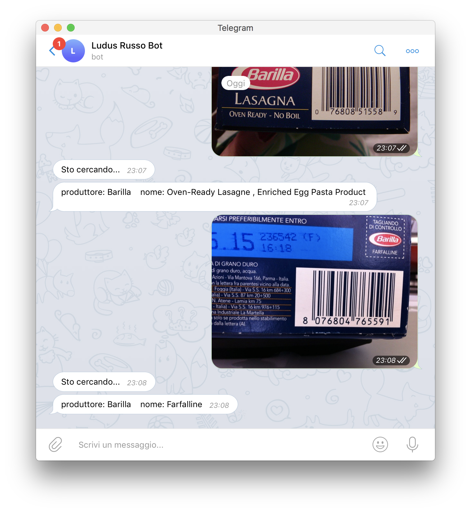

Qualche giorno fa, ho sviluppato un [breve articolo](/2018/01/22/opencv-barcode-reader/) che spiega come implementare
un sistema in grado di leggere ed analizzare i codici a barre per alimenti
utilizzando **OpenCV** e la libreria **zbar**, ovviamente in Python.

In questa guida, voglio estendere il codice implementato nel tutorial precedente
ed integrarlo ad un bot Telegram, in modo che questo sia in grado di leggere le
informazioni dal codice a barre ed rispondere all'utente con queste info.

## Vediamo come fare

Per prima cosa, come sempre, dobbiamo creare un [ambiente virtuale](/2017/11/06/virtualenv/) ed installare
python e le varie dipendenze...
Dobbiamo installare le varie librerie viste nel tutorial precedente più la libreria `telepot`
per gestire Telegram.
Questa volta non la faccio lunga:

```bash
$ mkdir barcode-telegram
$ cd barcode-telegram
$ virtualenv -ppython3 env
$ source env/bin/activate
(env)$ pip install telepot pyzbar opencv-python requests
```

Siamo pronti per iniziare. Ovviamente, partiamo dal codice già implementato nel tutorial
precedente. Creiamo un file `bot_barcode.py` ed implementiamo il seguente codice:

```python
from pyzbar.pyzbar import decode
import cv2
import requests

def get_barcode_info(img):
    gray_img = cv2.cvtColor(img, cv2.COLOR_BGR2GRAY)
    barcodes = decode(gray_img)

    if len(barcodes) == 1:
        code = barcodes[0].data
        url = "https://it.openfoodfacts.org/api/v0/product/{}.json".format(code)
        data = requests.get(url).json()
        if data["status"] == 1:
            product = data["product"]
            brand = product["brands"]
            return "produttore: {}    nome: {}".format(product["brands"], product["product_name"])
        else:
            return "Prodotto non trovato!"
    else:
        return "Codice a barre non trovato!"
```

La funzione `get_barcode_info`, come già spieato in precedenza, riceve un'immagine
OpenCV e ritorna la stringa contenente le informazioni trovate!

Precedentemente avevamo impresso le immagini all'interno dell'immagine stessa con
OpenCV. Questa volta, semplicemente facciamo ritornare queste informazioni a Telegram.

Impostiamo quindi il bot Telegram, implementando il seguente codice:

```python
# ...
import telepot

def get_barcode_info(img):
  #...

def on_chat_message(msg):
    content_type, chat_type, chat_id = telepot.glance(msg)
    if content_type == 'text':
        bot.sendMessage(chat_id, 'ciao, sono un bot molto stupido!')

TOKEN = '*** inserisci il tuo token qui  ***'

bot = telepot.Bot(TOKEN)
bot.message_loop(on_chat_message)

print 'Listening ...'

import time
while 1:
    time.sleep(10)
```

Leggete [questo mio articolo](/2017/04/27/implementiamo-un-bot-telegram-con-python/)
se non sapete cosa fa il codice implementato su!

### Leggere le immagini da Telegram

Per unire il tutto ci manca un pezzo.. Come facciamo a leggere l'immagine da Telegram
e passarla alla funzione `get_barcode_info`?

Fortunatamente, `Telepot` è già in grado di gestire le immagini. Sfortunatamente
mette a disposizione un unico metodo che permette di scaricare l'immagine come file su
disco.

#### Leggere l'immagine come file

Per leggere l'immagine, il modo più semplice che ho trovato consiste nel salvare
l'immagine come file e poi leggerla da OpenCV. Questo metodo non è molto efficace
ma funzione, e sarà il punto di partenza per testare il nostro progetto.

Per prima cosa dobbiamo controllare che il `content_type`
sia di tipo `photo`. Nel caso, possiamo scaricare l'immagine con il comando
`bot.download_file(msg['photo'][-1]['file_id'], 'image.png')` e a questo punto
la possiamo leggere il file `image.png` con il comando `cv2.imread`.

```python
if content_type == 'photo':
    bot.download_file(msg['photo'][-1]['file_id'], 'image.png')
    img = cv2.imread('image.png')
```

Fatto questo, basta passare la foto `img` a `get_barcode_info()` e mandare
la stringa ottenuta come riposta.

```python
    data = get_barcode_info(img)
    bot.sendMessage(chat_id, data)
```

Ho notato che il tempo di risposta del bot è lento, quindi per non bloccare
l'utente aggiungiamo una risposta di "Attendi" prima di analizzare la foto.

Gestiamo inoltre il caso in cui l'utente invia un dato che non è un'immagine con una
semplice risposta automatica.

Il codice completo per la funzione `handle` è quindi il seguente

```python
def handle(msg):
    content_type, chat_type, chat_id = telepot.glance(msg)
    if content_type == 'photo':
        bot.download_file(msg['photo'][-1]['file_id'], 'image.png')
        img = cv2.imread('image.png')
        bot.sendMessage(chat_id, "Sto cercando...")
        data = get_barcode_info(img)
        bot.sendMessage(chat_id, data)
    else:
      bot.sendMessage(chat_id, "Inviami una foto contenente un codice a barre!")
```

Siamo pronti per testare il bot. Avviamo il programma

```bash
(env)$ python bot-barcode.py
```

E iniziamo a comunicare con il bot. Se tutto funziona, dovrebbe essere in grado di
rispondere correttamente, come segue!



#### Evitare di salvare l'immagine su file

Il salvataggio dell'immagine su file e poi il ricaricamento di qeusta in memoria
non è molto efficiente in quanto spreca tempo (di lettura e scrittura) e risorse (Hard Disk).
Litigandoci un po', ho però
trovato una soluzione efficace che sfrutta il modulo nativo di Python3 `io.BytesIO`,
che essenzialmente simula un file caricato in memoria RAM (quindi che non viene veramente
salvato su disco). Quello che dobbiamo, è creare un file `io.BytesIO`, salvare
l'immagine su questo file e poi leggerla con OpenCV. Il tutto è dato da queste linee di codice:

```python
    raw_img = io.BytesIO()
    bot.download_file(msg['photo'][-1]['file_id'], raw_img)
    file_bytes = np.fromstring(raw_img.getvalue(), dtype=np.uint8)
    img = cv2.imdecode(file_bytes, cv2.IMREAD_COLOR)
```

Che richiedono di importare le seguenti librerie

```python
import io
import numpy as np
```

La funzione modificata diventa la seguente

```python
def handle(msg):
    content_type, chat_type, chat_id = telepot.glance(msg)
    if content_type == 'photo':
        raw_img = io.BytesIO()
        bot.download_file(msg['photo'][-1]['file_id'], raw_img)
        file_bytes = np.fromstring(raw_img.getvalue(), dtype=np.uint8)
        img = cv2.imdecode(file_bytes, cv2.IMREAD_COLOR)
        bot.sendMessage(chat_id, "Sto cercando...")
        data = get_barcode_info(img)
        bot.sendMessage(chat_id, data)
    else:
      bot.sendMessage(chat_id, "Inviami una foto contenente un codice a barre!")
```

Provate a lanciare il codice. Noterete che è molto più veloce di quello precedente!

## Codice completo

Qui trovate il codice completo sviluppato in questo articolo

```python
from pyzbar.pyzbar import decode
import requests
import telepot
import cv2
import numpy as np
import io

def get_barcode_info(img):
    gray_img = cv2.cvtColor(img, cv2.COLOR_BGR2GRAY)
    barcodes = decode(gray_img)

    if len(barcodes) == 1:
        code = barcodes[0].data
        url = "https://it.openfoodfacts.org/api/v0/product/{}.json".format(code)
        data = requests.get(url).json()
        if data["status"] == 1:
            product = data["product"]
            brand = product["brands"]
            return "produttore: {}    nome: {}".format(product["brands"], product["product_name"])
        else:
            return "Prodotto non trovato!"
    else:
        return "Codice a barre non trovato!"


def handle(msg):
    content_type, chat_type, chat_id = telepot.glance(msg)
    if content_type == 'photo':
        raw_img = io.BytesIO()
        bot.download_file(msg['photo'][-1]['file_id'], raw_img)
        file_bytes = np.fromstring(raw_img.getvalue(), dtype=np.uint8)
        img = cv2.imdecode(file_bytes, cv2.IMREAD_COLOR)
        bot.sendMessage(chat_id, "Sto cercando...")
        data = get_barcode_info(img)
        bot.sendMessage(chat_id, data)
    else:
      bot.sendMessage(chat_id, "Inviami una foto contenente un codice a barre!")

TOKEN = '*** inserisci il tuo token qui  ***'

bot = telepot.Bot(TOKEN)
bot.message_loop(handle)

print('Listening ...')

import time
while 1:
    time.sleep(10)
```

## Conclusioni

Questo progetto mi è veramente piaciuto e l'ho trovato super divertente. In realtà,
con questo tutorial voglio inaugurare una serie di articoli che sfruttano Telegram
e la Computer Vision (con OpenCV) per sviluppare bot in grado di fare Image Processing.

Se qualcuno ha possibili applicazioni per queste tecnologie, me lo dica sotto nei commenti, potremmo
farla diventare un tutorial!!

A presto.
