Riprendo con questo post il mio progetto [Costruiamo un robot Open Source](robot-open-source/),che ho lasciato un po' accantonato per vari impegni in questi ultimi due mesi.

La scrittura di questo post nasce dall'esigenza di spiegare alcuni concetti molto tecnici legati al mondo di Docker per sistemi embedded che preferisco presentare in forma scritta, per poi riprenderli nei prossimi video che verranno rilasciati sul mio canale YouTube, in cui ci focalizzeremo sull'utilizzo di ROS e Docker all'interno del nostro Raspberry PI.

Se non sapete di cosa si parla, Docker è un progetto che semplifica lo sviluppo ed il deploy di applicazioni informatiche per il web. Questo è utilizzatissimo nel mondo dello sviluppo e gestione di server web ma sta diventando popolare anche nel mondo di Linux Embedded, specialmente perchè semplifica di tantissimo la gestione di dispositivi IoT.

I problemi legati all'utilizzo di Docker su Raspberry (ed in generale su Linux Embedded basati su tecnologia ARM), sono due:

1. Installare Docker su questi dispositivi;
2. Cross-buildare i container Docker su computer convenzionali, per semplificare e velocizzare l'intero processo di sviluppo.

Il primo problema, fortunatamente, è già risolto dagli stessi sviluppatori docker, che al momento hanno rilasciato uno script che permette, con un semplicissimo comando, di installare docker praticamente su qualsiasi ambiente linux supportato (e quindi anche ambiente ARM).

Il secondo problema è un po' più incasinato, ma per fortuna [i ragazzi di hypriot.com](https://blog.hypriot.com/post/setup-simple-ci-pipeline-for-arm-images/) hanno rilasciato un bellissimo post che spiega una procedura semplice da atturare per fare questa operazione.

Questo post quindi ha il triplice scopo di:

1. Insegnare come installare Docker su Raspberry Pi in modo semplice e veloce.
2. Proporre una possibile build chain per cross-compilare immagini Docker su un computer Intel.
3. Presentare una soluzione per il deploy delle applicazioni direttamente su Raspberry Pi.

Oltre all'utilizzo di Docker vero e proprio, vedremo anche come si usa **docker-compose**, un tool che semplifica di molto la gestione delle varie immaigni Docker.

## Installare Docker su Raspberry Pi (2 o 3)

Come già accennato, l'installazione di Docker su Rasperry è un processo diventato molto semplice grazie al team di Docker. Questa procedura è stata testata dal sottoscritto su Raspberry Pi model 2 e 3 (compreso 3+). Purtroppo non funziona su Rasperry Pi Zero (almeno secondo la mie esperienza di qualche mese fa).

In particolare, per questo tutorial ho utilizzato il sistema operativo Raspbian Lite (potete scaricare l'ultima versione [questo link](https://www.raspberrypi.org/downloads/raspbian/)). La differenza rispetto a Raspbian originale consiste nel fatto che questa immagine non monta l'interfaccia grafica, ed è quindi una versione più _leggera_ (da qui il nome _lite_). La mia scelta deriva semplicemente dal fatto che, dovendo spesso lavorare con Robot o comunque dispositivi IoT che non hanno uno schermo, preferisco avere un OS alleggerito dall'interfaccia grafica. Nulla vieta di eseguire questo stesso tutorial su altre versioni di Raspbian o in generale su altri OS Linux compatibili.

### Installazione di Docker

Per installare docker, da terminale, basta eseguire il seguente comando:

```bash
$ curl -sSL https://get.docker.com | bash
```

Il quale esegue uno script che installa e configura docker sul vostro Raspberry Pi (si noti che lo stesso identico comando funziona anche su macchine standard Linux e su ogni macchina Linux compatibile con docker, non è quindi specifico del Raspberry Pi).

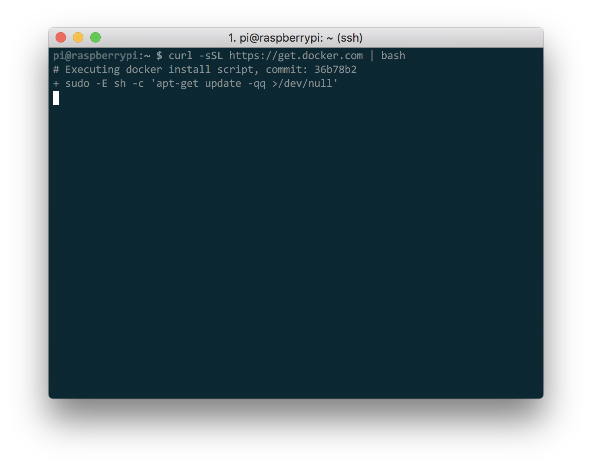

Questo script impiega un po' di tempo per essere eseguito (state attenti che ad un certo punto potrebbe chiedere di inserire la password). Un volta concluso, lo script vi chiederà di eseguire un comando:

```bash
$ sudo usermod -aG docker pi
```

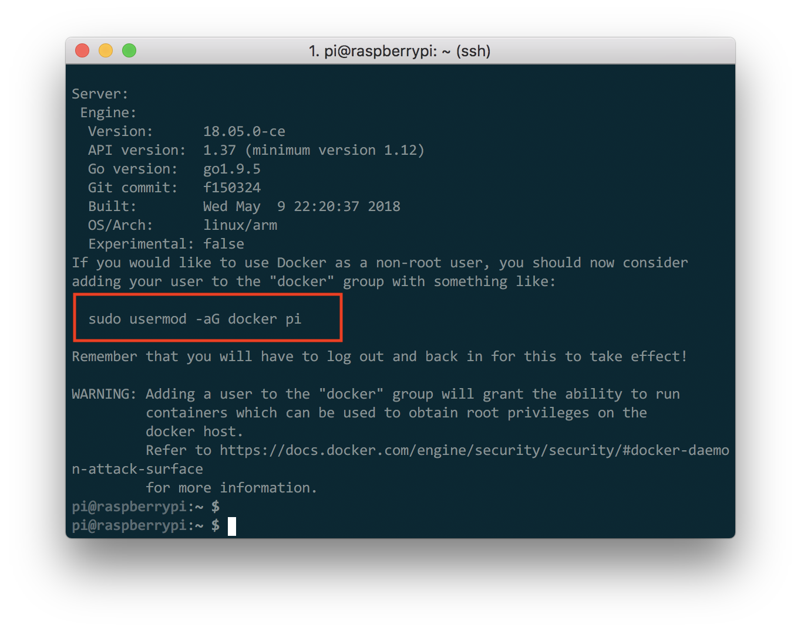

Questo farà si che il vostro utente possa accedere a Docker ed alle sue risorse senza digitare ogni volta il comando `sudo`.

### Test dell'installazione

Una volta eseguito il comando vi conviene riavviare il Rasperry Pi. Possiamo quindi testare la corretta installazione digitando il comando:

```bash
$ docker run -t hello-world
```

Che, se tutto è andato bene, mostrerà l'output come in figura.

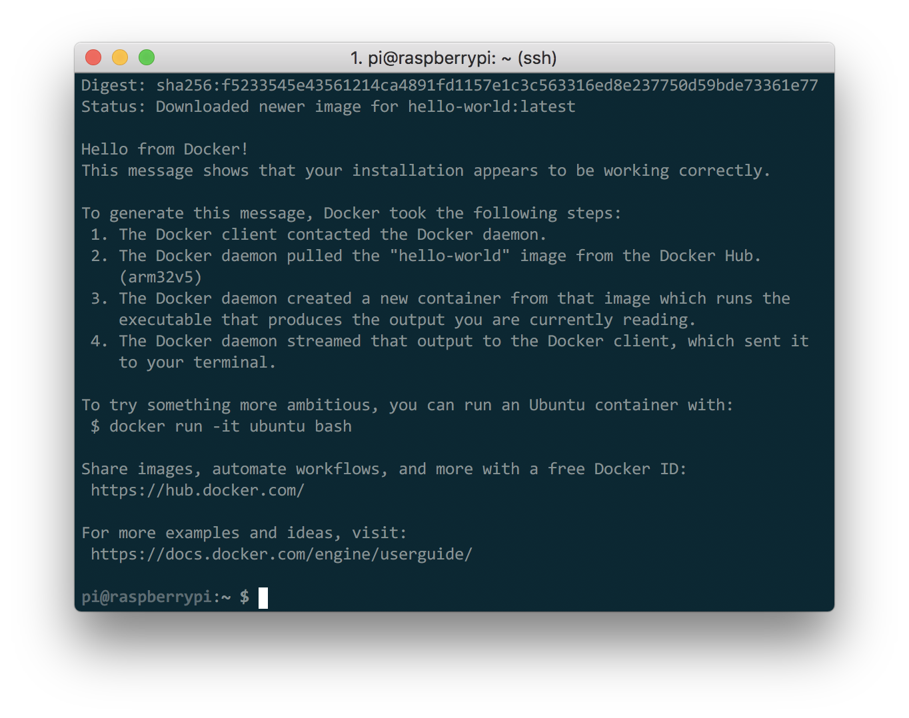

### Installiamo Docker Compose

A questo punto, possiamo procedere ad installa Docker compose, un tool (scritto in Python) molto utile per gestire macchine docker in modo semplice e veloce.

Per installarlo, basta digitare il comando

```bash
$ sudo pip install docker-compose
```

Che richiede il comando pip. Nel caso non fosse installato sul vostro Raspberry Pi (raspbian lite non lo ha di default), basta usare il comando

```bash
$ sudo apt-get install python-pip
```

## Cross Build di Docker su computer Intel

La **Cross Compilazione** o **Cross Build** è un concetto un po' complesso, che provo a spiegare qui: l'idea è quella di creare un _eseguibile_ (o in questo caso un _container_) pensato per funzionare su un'architettura hardware diversa rispetto a quella in cui è viene eseguita il build. Nel nostro caso, in particolare, quello che ci interessa è creare container docker per Raspberry Pi (quindi architettura ARM) su un computer classico, solitamente dotato di architettura Intel.

Il crossbuild è utile per due motivi:

1. Quando la nostra macchina target è poco performante, e quindi un build diretto sarebbe enormemente lento. Il Raspberry Pi è una macchina che, specialmente nelle versioni 3 e 3+, ha ottenuto potenze di calcolo non indifferenti. Ciò non toglie che un computer consumer è comunque più veloce in questo tipo di processi:
2. Quando (e questo è il motivo principale per cui preferisco preferisco fare il cross build) lavorare direttamente sulla macchina target è scomodo perchè non abbiamo a disposizione un buon ambiente di sviluppo.

Prima di procedere, ricordiamoci che docker ha un metodo di build piramidale. Quando si vuole creare un nuovo container, solitamente quello che si fa è partire da un container già esistente che viene customizzato come descritto nel _Dockerfile_. Se vogliamo creare un container con target ARM, dobbiamo quindi partire da un container già creato per ARM.

### Container per Architetture arm32v7

Fortunatamente, anche in questo caso ci vengono in aiuto gli ideatori e mantainer di Docker, che mettono a disposizione, parallelamente alle varie immaigni ufficiali docker, anche immagini per differenti architetture. Per accedere a queste immagini, basta anteporre il tag dell'architettura che ci interessa usare (ad esempio `arm32v7` nel caso del Raspberry PI) al nome dell'immagine da scaricare.

Se, per esempio, ci interessa scaricare `ubuntu:16.04` per Raspberry Pi, useremo il nome `arm32v7/ubuntu:16.04`.

### Cross Build di container per architettura arm32v7

> Nota: Ho testato questa procedura sia su macOS che su Linux, non ho avuto modo di usarla sotto Windows, che comunque sconsiglio perchè notorialmente ha un bel po' di problemi nello sviluppo.

Una volta ottenuta la nostra immagine di partenza, il prossimo passo è quella di poter lanciare il container sulla nostra macchina in emulazione. Per farlo, usiamo il progetto **qemu**, e per fortuna anche in questo caso docker ci fornisce dei tools per configurarlo al meglio.

Infatti, tutto quello che serve per far gestire il sistema di cross compilazione è lanciare questo script una volta sul nostro computer:

```bash
docker run --rm --privileged multiarch/qemu-user-static:register
```

Fatta questa operazione, potremo utilizzare tutti i container che hanno registrato il file `qemu-*-static` per la loro architettura. Nella community docker sono già presenti un po' di container che hanno già fatto questa operazione (si veda il progetto [multiarch](https://hub.docker.com/u/multiarch/)). Ad esempio, non dovremmo avere problemi a lanciare il container `multiarch/ubuntu-core:armhf-wily`, come mostrato in figura

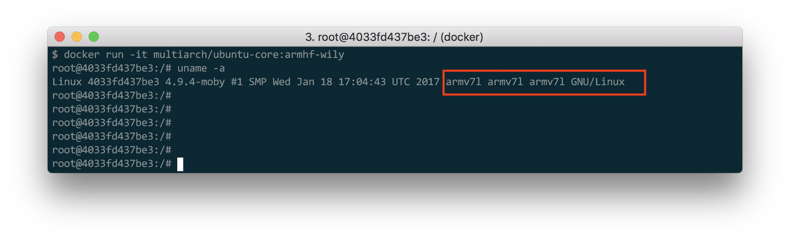

Però non funzionerà il container (o la classe di container) che ci interessa (`arm32v7/ubuntu:16.04`), che restituirà l'errore `standard_init_linux.go:178: exec user process caused "no such file or directory"` che essenzialmente indica che `qemu-arm-static` non è ancora stato registrato al suo interno.

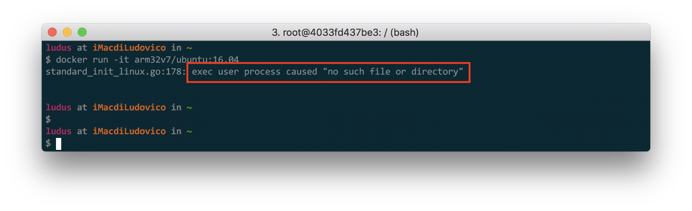

Questo non è un problema quando vi interessa solo usare un container linux base: in questo caso potete spulciare la libreria **multiarch** e trovere tantissimi container già pronti all'uso.

Diventa un problema, invece, quando ci interessa utilizzare container basati su `arm32v7/ubuntu:16.04` (o simili), come ad esempio tutti i container ufficiali di ROS.

### Registrare qemu nel vostro container

La registrazione di qemu nel container è un processo molto facile che va sempre eseguito all'inizio della fase di build di un container non ancora registrato. Una volta fatto, tutti i container costruiti su questo saranno automaticamente registrati, e non sarà necessario ripetere l'operazione.

Per eseguire la procedura, quindi, dobbiamo creare un nuovo ambiente docker in cui eseguire il build della nostra nuova immagini. Creiamo una cartella `docker-img-rpi` e creiamo, al suo interno, il file `Dockerfile` in cui andremo a lavorare. Dobbiamo quindi utilizzare un file di qemu chiamato `qemu-arm-static`. Questo file si trova nel vostro computer (è uno dei file registrati dalla procedure fatta sopra), ma per semplicità potete scaricarlo [cliccando qui](https://github.com/HotBlackRobotics/ntbd/blob/devel/NTBD_base/qemu-arm-static?raw=true)

Scaricatelo e mettetelo nella cartella di lavoro. A questo punto, è anche necessario dargli i permessi di esecuzione con il comando:

```bash
$ chmod +x qemu-arm-static
```

Andiamo quindi a creare il `Dockerfile`:

```Dockerfile
FROM  arm32v7/ubuntu:16.04
COPY ./qemu-arm-static /usr/bin/qemu-arm-static
```

Dove la prima riga `FROM arm32v7/ubuntu:16.04` dice di creare la nuova immagine a partire da `arm32v7/ubuntu:16.04`, mentre la seconda è quella che si occupa (effettivamente) di eseguire la registrazione.

A questo punto, buildiamo il tutto e testiamo se tutto funziona:

```bash
$ docker build -t ubuntu-16:rpi3 .
$ docker run -it ubuntu-16:rpi3
```

E come vedete, adesso l'immagine adesso viene eseguita correttamente.

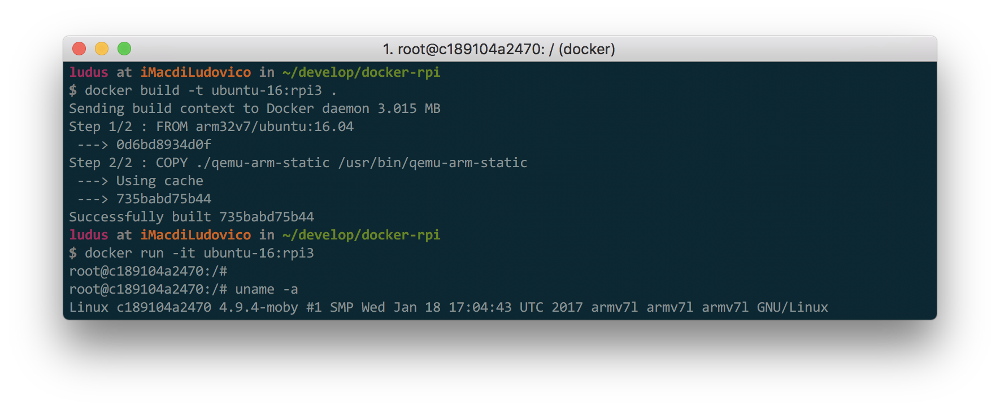

## Build e Deploy con Docker Compose

Una volta abilitata la fase di cross compilazione, non ci resta altro che trovare un modo per passare l'immagine dal nostro computer verso il raspberry in cui vogliamo che questa venga eseguita.

Ovviamente, ci sono diversi modi per farlo: il modo più semplice che ho trovato è quello di usare il progetto **dockehub** per condividere le immagini (utilissimo a meno che non volete creare delle immagini private) e **docker-compose** per il build e il deploy.

Come avete visto se avete smanettato un po' con docker, la gestione da linea di comando di docker è un po' pesantuccia, ed ci troviamo spesso a dover scrivere comandi molto lunghi su shell. L'errore e i typos sono quindi un grosso problema che spesso ci costringono a riscrivere molte volte lo stesso comando. Docker-compose è un progetto che, sebbene porti tantissimi vantaggi nella gestione dei container, utilizzo spesso perchè semplifica enormemente la gestione da linea di comando di docker.

Vi ricordo che per installare docker-compose basta eseguire il comando:

```bash
$ sudo pip install docker-compose
```

Il concetto di questo tool è molto semplice: viene creato un nuovo file (chiamato `docker-compose.yml`) che contiene alcune informazioni del progetto docker che vogliamo creare (come il nome da dare all'immagine del container, la posizione dei Dockerfile, etc.), grazie a questo file, docker-compose semplifica le api dal shell di docker enormemente.

Vediamo quindi come creare un container che, in fase di lancio, eseguire un semplice script python di `hello-world` su archietettura ARM.

### Costruiamo il Container Docker

Creiamo una cartella `arm-docker-hello` e creiamo al suo interno i file `Dockerfile` e `docker-compose.yml`.

Come visto su, scarichiamo il file `qemu-arm-static` e registriamo il file all'interno del nostro Dockerfile (se partite da un container già registrato, non è necessaria questa operazione). Inoltre, all'interno del Dockerfile, installiamo `python3` (sull'immagine `arm32v7/ubuntu:16.04`) non è installato di default:

```
# Dockerfile

# ...
RUN apt-get update
RUN apt-get install python3 -y
```

Quindi, creiamo un file `hello.py` con il seguente contenuto:

```python
#!/usr/bin/env python3

print('Hello from Docker')
```

Diamogli i permessi di esecuzione:

```bash
chmod +x hello.py
```

e copiamo all'interno della del container.

Per finire, utilizzamo l'istruzione `CMD` per dire a Docker di eseguire direttamente il file `/hello.py` quando viene chiamato con `run` (comando di default se nessun comando è specificato):

```
# Dockerfile

# ...

COPY ./hello.py /hello.py
CMD ["/hello.py"]
```

Il file `Dockerfile` è quindi

```
# Dockerfile

FROM  arm32v7/ubuntu:16.04
COPY ./qemu-arm-static /usr/bin/qemu-arm-static

RUN apt-get update
RUN apt-get install python3 -y

COPY ./hello.py /hello.py
CMD ["/hello.py"]
```

### Utilizzo di Docker-Compose

Siamo pronti ad usare docker compose per buildare ed eseguire il container. Creiamo un nuovo file chiamato `docker-compose.yml` ed inseriamo il seguente codice all'interno:

```
version: '3'

services:
  arm-ubuntu:
    build: .
```

Queste poche linee dicono che noi vogliamo creare un'immagine (in docker-compose sono chiamati **servizi**) che chiamiamo `arm-ubuntu` (attenzione, questo non è un tag docker, come vedremo dopo, ma solo un nome arbistrario che noi stiamo dando).
Diamo anche informazioni a docker-compose che il `Dockerfile` per eseguire il build del container si trova nella cartella corrente (da qui `build: .`).

A questo punto, possiamo eseguire il build con il comando

```bash
docker-compose build arm-ubuntu
```

e, una volta conclusa questa fase, lanciare il container con il comando

```bash
docker-compose run arm-ubuntu
```

Se poi vogliamo eseguire un comando diverso al nostro container, basta specificare questo comando, proprio come con docker. Ad esempio, per aprire la bash, digitiamo

```bash
docker-compose run arm-ubuntu bash
```

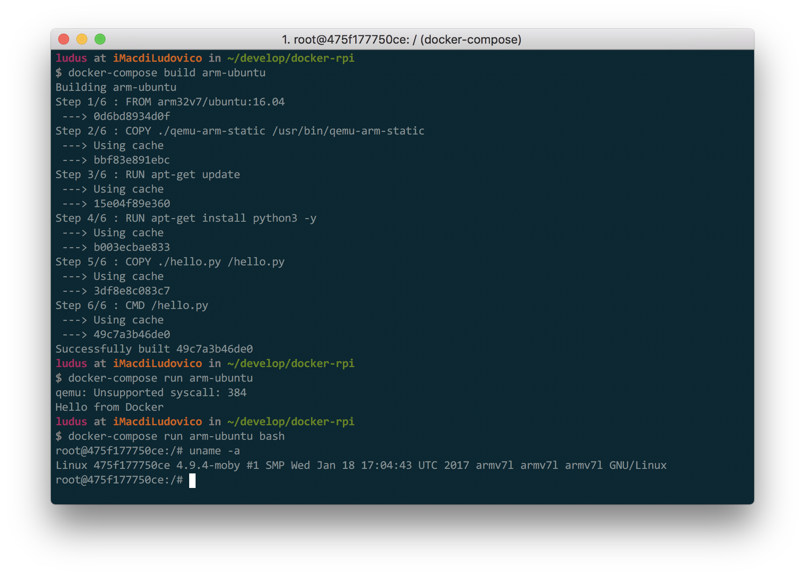

Come potete vedere, a parte uno strano errore da qemu (`qemu: Unsupported syscall: 384`) l'immagine viene eseguita perfettamente. L'errore è dovuto al fatto che siamo comunque in un ambiente di emulazione.

### Desploy sul Raspberry Pi con DockerHub

Finita la fase di build e test del container, non ci resta che inviarlo al nostro Raspberry Pi.
Per farlo, utilizziamo il progetto Dockerhub, che permette di condividere le vostre immagini tramite internet.

Per prima cosa, se non lo avete già fatto, dovete iscrivervi in modo da avere un accesso ed un nome utente. Per farlo, basta accedere al sito [https://hub.docker.com/](https://hub.docker.com/) e seguire le istruzioni per creare un account. Prendete nota del vostro username (il mio è `ludusrusso`).

Una volta loggati, dobbiamo creare una nuova repository cliccando sul tasto in alto a sinistra.

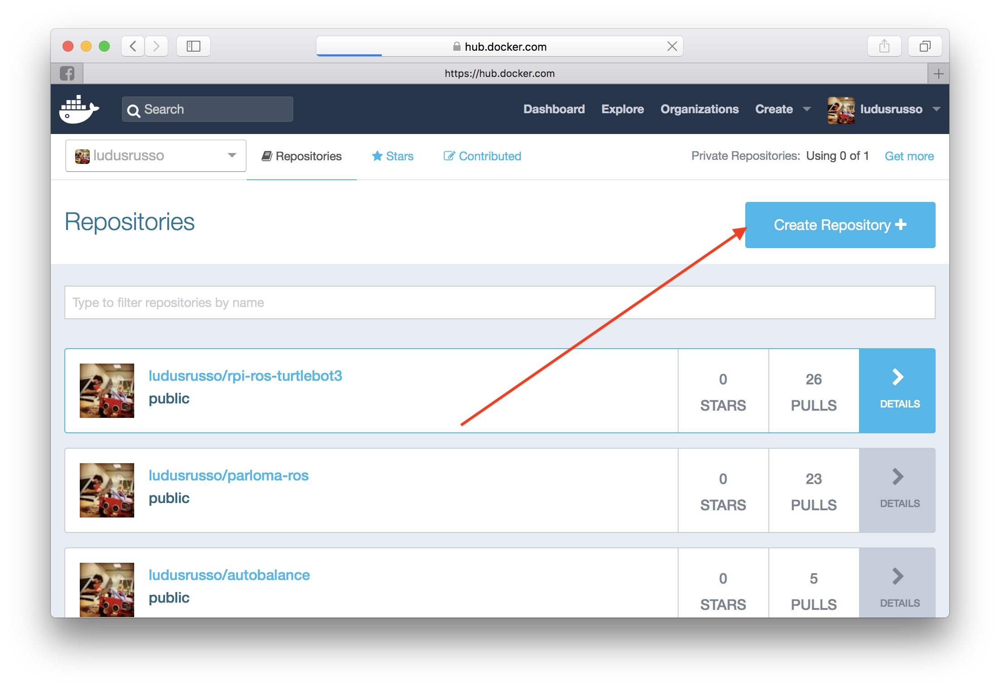

Diamo un nome ed una descrizione alla nostra immagine, e quindi clicchiamo sul tasto `create`.

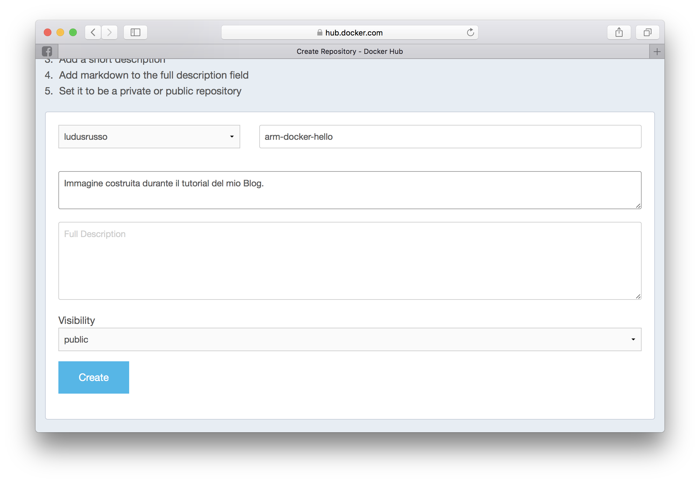

A questo punto, otterremo un tag della nostra immagine (che ha la forma `<nome utente>/<nome immagine>`) che dovremmo usare per fare il deploy ed il download. Nel mio caso è `ludusrusso/arm-docker-hello`.

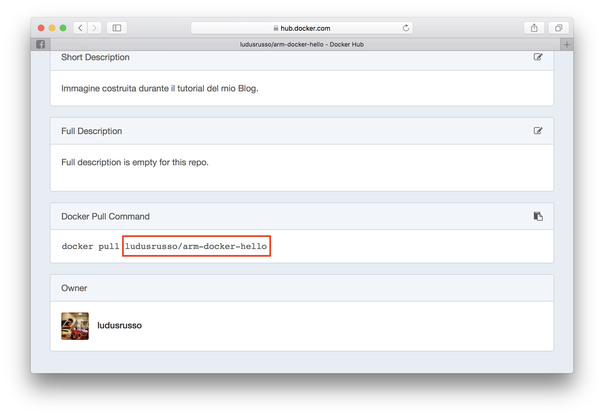

Ora torniamo nel nostro terminale, per prima cosa dobbiamo loggarci su docker hub, per farlo, basta digitare il comando `docker login` su shell ed inserire nome utente e password.

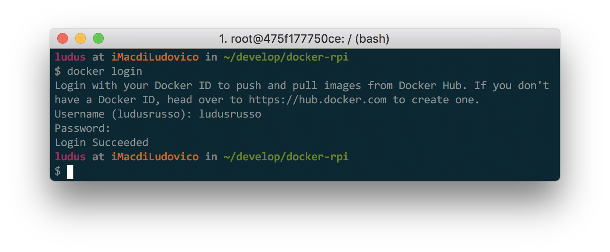

Ora, dobbiamo taggare la nostra immagine con il tag ottenuto da dockerhub. Per farlo, aggiungiamo la riga

```
image: <tag immagine da dockerhub>
```

dentro il file `docker-compose-yml`. Che nel mio caso, diventa:

```
version: '3'

services:
  arm-ubuntu:
    image: ludusrusso/arm-docker-hello
    build: .
```

Per finire, buildiamo nuovamente l'immagine (in modo da inserire il tag all'interno di questa), e quindi eseguiamo il comando

```bash
$ docker-compose push
```

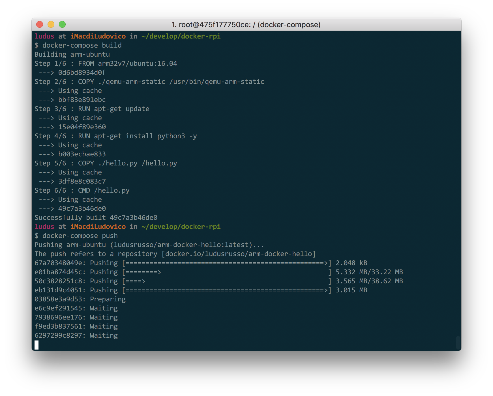

Questo effettuerà il deploy su dockerhub. Una volta finita al procedura (che potrà durare anche molto in base alla velocità della connessione internet), finalmente la nostra immagine sarà scaricabile da internet.

A questo punto, non ci resta che accedere al nostro Raspberry Pi e verificare che tutto funzioni per il meglio. Per farlo, semplicemente eseguiamo l'immagine da docker (per ora non serve usare docker-compose) con il comando:

```bash
$ docker run <tag immagine da dockerhub>
```

Come vedrete, docker si accorge che l'immagine non esise in locale sul Raspberry e la scarica in automatico prima di eseguirla.

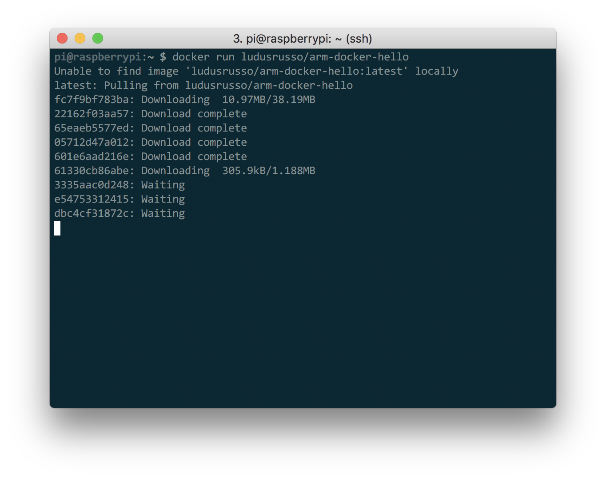
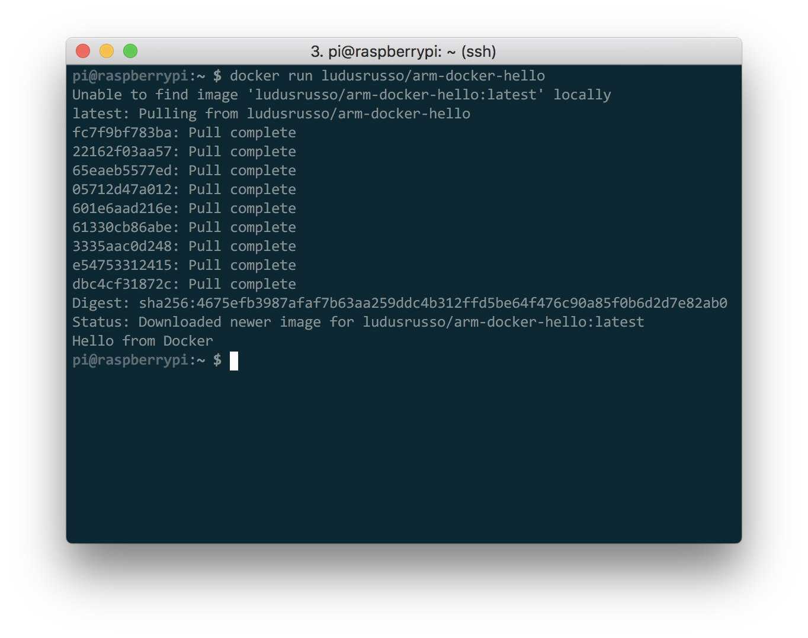

## Conclusioni

Si conclude qui questo tutorial, che sarà poi alla base del prossimo video (a breve sul mio canale YouTube) in cui vedremo come configurare un nuovo Raspberry Pi e usare Docker con ROS per iniziare a svilupparci delle applicazioni un po' più complesse.

Nell'attesa chiedo, come al soluto, quali sono le vostre impressioni in merito e cosa pensate di fare con questa tecnologia!

## Update Agosto 2020

Nell'ultimo anno le cose si sono molto semplificate. In particolare Docker sta lavorando all'integrazione di immagini multi architettura che semplificano notevolmente quanto spiegato soprato.

Ho realizzato un video dove la nuova funzionalità viene descritta!

<iframe width="100%" height="400px" src="https://www.youtube-nocookie.com/embed/bY3X3Sc5s9A" frameborder="0" allowfullscreen></iframe>
