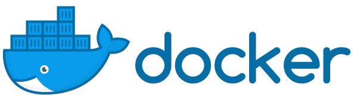
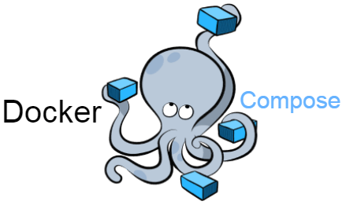

Da un po' di tempo mi sto dedicando sempre di più allo sviluppo di software in Cloud, e ho costruito e sviluppato una serie di skills su software, tools e strategie per lo sviluppo di software in cloud in modo semplice e veloce.

In questo post, vi voglio raccontare queli che sono i tool più importanti che ogni _Cloud Developer_ deve conoscere, e a cosa servono!

## 1. Docker

Ho [parlato di Docker](https://ludusrusso.cc/tags/#docker) in alcuni post in questo blog.

**Docker** è probabilmente il progetto Open Source che ha avuto più impatto nel mondo del Cloud Computing negli ultimi tempi, basti pensare che in meno di 5 anni (Docker è stato rilasciato nel 2013) è diventato uno standard di fatto accettato ed utilizzato da tutti i Big del mondo Cloud Computing, ma già in [meno di 2 anni dal rilascio](https://www.datacenterknowledge.com/archives/2014/08/22/docker-ceo-dockers-impact-data-center-industry-will-huge) era sotto il mirino dei vari cloud provider, per la sua capacità di impacchettare. spostare e distribuire applacazioni tra i vari ambienti Cloud.

Docker è basato sulla tecnologia dei Linux container, che possono essere visti (mi scusino i puristi del cloud ma ho bisogno di un esempio pratico) come delle _Macchine Virtuali Superleggere_. Docker permette di gestire la creazione, distribuzione, condivisione e gestione di Linux Container.

Impacchettando un'applicazione con Docker all'interno di un Container Linux, siamo sicuri che le dipendenze dell'applicazione e l'ambiente di configurazione sarà sempre lo stesso indipendentemente da dove verrà deployata l'applicazione stessa, sia sul nostro PC di sviluppo su cui gira Ubuntu, che su un server remoto basato su Debian o un cluster di Server (si veda la voce Kubernetes) in Cloud.

Docker inoltre standardizza il modo in cui un'applicazione viene Buildata e Testata, semplificando notevolmente la gestione del Continuous Integration delle applicazioni in Cloud.
Il build delle applicazioni Docker è _incrementale_, questo vuol dire che docker permette di risparmiare tantissimo tempo in fase di compilazione, in quanto le parti delle immagini già compilate possono essere riutilizzare nei build futuri.

Per finire, Docker permette di distribuire le immagini tramite Internet con i Container Registry. Questi possono essere utilizzati sia per spostare in modo semplice le applicazioni
dal nostro ambiente di test locale all'ambiente di produzione in cloud, ma anche permette di condividere le immagini di progetti in modalità Open (o anche no). Basta fare un giro sul sito [Docker Hub](https://hub.docker.com/) per capire di che parlo.

### 1.1 Docker per IoT

Un piccolo bonus, prima di andare avanti, lo voglio dedicare al mondo IoT, che è stato anche questo influenzato tantissimo dalla tecnologia Linux Container e quindi da Docker.

Come ho già detto, i container molto leggeri con un overhead minimo. Per questo motivo, questa tecnologià sta avendo lo stesso impatto che ha avuto la Virtualizzazione all'interno dell IoT. I container Docker possono infatti essere tranquillamente eseguti all'interno di macchine ARM su Embedded Linux. Con i registry Docker, le immagini possono essere distruibuite come aggiornamenti su dispositivi IoT in produzione.

Per approfondimenti, ho trattato il tema su questo blog nell'articolo [Buildare e usare container Docker per Raspberry Pi](https://ludusrusso.cc/2018/06/29/docker-raspberrypi/)

## 2. docker-compose

Lo sviluppo di applicazioni Docker richiede una certa conoscenza del tool linea di comando `docker`, che risulta essere (ve ne accorgerete subito) molto prolisso per compilare, lanciare e gestire applicazioni Docker. Il tutto si complica quando iniziamo ad avere progetti con più di un container docker in azione (e vi assicuro che è normale avere almeno due container che lavorano insieme), e se si vogliono sfruttare le funzionalità di docker come la gestione dei `volumi`, il networking virtuale o il semplice passaggio di configurazioni (come variabili d'ambiente) al container.

`docker-compose` è un tool (implementato in Python) che permette di gestire in modo semplice e veloce la gestione dei container. Al posto di gestire l'intera vita dei container a mano da line a di comando, possiamo creare un file di configurazione `docker-compose.yaml` che descrive i nostri container e come questi interagiscono tra loro. Una volta creato ed implementato questo file, possiamo usare dei comandi semplificati per creare, gestire e distruggere i container!

## 3. Kubernetes

**Kubernetes** (**k8s** per gli amici) è un progetto Open Source nato e spinto da Google, e attualmente matenuto dalla **Cloud Native Computing Foundation**. Kubernetes è il progetto che, dopo Docker, ha radicalmente ridefinito il concetto di Cloud Computing moderno. Kubernetes è un sistema che permette di orchestrare e gestire applicazioni basate su container. Permettendo di automatizzare e semplificare il deployment, lo scaling e la gestione di applicazioni i cui _building blocks_ sono, appunto, container.

Kuberentes introduce alcuni concetti che richiedono un po' di tempo per essere appresi e digeriti, ma, una volta capiti, ci permettono gestire interamente un'applicazione cloud con uno (o più) file di configurazione e una serie di semplici comandi basati sul tool `kubeclt`.

## 4. Helm

Per finire, **Helm** è l'ultimo tool che ho iniziato ad utilizzare in questo periodo, ma che,in pochi giorni, ha rivelato tutta la sua potenza. Come viene definito dagli stessi creatori del progetto, Helm è un packet manager per kubernetes, e ci permette di condividere ed utilizzare applicazioni kubernetes in modo semplice e veloce. Il progetto ha permesso di costruire repository di applicazioni _kubernetes-ready_, come [Kubeapps](https://hub.kubeapps.com/), che possiamo installare ed utilizzare sul nostro cluster persone pochi click!

## Conclusioni

Le tecnologie informatiche si evolvono velocemente, le tecnologie web lo fanno molto velocemente e anche il Cloud Computing non è da meno. Lo sviluppo di applicazioni Cloud è cambiato notevolmente in pochissimi anni (se non mesi), e con questo post ho voluto fare una carrellata sulle tecnologie che, a mio pararere, sono le più importanti da conoscere per chi vuole lavorare nel mondo del cloud computing.

Voi cosa ne pensate? Ho dimenticato qualcosa? Avete dei suggerimenti o creitiche per migliorare questo post?
