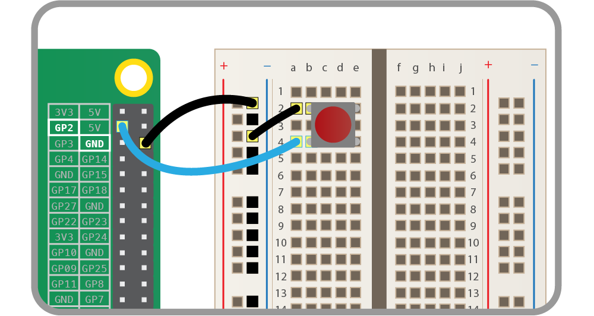

Il primo post di quest'anno è stato inspirato da una domanda di un utente su un [precedente articolo](https://ludusrusso.cc/2017/10/29/bot-telegram-telepot-2/), che mi chiedeva questo:

> "ho implementato il bot senza problemi, mando un comando e mi restituisce quando mi serve, vorrei nel frattempo, monitorare un GPIO, il quale se cambia stato, manda un messaggio al bot senza che io abbia fatto esplicita richiesta con un comando, è possibile farlo ? grazie mille"

Dato che l'idea è molto interessante e permette di lavorare su progetti molto utili, ad esempio un allarme fatto in casa, ho deciso di scrivere un post per spiegare come fare!

Iniziamo quindi, al solito, ad tirare su l'ambinete di sviluppo ed iniziare a lavorare.

## Componenti necessari

Il progetto si basa su Raspberry Pi, quindi sarà necessario avere a disposizione in casa questo computerino. Nel mio caso, ho usato un [Raspberry Pi Model 3B+](https://amzn.to/2R4LoCQ) con relativi componenti necessari e su cui ho installato [Raspbian Lite](https://www.raspberrypi.org/downloads/raspbian/), che come sapete è la mia Distro preferita per Rpi. Ovviamente dovrebbe andare bene qualsiasi Distro e qualsiasi versione del Raspberry.

Vi servirà anche un modo per inviare comandi al GPIO di ingresso che invierà il segnale. Nel mio caso, ho usato un semplice bottone connesso al PIN come descritto più sotto.

## Setup Ambiante di Sviluppo

Assicuriamoci, una volta entrati nel Raspberry pi, di avere installato `python3` (che dovrebbe essere installato di default in Raspbian).

A questo punto, dobbiamo installare virtualenv con il comando

```bash
python3 -m venv env
```

E siamo finalmente pronti a lanciare il nostro ambiente virtuale ed installare le dipendenze:

1. `telepot` per creare il nostro bot,
2. `RPi.GPIO` per interagire con i GPIO del Raspberry PI.

```bash
$ mkdir bot-telegram && cd bot-telegram
$ python3 -m venv env && source ./env/bin/activate
(env)$ pip install telepot RPI.GPIO
```

Notate che, a differenza di quello fatto nei miei [precedenti tutorial](https://ludusrusso.cc/2017/04/27/implementiamo-un-bot-telegram-con-python/), questa volta ho installato l'ambiente virtuale con il comando `python3 -m venv env`, e che stiamo usando Python 3 invece che Python 2.

## Creiamo il BOT

Creiamo un file chiamato `bot.py` (o come preferite) e apriamolo con un qualsiasi editor di testo (io uso `vim`, ma voi potete usare quello che volete).

Come punto di partenza, prendiamo il codice che trovate nel mio [precedente tutorial](https://ludusrusso.cc/2017/04/27/implementiamo-un-bot-telegram-con-python/). Ho dovuto solo modificare la linea `print 'Listening ...'` con `print('Listening ...')` in quanto questa volta usiamo **Python3** invece che **Python2**.

```python
import telepot

def on_chat_message(msg):
    content_type, chat_type, chat_id = telepot.glance(msg)
    if content_type == 'text':
        bot.sendMessage(chat_id, 'ciao, sono un bot molto stupido!')

TOKEN = '*** inserisci il tuo token qui  ***'

bot = telepot.Bot(TOKEN)
bot.message_loop(on_chat_message)

print('Listening ...')

import time
while 1:
    time.sleep(10)
```

Come sapete, questo bot è un semplicissimo bot che risponde a qualsiasi messaggio con un semplice `'ciao, sono un bot molto stupido!'`. Se volete più informazioni su come scrivere questo codice o sapere esattamente cosa fa vi consiglio di rileggere il mio [primo articolo su Telegram e Python](https://ludusrusso.cc/2017/04/27/implementiamo-un-bot-telegram-con-python/). Non credo sia necessario ripetermi qui.

Altro consiglio, dato che questo bot è super testato, prima di andare avanti lanciatelo e provate almeno una volta che funziona. Saprete, in futuro, che se qualcosa non funziona è colpa di quello che avete aggiunto dopo :D

### Callback e GPIO

Se avete letto questi articoli, vi ricorderete che quando parlo della funzione `on_chat_message` vi metto in guardia sul fatto che questa funzione non viene mai chiamata direttamente dal nostro codice, ma è la libreria `telepot` che si occupa di invocarla quando qualcuno scrive un messaggio al bot. In gergo, questo tipo di funzioni vengono chiamate _callback_, e vengono usate ogni volta che creiamo un programma che deve gestire _eventi_ che vengono generati esternamente al programma stesso.

Le funzioni di callback, oltre ad essere definite, devono anche essere _registrate_ all'evento che devono gestire. Ogni libreria o tool che usiamo ha un modo proprio di gestire le registrazioni, ad esempio, in `telepot` la registrazione avviene con la riga `bot.message_loop(on_chat_message)`, in cui essenzialmente diciamo al nostro bot:

> Hey bot! Ogni volta che qualcuno ti scrive un messaggio, chiama gentilmente la funzione `on_chat_message`. Si occuperà lei di generare la risposta.

Perchè ho fatto questa lunga premessa? Il motivo è semplice, anche il cambio dello stato di un GPIO (in ingresso) del Raspberry Pi è un evento esterno al programma, quindi deve essere gestito in un modo simile :)

Ed infatti, la libreria `RPi.GPIO` mette a disposizione un modo per registrare una funzione di callback quando lo stato di un GPIO cambia. Questa funzione è la seguente:

```python
GPIO.add_event_detect(PIN, EVENT, callback=cfunc)
```

e che prende i seguenti parametri:

1. `PIN` è il numero del GPIO che vogliamo "ascoltare".
2. `EVENT` è il tipo di evento a cui vogliamo rispondere. Ci sono 3 tipi di eventi:
   - `GPIO.RISING`: risponde all'evento cambio stato da _LOW_ a _HIGH_.
   - `GPIO.FALLING`: risponde all'evento cambio stato da _HIGH_ a _LOW_.
   - `GPIO.BOTH`: risponde indistintamente ad entrambi gli eventi.
3. `callback`, il nome della funzione di Callback che dobbiamo chiamare al verificarsi dell'evento.

Capito questo, il resto è facile. Per prima cosa, dobbiamo creare una funzione che invia un messaggio tramite il nostro bot. La cosa è molto facile, infatti basta implementare questo:

```python
def bot_cb(pin):
    print('il pin {} ha cambiato stato'.format(pin))
    bot.sendMessage(admin_id, 'il pin {} ha cambiato stato'.format(pin))
```

ed attaccare questa funzione al nostro PIN di input nel seguiente modo:

```python
INPIN = 2

GPIO.setmode(GPIO.BCM)
GPIO.setup(INPIN, GPIO.IN)

GPIO.add_event_detect(INPIN, GPIO.BOTH, bot_cb)
```

Notate che, a differenza del caso normale in cui il bot risponde ad una chat, in questo caso il bot deve conoscere _a priori_ l'id chat a cui mandare il messaggio. Ci sono vari modi per farlo, ma il più semplice è embeddare nel codice il proprio _chat id_. Basta quindi definire la variabile `admin_id = 00000000` (con il proprio chat id) e poi usarla per inviare il messaggio.

Per scoprire il proprio chat id ci sono vari modi, il più immediato è quello di usare uno dei bot disponibili su telegram, come [@chatid_echo_bot](https://t.me/chatid_echo_bot), che vi risponderà con il vostro chat id a qualsiasi messaggio gli invierete.

## Programma Completo

Il programma finale, quindi, è il seguente:

```python
import telepot
import RPi.GPIO as GPIO

admin_id = 0000000 # Inserisci il chat id di chi deve ricevere il messagio
INPIN = 2
TOKEN = '*** INSERISCI IL TUO TOKEN ***'

GPIO.setmode(GPIO.BCM)
GPIO.setup(INPIN, GPIO.IN)

def on_chat_message(msg):
    content_type, chat_type, chat_id = telepot.glance(msg)
    if content_type == 'text':
        bot.sendMessage(chat_id, 'ciao, sono un bot molto stupido!')

bot = telepot.Bot(TOKEN)
bot.message_loop(on_chat_message)

def bot_cb(pin):
    print('il pin {} ha cambiato stato'.format(pin))
    bot.sendMessage(admin_id, 'il pin {} ha cambiato stato'.format(pin))

GPIO.add_event_detect(INPIN, GPIO.BOTH, bot_cb)

print('Listening ...')

import time
while 1:
    time.sleep(10)
```

### Test con un bottone

Per testare il tutto, ho creato un semplicissimo circuito con un pulsante sul Raspberry, collegato al GPIO 2 secondo il seguente schema:



Il bot funziona bene, ci sono alcuni problemi che non ho voluto risolvere perchè questo test è (appunto), un semplice test di funzionamento e non un vero e proprio caso d'uso.

In particolare, a causa dei rimbalzi meccanici delle perti interne del bottone, capita che la funzione di callback venga chiamata più volte quando il bottone cambia stato. Questo è normale ed anche facilmente risolvibile, ma non ho voluto complicare il codice per un esempio di questo tipo.

## Che ne pensate?

Avete in mente applicazioni e casi d'uso dove è richiesto che un raspberry invii messaggi a qualcuno quando lo stato di un pin (od un sensore in generale) cambia? Io si, e la mia idea consiste anche nel dover fare un po' di analisi di immagini. Quindi aspettatevi a breve un nuovo tutorial!!!!
