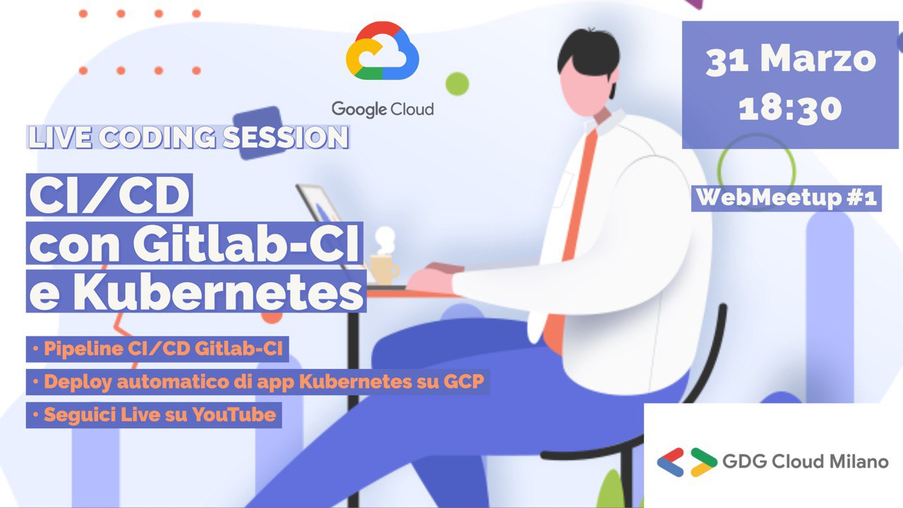

Per ragioni di lavoro sono stato un po' costretto ad abbandonare questo blog,
ma da oggi mi impegno a riprenderlo e ricominciare a scrivere contenuti come
una volta.

Forse l'argomento sarà un po' diverso, in quest'ultima anno, dopo il trasferimento
a Milano ed un cambiamento di lavoro, mi sono fortemente interessato al mondo
del cloud computing ed in particolare a Kubernetes.

Oggi, vi segnalo un mio intervento in live streaming su Youtube dal titolo
**[webMeetup #1] GDG Cloud Milano - Live Code: CI/CD con Gitlab-CI e Kubernetes**,
in cui, insieme agli amici di **GDG Cloud Milano**, che mi hanno recentemente
accolto come organizzatore, discuteremo del mondo del Continuous Integration and
Continuous Deployment con Kubenretes e Gitlab-CI sulla piattaforma Google Cloud
Platform.

Potete seguire l'evento oggi dalle 18:30 cliccando sulla locandina qui in basso:

Vi lascio l'agenta, e vi aspetto numero alla live, dove sarà possibile anche
interagire in Tempo Reale con noi speaker per mezzo di strumenti digitali!

Il primo evento online di GDG Cloud Milano vede una live code in cui impareremo a sviluppare un’app in Angular da zero e deployare all’interno di Google Kubernetes Engine per mezzo della piattaforma CI/CD Gitlab CI.

👉 Potrete seguire l'evento nel nostro [canale Youtube](https://www.youtube.com/channel/UCs2L)

AGENDA
18:30-18:40 Inizio stream live e introduzione
18:40-19:00 Introduzione a Docker, Kubernetes e GitLab-CI (per i più inesperti)
19:00-19:30 Sviluppiamo una semplice app con Angular
19:30-20:00 Setup e deploy tramite GitLab-CI
20:00-20:30 Go live e test tramite la community :)
20-30:21:00 Aperitivo di Networking Digitale, Q&A e Smanettamento

📑 Sei interessato ad avere slide e codice? Compila un piccolo form alla fine dell'evento ed avrai accesso a tutto il materiale :)

Cosa ti serve?
Una connessione ad internet ed un po’ di tempo libero per seguire lo stream. Prepara qualcosa da bere e da mangiare insieme agli altri della community :)

Quanto costa?
Nulla. L'evento è assolutamente gratuito!

Chi e' lo Speaker?
Ludovico Russo ha ottenuto un PhD in Cloud Computing and Robotics presso il Politecnico di Torino. Attualmente lavora come consulente e inprenditore nel mondo del Cloud Computing, utilizzando principalmente kubertes e GCP!
