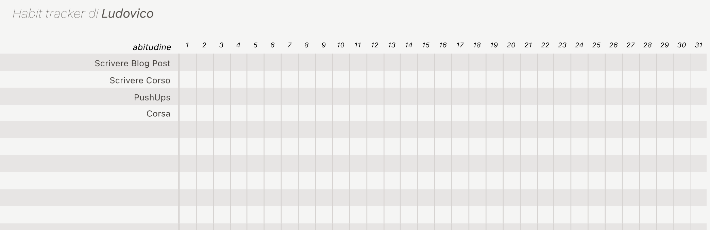

Recentemente ho riletto uno dei libri che più mi hanno cambiato la vita: [Atomic Habit](https://amzn.to/3wvllXf),
un libro veramente brillante che parla di crescita personale e di come possiamo raggiungere il successo
controllando le nostre abitudini. [Qui trovate cosa ne penso](https://ludusrusso.dev/books/hatomic-habits)!

Uno dei metodi che l'autore propone per creare un'abitudine duratura nel tempo è quello dell'**Habit Tracking**.
Non sto qui a spiegarvi i motivi neuroscientifici e psicologici del perchè questo metodo funziona (leggete
il libro per approfondire), ma devo dire che, dopo averlo usato per qualche mese, ne sto vendendo tantissimo
i benefici!

Il modo più semplice per fare tracking delle abitudine è di mettere una croce su un calendario ogni volta
che eseguiamo quell'abitudine. Ma ovviamente se sono più di una la cosa non funziona. Personalmente ho
provato diverse apps ma credo che un cosa fisica sia l'idea (il solo mettere la 'x' fisicamente da qualche parte
fa parte del _reword_ che ci aiuta a continuare a ripetere l'abitudine il giorno successivo).

L'autore vende un [simpatico libricino](https://jamesclear.com/habit-journal) che contiene al suo interno
delle pagine per fare tracking delle nostre abitudini, libro che probabilmente prima o poi comprerò 😂

Ad ogni modo, in un momento di noi, ho creato una piccola web app che vi permette di creare e sacricare il vostro
habit tracker in modo semplice e veloce.

Ecco quello che viene fuori:

Ve la piazzo qui sotto :D

<TrackerApp />

## Come usare l'habit tracker

Il suo utilizzo è molto semplice. Ogni pagina rapprensenta un mese delle nostre abitudini.
Devete i giorni che vanno da 1 a 31. Ogni riga rapprensenta invece l'abitudine. Lo scopo
è semplicmente eseguire la nostra abitudine alla frequenza che vogliamo (una volta al giorno, una ogni 2 giorni, etc.)
e tracciare una x nella casella ogni volta che eseguiamo quell'abitudine.

Vi renderete conto che, dopo un po' di sforzo inizale, mettere la x e completare il mese vi darà tantissima motivazione
per continuare a seguire l'abitudine!

Che ne pensate di questo _Habit Tracking_? Come posso miglioralo? Scrivetemelo nei commenti.
