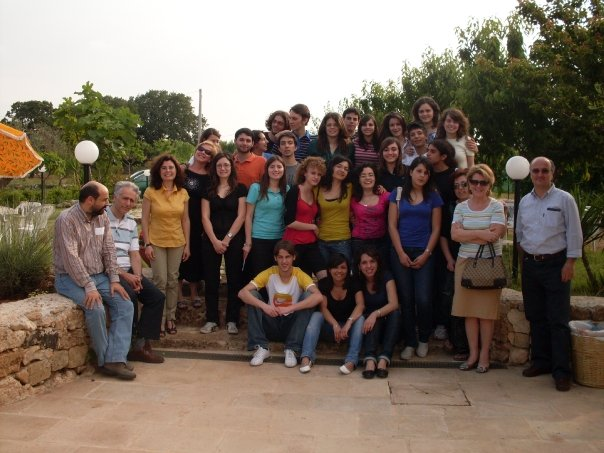
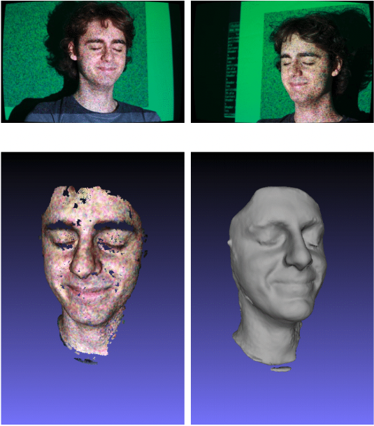
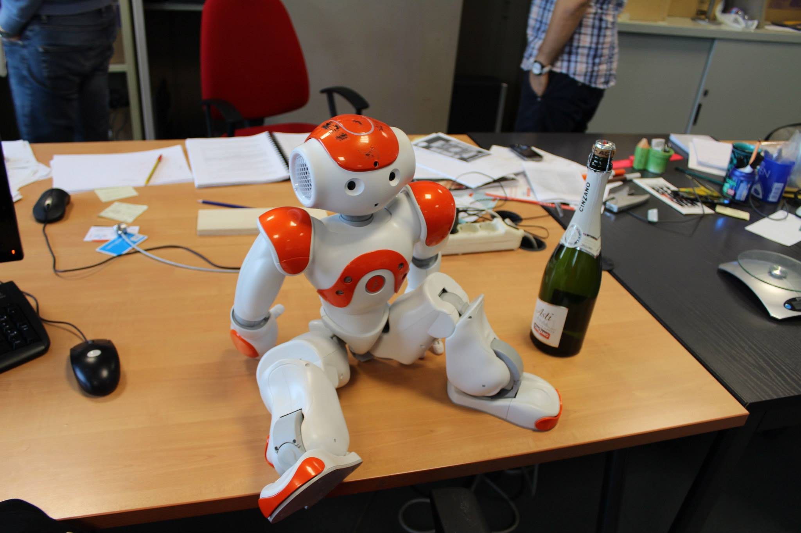
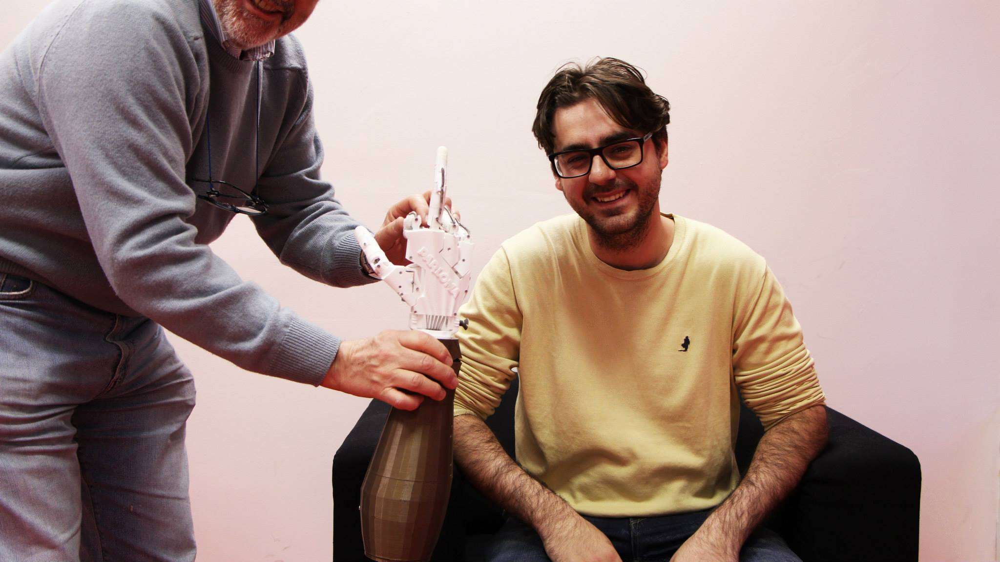
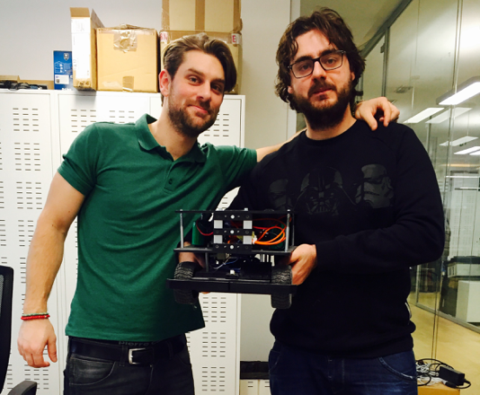
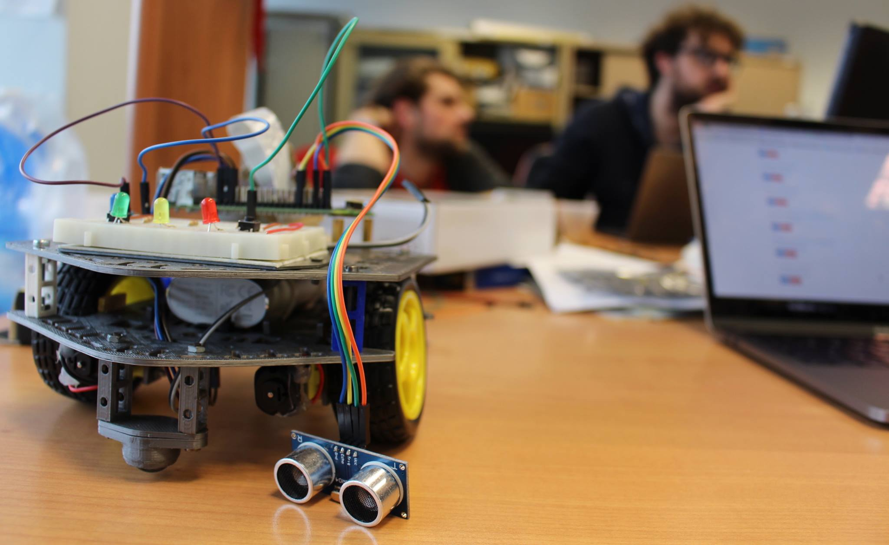

Nel settembre 2007 ho iniziato l'ultimo anno del liceo Scientifico di Tricase (in salento), la mia città natale. Come molti
liceali di quel periodo non avevo la minima idea di dove sarei andato a finire da li ad un anno.

**E la cosa mi spaventava a morte!**

Ricordo che avevo maturato l'idea che semplicemente il mondo sarebbe finito nel momento in cui avessi finito la scuola,
non che non avessi stimoli o opportunità. Giocavo a pallavolo, ed ero bravino, e per un periodo ho maturato l'idea
di dedicare la mia vita allo sport. Amavo la matematica, ed ero bravo anche li, ma l'idea di fare poi l'insegnante
non mi è mai piaciuta.

Questa era la mia classe a proposito!

**Sapevo solo che non avrei fatto medicina**, per due motivi:

1. Essendo nato in una famiglia di medici, ho vissuto i miei primi 18 anni di vita con nonni, zii, cugini ecc. ecc. che
   mi dicevano che sarei diventato medico. Credo fosse il modo migliore per convincere un ragazzo a NON FARE una certa cosa.
2. Il 75% della mia classe voleva fare medici, mi sembrava una cosa un po' inflazioata a quei tempi!

Il quinto anno passa veloce tra pallavolo, compiti, preparazione agli esami, e ovvaimente arrivo alla primavera senza la minima
idea di quello che avrei fatto.

**Poi una mattina d'aprire arriva la svolta**

La professoressa di italiano annuncia un compito in classe per la settimana successiva, due dei miei compagni di classe
alzano la mano dicendo

> Prof. noi quel giorno saremo a Torino per i test di ingresso anticipati al Politecnico.

Con la risposta pronta della professoressa

> Non fa niente, vi perderete il compito, vedremo poi come farvelo recuperare.

Ricordo esattamente quel momento come una delle prime volte in cui il mio cervello si è veramente messo in moto per cogliere
un'opportunità. Se c'è una cosa che non sopportavo erano i compiti di italiano, materia che non ho mai apprezzato fino in
fondo.

Per il mio cervello è stata un'uternità, ma credo di averci messo meno di 1ms per prendere quella decisione, alzare la mano
e dire:

> Prof. anche io farò i test di ingresso con Antonio e Sergio al Politecnico!

Ad essere onesti ci stavo pensando già da un po', i miei due compagni (Antonio e Sergio) si erano preparati da tempo
per andare, ma molto spesso avevano cercato di convicermi ad andare con loro. Non avevo mai preso sul serio la cosa,
in reltà perchè pensavo che gli ingegneri facessero solo ponti e case, ma in quel momento avevo deciso, quale
migliore occasione di saltare un compito di italiano in fondo?

Non credo di aver mai avuto un botta di culo grande come allora. Se quel giorno non ci fosse stato un compito di italiano
probabilmente adesso sarei in una classe ad insegnare. Non lo sapremo mai. Comunque una settimana dopo ero su un treno
notte con i miei due amici a studiare come un pazzo per prepararmi ai test di ingresso.

**Fortuna che sono sempre stato un ragazzo sveglio**

Il test era facile, almeno per chi ha avuto la fortuna di avere una platea di prof con controcazzi al liceo
(se qualcuno di voi mai leggerà questo post, grazie) come li ho avuti io. Erano (credo) 80 domande,
divise in 4 area (logica, matematica, comprensione del testo e fisica).

**Me la sono cavata egregiamente**, sbagliando una sola domanda! (non la sapevo, l'ho sparata).

Antonio, che è sempre stato più prudente di me, ha lasciato quella domanda in bianco. Ci siamo classificati (per quel test)
ai primi posti (lui un po' prima di me). Lui terzo, io secondo, c'era una persona che non aveva fatto nemmeno un errore
ma non ho mai saputo chi fosse.

Ad ogni modo, per essermi classificato tra i primi 100 avevo vinto un mac, era la cosa che mi serviva per prendere
una decisione, cosa che ho fatto in 10 secondi.

**Ma non volevo fare informatica**

Non so perchè, credo non avevo capito esattamente cosa fosse. Era l'anno dopo l'uscita dell'iPhone, le app ancora non
esistevano e credevo che un ingengere informatico riparasse computer. E la cosa non mi piaceva, mi sono
sempre divertito a **smontare le cose**, non ad aggiustare.

Nel deplian del Politecnico c'era una cosa chiamata **meccatronica**, non capivo cosa fosse, ma avevo capito
che era legata alla robotica. In pochi secondi avevo deciso! Sarei diventato un **ingegnere meccatronico**!

**Sfiga vuole che la sede non fosse Torino, ma un piccolo paese in Val d'Aosta chiamato Verres**

La trieannale in Val d'Aosta è stato un periodo veramente bello per me, apparte l'università con tante cose
interessanti, ma era quasi come essere al liceo, poche persone, ma trovavamo il modo per divertirci, studiare
e goderci la natura.

La grande città mi mancava, ma non mi sono dispiaciuto per niente della scelta che avevo fatto.

Ad ogni modo l'università è andata liscia, ho iniziato ad avvicinarmi all'informatica in modo serio, ma
mi divertivo tantissimo anche con i corsi di elettronica, e (un po' meno) la meccanica.

In quel periodo, con i miei amici e colleghi, avevamo scoperto **Arduino** ed iniziavamo anche a
sperimentare per conto nostro. Abbiamo la soddispazione di aver fatto conoscere arduino per la prima volta
ad alcuni professori del Politecnico, che adesso lo usano felicemente a scopo didattico.

Ricordo di un professore (di cui non ricordo il nome) che mi diceva che io ero **pazzo** a non voler
studiare informatica perchè ero naturalmente predisposto. Ovviamente non l'ho ascoltato.

**Il primo vero incontro con la programmazione l'ho avuto nel progetto di tesi triennale**

Dovevamo tirare su un software per fare _fotogrammetrica_, ricostruizione 3D di un'immagine a partire da
più foto che la vedono da diverse angolazioni. Ricordo che avevo trovate un software open source
in grado di fare questa cosa, ma (non conoscendo nulla del mondo linux) ci ho messo settimane solo per compilarlo
e farlo funzionare.

La tesi consisteva anche nella costruzione di un apparato fotogrammetrico, quindi non solo scrivere software ma fare un po'
di hardware. Ad ogni modo i risultati finali non erano affatto male!

**Ma iniziavo a sentire il mio bisogno di fare cose ad alto livello!**

La scelta della specialistica è stata tormentata, da un parte ero molto tentato di cambiare e fare informatica,
dall'altra mi dispiaceva lasciare il corso di Meccatronica, volevo fare robotica (corso del secondo semestre del quarto anno) ad ogni costo.

Ma vedevo corsi interessantissimi solo per informatici, come quello di computer vision, che non era previsto nel mio piano di studi.

Ho optato per una via di mezzo, facendo un po' il _rompi scatole_, ho insisito con Basilio Bona (che poi sarebbe diventato
il mio professore, il mio mentore e un mio amico) a farmi cambiare il piano di studi per frequentare dei corsi che mi interessavano
al posto di altri che mi interessavano un po' meno. E ci sono riuscito!

E anche la specialistatica è andata liscia liscia, la robotica mi piaceva, ma mi stavo sempre più allontanando dall'hardware e
avvicinando al software. Fortuna vuole che in quel periodo anche il modo della robotica stava facendo lo stesso passo!

La tesi l'ho fatta su un progetto di Robotica e Computer Vision, si trattava smepre di ricostruzione 3D, ma in questo caso la telecamera
era una sola che si muoveva sul robot, e lo scopo non era ricostruire l'ambiente ma capire come il robot si stesse muove all'interno
dell'ambiente. E' stato molto divertente, e sicuramente stavo iniziando a capire cosa vuol dire scrivere un software complesso.

**Mi hanno offerto di fare il Dottorato!**

Dopo la laurea ho iniziato il PhD, nel gruppo di _Basilio Bona_ (non ho mai smesso di fare il rompiscatole con lui, anche se forse
la foto sotto dimostra che non sono solo io il rompiscatole) all'interno di
un laboratorio di TIM (Telecom Italia), sul tema Cloud Robotics.

Da una parte è stato un periodo della mia vita molto interessante, dall'altro ricevevo pochi stimoli e nel lab TIM non sapevano
bene come gestirci. Di fatto il nostro lavoro era relegato a costruire demo, e finita una demo si passava alla prossima.
Ricordo varie volte di aver chiesto di poter lavorare sulla parte cloud e infrastrutturale, ma essendo un progetto
interno a TIM non potevo metterci naso.

**Ero quasi arrivato a voler lasciare il dottorato**

Quello che mi ha salvato è stato l'interesse di TIM di far partecipare uno dei progetti per cui stavo lavorando al programma
di accelerazione per startup TIM #WCAP! Avevo finalmente la scusa per iniziare a fare qualcosa di mio!

Un po' pischelli, io, Gabriele e altri due colleghi (che hanno abbandonato quasi subito) abbiamo fondato una società
credendo che i 30k€ promessi da TIM fossero abbastanza per poterci campare 10 anni. Ovviamente è stato un disastro. Il Business
non si reggeva su nulla, il mercato non c'era, e dopo 2 anni e abbiamo chiuso la società!

Ma intanto è stato un periodo super interessante, ho imparato molto, ho sbagliato tanto, e finalmente potevo costruire e progettare
piattaforme cloud per i miei robottini.

Durante questi due anni però ne abbiamo fatta di roba, abbiamo aiutato a creare due prodotti lanciati sul mercato collaborando con grandi aziende (di cui uno che
ancora è in vendita), abbiamo imparato tantissimo e abbiamo conosciuto persone che sono diventati amici e mentori.

Però ci siamo resi conto che stavamo diventando un'azienda di consulenza, e la cosa non ci andava a genio.

**Nel 2018 ero senza lavoro**

Gabriele aveva deciso di partire in Cina, io non volevo rimanera in università (dove comunque avevo mantenuto un posto di collaborazione alla fine del PhD).

Un po' all'aventura, forte del fatto che la mia allora fidanzata (ed attuale moglie), aveva un lavoro a Milano, ho lasciato il mio posto in università
e mi sono trasferito in una nuova città senza un lavoro. Per sostentarmi avevo aperto Partita Iva, per chiudere dei piccoli lavoretti lasciati
in sospeso con i clienti della mia società e con l'idea di cercare lavoro nel frattempo.

Però pochi giorni dopo aver aperto partita IVA un'azienda che avevo conosciuto grazie alla mia società di robotica mi ha chiesto di aiutarla su un progetto Cloud.
E da li è stato tutto in discesa. La partita IVA non l'ho mai chiusa e da allora aiuto piccole aziende e startup a creare e scalare i loro servizi in Cloud.

### E c'è anche un video

Pensavo a come chiudere questa mia storia, ma mi sono reso conto che il modo migliore per farlo è rigraziando il mio amico e collega
[Giuseppe](https://www.youtube.com/c/GiuseppeFunicelloo) per questa bellissima intervista che mi ha fatto qualche tempo fa!

<YouTube videoId="UYauV4ZYNqU" />
