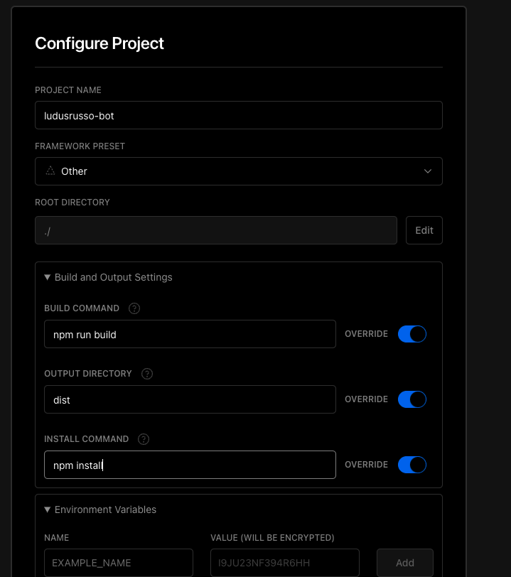

Abbiamo visto come creare il nostro telegram e come
implementare dei comandi. L'esempio che abbiamo fatto
è abbastanza semplice ma ci da tutte le capacità di creare un
bot completo.

**Però non sappiamo ancora come deployarlo**.

Essenzialmente abbiamo due modi per deployare il nostro bot telegram.

#### 1. Servire il bot tramite loop di ascolto

Se abbiamo a disposizione un computer sempre acceso, come può essere un raspberry pi o un VPS, anche se questo non
è raggiungibile dall'esterno tramite indirizzo IP pubblico possiamo deployare il BOT con la funzione `bot.launch()`,
un po' come facciamo per il test locale. Con questa soluzione possiamo usare piccoli computer economici da
avere in casa, come un raspberry pi dedicato.

#### 2. Servire il bot tramite webhooks

La seconda soluzione è quella di usare un servizio serverless che ci permette di hostare il robot in cluod.
In questo caso, non possiamo utilizzare la funzione `bot.launch()` in quanto questi servizi non sono sempre
accesi, ma di fatto accendono il nostro server nel momento in cui arriva una richiesta dall'esterno. Abbiamo quindi
necessità di creare un webserver che accetta le richieste di telegram e le passa al nostro bot.
Questa cosa, fortunatamente, è molto semplice da fare e realizzabile tramite i telegram webhook.

L'idea di base è quella di creare un webserver in cui il nostro bot è in ascolto, e questo viene semplicemente fatto da
telegraf tramite la funzione `bot.telegram.setWebhook()`. A questa funzione passiamo un URL pubblico a cui vogliamo
che il nostro bot risponda, e questa la invia al server di telegram. Tutte le successive richieste che arrivano a telegram
verranno inoltrate tramite richiesta HTTP POST verso l'url in questione.

Grazie al fantastico servizio che mette a disposizione [Vercel](https://vercel.com/), completamente gratuito se non abbiamo troppo traffico,
possiamo in modo semplice e veloce deployare in cloud il nostro bot.

In questo articolo vedremo come preparare il codice per il deploy!

Nei prossimi, invece, vedremo alcune soluzioni per effettuare il deploy del robot su Vercel e altre piattaforme.

## Prepariamo il bot per la produzione

Prima di deployare il robot, però, dobbiamo fare si che il codice sia pronto per la produzione. Per fare questo
dobbiamo completamente eliminare le informazioni sensibili dal robot, e trovare una soluzione che ci permetta di
deployare il bot in modalità ascolto o webhook in base alle configurazioni. Useremo per questa soluzione
le variabili d'ambiente, che ci permettono in modo semplice e veloce di passare delle configurazioni al
nostro codice dall'esterno in fase di esecuzione.

Per fare questo, dobbiamo fare due cose:

Decidere quale variabile d'ambiente il nostro codice deve aspettarsi di ricevere, ed in particolare abbiamo bisogno di due variabili:

- `TELEGRAM_BOT_TOKEN` (obbligatorio): il token del bot telegram e
- `WEBHOOK_BASE_URL` (opzionale): l'url che dovremo usare per inviare le richieste al nostro bot.

La mia idea è la segunete: in caso il `WEBHOOK_BASE_URL` non venga passato, possiamo lanciare il nostro bot in modalità ascolto, altrimenti
lo lanciamo in modalità webhook, in questo modo non dobbiamo vedere dei codici diversi per gestire entrambe le modalità.

In Node, possiamo accedere a valore di una variabile d'ambiente usando il comando `process.env.VARIABLE_NAME`. Quindi iniziamo ad aggiustare il codice
che abbiamo protto in modo da gestire queste bariabili. Per il token, possiamo fare questo:

#### Gestire il token del bot tramite variabile d'ambiente

```ts
const botToken = process.env.TELEGRAM_BOT_TOKEN;
if (!botToken) {
  console.error("TELEGRAM_BOT_TOKEN not set");
  process.exit(1);
}
const bot = new Telegraf(botToken);
```

Notare che in caso di token non creato, il nostro programma semplicetemente termina stampanto un messaggio di errore.

#### Gestire se deployare il bot usando webhooks o in ascolto

In questo cosa dobbiamo essenzialmente controllare la presenza di `WEBHOOK_BASE_URL` ed agire di conseguenze.

```ts
const whBaseUrl = process.env.WEBHOOK_BASE_URL;
if (whBaseUrl) {
  runWithWebhook(whBaseUrl); // dobbiamo creare questa funzione
} else {
  bot.launch();
}
```

Per lanciare il bot tramite webhook abbiamo bisogno di un webserver, e per crearlo
possiamo usare la libreria [fastify](https://www.fastify.io/).

Quindi installiamola

```bash
$ npm i fastify
```

E a questo punto possiamo creare la funzione `runWithWebhook()` come segue:

```ts
function runWithWebhook(whBaseUrl: string) {
  const path = `/telegraf/${bot.secretPathComponent()}`;
  const url = new URL(path, whBaseUrl).href;

  bot.telegram.setWebhook(url).then(() => {
    logger.info({ url }, "Webhook is set!");
  });

  app.post(path, (req, rep) => bot.handleUpdate(req.body as any, rep.raw));

  app
    .listen({
      host: "0.0.0.0",
      port: appConfig.port,
    })
    .then(() => {
      logger.info("🚀 Listening on port: " + appConfig.port);
    });
}
```

#### Compiliamo il codice

Per ultimo dobbiamo fare il modo di porter compilare il codice per gestire la prodizione.
Per prima cosa configuriamo una cartella di destinazione del codice compilato in `tsconfig.json`,
aggiungendo l'opzione `outDir` alla sezione `compilerOptions`:

```json
{
  "compilerOptions": {
    "outDir": "dist"
    ...
  }
  ...
}
```

Ora installiamo `typescript` come dev dependencies, in modo da portarci dietro il comando per
compialre `tsc`:

```bash
$ npm i -D typescript
```

E per finire aggiungiamo il comando `build` all'interno del file `package.json`:

```json
{
  "scripts": {
    "build": "tsc"
    ...
  }
  ...
}
```

Ora possiamo eseguire il comando `npm run build` per compilare il codice. Lo troveremo
all'interno della nuova cartella creata `./dist`:

```bash
$ npm run build
```

#### Prepariamo una repo Git

Abbiamo a questo punto bisogno di una repository su github per deployare il codice. Per
farlo dobbiamo prima di tutto creare una repo locale con il comando `git init`.

A questo punto possiamo aggiungere il file `.gitignore` con il seguente contenuto

```
/node_modules/
/dist/
```

Per ignorare le cartelle che non ci interessa versione. E a questo punto siamo pronti a deployare
il codice su github. [Ecco la mia repository](https://github.com/ludusrusso/ludusrusso-bot) che potete anche andare a copiare se lo preferite:

## Lanciamo il bot in produzione

Perfetto, il nostro codice ora è pronto per essere usato in produzione, vediamo come fare!

#### Eseguiamo il bot come loop di ascolto

Per servire il bot con loop di ascolto, quindi su un raspberry o in locale sul nostro computer, è molto semplice.

Prendiamo codice, lo mettiamo sulla macchia dove vogliamo lanciarlo, lo compiliamo e a questo punto siamo pronti per lanciarlo.

Per farlo dobbiamo prima di tutto dobbiamo esportare il token del bot come variabile d'ambiente, e lo possiamo fare con il
comando `export`, e poi possiamo lanciare il bot con node.

```bash
$ export TELEGRAM_BOT_TOKEN=<token>
$ node ./dist/main.js
```

Il bot inizierà ad ascoltare e a rispondere ai comandi!

#### Servire il bot tramite webhooks su Vercel

Questa soluzione è più complicata ma più stabile, e potremmo sfruttare vercel che è un servizio completamente gratuito.
Attenzione però, perchè Vercel è serverless e il bot si spegnerà automaticamente quando non ci saranno richieste per un po' di tempo.

Questo vuole anche dire che alla prima richiesta ci metterà un po' (qualche secondo) a rispondere. Non è un grosso problema
ma dobbiamo tenerne conto.

Altro problema è il seguente: Vercel è un software freemium, in caso di molte richieste dovremmo pagarlo. Fortunatamente il
piano gratuito è molto generoso e a meno di grandi numeri difficilmente riusciremo a superarlo.

Ma per prima cosa dobbiamo fare un po' di lavoro.

##### Step 1: registrazione a vercel

Andiamo su [vercel.com](https://vercel.com/) e registriamoci. Vi consiglio, dato che avete già un account GitHub, di
usare la registrazione con GitHub per rendere poi il collegamento con la nostra repo più immediata.

##### Step 2: creiamo un nuovo progetto vercel

Sulla nostra dashboard di Vercel dobbiamo creare un nuovo progetto cliccando sull'apposito tasto
**New Project**


Ci chiederà quindi di importare il progetto da una repository GitHub. Avendo
fatto la registrazione con GitHub non dobbiamo fare
altre cose, basta selezionare la nostra repository del nostro bot e cliccare su **Import**.


A questo punto dobbiamo fornire alcune info al progetto.
Non essendo un progetto con un framework noto, come può essere
**NextJS**, Vercel ha bisogno di un piccolo aiuto per
compiarlo e lanciarlo. Gli dobbiamo quindi dire che

1. Per compilare il progetto deve usare il comando `npm run build`,
2. La cartella di destinazione è `dist`,
3. Per installare le dipendenze deve usare `npm install`,


