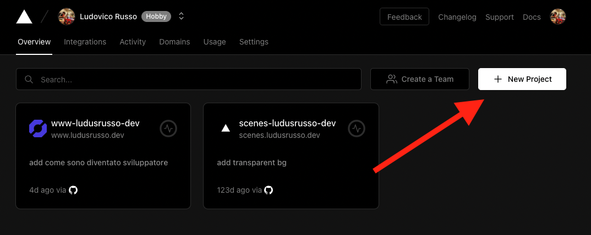
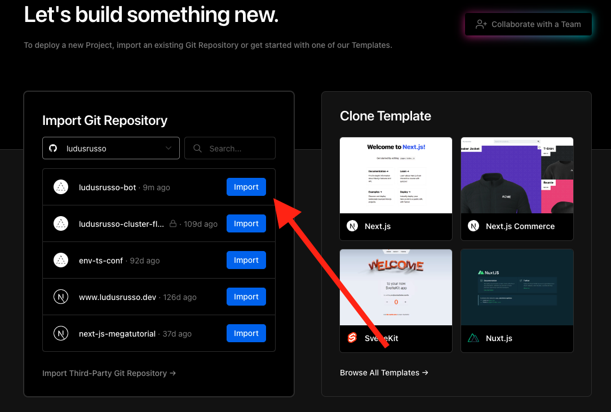
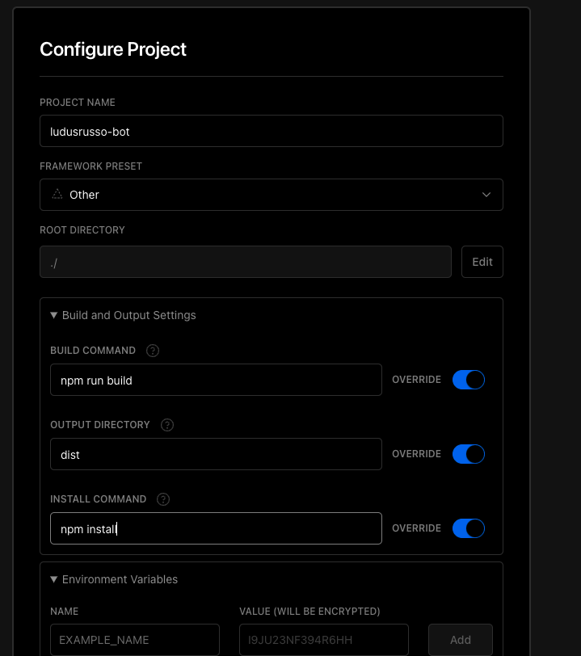
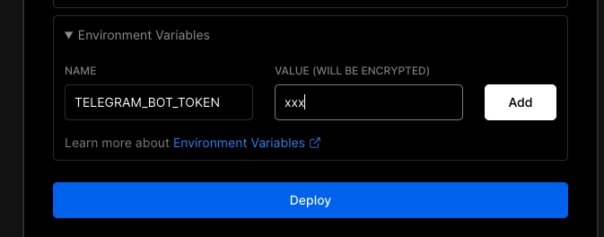
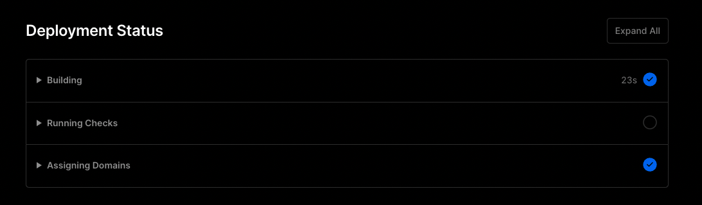
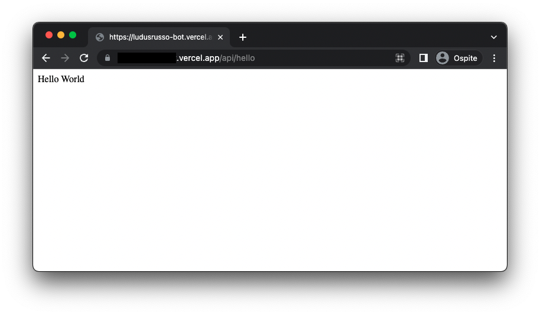
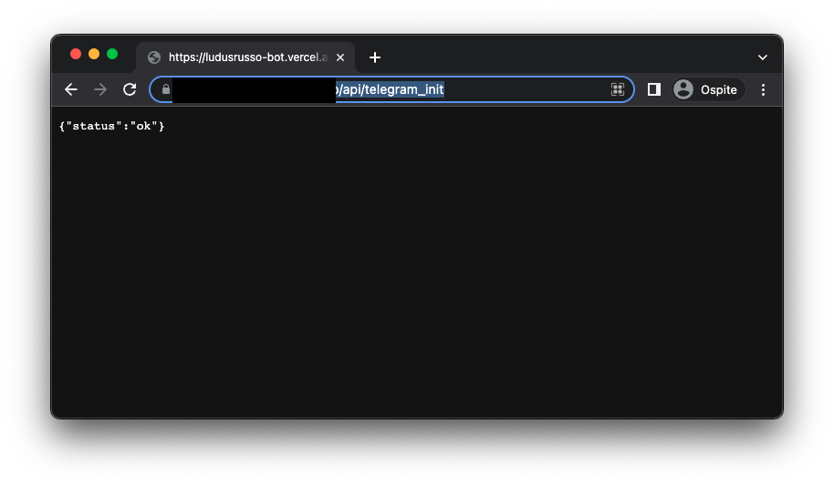
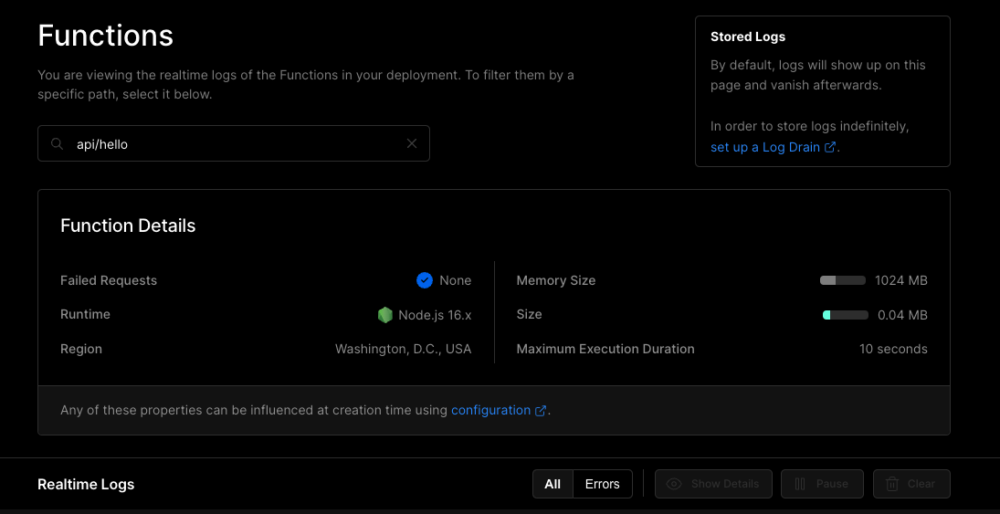

Nel capitolo precedente abbiamo reso il nostro bot pronto per il deploy, e abbiamo visto come lanciarlo
in ascolto in locale sul nostro computer o anche su un Raspberry Pi. Ovviamente questa soluzione
è funzionale ma non va bene se il nostro bot deve essere sempre e costantemente connesso. Infatti un qualsiasi
problema di casa, come internet che non va, o un blackout temporaneo (cosa successa a me ieri), è una causa
di malfunzionamento e di un bot che non risponde.

Fortunatamente, ormai, con servizi Serverless come [Vercel](https://vercel.com/) è possibile deployare
il nostro bot su un server che ci garantisce essere sempre connesso.

Questa soluzione è più complicata ma più stabile, e potremmo sfruttare Vercel che è un servizio gratuito (almeno inizialmente).
Attenzione però, perchè Vercel è serverless e il bot si spegnerà automaticamente quando non ci saranno richieste per un po' di tempo.

Questo vuole anche dire che alla prima richiesta ci metterà un po' (qualche secondo) a rispondere. Non è un grosso problema
ma dobbiamo tenerne conto.

Altro problema è il seguente: Vercel è un software cloud che mette a disposizione un piano gratuito limitato.
In caso di molte richieste dovremmo pagarlo. Fortunatamente il
piano gratuito è molto generoso e a meno di grandi numeri difficilmente riusciremo a superarlo.

Ma per prima cosa dobbiamo fare un po' di lavoro.

### Prepariamo il codice per Vercel

Vercel funziona in modo molto semplice, per creare una API serverless, cioè un endpoint, ci basta semplicemente creare una
cartella `/api` all'interno del nostro progetto. Ogni funzione esportata di default dai file all'interno della cartella
saranno degli endpoint.

Per prima cosa però dobbiamo installare due dipendenze necessarie al nostro progetto per vercel, che sono semplicemente
dei type definition graphql richiesti da Vercel per compilare il codice:

```bash
$ npm i -D @types/node @vercel/node
```

#### Primo endpoint in Vercel

Creiamo un semplice endpoint, che ci servirà per verificare che tutto funzioni, che risponde al path `/api/hello`, quindi va
messo all'interno del file `/api/hello.ts`

```ts
// /api/hello.ts

import { VercelRequest, VercelResponse } from "@vercel/node";

// We only keep this in for testing purposes.
export default (req: VercelRequest, res: VercelResponse) => {
  return res.send("Hello World");
};
```

Come vedete è molto seplice da fare.

Dopo che deployeremo il codice su Vercel, potremmo sfruttare questo endpoint per verificare che tutto funzioni correttamente.

#### Creiamo l'endpoint Telegram

Per Telegra, invece, creiamo un file `/api/telegram.ts` all'interno del quale deployare il nostro bot.

Iniziamo quindi costruindo il nostro bot in modo simile a come abbiamo fatto nel precedente articolo per il deploy
con fastify. In questo caso, come endpoint a cui il bot risponderà, possiamo usare la variabile d'ambiente che vercel
ci mette a disposizione chiamata `VERCEL_URL`. Che rappresenta l'url a cui le nostre api (ed in generale il nostro sito),
risponderà.

```ts
// /api/telegram.ts

import { createBot } from "../src/bot";
import type { VercelRequest, VercelResponse } from "@vercel/node";

const botToken = process.env.TELEGRAM_BOT_TOKEN;
if (!botToken) {
  console.error("TELEGRAM_BOT_TOKEN not set");
  process.exit(1);
}

const whBaseUrl = process.env.VERCEL_URL;
if (!whBaseUrl) {
  console.error("VERCEL_URL not set");
  process.exit(1);
}

const bot = createBot(botToken);

export default async function handler(
  request: VercelRequest,
  response: VercelResponse
) {
  // gestire il bot
  return res.send("Hello World");
}
```

A questo punto ci possiamo concentrare sul bot, per farlo, ci basta semplicemente chiamare la funzione `bot.handleUpdate()` passandogli
il body della richiesta e l'oggetto risposta di vercel, in questo modo:

```ts
// ...
export default async function handler(
  request: VercelRequest,
  response: VercelResponse
) {
  return await bot.handleUpdate(request.body, response);
}
```

Dobbiamo però stare attenti a controllare che la secret path che ci arriva dalla richiesta sia corretta. In `fastify` la cosa
era automatica perchè settavamo il bot a rispondere ad un url che conteneva già la secret path. In questo caso non possiamo farlo,
ma possiamo semplicemente inserire la secret path dentro un query parameter e controllare che sia passato.

L'url quindi che il bot telegram chiamerà sarà nella forma `/api/telegram?secret=<secret path>`. E possiamo accedere ai
vari parametri dei query parameter semplicemente accedendo all'oggetto `request.query`, in questo modo:

```ts
if (request.query.secret === bot.secretPathComponent()) {
  await bot.handleUpdate(request.body, response);
  return;
}
```

Chiudiamo quindi la funzione aggiungendo la gestione di un eventuale errore e una risposta di 404 in caso di `secret` sbagliato:

```ts
// ...
export default async function handler(
  request: VercelRequest,
  response: VercelResponse
) {
  try {
    if (request.query.secret === bot.secretPathComponent()) {
      return await bot.handleUpdate(request.body, response);
    }
  } catch (e) {
    console.error(e);
    response.status(500).send("Internal error");
  }
  return response.status(404).send("Not found");
}
```

#### Configurare il bot tramite una seconda api

A questo punto però si pone un problema: come facciamo a configurare il bot per avere l'url da chiarare?
Nel precedente articolo lo abbiamo fatto allo startup del programma. Ma in questo caso non possiamo perchè le funzioni serverless di Vercel vengono
eseguite solamente nel momento in cui arriva una richiesta.

Per risolvere questo problema, possiamo però creare un secondo funziona, `/api/telegram_init` che, una volta chiamata,
setterà l'url del webhook correttamente in modo da poter configurare il bot.

Creiamo quindi il file `/api/telegram_init.ts` e mettiamoci all'interno il seguente codice:

```ts
// /api/telegram_init.ts

import { createBot } from "../src/bot";
import type { VercelRequest, VercelResponse } from "@vercel/node";

const botToken = process.env.TELEGRAM_BOT_TOKEN;
if (!botToken) {
  console.error("TELEGRAM_BOT_TOKEN not set");
  process.exit(1);
}

const whBaseUrl = process.env.VERCEL_URL;
if (!whBaseUrl) {
  console.error("VERCEL_URL not set");
  process.exit(1);
}

const bot = createBot(botToken);

export default async function handler(
  request: VercelRequest,
  response: VercelResponse
) {
  const path = `/api/telegram/?secret=${bot.secretPathComponent()}`;
  const url = new URL(path, "https://" + whBaseUrl).href;
  await bot.telegram.setWebhook(url).then(() => {
    console.log("Webhook is set!: ", url);
  });
  return response.send({ status: "ok" });
}
```

Committiamo e pushamo su git il progetto.

### Configurazione di Vercel

Siamo quindi pronti a configurare il bot con Vercel!

#### Step 1: Registriamoci Vercel

Andiamo su [vercel.com](https://vercel.com/) e registriamoci. Vi consiglio, dato che avete già un account GitHub, di
usare la registrazione con GitHub per rendere poi il collegamento con la nostra repo più immediata.

#### Step 2: Creiamo un nuovo progetto Vercel

Sulla nostra dashboard di Vercel dobbiamo creare un nuovo progetto cliccando sull'apposito tasto
**New Project**



Ci chiederà quindi di importare il progetto da una repository GitHub. Avendo
fatto la registrazione con GitHub non dobbiamo fare
altre cose, basta selezionare la nostra repository del nostro bot e cliccare su **Import**.



A questo punto dobbiamo fornire alcune info al progetto.
Non essendo un progetto con un framework noto, come può essere
**NextJS**, Vercel ha bisogno di un piccolo aiuto per
compiarlo e lanciarlo. Gli dobbiamo quindi dire che

1. Per compilare il progetto deve usare il comando `npm run build`,
2. La cartella di destinazione è `dist`,
3. Per installare le dipendenze deve usare `npm install`,



Dobbiamo quindi inserire la variabile d'ambiente `TELEGRAM_BOT_TOKEN` contente il nostro token di accesso al bot nell'apposito form.



E clicchiamo sul tasto **Deploy**.

A questo punto entrerete in una schermata dove potrete vedere l'avanzamento del deploy del vostro progetto.



Una volta completato, possiamo verificare che tutto funzioni a dovere.

#### Step 3: Test delle API

Andate sulla URL che vi riporta la dashboard di Vercel, ed in particolare proviamo se l'api `/api/hello` funziona correttamente:

Se tutti va bene vi dovrebbe rispondere con il messaggio "Hello World".



#### Step 4: Configuriamo il bot

Per finire, chiamiamo l'endpoint `/api/telegram_init` per configurare il bot, che vi dovrebbe rispondere con un messaggio di ok.



E a questo punto dovreste riuscire a parlare e ricevere messaggi dal vostro bot deployato su vercel.

<InfoBox type="warn" title="Risolvere problemi">
  Se trovate dei problemi, potete tranquillamente debuggare il vostro bot e le vostre api andando nella sezione **functions** 
  all'interno della dashboard di Vercel e quinid selezionando la funzione a cui velete vedere i log.



</InfoBox>

### Perchè Vercel

Come vedete è decisamente semplice e veloce configurare il nostro bot (o qualsiasi API a dir la verità) con Vercel.
Ed i vantaggi non finiscono qui. Ora che è configurato, ad ogni commit che deployeremo abbiamo istantaneamente il progetto
online senza dover toccare praticamente nulla, se non rilanciare la funzione `/api/telegram_init` dato che cambia l'URL interno.

Ovviamente ci sono degli svantaggi, come ad esempio il fatto che abbiamo nel piano gratuito un numero massimo di chiamate
che possiamo fare. Non ricordo quanto sono ma vi assicuro che difficilmente supererete questo numero per progetti hobbistici.
