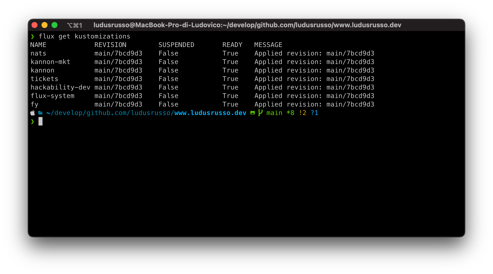

🚀 Negli anni ho lavorato a tantissimi progetti personali che spesso venivano lasciati a metà o in generale avevano pochi utenti.

🧑‍🏫 In generale quello che mi interessa quando porto avanti un progetto nel mio tempo libero non è tanto il farlo sfruttare o farlo diventare economicamente sostenibile, ma massimizzare le cose che posso imparare facendo quel progetto.

💸 Mi sono però sempre posto il problema di minimizzare i costi di gestione e mantenimento dei miei progetti live, e nel tempo questa cosa mi ha portato a testare praticamente qualsiasi servizio serverless/cloud che avesse un piano gratuito generoso per quello che mi serviva.

🤩 La cosa che mi piace tanto di questi servizi è sicuramente la parte di UX (o meglio DX) che presentano. Andare online è immediato, in un attimo si ha un dominio personalizzato, https, una dashboard comodissima per vedere cosa sta succedendo eccetera.

😱 Il problema però è che ad un certo punto un conto lo devi pagare, e ho imparato a mie spese che più il piano di ingresso gratuito è generoso più saranno i costi quando questo piano lo superi (come è giusto che sia). E ho anche imparato (come sta succedendo adesso per heroku) che anche i servizi migliori e più apprezzati possono cambiare policy e lasciarti a casa se non paghi.

💪 Nel tempo però, facendo team up con altri sviluppatori che hanno lo stesso problema ([Jaga Santagostino](https://jagasantagostino.com/)) e sfruttando il mondo di #Kubernetes e della #CNCF, siamo riusciti a creare una soluzione a basso costo self hostata che ci costa poco (18€/mese) e che ci da tutte le feature di un sistema serverless professionale, in cui essenzialmente posso avere db a comando, deplorare servizi in pochi click, avere l’aggiornamento automatico delle mie repo quando la repo git si aggiorna ecc. ecc.

Questa cosa la chiamiamo **kubernello**, ed il mio è ormai online da più di tre anni senza mai un down e hosta 3 servizi che ho sviluppato negli ultimi due anni di cui vado molto fiero:

- 🪐 [Hackability space](https://space.k8s.hackability.dev/)
- 🛳 La piattaforma di [Farmaceutica Younger](https://www.farmaceuticayounger.science/)
- 📨 Un sistema di mail transazionali usato dai due progetti di cui sopra
  Più tanta altra porcheria.

In questo articolo voglio presentare un dettaglio del mio cluster, di come gestisco i progetti sfruttanto la metodologia **gitops**
e di come posso accedere velocemente alle risorse con una Dev Experience ottimale.

### Accesso al cluster con K9S

Riesco ad accedere alle risorse velocemente sfrutta le API di kubernetes e la cli [k9s](https://k9scli.io/), come vedete è un attimo
da terminale entrare e gestire le risorse.

Grazie a questo posso usare qualsiasi soluzione open source nell'ecosistema kubernetes per monitorare e gestire il cluster, oltre a k9s (il mio proferito)
esistono anche progetti grafici con un'interfaccia grafica molto più carica come [lens](https://k8slens.dev/).

### Database

Una delle ansie più grandi a gestire un servizio internamente da me è la gestione del DB, ma anche qui con Kubernetes e Help creare un database
postgres è un attimo, e mi sono scritto un piccolo progetto che periodicamente backuppa il database su Google Storage, per essere sicuro di non
perdere i dati. Attualmente nel mio cluster girano 3 istanze separate di postgre, tutte backuppate e senza che nessuna mi desse mai problemi.

### Custom domains e https

Tutti i servizi ormai permettono di deployare in modo facile e veloce i nostri progetti con domini custom e https automatica, e **kubernello**
non è da meno grazie a [Cert Manager](https://cert-manager.io/). Questo progetto permette di gestire in modo semplice e veloce tramite
kubernetes certificati TLS integrandosi con diversi provider o permettendo di creare certificati self signed. Io lo uso in combo con [Let's Encrypt](https://letsencrypt.org/it/),
un'autorità di certificazione non profit e completamente gratuita che ci permette di rilasciare certificati per i nostri siti in modo
completamente gratuito.

Cert Manager, una volta configurato, monitora automaticamente gli ingress definiti all'interno della nostra infrastruttura (non sono altro che le
definizioni in kubernetes per implementare un revers proxy del traffico esterno tramite dominio custom).

Alla creazione di un nuovo ingress con un nuovo dominio, viene fatta partire in automatico la challenge per rilasciare un nuovo certificato
da Let's Encrypt, e si occupa poi di gestire l'intero lifecycle del certificato per rinnovarlo in caso di scadenza, cancellarlo se
l'ingress originale viene eliminato o addirittura generarne uno nuovo in caso lo stesso sparisca perchè cancellato per sbaglio del
sottoscritto (cosa successa veramente che mi ha fatto tremare per 2 secondi, prima che lo vedessi magicamente riapparire come mostrato qui sotto).

### Gestione dei progetti con GitOps e [FluxCD](https://fluxcd.io/)

Tutti i progetti presenti nel mio cluster sono gestiti con l'approccio GitOps e il progetto [FluxCD](https://fluxcd.io/) che lo implementa.

L'idea di base è avere una repository git (che nel mio caso è provata) contenente
l'intera definizione del nostro cluster, in approccio dichiarativo.

FluxCD (o altri progetti alternativi) nel mio caso effettua periodicamente una prodedura di "riconciliazione",
in cui la repo "fleet" contenente le definizioni del cluster viene monitorata periodicamente ed in caso di differenze
tra la richiesta e lo stato attuale vengono riapplicate le definizioni kuberntes. Questo approccio ha due vantaggi:

1. Per prima cosa aggiornare il cluster si traduce in un semplice "git commit" nella repo fleet
2. In caso di problemi (come quando cancello per sbalgio una risorsa sul cluster o se si rompe tutto) ho un posto da cui posso ricreare completamente la mia infrastruttura.

Inoltre, anche l'aggiornamento dei progetti è automatico, frutto le github actions (che sono completamente gratuite per progetti open source) per
buildare le immagini dei container dei miei progetti, e li pusho sul github container registry. A quel punto sfrutto un'altro progetto
all'interno di FluxCD chiamato [image automatio](https://fluxcd.io/flux/guides/image-update/) che mi permette di monitorare dei
container registry in attesa di nuove immagini che, nel caso vengano trovate, esegue un commit in automatico all'interno del cluster
fleet che poi mi triggera una nuova reconciliazione.

In questo, tutto completamente automatico, da un semplice git push del codice in pochi minuti ho una nuova versione del mio progetto
completamente online e funzionante.

## Dove host il mio kubernello?

Il progetto era nato con l'idea di avere qualcosa a più basso costo possibile, ed è nato su un VPS di [Hetzner](https://hetzner.cloud/?ref=kmrVFFJZW4JW),
una piattaforma tedesca che fornisce VPS a prezzi molto competitivi. Il costo iniziale era di 3€/mese, ma dopo varie esperimenti e
richieste un po' più elevate, e anche a causa dell'aumento dei costi dell'energia che ha fatto un po' lievitare i prezzi, sono arrivato
ad avere un server coi controcazzi (4vCPU e 16GB di RAM) al costo di circa 20€/mese, che è un prezzo super accettabile.

## We ❤️ Kubernello

Ero sinceramente un po' scettico all'inizio nell'usare un cluster VPS per hostare i miei servizi, specialmente per tutte le pippe
e le ansie che noi devops solitamente ci facciamo su progetti cloud che "devono scalare", "devono essere fault tolerant" e "se si rompe una region devo avere la regio di backup".

Che sono ansie giuste ma le possibilità molto rare, e per progetti personali o di associazione senza scopo di lucro, un piccolo downtime non
può creare troppi danni. In fondo per anni, prima del cloud, tutti i sistemi (anche Google) erano hostati su server fisici a casa di qualcuno,
e spesso le ansie che ci facciamo non sono troppo fondate.

Ed in effetti, in 2 anni di upload non ho avuto un solo problema, se non quando ho deciso di passare da traefic a nginx come ingress controller
e ho avuto un downtime di circa 2min nei miei serivizi.

In fondo, basta prendere un po' di accorgimenti, come avere i backup periodici sui database e usare fluxCD che mi permetterebbe, in poco tempo,
di ricreare da zero l'intero cluster senza troppi sforzi.
