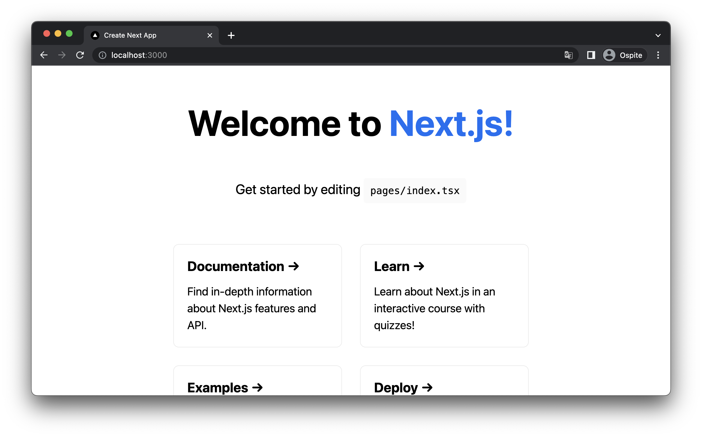
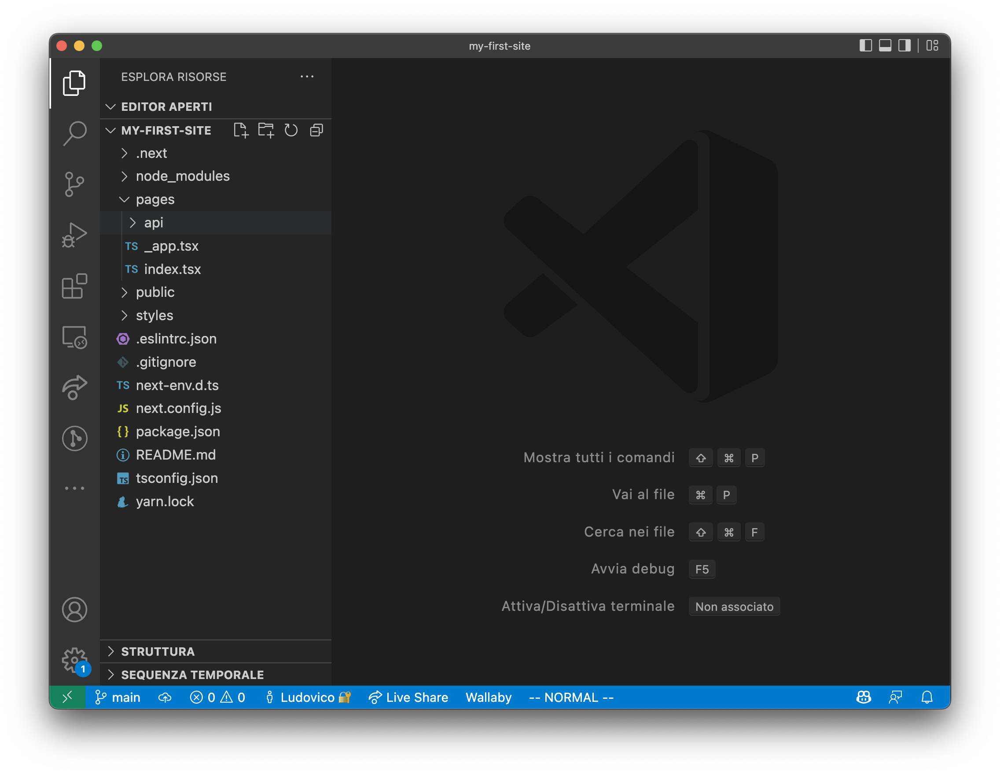
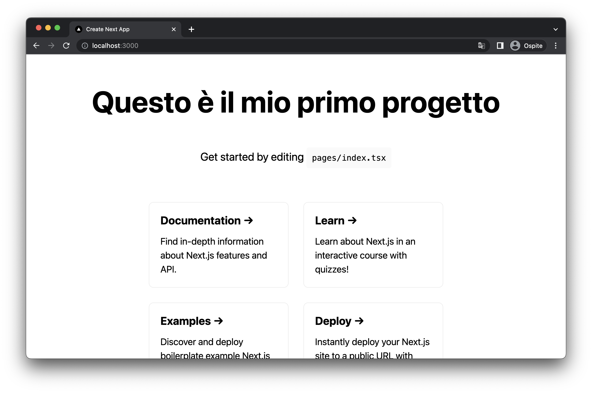

Abbiamo parlato in questa guida di React e NextJS. Prima di iniziare la parte cicciosa di questo tutorial,
cerchiamo di capire meglio esattamente a cosa ci riferiamo.

ReactJS è una libreria sviluppata da Facebook per lo sviluppo di Interfaccia Grafica (UI) nelle applicazioni Web.
A differenza di altri progetti a cui spesso è affiancato (come Angular o VueJS), React è una semplice libreria, nel
senso che mette a disposizione una serie di blocchi (funzioni, classi eccetera) allo sviluppatore ma non
forsa (come nel caso dei framework) ad adottare una specifica architettura o organizzazione del codice. Inoltre, a differenza
di altri framwork, ReactJS non integra soluzioni a problemi noti nello sviluppo di applicazioni Web, come ad esempio
la gestione del Routing (i cambi della pagina) o l'integrazioni come Api esterne: in questi casi gli sviluppatori sono
liberi di integrare librerie nell'ecosistema React che preferiscono per risolvere i loro problemi come meglio credono.

Questo ha dato parecchi vantaggi negli anni a ReactJS, in quanto ha permesso all'ecossitema creatosi intorno alla libreria
di evolvere in modi diversi, senza limitazioni imposte dal team di sviluppo originale. In particolare, intorno a React sono
iniziati a nascere i cosidetti "MetaFramework", cioè progetti che estendevano la libreria originale imponendo scelte
architetturali alla creazione di un progetto. La cosa interessante, a mio avviso, è che molti di questi framework non
sono rimasti relegati a pure applicazioni frontend (come nel caso di Angular), ma sono stati realizzati in modo da poter
permettere la creazione di siti completi, integrando anche tecnologie backend.

Tra questi metaframework, i più rilevanti (almeno per il mio percorso) sono stati [Gatsby](https://www.gatsbyjs.com/) e [NextJS](https://nextjs.org/).

**Gatsby** è stato uno dei primi framework ReactJS a permettere la creazione di siti statici (o prerenderizzati).
Entreremo in futuro in questa guida nel dettaglio di cosa vuol dire prerendering, ma in generale quello che fa Gatsby è
dare la possibilità allo sviluppatore di creare un sito in ReactJS composto da divere pagine, e (in fase di build), renderizzare
l'intero progetto in modo da permettere di essere servito senza la necessità di avere un server web completo. Quest'idea, qualche anno fa,
andava molto di moda in quanto permetteva agli sviluppatori di creare siti web completi con costi di hosting quasi (o completamente) nulli.

**NextJS**, invece, porta l'idea di GatsbyJS al suo massimo, in quanto permette, all'intero di uno stesso framework, di controllare
pagina per pagina se effettuare il rendering lato frontend, lato backend, o entrambi. Con NextJS abbiamo il massimo della
flessibilità nella creazione di siti web complessi, in quanto possiamo decidere in modo semplice e con delle API molto facili di utilizzare,
come una pagina deve essere renderizzata. Una pagina che contiene contenuti statici (come un blog post o un documento) può essere
renderizzata a buildtime ed avere un'inpatto minimo in termini di latenza e risorse per essere servita al cliente. Dall'altra parte
pagine che richiedono contenuti molto variabili possono essere renderizzate nel backend nel momento in cui viene fatta la richiesta
dal cliente, come i classici siti web.

Questa capacità ha reso NextJS un progetto molto popolare nel modo JavaScript, che negli ultimi anni ha preso il sopravvento ed
è sicuramente uno dei framework consigliati per realizzare siti web di tutti i tipi, dal blog personale a grandi siti aziendali.

## Creazione del primo progetto NextJS

Per poter utilizzare NextJS abbiamo bisogno di aver installato _node_ sul nostro terminale.
Queta operazione è molto semplice, ed in generale consiglio di seguire la [guida del sito ufficila di Node](https://nodejs.org/en/).

Per i più smanettoni, ed in particolare per chi vuole avere la possibilità di controllare puntualmente la versione di nodejs sul proprio
computer, suggerisco di dare un'occhiata al progetto [NVM (Node Version Manager)](https://github.com/nvm-sh/nvm), che ci permette
di installare ed eseguire versioni diverse di node in modo semplice ed immediato.

In questo e nei prossimi passi, userò la versione di node _v16_, che al momento risulta essere la versione LTS (quella con supporto maggiore
per interderci). Ad ogni modo, non dovrebbero esserci troppi problemi nell'utilizzare una versione di node successiva.

Una volta installato node, per verificare che tutto funzioni correttamente, possiamo digiare il comando all'interno del terminale

```bash
$ node -v
Output: v16.14.0
```

che ci dirà quale versione di node abbiamo sul nostro sistema.

Per creare un nuovo progetto, NextJS ci mette a disposizione il comando `create-next-app` che inizializzerà un progetto
blueprint funzionante. Noi lo chiamere con l'opzione `--typescript`, per avere automaticamente installato il supporto a TypeScript.

```bash
$ npx create-next-app@latest --typescript
Need to install the following packages:
  create-next-app@latest
Ok to proceed? (y) y
✔ What is your project named? … my-first-site
Creating a new Next.js app in /Users/ludusrusso/develop/next-js-megatutorial/my-first-site.

Using yarn.

Installing dependencies:
- react
- react-dom
- next

# ...
```

Il promt del tool ci chiederà alcune informazioni, intanto se vogliamo installare l'ultima versione del pacchetto `create-next-app`,
a coi ovviamente dovremmo rispondere di sì (digitando `y`). Inoltre ci chiederà che nome dare al progetto che stiamo creando.
Scegliete il nome che preferite (io ho scelto `my-first-site`), premete invio e attendete che l'installazione sia completata.

Vogliamo vedere se il sito funziona? Ci basta entrare nel progetto `cd my-first-site` e lanciare il server con il comando `npm run dev`.

```bash
$ npm run dev

> my-first-site@0.1.0 dev
> next dev

ready - started server on 0.0.0.0:3000, url: http://localhost:3000
wait  - compiling...
event - compiled client and server successfully in 805 ms (125 modules)
```

A questo punto, apriamo il nostro browser preferito (io userò Chrome) e digitiamo l'indirizzo che vediamo
nel prompt: `http://localhost:3000` per vedere il sito.



Come potete vedere, abbiamo appena eseguito il nostro sito web, che si presenta
come una pagina HTML base con rimandi alla documentazione e ai tutorial di NextJS.

Per spegnere il server, ci basterà digirare sul terminale la combinazione `ctrl-C`.

### Anatomia di un progetto NextJS

Prima di iniziare a scrivere codice, credo sia importante iniziare ad esplorare
il progetto per capire come è composto. Avremmo tempo di capire bene come
muoverci per bene tra i file di un progetto Next, ma credo sia importante
iniziare a riconoscere alcune cose fin dall'inizio.

Se non lo avete già fatto, aprite il progetto con il vostro editor di testo.
Come ho detto io userò in questa guida [VSCode](https://code.visualstudio.com/), che consiglio
caldamente a tutti voi in quanto è molto ben integrato con il mondo JavaScript e React. Inoltre,
vi farò vedere più avanti alcuni tool ed estenzioni molto utili per
velocizzare lo sviluppo basati proprio su VSCode.

> Se avete installato il [command line tool di VSCode](https://code.visualstudio.com/docs/setup/mac#_launching-from-the-command-line), potete aprire VSCode nella cartella corrente semplicemente digitando `code .` all'interno della cartella del vostro progetto.

Il progetto dentro VSCode dovrebbe apparirvi in questo modo:



Non ci addentremo in tutti i file del progetto, ma vediamo insieme i più importanti.

#### Il file `package.json`

Il file `package.json` è il principale file di ogni progetto node, all'interno
del file troviamo le definizioni delle dipende del nostro progetto, alcuni
script che vogliamo eseguire ed informazioni utilizi sul progetto.

Dalla sezione `dependencies` vediamo che il nostro progetto si porta dietro
solo 3 dipendenze: `next`, `react` e `react-dom`.

```json
{
  ...
  "dependencies": {
    "next": "12.1.6",
    "react": "18.1.0",
    "react-dom": "18.1.0"
  }
}
```

Non c'è molto da dire di queste dipendenze, se non, cosa che sapeva già, che
il progetto che abbiamo creato è un progetto NextJS e React.

In particolare `react` e `react-dom` sono alla base di ogni progetto React,
in quanto contengono, rispettivamente, la libreria princiapale e la parte
che permette alla libreria di agire sul Documento HTML (DOM). Come vedete stiamo
usando la versione di react 18, che è l'ultima versione rilasciata nel momento
in cui scrivo.

La dipendenza `next` invece include tutte le funzionalità di `NextJS`. Anche in
questo caso stiamo usando la verisone `12`, l'ultima major release rilasciata
nel momento in cui scrivo questo articolo.

Spostandoci nella sezione _scripts_, vediamo che nextjs ci prepara degli
script di default per agire sulla nostra applicazione.

```json
{
  ...
  "scripts": {
    "dev": "next dev",
    "build": "next build",
    "start": "next start",
    "lint": "next lint"
  }
}
```

Gli scirpt possono essere eseguiti con il comando `npm run <nome-script>`, e
come immagino molti di voi avranno capito, quando prima abbiamo eseguito il comando
`npm run dev` stavamo lanciando lo script `dev` di questa sezione.

Per ora ci interesserà principalmente lo script `dev`, che ha appunto lo scopo
di lanciare il server next in modalità di sviluppo. `build` ci permette
invece di _buildare_ l'applicazione e prepararla per essere eseguita in produzione,
mentre `start` ci permette di _avviare_ l'applicazione precedentemente buildata. Questi
due scirpt ci serviranno nei prossimi capitoli quando ci occuperemo di rilasciare
il nostro sito web in produzione.

Per finire, il comando `lint` ci permette di lanciare il linter del codice, che
verificherà che non ci siano problemi o warning a livello di sintassi JavaScript.
In generale la fase di lint viene eseguita prima di ogni build, quindi non useremo
molto questo comando.

Per finire, nella sezione `devDependencies` troviamo tutte le dipendenze che sono
utili al progetto in fase di sviluppo ma che non servono per la produzione.

```json
{
  "devDependencies": {
    "@types/node": "17.0.32",
    "@types/react": "18.0.9",
    "@types/react-dom": "18.0.3",
    "eslint": "8.15.0",
    "eslint-config-next": "12.1.6",
    "typescript": "4.6.4"
  },
  ...
}
```

Partiamo da `typescript`, che è la libreria che ci permette di usare ed interpretare
il codice in linguaggio typescript. Come abbiamo visto nei capito precedenti, TypeScript
non è un linguaggio che viene interpretato nativamente dal Browser o in generale dagli interpreti
JavaScript. Per questo motivo lo troviamo tra le dipendenze di dev. Una volta buildato il progetto
semplicemente tutto il codice Typescript sparisce e viene _transpilato_ in puro JavaScript.

Tutte le dipendenze che iniziano con `@types` sono necessarie per
avere le definizioni `typescript` di librerie implementate in JavaScript puro. Sono essenzialemnte
un'aggiunta alla libreria principale in modo da far sapere al nostro editor di testo quali sono i
tipi e le funzionalità TypeScript della libreria originale. Non è importante per noi sapere esattamente
il funzionamento, vi basti sapere che è prassi, per molte librerie, definire i tipi TypeScript in una libreria
separata. Ne incotreremo alcune nei prossimi capitoli.

Per finire, le due dipendenze `eslint` e `eslint-config-next` riguandano il linter (quindi l'analizzatore del codice),
che ovviamente ci serve solo in fase di sviluppo e non è necessaria quando facciamo il deploy in produzione.

> È compito dello sviluppatore sapere quali dipendenze vanno installate come `devDependencies` e quali come `dependencies`. Molti sviluppatori, poco attenti o poco esperti, tendono ad installare tutto all'interno della sezione `dependencies`. Sebbene questo non comporti un grosso problema nel funzionamento del progetto, diventa sicuramente un problema di ottimizzazione in quanto il pacchetto finale che andrà in produzione sarà molto più pensante del necessario.

#### `npm` VS `yarn`

Le dipendenze in un progetto node si gestiscono attraverso dei programmi
chiamati _package manager_. Il package manager ufficiale di node è `npm`
(che sta appunto per _node package manager_). Questo package manager ha avuto
storicamente alcuni problemi di funzionamento, tanto da costringere la community
a sviluppare package manager alternativi per risolvere questi problemi. `yarn`, sviluppato
da facebook, è uno dei package manager alternativi più comuni nel mondo node, ed in
particolare molto usato nel mondo React.

Per questo motivo, se vi addentrerete nel mondo dello sviluppo software JavaScript,
troverete spesso l'utilizzo quasi indistinto delle due tecnologie, `npm` e `yarn`.
Nel loro utilizzo cambia di fatto veramente poco, ma in generale ormai da qualche anno
la differenza tra i due progetti è praticamente inesistente.

Potete usare a piacere `npm` o `yarn`, di fatto (se non in alcuni comandi) non ho mai trovato
realmente delle differenze tra i due. Per mia scelta, in questo progetto, userò solamente
il comando `npm`. Un po' per semplificare le cose (richiede una dipendenza in meno dato che il comando
npm è automaticamente installato con node), un po' perchè tra le due è sempre stato il mio
comando di default.

Detto questo, cosa cambia nel pratico? NextJS usa yarn di default, ve ne accorgenete perchè
trovate il file `yarn.lock` all'interno del progetto. Per passare a `npm` è sufficiente
cancellare il file e difitare il comando `npm install`.

```bash
$ npm install

changed 1 package, and audited 230 packages in 1s

68 packages are looking for funding
  run `npm fund` for details

found 0 vulnerabilities
```

Vedrete che apparirà un nuovo file `package-lock.json` che è l'equivalente npm i `yarn.lock`.
Questi file rappresentano uno screenshot delle dipendenze che abbiamo installato (comprese quelle indiritte, cioè dipendenze delle dipendenze),
e permettono al sistema di ricostruire in futuro esattamente l'attuale installazione anche su altri computer o sistemi diversi.

Piccola nota, uno dei principali problemi di giovinezza di `npm` era l'assenza di questo file che rendeva il porting di progetti tra diversi
sistemi instabile.

Il file `package-lock.json` non deve mai essere modificato da uno sviluppatore, è automaticamente gestito dal package manager, quindi non
è importante vedere cosa troviamo al suo interno. Sappiate solo che esiste.

#### Typescript

Abbiamo inizializzato il nostro progetto con Typescript, e questa cosa
si porta dietro due cose importnati su cui voglio puntare la vostra attenzione.

Intanto troviamo un file `tscondig.json` che è il file di configurazione per Typescript.
In particolare questo file contiene alcune informazioni per dire a Typescript come
comportarsi. Per il momento non è importante il suo contenuto, ma lo andremo ad
esplorare in futuro.

La seconda, è che i file che andremo ad implementare hanno estenzione `.ts` o `.tsx`.
Come ad esempio, rispettivamente, i file `pages/api/hello.ts` e `pages/index.tsx`.

I file `.ts` i file nativi _typescript_, mentre quelli `.tsx` contengono codice TypeScript
scritti in JSX (ricordate? TypeScript + JSX = TSX). All'interno di questi file, infatti, troverete
un misto tra TypeScript e HTML.

#### Pagine ed API

L'ultima cosa su cui voglio soffermarmi, prima di andare ad implementare finalmente del codice, è
la cartella `pages` che trovate nel progetto.

Come abbiamo detto NextJS è un framework (o metaframework dato che è basato su ReactJS), quindi non solo
offre una serie di funzionalità ma impone allo sviluppatore un modo di organizzare il codice.

La cartella `pages` è una cartella importante in NextJS, in quanto qualsiasi cosa metteremo qui dientro (a parte alcune eccezioni che vedremo)
diventa automaticamente una pagina HTML del nostro progetto. Il file `pages/index.tsx` sarà tramutato nel file `index.html` del nostro sito,
cioè la pagina inziale che sarà raggiunta tramite `https://<dominio>.<com>/`. Se volessimo fare una pagina chiamata `/about`, ci basterà
creare un file `pages/about.tsx`. Anche il contenuto di questi file deve essere implementato in un certo modo. In particolare, come vedremo nella sezione
successiva, il componente React che implementa la pagina deve essere esportato con `export default`.

Il file `pages/_app.tsx` è una delle eccezioni che dicevo prima, in questo file troviamo il componente `App` che _wrappa_ tutte le nostre pagine. Anche
in questo caso, per ora non dobbiamo preoccuparci troppo del funzionamento perchè lo esploreremo per bene in seguito. Giusto per completezza, NextJS
prevede altri due file che non verranno gestiti come pagine, che sono `_document.tsx` e `_middleware.ts`. Scopriremo il comportamento di questi file in futuro.

Infine, degno di nota è la cartella `pages/api`. Tutto i file contenuti in questa cartella non verranno gestiti come pagine, ma come _api endopoint_. Questi
file saranno sempre eseguiti dal backend (quindi non sono pagine frontend o generate staticamente) ed il loro risultato non sarò necessariamente
una pagina HTML ma dei dati (solitamente ritornati in formato JSON). Un esempio classico dell'utilizzo di queste API è quello di permettere agli utenti
di effettuare un'autenticazione e ricevere dati personalizzati. Ma anche in questo caso avremmo tempo per approfondire andando avanti in questo progetto.

### Customizziamo la nostra pagina

Dopo la parte introduttiva, siamo finalmente pronti per esplorare il codice e iniziare a modificarlo. Iniziamo
quindi a vedere come customizzare il nostro sito.

Abbiamo visto che la pagina principale del sito è gestita nel file `pages/index.tsx`. Vediamo cosa ci sta dentro:

Dalla sezione di import

```tsx
import type { NextPage } from "next";
import Head from "next/head";
import Image from "next/image";
import styles from "../styles/Home.module.css";
```

vediamo che il progetto importa due componenti da NextJS (li approfondiremo in seguito), un file di stili CSS
(cosa che a me non piace molto e in futuro eviteremo di importare il CSS in questo modo). Vediamo infine subito una
sintessi nuova che non abbiamo approfondito: `import type`.

Questa è una sintassi specifica di TypeScript (quindi non di JavaScript) che ci permette di importare un oggetto solo
per utilizzarne la definizione dei tipi. In realtà ogni riga `import type` viene semplicemente cancellata in JavaScript,
è serve al progetto TypeScript per identificare una definizione tramite type annotation.

Vediamo subito, infatti, che l'oggetto `NextPage` viene usato per definire una pagina NextJS, come mostrato qui:

```tsx
const Home: NextPage = () => {
  /// ....
};

export default Home;
```

L'oggeto Home è la nostra pagina NextJS, e ce ne accorgiamo perchè viene esportato con `export default` alla fine del documento.
Vi ricordo, infatti, che in NextJS l'oggetto che viene esportato di default all'interno di un file dentro la cartella `pages` è quello
che poi viene renderizzato come pagina.

`Home` è un componente funzionale React, cioè il modo consgliato in react per definire un componente da renderizzare. In particolare
un componente funzionale è una funzione il cui valore di ritorno è un oggetto JSX.

Vedimao infatti che quello che torna questa funzione è un `<div>` html con dentro alcune cose.

Se proviamo a modificare l'html di questo componente, vedremo immediatamente una modificare nella pagina renderizzata.

Ad esempio, fare questo cambiamento:

```diff
<h1 className={styles.title}>
  - Welcome to <a href="https://nextjs.org">Next.js!</a>
  + Questo è il mio primo progetto
</h1>
```

Lanciando il progetto con `npm run dev` vedremo a nel browser
la nuova pagina modificata.


