Nei capitoli precedenti abbiamo iniziato a muoverci all'intenro del progetto NextJS e iniato a creare pagine e
componenti sfruttando la libreria ReactJS, su cui NextJS si basa.

Prima di iniziare a lavorare veramente su un progetto, ci manca un punto fondamentale: come stilizziamo i nostri componenti?

Purtroppo su questo tema entriamo in una giungla di soluzioni e tecnologie diverse, in quanto attualmente all'interno della
community ReactJS, non si è trovata una tecnologia (o un gruppo di tecnologie) abbastanza orizzontale sui vari proggetti, invece
esistono diversi approcci (anche moldi diversi tra loro) e diverse preferenze tra gli sviluppatori.

Lo stile in HTML si basa sull'utilizzo della tecnologia CSS. L'idea di base di HTML e CSS è quella di definire separatamente
il contenuto di un documento (HTML) dal modo in cui viene visualizzato (CSS). Sebbena questa idea in teoria sia molto valida,
nella pratica ci si rende subito conto che non è tanto semplice da portare avanti. Anche in caso di organizzazione perfetta
del nostro HTML, ci troveremo comunque a doverne modificare l'organizzazione in base ad esigenze di stile e viceversa.

Per questo motivo, si è visto che l'approccio standard di definire CSS e HTML in posti e file diversi tra loro semplicemente
non funziona, e in progetti grandi (ma anche medi) porta a codice difficile da mantenere e capirne il funzionamento?

Come fare quindi? In React esistono tante soluzioni diverse per risolvere questo problema, proviamo a classificarle:

#### Standard CSS e HTML

Standard CSS e HTML. Questo è l'approccio base, che abbiamo visto che non funziona molto bene. Ovviamente però React lo supporta e
nel progetto NextJS che abbiamo creato è la soluzione standard. Ha il vantaggio di non richiedere tool e dipendenze aggiuntive,
ed essendo nativo è anche molto efficace. Purtroppo porta a codice che diventa difficile da mantenere in poco tempo.

#### React Style Props

Questo è un secondo approccio nativo React, che di fatto ci permette di aggiungere una props `style`
ai nostri componenti. Questa props viene interpretata dal browser e viene utilizzata per definire il CSS. Sebbene sia nativo e semplice
da usare, ha comunque il problema che dobbiamo passare un oggetto cone le proprietà CSS che vogliamo settare, e
in generale la development experimence non è molto semplice.

```tsx
const MyComponent = () => (
  <div
    styles={{
      backgroundColor: "red",
      color: "white",
      fontSize: "1.5em",
    }}
  >
    Hello World
  </div>
);
```

#### Librerie grafiche

Sono delle librerie React che mettono a disposizione di noi sviluppatori dei componenti stilizzati che possiamo usare
per creare componenti. Tra le più famose ci sono [Material UI](https://mui.com/) e [React Bootstra](https://react-bootstrap.github.io/).
Sono solitamente librerie molto semplici da usare per creare interfacce grafiche base, ma diventano complesse quando si vuole
fare qualcosa che va oltre quello che gli sviluppatori della libreria hanno pensato. In generale le evito in quanto, essendo
abbastanza mainstream, rendono le nostre applicazioni abbastanza monotone ed in generale troppo simili ad altre applicazioni
sparse per il web.

#### CSS in JS

Questa tecnologia consiste nell'usare CSS nativamente ma all'interno del codice HTML. Questo approccio è molto potente
e semplice da usare, in quanto ci permette di scrivere nativamente stili in CSS ma di metterlo il più vicino possibile al posto dove lo
stiamo utilizzando. Possiamo creare, nel pratico, dei componenti React con lo stile incorporato, come nel seguente esempio:

```tsx
const StyledDiv = styled.div`
  heigth: 100px;
  width: 200px;
  background-color: red;
`;
```

Tra le librerie più famose che ci permettono di scrivere CSS in JS troviamo [emotions](https://emotion.sh/) e [styled components](https://www.styled-components.com/).

#### Utility CSS

Utility CSS. In questo caso l'idea è molto semplice: quella di creare una serie di classi CSS che non contengono informazioni
semantiche (ad esempio `.card` o `.btn`) ma informazioni puramente relative allo stile che stanno per applicare (`text-red-400`, `bg-white` etc.).
Il vantaggio di questo tipo di approccio è di nuovo quello di avere una serie di piccole classi che possono essere sfruttate
per costruire lo stile dell'HTML nello stesso posto dove definiamo l'HTML stesso. Tra le tecnologie più famose e promettenti
su questo tema troviamo [`tailwindcss`](https://tailwindcss.com/), che neglio ultimi anni si è distinta tantissmo grazie
non solo alla libreria in se ma ad una serie di tool e strumenti che migliorano notevolmente la nostra development experience.

#### Quali usare?

Quindi esistono tantissime tecnologie, quale possiamo usare? Non ho una risposto a questa domanda, perchè come ho detto ci sono tantissimi
pareri diversi tra gli sviluppatori ed una tecnologia che piace a me può non piacere a qualcun'altro, o viceversa.

Vi esorto quindi ad esplorarli tutti e cercare di decidere in autonomia cosa è meglio per voi,
una conoscenza di tutti gli aprocci sarebbe ideale, ma ovviamente dobbiamo fare una scelta per questa guida, e dopo
averci pensato un po' credo che la cosa migliore sia continuare con l'approccio che conosco meglio, perchè permetterà
a questo corso di essere il più completo possibile e non dirò (troppe) castronerie 😜!

Personalmente, nei miei progetti uso un mix di TailwindUI (quindi una libreria di utility CSS), Styled component (CSS in JS) insieme
alla libreria [headlessui](https://headlessui.dev/). Quest'ultima è un progetto degli stessi autori ci tailwind
che mette a disposizione una serie di componenti React base per interazioni standard (select, menu, etc), ma con nessuna
imposizione di stile. L'utilizzo di questa libreria in combo con tailwincss o styled component è quindi molto vantaggiosa.

Credo che tailwind sia veramente ottima e semplice da usare, ma ha dei limiti, specialmente per quanto riguarda
la creazione di layout complessi, che invece sono facilmente compensabili con un po' di CSS in JS. In questo capito, ed in generale
nei prossimi, useremo principalmente TailindUI e un po' di CSS in JS con [emotions css](https://emotion.sh/docs/introduction) quando diventa troppo complesso usare Tailwind.

### Come trarre al meglio da questa guida?

A differenza della parte di scrittura del codice, dove è abbastanza semplice spiegare il perchè di certe scelte
sintattiche, la creazione e la definizione di stili grafice è un processo che richiede molto più feedback, trial and error ed
interazione con l'applicazione. In questo capitolo sarà molto difficile per me spiegare il perchè di alcune scelte
o da dove viene fuori un certo codice, e non credo sia possibile per me essere più specifico di quanto ho fatto.

Per trarre meglio da questo capitolo suggerisco di approfondire guarda la versione video dello stesso, ed in generale vi metterò
alla fine del capitolo una serie di risorse utilissime per capire ed imparare l'approccio che dobbiamo avere nello
stilizzare un componente.

## Stilizziamo i componenti con TailwindCSS

Partiamo quindi subito con Tailwind e vediamo come possiamo usarla per stilizzare i componenti. Per installare e abilitare tailwind
dobbiamo fare un po' di cose sul nostro progetto. Fortunatamente, tailwind è ben documentato e ci viene in auto una guida
per [inizializzare tailwind dentro un progetto NextJS](https://tailwindcss.com/docs/guides/nextjs).

### Installazione e configurazione di Tailwind

Installiamo quindi le dipendenze:

```bash
$ npm install -D tailwindcss postcss autoprefixer

added 33 packages, changed 1 package, and audited 335 packages in 2s

79 packages are looking for funding
  run `npm fund` for details

found 0 vulnerabilities
```

E inizializziamo tailwind con il comando:

```bash
$ npx tailwindcss init -p

Created Tailwind CSS config file: tailwind.config.js
Created PostCSS config file: postcss.config.js
```

Quest'ultimo comando ci ha creato due file importanti, il primo è `postcss.config.js`, una dipendenza di tailwind
che a noi non interessa troppo. Sappiate che esiste e che senza questo tailwind non potrebbe funzionare.

Il secondo è il file di configurazione di tailwind: `tailwind.config.js`, al cui interno possiamo inserire tutte
le personalizzazioni al progetto che vogliamo.

```js
// tailwind.config.js

module.exports = {
  content: [],
  theme: {
    extend: {},
  },
  plugins: [],
};
```

Dentro questo file dobbiamo dire a tailwind in quali file ci aspettiamo di usare le classi che tailwind ci mette a disposizione.
Questo è essenziale per il funzionamento di tailwind, perchè il server tailwind monitorerà tutti i file che inseriamo qui dentro
e genererà il codice CSS in base alle classi che vogliamo usare. Quest'idea di tailwind ha un duplice vantaggio:

1. non creare codice CSS per utility class che non stiamo usando. Questo è imporntate perchè tailwind mette a disposizione
   tantissime permutazioni di classi (vedremo dopo come), e generarle tutto creerebbe file css pesantissimi che renderebbero molto
   lento il nostro progetto.
2. ci permette di utilizzare classi non previste (custom) con una sintassi particolare e generare al volo codice css per queste classi.

Dobbiamo quindi modificare questo file come segue:

```diff
// tailwind.config.js

module.exports = {
- content: [],
+ content: [
+   "./pages/**/*.{js,ts,jsx,tsx}",
+   "./pages/**/*.{js,ts,jsx,tsx}",
+ ],
  theme: {
    extend: {},
  },
  plugins: [],
};
```

Come vedete così facendo diciamo a tailwind di monitorare tutti i file `.js`, `.ts`, `.jsx` e `.tsx` che ci troviamo dentro
le cartelle `/pages` e `/components`. Se strutturate il vostro progetto in modo diverso da questo non è un problema, ma ricordatevi
di modificare questo file altrimeti potreste avere problemi con il funzionamento di tailwind.

A questo punto dobbiamo creare un file chiamato `./styles/globals.css` in cui andiamo a creare le definizioni di stili globali di tailwind.

Da notare che NextJS ci ha già creato questo file, con all'interno una serie di stili di default.
Possiamo cancellare tutto e, sempre d'accordo con la guida di tailwind,
andremo a mettere 3 direttive (attenzione all'ordine che è importante):

```css
@tailwind base;
@tailwind components;
@tailwind utilities;
```

Queste utility non sono css standard, vengono parsate da tailwind per creare poi il vero file css.

Dato che ci siamo, cancelliamo il file `Home.module.css` che nextjs ci ha gentilmente creato che adesso non ci servirà più.

### Hello Tailwind

A questo punto siamo pronti a lanciare il progetto. Ma prima possiamo iniziare a lavorare sulla pagina iniziale `./index.tsx`.
Possiamo rimuovere tutto il contenuto della pagina e sostituirlo con quello che segue:

```tsx
const Home = () => {
  return (
    <div className="h-screen w-screen bg-red-300">
      <h1 className="text-red-800 text-xl text-center">Hello tailwind</h1>
    </div>
  );
};

export default Home;
```

Lanciando il server, a questo punto, dovremmo vedere una pagina rossa con la scritta `Hello tailwind` anch'essa rossa.

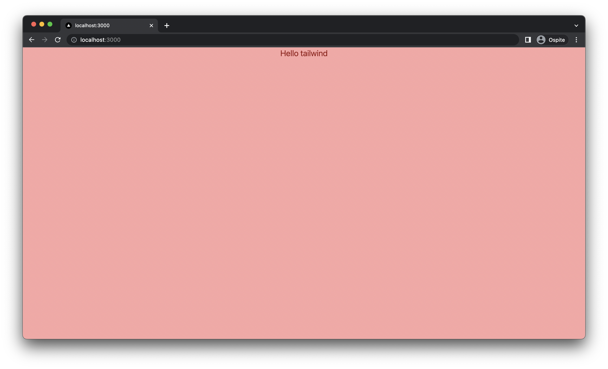

<InfoBox>

Tailwind non è solamente un sistema di utility classes molto versatile. La sua popolarità è dovuta anche tantissimo
ad una serie di progetti che rendono fenomenale la developer experience. Per utilizzarlo al meglio, vi suggerisco di
installare il pacchetto VSCode [Tailwind CSS IntelliSense](https://marketplace.visualstudio.com/items?itemName=bradlc.vscode-tailwindcss)
che vi permette di esplorare le classi di tailwind in una forma più semplice.

</InfoBox>

Ma cosa abbiamo fatto? Nella nostra pagina abbiamo creato un container div con altezza (`h-screen`) e larghezza (`w-screen`)
settate alle dimensioni dello schermo, e colore di background a _red-300_ (`bg-red-300`). All'interno di questo
componente abbiamo creato un titolo (`h1`) con il testo `Hello tailwind`, colore di testo _ted-800_ (`text-red-800`), centrato (`text-center`)
e di dimensioni _xl_ (`text-xl`). Tailwind mette a disposizione tantissime classi e tantissime gradazioni di colori, ci vuole
un attiamo per prendere familiarità con tutto (noi vederemo piano piano le utility che ci mette a disposizione).
Se volete avere più info su Tailwind, visitate il sito [tailwindcss.com](https://tailwindcss.com/) e la [documentazione](https://tailwindcss.com/docs/utility-first/).

### Creiamo una NavBar avanzata con Tailwind

Siamo finalmente pronti a lavorare ad un componente. Per questo ho scelto di creare con tailwind la NavBar del nostro sito,
che può sembrare un componente semplice ma in realtà nasconde un po' di insidie come farlo collassare in modalità mobile
e gestire il menu a scomparsa.

Per la NavBar, quindi, insieme a Tailwind useremo altre due librerie che spesso vengono usate in coppia:

- [headlessui](https://headlessui.dev/), di cui abbiamo già parlato, che ci mette a disposizie una serie di componenti
  non stilizzati e che funziona molto bene con tailwind.
- [heroicons](https://heroicons.com/), una libreria di icone creata utile per le varie icone del sito.

Per prima cosa installiamo le librerie:

```bash
$ npm i @headlessui/react @heroicons/react

added 2 packages, and audited 337 packages in 5s

79 packages are looking for funding
  run `npm fund` for details

found 0 vulnerabilities
```

Siamo quindi pronti per partire.

Riprediamo per prima cosa il componente `Nav` che abbiamo abbozzato precedentemente, cioè il file che abbiamo chiamato `components/nav.tsx`, di cui
riporto il contenuto attuale:

```tsx
export const Nav = () => {
  return <nav>React Megaturial Navigation</nav>;
};
```

Per vederne il risultato, aggiungiamolo alla pagina `./index.tsx` (a cui possiamo a questo punto rimuovere il colore di background ed il testo):

```tsx
import { Nav } from "../components/nav";

const Home = () => {
  return (
    <div className="">
      <Nav />
    </div>
  );
};
```

Possiamo quindi finalmente spostarci nel file `Nav` ed iniziare a lavorare da qui.

La navbar dovrà contenere una lista di link posizionati in vertiale, insieme ad una icona della nostra applicazione (in teoria il nostro logo
ma non avendorlo useremo l'icona delle casa) che ci rimanda
alla home del sito. Per finire, vogliamo che in modalità mobile la navbar collassi a solo il titolo insieme ad un pulsante che apre un menu.

In fase di design, applicare uno stile di sviluppo chiamato **mobile first**, dove l'idea di base è quella di creare per prima cosa
il layout per cellulari (mobile appunto), e poi estenderlo alla visualizzazione desktop. Partiamo quindi a stilizzare la navbar
collassato con solo il menu e il titolo.

Partiamo dalla navbar, dobbiamo farla alta 64px `h-16` (non so perchè, ma è lo standard di molte navbar in giro) e di un colore
che ci piace. Partiamo quindi da dare questo stile al componente principale. Possiamo anche togliere il contenuto per
il momento.

```tsx
export const Nav = () => {
  return <nav className="h-16 bg-green-600"></nav>;
};
```

Andiamo quindi a posizionare all'interno di questa nav il nostro componente che si vedrà
quando la navbar è collassata (quindi in formato mobile). Per ora facciamo finta che ci sia solo questo.

Questo componente dovrà mostrare a sinistra l'icona delle casa e a destra quella del menu. Troviamo entrambe
le icone in `@heroicons/react/outline`.

```tsx
import { HomeIcon, MenuIcon } from "@heroicons/react/outline";

export const Nav = () => {
  return (
    <nav className="h-16 bg-green-600">
      <div className="h-full flex justify-between items-center px-4 text-green-100">
        <a>
          <HomeIcon className="h-8 w-8"></HomeIcon>
        </a>
        <button>
          <MenuIcon className="h-8 w-8"></MenuIcon>
        </button>
      </div>
    </nav>
  );
};
```

Da notare che le due icone sono state wrappate la prima in un componente `<a>` (cioè un link, infatti
deve essere un semplice link a home), mentre la seconda in un componente `<button>`, perchè appunto
al click dovrà aprire il menu.

Se le cose sono state fatte bene, lanciando il server, dovreste vedere qualcosa simile a questo:

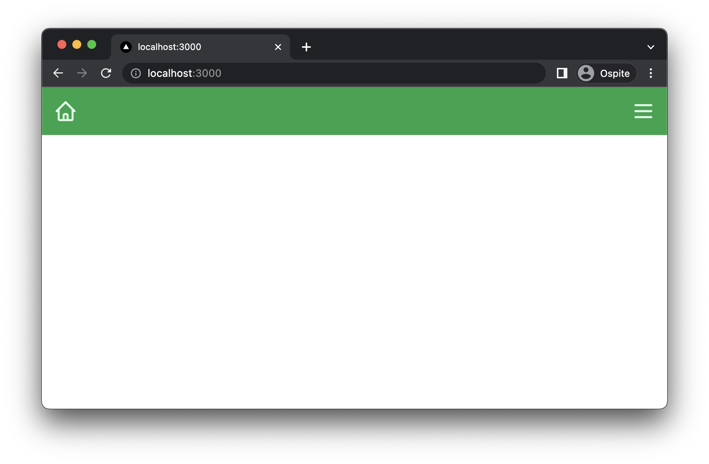

<InfoBox>
Siccome stiamo lavorando in mobile mode, conviene mettere il browser in visualizzazione mobile per avere una view simile a quella di un telefono.
Per farlo basta aprire l'inspector del browser e cliccare sull'icona a forma di telefono/tablet che trovate in alto a sinistra dell'
inspector, all'inizio della navbar principale

</InfoBox>

#### Navigazione con `next/link`

Il componente `<a>` dovrà rimandare alla home page del sito. Questo normalmente si sarebbe fatto
in HTML con la props `href="/"`, ma NextJS ci mette a disposizione un compoente speciale
per ottimizzare la navigazione interna al sito: `Link`.

Questo componente deve sempre wrappare `<a>`, e il link `href` lo imposteremo a lui, non al componente `<a>` originale.

Questa sintassi permette a NextJS di essere più veloce a renderizzare la navigazione.

```tsx
import { HomeIcon, MenuIcon } from "@heroicons/react/outline";
import Link from "next/link";

export const Nav = () => {
  return (
    <nav className="h-16 bg-green-600">
      <div className="h-full flex justify-between items-center px-4 text-green-100">
        <Link href="/">
          <a>
            <HomeIcon className="h-8 w-8"></HomeIcon>
          </a>
        </Link>
        <button>
          <MenuIcon className="h-8 w-8"></MenuIcon>
        </button>
      </div>
    </nav>
  );
};
```

#### Apertura e chiusura del menu

Per la gestione del menu le cose iniziano ad essere più complesse, fortunatamente troviamo dentro `@headlessui` il
componente [`Popover`](https://headlessui.dev/react/popover) che può essere usato, appunto, per la creazione di menu.

Partiamo quindi ad usare il Pupover per creare il nostro menu, il componente base da cui partire è questo (preso dalla documentazione):

```tsx
import { Popover } from "@headlessui/react";

const Menu = () => {
  return (
    <Popover className="relative">
      <Popover.Button>
        <MenuIcon className="h-8 w-8" />
      </Popover.Button>

      <Popover.Panel className="absolute z-10">
        <div className="grid grid-cols-2">
          <a href="/analytics">Analytics</a>
          <a href="/engagement">Engagement</a>
          <a href="/security">Security</a>
          <a href="/integrations">Integrations</a>
        </div>
      </Popover.Panel>
    </Popover>
  );
};
```

Dove, come vedete, ho inserito il bottone ` <MenuIcon className="h-8 w-8" />` all'intenro del componente `<Popover.Button>`.

Possiamo usare il nostro menu in questo modo all'interno del componente `Nav`:

```tsx
export const Nav = () => {
  return (
    <nav className="h-16 bg-green-600">
      <div className="h-full flex justify-between items-center px-4 text-green-100">
        <Link href="/">
          <a>
            <HomeIcon className="h-8 w-8"></HomeIcon>
          </a>
        </Link>
        <div>
          <Menu />
        </div>
      </div>
    </nav>
  );
};
```

Il menu a questo punto funziona, potete provare ad aprirlo e chiderlo senza problemi, ma vi renderete subito conto che la
parte grafica non è per niente ottimale. Iniziamo a stilizzarlo megli (in modo che almeno sia visibile) come seguie:

```tsx
const Menu = () => {
  return (
    <Popover>
      <Popover.Button>
        <MenuIcon className="h-8 w-8" />
      </Popover.Button>

      <Popover.Panel className="absolute z-10 inset-x-0 ">
        <div className="flex flex-col bg-slate-100 shadow-xl m-2 text-black">
          <a href="/analytics">Analytics</a>
          <a href="/engagement">Engagement</a>
          <a href="/security">Security</a>
          <a href="/integrations">Integrations</a>
        </div>
      </Popover.Panel>
    </Popover>
  );
};
```

Il cui risultato dovrebbe essere simile a quello che segue:

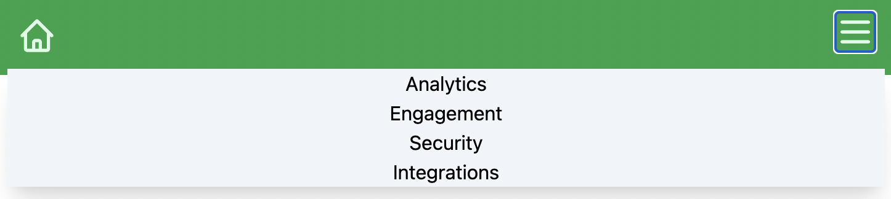

#### Conditional Rendering con gli operatori `&&` e `?:`

Una cosa interessante che possiamo fare è cambiare l'icona del menu in base al fatto che sia aperto o chiuso. Per fare questo dobbiamo
per prima cosa estrapolare una variabile che ci dice se il menu è aperto e chiuso, e per farlo possiamo usare questa sintassi:

```tsx
const Menu = () => {
  return (
    <Popover>
      {({ open }) => (
        <>
          <Popover.Button>
            {open ? (
              <XIcon className="h-8 w-8" />
            ) : (
              <MenuIcon className="h-8 w-8" />
            )}
          </Popover.Button>

          {open && (
            <Popover.Panel className="absolute z-10 inset-x-0 ">
              <div className="flex flex-col bg-slate-100 shadow-xl m-2 text-black">
                <a href="/analytics">Analytics</a>
                <a href="/engagement">Engagement</a>
                <a href="/security">Security</a>
                <a href="/integrations">Integrations</a>
              </div>
            </Popover.Panel>
          )}
        </>
      )}
    </Popover>
  );
};
```

Come vedete, il children del pophover non è più un componente ma un render template, cioè una funzione che prende dei
parametri e ritorna un componente.

In particolare ci interessa il parametro `open`, che appunto ci dice se il popover è aperto o chiuso.
`open` cambia valore nel momento in cui cambiamo il bottone, o premiamo esc, ad ogni modo il suo
comportamento è gestito dal componente `Popover`. Il nostro compito è di usare questo componente per
far funzionare correttamente il menu.

Per prima cosa, notate che si rende necessario dire al componente quando renderizzare il `Popover.Panel`.
Quando passiamo direttamente `Popover.Panel` come children al componente `Popver`, infatti,
è quest'ultimo che sa come e quando renderizzarlo, ma se adottiamo la sintassi con il templace children,
come stiamo facendo adesso, il componente `Popover`non prende più decisioni e siamo noi che dobbiamo
dirgli di renderizzare il componente `Popover.Panel` quando `open` è a `true`.

Per farlo usiamo questa sintassi `{open && <Popover.Panel />}`, che si chiama conditional rendering. L'operatore
`&&` semplicemente valuta se il primo valore è `true` (o equivalente) e, in caso, ritorna il
secondo valore, altrimenti ritorna `null` (che in react vuol dire non renderizzare niente). Questa è
una sintassi molto comune in React e quindi preparatevi a trovarla spesso in giro per i progetti.

Un altro esempio di operatore condizionale è quello che abbiamo usato per renderizzare le icone:

```tsx
open ? <XIcon className="h-8 w-8" /> : <MenuIcon className="h-8 w-8" />;
```

In questo caso abbiamo usato il ternary operator `?:`, che non è altro che un `if else` condensato. L'operatore
valuta il valore del primo elemento (`open`). Se è vero ritorna il secondo elemento, altrimenti il terzo.
Quindi questa operazione si legge così:

> Se il pannello è vero (`open==true)` allora renderizza l'icona `<XIcon />`, altrimenti l'icona `<MenutIcon />`.

Se provate a il componente a questo punto vedrete che l'icona cambia se questo è aperto o chiuso.

#### Props del componente

A questo punto dobbiamo fare in modo da passare dall'esterno la lista di link al menu, questo è imporante perchè ricordiamo che dovremo renderizzare il menu in due modi diversi in base alla dimensione
dello schermo, quindi abbiamo bisogno di non dover duplicare i dati che passiamo al componente (questo è uno dei principi
base dello sviluppo informatico chiamato **DRY** (don't repeat yourself), cioè _non ripetere te stesso_).

Lo possiamo fare
definendo una props all'interno del nostro componente Menu:

```tsx
interface MenuElement {
  href: string;
  label: string;
}

interface MenuProps {
  menu: MenuElement[];
}
```

Da usare all'iterno del nostro menu:

```tsx
const Menu = ({ menu }: MenuProps) => {
  return (
    <Popover>
      {({ open }) => (
        <>
          <Popover.Button>
            {open ? (
              <XIcon className="h-8 w-8" />
            ) : (
              <MenuIcon className="h-8 w-8" />
            )}
          </Popover.Button>

          {open && (
            <Popover.Panel className="absolute z-10 inset-x-0 ">
              <div className="flex flex-col bg-slate-100 shadow-xl m-2 text-black">
                {menu.map((item, idx) => (
                  <Link key={idx} href={item.href}>
                    <a>{item.label}</a>
                  </Link>
                ))}
              </div>
            </Popover.Panel>
          )}
        </>
      )}
    </Popover>
  );
};
```

Quello che abbiamo fatto è stato usare la lista `menu` per renderizzare i link con l'espressione `menu.map()`, che ricordo ci permette
di creare una lista di elementi (in questo caso `<Link />`) a partire da una lista di partenza (contenente i dati).

Invece di listare quindi i link come facevamo prima

```tsx
<a href="/analytics">Analytics</a>
<a href="/engagement">Engagement</a>
<a href="/security">Security</a>
<a href="/integrations">Integrations</a>
```

adesso facciamo un loop all'interno di `menu` (che ci arriva da fuori) e generiamo un oggetto `<Link />` per ognuno di questi elementi.

Per usare il nuovo componente, dobbiamo creare la lista:

```tsx
const MenuElements: MenuElement[] = [
  {
    href: "/blog",
    label: "Blog",
  },
  {
    href: "/about",
    label: "About",
  },
];
```

E passarla in fase di renderizzazione al componente:

```tsx
<Menu menu={MenuElements} />
```

ed il risultato dovrebbe essere il seguente:

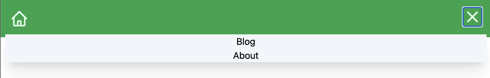

#### Creare nuove pagine

Siamo pronti a testare che la navigazione funzioni, ma per farlo ci servono nuove pagine. La creazione delle nuove pagine
`/about` e `/blog` è semplicissima: basta creare due file `pages/about.tsx` e `pages/blog.tsx`, con il seguente contenuto:

```tsx
// pages/about.tsx
import { Nav } from "../components/nav";

const About = () => {
  return (
    <div className="">
      <Nav />
      <h1> About</h1>
    </div>
  );
};

export default About;
```

```tsx
// pages/blog.tsx
import { Nav } from "../components/nav";

const Blog = () => {
  return (
    <div className="">
      <Nav />
      <h1> Blog</h1>
    </div>
  );
};

export default Blog;
```

Fatto questo, dovremmo poter essere in grado di navigare tranquillamente all'intenro della nostra app!

#### Breakpoints e Modalità Desktop

Ora che la modalità mobile funziona bene, dobbiamo creare l'applicazione in modo che il menu venga visualizzato diversamente
in modalità desktop. Per farlo, dobbiamo introdurre il concetto di breakpoin in Tailwind.

Un breakpoint non è altro che una dimensione dello schermo in larghezza per cui una pagina può cambiare layout.
Tailwind mette a disposizione di default una [serie di breakpoint](https://tailwindcss.com/docs/responsive-design), chiamate `xl`, `sm`, `md` e `lg` etc.
Questi breakpoint si traducono in modificatori delle classi css che ci permettono di cambiare il layour in base
alla dimensione dello schermo. Vediamo come usarli.

L'idea di base dei modificatori di tailwind è che possiamo applicare nuovi template sovrascrivendo le classi a brackpoint diverse.
Facciamo un esempio per capire meglio: supponiamo di voler nascondere il menu del nostro header quando lo schermo è a breackpoint `md` (medium)
o superiori, per farlo basta usare questa sintassi:

```tsx
<div className="md:hidden">
  <Menu menu={MenuElements} />
</div>
```

Il bottone sarà mostrano normalemnte fino al breackpoint `md`, e poi verrà applicato la classe `hidden` che non lo farà più vedere.

Per fare il contrario, dobbiamo creare un componente `hidden` di base e poi mostrarlo al breackpoint `md`:

```tsx
<div className="hidden md:block">Visibile la breakpoing</div>
```

Mettendo insieme questi due componenti, vedrete che quando il primo sparisce il secondo appare!

#### Creazione della navbar estesa

Andiamo quindi a sfruttare questa funzionalità per creare la navbar estesa, che metteremo all'interno del nostro `<div>` visibile
solo in modalità desktop.

```tsx
const DesktopMenu = ({ menu }: MenuProps) => {
  return (
    <ul className="flex gap-2">
      {menu.map((item, idx) => (
        <li key={idx}>
          <Link href={item.href}>
            <a>{item.label}</a>
          </Link>
        </li>
      ))}
    </ul>
  );
};
```

Il componente prende le stesse props di `<Menu />`, ma invece di renderizzare il bottone con il popup, renderizza una
semplice list di `<Link />` orizzonatale.

Il componente `Nav` finale, quindi, risulta essere il seguente:

```tsx
export const Nav = () => {
  return (
    <nav className="h-16 bg-green-600">
      <div className="h-full flex justify-between items-center px-4 text-green-100">
        <Link href="/">
          <a>
            <HomeIcon className="h-8 w-8"></HomeIcon>
          </a>
        </Link>
        <div className="hidden md:block">
          <DesktopMenu menu={MenuElements} />
        </div>
        <button className="md:hidden">
          <Menu menu={MenuElements} />
        </button>
      </div>
    </nav>
  );
};
```

Questo dovrebbe essere il risultato finale:

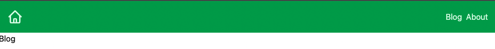
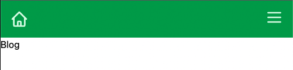

## Stilizziamo i componenti con emotions

Abbiamo visto come usare TailwindCSS e le sue funzionalità per creare una navbar in grado di collassare.
Sebbene quella vista su è il modo principale con gestiremo lo stile della nostra applciazione, vorrei fare anche
un accenno agli styled component che possiamo usarli (in combo con Tailwind) per stilizzare i component.

In questa seconda parte del capitolo, quindi, ci occuperemo di usare styled components per creare il footer della nostra applicazione.
Non useremo solo styled componente, in quanto credo fermamente che tailwind sia molto funzionate specialmente nella gestione dei colori, quindi
vedremo come usare insieme queste due tecnologie.

Partiamo subito con la libreria di css-in-js chiamata [emotions](https://emotion.sh/docs/introduction) ed iniziamo a stilizzare il nostro footer.
Per farlo, per prima cosa dobbiamo installare la libreria, dato che, come abbiamo detto, vogliamo utilizzare gli styled components, dovremmo
installare due pacchetti: `@emotion/styled` e `@emotion/react`:

```bash
$ npm i @emotion/styled @emotion/react

added 72 packages, and audited 302 packages in 20s

71 packages are looking for funding
  run `npm fund` for details

found 0 vulnerabilities
```

Con questa libreria andremo a stilizzare il footer della nostra applicazione, cioè il file che abbiamo chiamato `components/footer.tsx`, di cui
riporto il contenuto attuale.

```tsx
export const Footer = () => {
  return <footer>React Megaturial; all right reserverd</footer>;
};
```

Il footer dovrà contenere un poccolo disclaimer con il nome del sito e l'autore e una lista di link ai social network.

Anche in questo caso adotteremo lo stile **mobile first**, quindi partiamo dalla visualizzazione mobile.

#### Layout e contenuto del nostro Footer

Partiamo dal contenuto, dovremmo creare due div, la prima contenente il disclaimer mentra la seconda che contiene la lista di link social.

```tsx
import Link from "next/link";

export const Footer = () => {
  return (
    <footer>
      <div>
        <p>
          NextJS MegaTutorial; all right reserved {new Date().getFullYear()}
        </p>
      </div>
      <div>
        <ul>
          {socials.map((item, idx) => (
            <li key={idx}>
              <Link href={item.href}>
                <a target="_blank">{item.label}</a>
              </Link>
            </li>
          ))}
        </ul>
      </div>
    </footer>
  );
};

const socials = [
  {
    label: "twitter",
    href: "https://twitter.com",
  },
  {
    label: "youtube",
    href: "https://youtube.com",
  },
  {
    label: "github",
    href: "https://github.com",
  },
];
```

Come vedete abbiamo di nuovo esternalizzato i dati dei social per fare un loop all'interno dell'array. Come nel caso precedente, questa soluzione
ci permette di scrivere codice più pulito.

#### Creiamo un component `FooterStyled`

Siamo pronti quindi a stilizzare il componente.

La cosa che faccio di solito è creare un componente interno dove inserire lo style utilizzando `@emotions/styled`. Dato che il momponente
princiaple della nostra navbar è l'oggetto html `<footer>`, partirò da questo per generare l'oggetto stilizzato.

```tsx
export const Footer = () => {
  return <FooterStyled>{/* ... */}</FooterStyled>;
};

const FooterStyled = styled.footer`
  padding: 20px;
  display: flex;
  flex-direction: column-reverse;
  text-align: center;
`;
```

Come vedete il componente `FooterStyled` non è altro che un classico componente `<footer>` HTML a cui abbiamo _appiccicato_ dello style
con styled component. Per farlo abbiamo importato la libreriea `styled` da `@emtion/styled` e abbiamo
usato una speciale sintassi in JavaScript chiamata [**tag functions**](https://developer.mozilla.org/en-US/docs/Web/JavaScript/Reference/Template_literals?retiredLocale=it#tagged_templates) (o **tagged templates**),
che non sono altro che delle speciali funzioni seguite da un template literal.

<InfoBox>
`@emotion/styled` è molto potente in quello che ci permette di fare, ed in generare è possibile creare styled component
anche a partire da componenti custom React, con una sintassi di questo tipo:

```tsx
const MyCompoent = () => <div></div>;

const MyComponentStyled = styled(MyCompoent)`
  background-color: #ccc;
`;
```

ma non mi voglio addentrare in questi dettagli. In questa guida useremo soltanto la sintassi che abbiamo visto con i componenti
nativi HTML.

</InfoBox>

Ora che abbiamo la base del nostro componente possiamo lanciare il server `npm run dev` e accedere al solito link `http://localhost:3000/`
per vedere il risultato.

Ricordiamoci prima di tutto di aggiungere il nostro componente alle pagina, io vi riporto `pages/index.tsx`, ricordatevi di farlo da tutte
le parti:

```diff
+ import { Footer } from "../components/footer";
import { Nav } from "../components/nav";

const Home = () => {
  return (
    <div className="">
      <Nav />
      <h1> Home </h1>
+     <Footer />
    </div>
  );
};

export default Home;
```


Il risultato è un po' bruttino, ma almeno abbiamo un componente che può essere stilizzato.

#### Social Icons e SVG

Purtroppo la libreria heroicons non mette a disposizione icone social o di brand, quindi dobbiamo trovare
una soluzione per inserire questo tipo di contenuti (per i social). La cosa che possiamo fare è di trovare
online direttamente il codice SVG delle icone che ci interessano ed usarlo all'interno del nostro progetto.
Tra le varie librerie online che esistono per questo tipo di operazione, credo che la migliore sia
[**Font Awesome**](https://fontawesome.com/). Una libreria di tantissime icone semplici da usare.

Font Awesome mette a disposizione una libreria React che potremmo installare ed utilizzare, ma
possiamo anche sfogliare il sito e scaricare direttamente l'SVG che possiamo usare nel codice React, che è quello che faremo.

Per farlo andiamo quindi su [**Font Awesome**](https://fontawesome.com/), cerchiamo l'icona che ci interessa (in questo caso twitter)
e clicchiamo sul link **Copia SVG Code** che ci permette di copiare l'SVG nella clipboard.

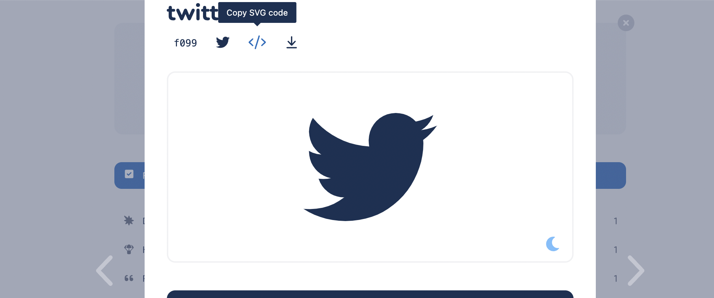

Vi copio il contenuto di seguito (notare che ho rimosso il commento contenuto nel codice copiato)

```tsx
<svg xmlns="http://www.w3.org/2000/svg" viewBox="0 0 512 512">
  <path d="M459.37 151.716c.325 4.548.325 9.097.325 13.645 0 138.72-105.583 298.558-298.558 298.558-59.452 0-114.68-17.219-161.137-47.106 8.447.974 16.568 1.299 25.34 1.299 49.055 0 94.213-16.568 130.274-44.832-46.132-.975-84.792-31.188-98.112-72.772 6.498.974 12.995 1.624 19.818 1.624 9.421 0 18.843-1.3 27.614-3.573-48.081-9.747-84.143-51.98-84.143-102.985v-1.299c13.969 7.797 30.214 12.67 47.431 13.319-28.264-18.843-46.781-51.005-46.781-87.391 0-19.492 5.197-37.36 14.294-52.954 51.655 63.675 129.3 105.258 216.365 109.807-1.624-7.797-2.599-15.918-2.599-24.04 0-57.828 46.782-104.934 104.934-104.934 30.213 0 57.502 12.67 76.67 33.137 23.715-4.548 46.456-13.32 66.599-25.34-7.798 24.366-24.366 44.833-46.132 57.827 21.117-2.273 41.584-8.122 60.426-16.243-14.292 20.791-32.161 39.308-52.628 54.253z" />
</svg>
```

A questo punto possiamo creare un nuovo componente `<TwitterIcon` /> come segue:

```tsx
const TwitterIcon = () => (
  <svg xmlns="http://www.w3.org/2000/svg" viewBox="0 0 512 512">
    <path d="M459.37 151.716c.325 4.548.325 9.097.325 13.645 0 138.72-105.583 298.558-298.558 298.558-59.452 0-114.68-17.219-161.137-47.106 8.447.974 16.568 1.299 25.34 1.299 49.055 0 94.213-16.568 130.274-44.832-46.132-.975-84.792-31.188-98.112-72.772 6.498.974 12.995 1.624 19.818 1.624 9.421 0 18.843-1.3 27.614-3.573-48.081-9.747-84.143-51.98-84.143-102.985v-1.299c13.969 7.797 30.214 12.67 47.431 13.319-28.264-18.843-46.781-51.005-46.781-87.391 0-19.492 5.197-37.36 14.294-52.954 51.655 63.675 129.3 105.258 216.365 109.807-1.624-7.797-2.599-15.918-2.599-24.04 0-57.828 46.782-104.934 104.934-104.934 30.213 0 57.502 12.67 76.67 33.137 23.715-4.548 46.456-13.32 66.599-25.34-7.798 24.366-24.366 44.833-46.132 57.827 21.117-2.273 41.584-8.122 60.426-16.243-14.292 20.791-32.161 39.308-52.628 54.253z" />
  </svg>
);
```

Dobbiamo fare un paio di modifiche al componente: per prima cosa, dobbiamo essere in grado di passargli una `className`, in modo da
poterlo stilizzale con tailwind o in generale con una classe CSS. In secondo luogo, gli aggiungiamo una property chiamata
`fill="currentColor"` che ci permette di cambiare il colore dell'icona utilizzando la proprietà `color` CSS (cioè il colore del testo).

Per permettere di riutilizzare queste icone, le definisco all'interno di un file `components/icons.tsx` da cui potremmo importarle.

```tsx
export interface IconProps {
  className?: string;
}

export const TwitterIcon = ({ className }: IconProps) => (
  <svg
    className={className}
    fill="currentColor"
    xmlns="http://www.w3.org/2000/svg"
    viewBox="0 0 512 512"
  >
    <path d="M459.37 151.716c.325 4.548.325 9.097.325 13.645 0 138.72-105.583 298.558-298.558 298.558-59.452 0-114.68-17.219-161.137-47.106 8.447.974 16.568 1.299 25.34 1.299 49.055 0 94.213-16.568 130.274-44.832-46.132-.975-84.792-31.188-98.112-72.772 6.498.974 12.995 1.624 19.818 1.624 9.421 0 18.843-1.3 27.614-3.573-48.081-9.747-84.143-51.98-84.143-102.985v-1.299c13.969 7.797 30.214 12.67 47.431 13.319-28.264-18.843-46.781-51.005-46.781-87.391 0-19.492 5.197-37.36 14.294-52.954 51.655 63.675 129.3 105.258 216.365 109.807-1.624-7.797-2.599-15.918-2.599-24.04 0-57.828 46.782-104.934 104.934-104.934 30.213 0 57.502 12.67 76.67 33.137 23.715-4.548 46.456-13.32 66.599-25.34-7.798 24.366-24.366 44.833-46.132 57.827 21.117-2.273 41.584-8.122 60.426-16.243-14.292 20.791-32.161 39.308-52.628 54.253z" />
  </svg>
);
```

Facciamo lo stesso lavoro per gli altri social che voglilamo usare, nel mio caso GitHub e YouTube, in modo da avere tutto quello che ci
serve per usarli nel nostro footer.

<InfoBox type="warn">
  FontAwesome non è completamente gratuito, e propone delle icone **Pro** che
  possono essere usate a pagamento. Non preoccupatevi troppo però se non volete
  acquistare una licenza, tutte le icone dei brand (a meno che non cerchiate
  stili particolari) sono gratuite, in ogni caso FontAwesome non vi permetterà
  di copiare codice di icone Pro, quindi nessun problema se temete di violare la
  licenza senza accorgervene.
</InfoBox>

A questo punto, possiamo inserire le icone all'interno della nostra lista `socials` dentro il file `footer.tsx`:

```tsx
const socials = [
  {
    label: "twitter",
    href: "https://twitter.com",
    Icon: TwitterIcon,
  },
  {
    label: "youtube",
    href: "https://youtube.com",
    Icon: YoutubeIcon,
  },
  {
    label: "facebook",
    href: "https://facebook.com",
    Icon: GithubIcon,
  },
];
```

e utlizzarlo come segue:

```tsx
<ul>
  {socials.map(({ Icon, href, label }, idx) => (
    <li key={idx}>
      <Link href={href}>
        <a target="_blank">
          <span className="sr-only">{label}</span>
          <Icon className="w-8 h-8" />
        </a>
      </Link>
    </li>
  ))}
</ul>
```

Notare che nel map ho usato il destructoring `({ Icon, href, label }, idx)` per accedere alle proprietà dell'oggetto `{Icon, href, label}`
direttamente. Inoltre sto usando del codice tailwindCSS per stilizzare le icone, perchè in questo caso viene molto più semplice
che usare styled components.

<InfoBox>
  Il tag `<span className="sr-only">{label}</span>` usa una classe di tailwind
  `sr-only` che ci permette di nascondere un testo mantenendolo visibili agli
  screen reader. Questa è una buona pratica di accessibilità importante
  specialmente quando si lavora con link visibile tramite icone, in modo da dare
  la possibilità di capire il contenuto del link anche a persone ipovedenti.
</InfoBox>

Adesso il contenuto del Footer è il seguente:

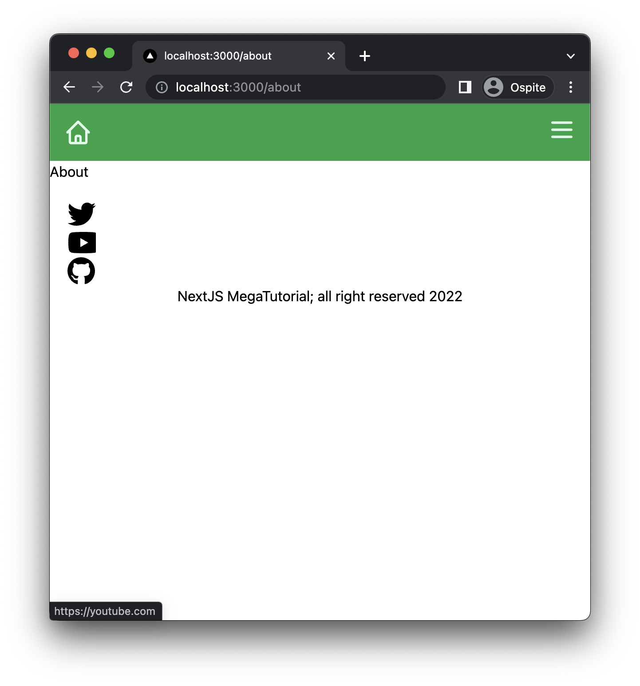

#### Stilizziamo il componente

Siamo finalmente pronti per aggiungere un po' di stile. Possiamo creare due styled component che andranno a sostituire i due div
che wrappano la lista dei social e il copyright.

```tsx
const SocialsContainer = styled.div`
  padding: 20px;
  ul {
    display: flex;
    flex-direction: row;
    gap: 10px;
    justify-content: center;
  }
`;

const CopyContainer = styled.div`
  padding: 20px;
`;
```

Da usare nel componente principale

```tsx
export const Footer = () => {
  return (
    <FooterStyled>
      <CopyContainer>
        <p>
          NextJS MegaTutorial; all right reserved {new Date().getFullYear()}
        </p>
      </CopyContainer>
      <SocialsContainer>
        <ul>
          {socials.map(({ Icon, href, label }, idx) => (
            <li key={idx}>
              <Link href={href}>
                <a target="_blank">
                  <span className="sr-only">{label}</span>
                  <Icon className="h-8" />
                </a>
              </Link>
            </li>
          ))}
        </ul>
      </SocialsContainer>
    </FooterStyled>
  );
};
```

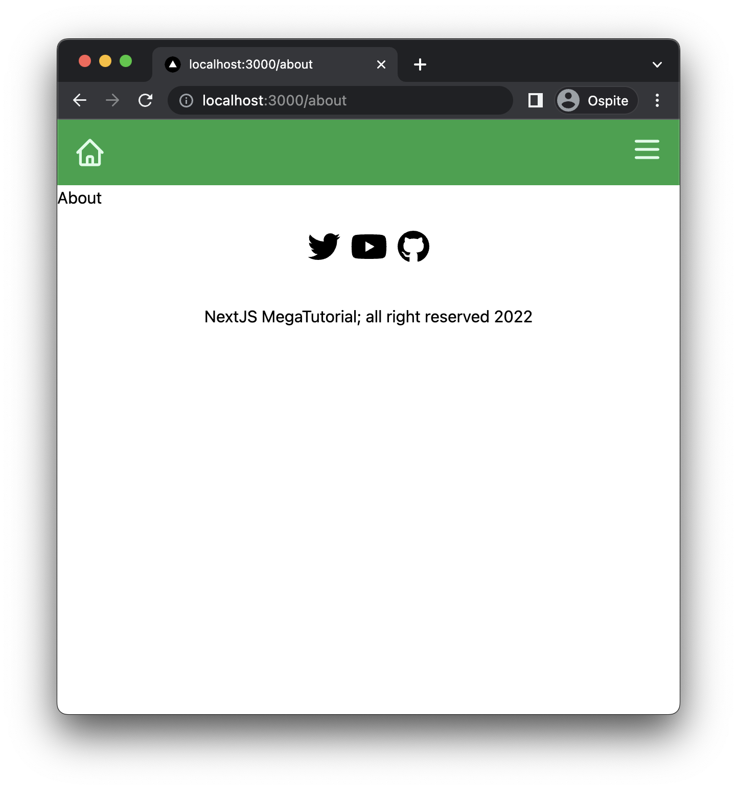

Possiamo anche definire nuovi stili aggiuntivi allo styled component usando tailwindcss, ad esempio per cambiare colori:

```tsx
export const Footer = () => {
  return (
    <FooterStyled>
      <CopyContainer className="text-gray-800">
        <p>
          NextJS MegaTutorial; all right reserved {new Date().getFullYear()}
        </p>
      </CopyContainer>
      <SocialsContainer className="text-green-500">
        <ul>
          {socials.map(({ Icon, href, label }, idx) => (
            <li key={idx}>
              <Link href={href}>
                <a target="_blank">
                  <span className="sr-only">{label}</span>
                  <Icon className="h-8" />
                </a>
              </Link>
            </li>
          ))}
        </ul>
      </SocialsContainer>
    </FooterStyled>
  );
};
```

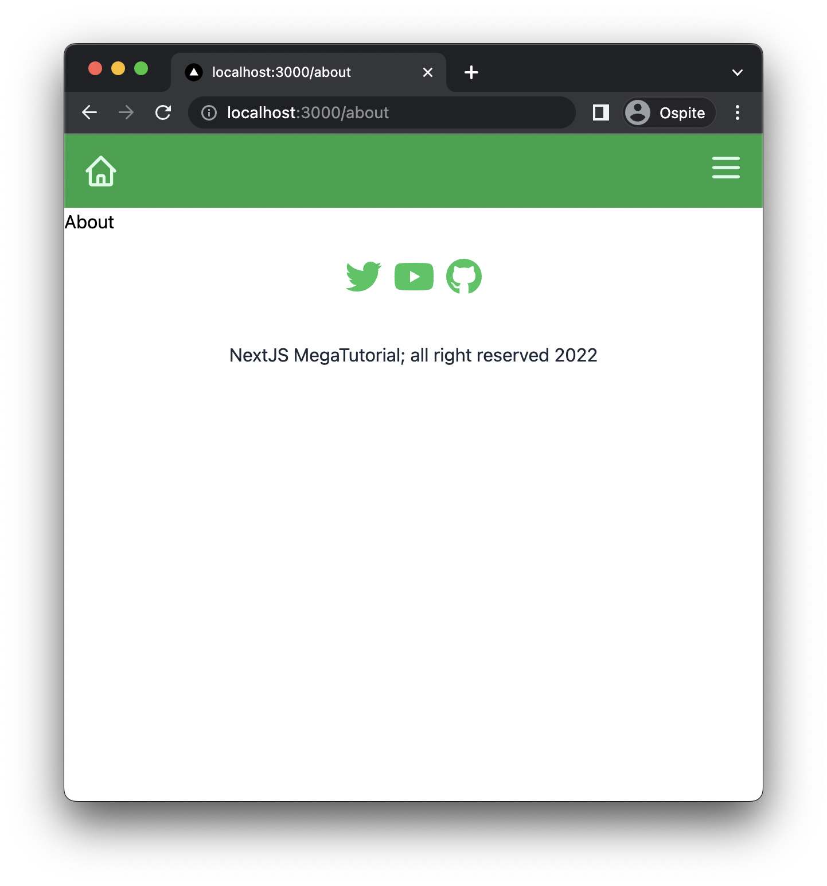

#### Visualizzazione Desktop

L'ultima cosa che ci manca da fare, quindi, è modificare il footer in modo che sia visibile in modalità desktop con un layout differente.

Per farlo possiamo usare direttamente le [media query css](https://developer.mozilla.org/en-US/docs/Web/CSS/Media_Queries/Using_media_queries)
all'inteno dello styled component!

```tsx
const FooterStyled = styled.footer`
  display: flex;
  flex-direction: column-reverse;
  text-align: center;
  @media screen and (min-width: 768px) {
    flex-direction: row;
    justify-content: space-between;
  }
`;
```

Notare che abbiamo settato come breackpoint `768px`, il breakpoin `md` di tailwind.

Il risultato finale è il seguente:

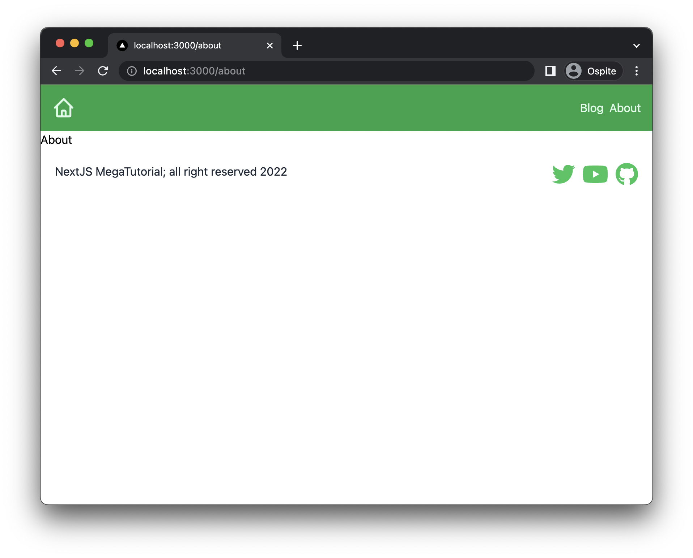

## Cosa abbiamo imparato?

- Ci sono molte soluzioni diverse per stilizzare i componenti in React;
- Come usare TailwindCSS per definire lo stile dei componenti;
- Come usare `@headlessui` e `@heroicons`;
- Come usare gli styled component con `@emotions` per stilizzare componenti;
- Come utilizzare SVG all'inteno delle applicazioni React;
- Come sfruttare la metodologia di sviluppo **mobile first**;

Il codice di questo capitolo lo [trovate su github](https://github.com/ludusrusso/next-js-megatutorial/tree/c3).
