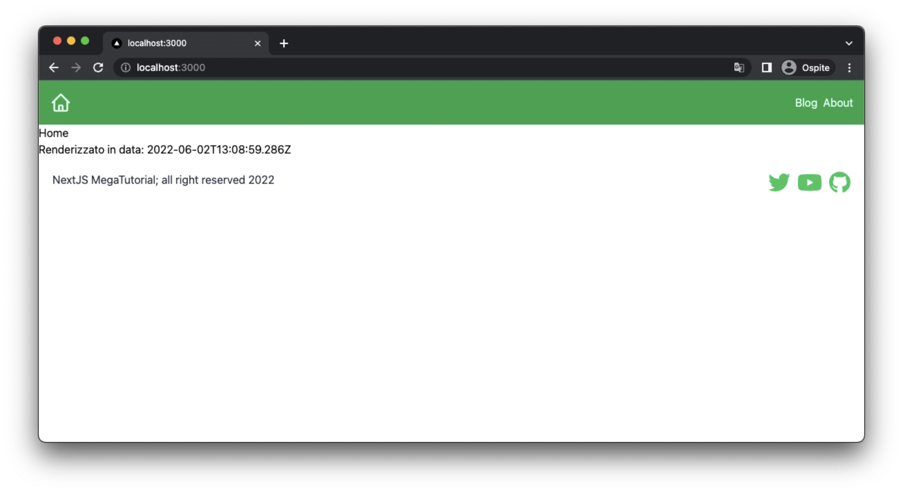

Negli ultimi due capitoli abbiamo principalmente lavorato con React e visto come creare e gestire
componenti, utilizzando le props, settando gli stili ecc.

Quello imparato nel capito precedenti non è nulla di specifico su NextJS, e può essere tranquillamente
applicato (con alcune modifiche) a qualsiasi progetto React su cui vogliamo lavorare. In questo capitolo, invece,
iniziamo ad addentrarci dentro alcune delle feature più importanti di NextJS che lo hanno
reso uno dei (meta)framework più famosi e versatili nel panorama dello sviluppo software moderno in React.

Il modello di **data fetching** di NextJS permette di renderizzare le pagine e i contenuti in
diversi modi in base alle esigenze del nostro sito, o della specifica pagina che vogliamo renderizzare.
In particolare NextJS permette di renderizzare le pagine nei seguenti modi:

- **Static Site Generation (SSG)** dove i contenuti per renderizzare una pagina
  vengono prelevati in fase di compilazione del sito internet e poi messi a disposizione agli utenti tramite cache.
  Gli utenti si trovano a servire una pagina super veloce, perchè questa è già stata costruita dal server. Inoltre
  non abbiamo necessità di consumerare risorse lato server per servire questa pagina: la pagina è già pronta e
  il server deve solo servire il file statico all'utente. Questo approccio funziona molto bene in caso di dati
  che non variano velocemente (come blog post), ma non è adatto in caso di dati che variano velomenete.
- **Server Site Rendering (SSR)** dove i contenuti vengono richiesti nel momento in cui l'utente fa
  la richiesta al server e presentanti all'utente immediatamente. Questo è il modo in cui i siti internet dinamici (come ad esempio quelli
  basati su wordpress) storicamente funzionano. Questo approccio richiede risorse computazionali per gestire la pagina, in quanto
  il server deve fare la query di dati a sorgenti terze (un db, altre api, eccetera) e poi renderizzare la pagina prima di servirla.
- **Client-side Rendering (CSR)**, dove riprendiamo il vantaggio di avere applicazioni completamente gestite dal browser. In questo caso il server
  si occupa di servire una pagina HTML con del codice JavaScript. La pagina, una volta eseguita sul browser, si occuperò di
  fare query di altri dati e di aggiornare il contenuto che viene mostrato all'utente. Questo approccio è molto popolare per appliacazioni
  che non richiedono l'indicizzazione SEO (in quanto i servizi che indicizzano le pagina solitamente non eseguino il codice JavaScript) e
  che richiede forte interazione con i dati da parte dell'utente. Da notare che questa terza tecnica può essere usata insieme ad una delle altre
  due in acluni casi, ad esempio una pagina renderizzata staticamente con alcuni dati che vengono aggiornati dal browser.
- **Incremental Static Regeneration (ISR)**, è un approccio misto tra **SSG** e **SSR**, in qesto caso la pagina viene prerenderizzata
  ma il server si occupa periodicamente di fare un refetch dei dati e di aggiornare il contenuto della pagina cachata se i dati cambiano.
  In questo caso abbiamo i vantiaggi di una pagina statica (all'utente arriva senpre la cache) con la possibilità di decidere quanto spesso
  controllarne l'aggiornamento.

<InfoBox>
  Durante lo sviluppo, le pagine **SSG** e **SSR** si comportano di fatto nello
  stesso modo, per autare lo sviluppo.

La differenza tra le due modalità di rendering viene vista in fase di rilascio del sito in prodizione.

</InfoBox>

In questo capitolo ci concentreremo sull'uso di **SSG** (e della sua evoluzione **ISR**). Questa soluzione ci darà la possibilità,
nei due capitoli successivi, di iniziare a costuire un semplice blog e metterlo a disposizione di tutti.

Appronfondiremo poi in seguito le soluzione **SSR** e **CSR** che richiedono una conoscenza più complessa delle tecnologie in gioco, ma
grazie ai quali possiamo realizzare siti molto più complessi.

### Static Site Generation (SSG) con `getStaticProps`

Le pagine che abbiamo costruito fino ad ora sono di fatto pagina statiche, andiamo ad esempio a prendere la pagina principale, che
troviamo nel file `pages/index.tsx`:

```tsx
import { Footer } from "../components/footer";
import { Nav } from "../components/nav";

const Home = () => {
  return (
    <div className="">
      <Nav />
      <h1> Home </h1>
      <Footer />
    </div>
  );
};

export default Home;
```

Ci accorgiamo subito che questa pagina non contiene alcun dato esterno da mostrare, non cambia quindi per nessun motivo se non
cambiamo il codice che la compone.

In questo caso, la pagina viene considerata da NextJS come una pagina statica (o meglio un caso particolare di una pagina statica
che non contiene nemmeno dati), e in fase di compilazione del sito, verrà renderizzata, cachata e servita all'utente così come è.

Esiste però un modo per controllare la renderizzazione di questa pagina in fase di build e passargli dei dati che arrivano da fonti
esterne. Questo viene fatto esportando una funzione speciale dalla pagina chiamata `getStaticProps`.

```tsx
export const getStaticProps = async () => {
  return {
    props: {},
  };
};
```

Questa funzione viene eseguita (lato server) nel momento del build del sito, e l'oggetto `props` che viene tornato
da questa funzione viene passato come proprietà al componente della pagina che esportiamo. Con questa semplice soluzione, di fatto,
possiamo controllare in modo molto specifico qualisasi dato che passiamo al componente che renderizza la pagina. L'unico vincolo è
che l'oggetto che mettiamo all'interno di props deve essere JSON serializzabile (cioè non possiamo passare classi o funzioni, ma solo dati
che possiamo mettere all'interno di un oggetto JSON), ad esemio, non possiamo passare una oggetti `Date` o un componente React.

Possiamo quindi usare queste informazioni per renderizzare la pagina. Supponiamo ad esempio di voler inserire da qualche parte
il momento in cui la pagina viene renderizzata, possiamo fare così:

```tsx
export const getStaticProps = async () => {
  const renderedTime = new Date();
  return {
    props: {
      renderedTime: renderedTime.toISOString(),
    },
  };
};
```

e accedere a questa informazione lato frontend:

```tsx
interface HomeProps {
  renderedTime: string;
}

const Home = ({ renderedTime }: HomeProps) => {
  return (
    <div className="">
      <Nav />
      <h1> Home </h1>
      <p>Renderizzato in data: {renderedTime}</p>
      <Footer />
    </div>
  );
};
```

Che renderizzerà questa pagina:



### Buildiamo il sito

Come detto prima, vi accorgerete che, facendo un refresh della pagina, il valore stampato della data cambierà. Questo perchè siamo
in modalità development e per semplicare lo sviluppo la funzione `staticSiteProps` viene eseguita continuamente. Possiamo però
provare a compilare il sito e servirlo in fase di prod.

Compiliamo prima di tutto il sito con il comando

```bash
$ npx run build
> my-first-site@0.1.0 build
> next build

info  - Checking validity of types
info  - Creating an optimized production build
info  - Compiled successfully
info  - Collecting page data
info  - Generating static pages (6/6)
info  - Finalizing page optimization

Page                                       Size     First Load JS
┌ ● /                                      2.68 kB        94.9 kB
├   /_app                                  0 B            75.1 kB
├ ○ /404                                   193 B          75.3 kB
├ ○ /about                                 2.63 kB        94.8 kB
├ λ /api/hello                             0 B            75.1 kB
├ ○ /blog                                  2.63 kB        94.8 kB
└ ○ /experiments                           3.1 kB         95.3 kB
+ First Load JS shared by all              75.1 kB
  ├ chunks/framework-a87821de553db91d.js   45 kB
  ├ chunks/main-fc7d2f0e2098927e.js        28.7 kB
  ├ chunks/pages/_app-43ac001d99fedbd3.js  493 B
  ├ chunks/webpack-fd1bc4a65a80e5c8.js     968 B
  └ css/45410aee82e1c763.css               1.8 kB

λ  (Server)  server-side renders at runtime (uses getInitialProps or getServerSideProps)
○  (Static)  automatically rendered as static HTML (uses no initial props)
●  (SSG)     automatically generated as static HTML + JSON (uses getStaticProps)
```

Notante intanto che NextJS ci segnala che la pagina `/` è di tipo **SSG** con il pallino ●. Le altre pagina che abbiamo
creato invece le considera **Static** (○), questo perchè contengono solo codice JavaScript e non dati.

Possiamo ora servire il server in modalità prod, e vedere come cambia il comportamento della pagina:

```bash
$ npm run start

> my-first-site@0.1.0 start
> next start

ready - started server on 0.0.0.0:3000, url: http://localhost:3000
```

A questo punto, se provate a refreshare la pagina varie volte, vedrete che il valore della data non cambia più, e risulterà essere quello
calcolato in fase di build durante il comando `npm run build`.

### Incremental Site Regeneration (ISR)

La tecnologia **ISR** è un'evoluzione della **SSG** in NextJS che ci permette di controllare il momento in cui una pagina viene
rirenderizzata. Il suo utilizzo è semplicissimo, in quanto basta che `getStaticProps` ritorni un oggetto contenente la proprietà `revalidate`.
`revalidate` è un numero rappresentate il periodo (in secondi) in cui la pagina deve rivenire aggiorata.

In fase di produzione, la funzione `getStaticProps` verrà eseguita alla scadenza di ogni intervallo di tempo prefissato e la cache della
pagina verà rirenderizzata.

Vediamo un esempi:

```tsx
export const getStaticProps = async () => {
  const renderedTime = new Date();
  return {
    props: {
      renderedTime: renderedTime.toISOString(),
    },
    revalidate: 10,
  };
};
```

In questo modo, se provate nuovamente a compilare e servire la pagina con `npm run start` vi accorgerete che il valore stampato
cambia all'incirca ogni 10 secondi.

<InfoBox>
`revalidate` è una feature molto potente di NextJS. Il valore che impostiamo all'interno di questo oggetto deve essere
settato in base a quanto frequente i nostri dati cambiano. Ad esempio in un blog post, ci aspettiamo che il contenuto non cambi 
molto spesso, perciò possiamo settare il valore a qualche ora (nel caso volessimo correggere eventuali errori) o non metterlo proprio.

In caso di una pagina che mostra una lista di blog post, possiamo settarlo a qualche minuto, in modo che la pagina si refreshi
abbastanza spesso da mostrare gli ultimi contenuti pubblicati.

</InfoBox>

### Inferenza dei tipi

Avete notato che abbiamo dovuto definire il tipo `Props` che passiamo alla pagina nonostante in teoria lo passimo già in quanto valore di ritorno
della funzione `getStaticProps`? Questa cosa, che non ci è costata tanto codice, in generale può essere scomoda da fare quando ritorniamo dalla
nostra pagina tantissimi oggetti. Fortunatamente, NextJS ci mette a disposizione una **type function** in typescript che ci permette dice
inferire il tipo di props dalla funzione. Questa funzione si chiama `InferGetStaticPropsType` e è disponibile nella libreria `@types/next`

```tsx
import { InferGetStaticPropsType } from "next";
// ...

type HomeProps = InferGetStaticPropsType<typeof getStaticProps>;

const Home = ({ renderedTime }: HomeProps) => {
  return (
    <div className="">
      <Nav />
      <h1> Home </h1>
      <p>Renderizzato in data: {renderedTime}</p>
      <Footer />
    </div>
  );
};
```

Questa funzione utilizziamo ci permette di mantenere i tipi corretti anche senza doverli definire manualmente.
Se provate a ritornare nuove proprietà dell'oggetto `props` vi accorgerete che queste vengono automaticamente
riconosciute dal tipo `HomeProps`.

## Cosa abbiamo imparato?

In questo capitolo abbiamo iniziato a scalfire le enormi potenzialità di NextJS nel creare siti complessi, vedendo come usare
la funzione `getStaticProps` per renderizzare la pagina in modalità **SSG**.

In particolare abbiamo visto:

- I diversi modelli di rendering e fetching dei dati in NextJS
- Come funziona `getStaticProps` per renderizzare una pagina in SSG
- Come usare `revalidate` per controllare la rigenerazione della pagina (ISR)
- Come sfruttare `InferGetStaticPropsType` per non dover definire il tipo `Props` a mano

Adesso abbiamo finalmente gli strumenti per iniziare a costruire un semplice blog con NextJS. Nel prossimi capitoli
vedremo quindi come costruire il nostro blog usando NextJS e Markdown (o una sua evoluzione chiamata MDX), la stessa
tecnologia con cui gestisco il mio blog e con cui sto scrivendo questo libro.

Nel frattempo, potete trovare il (poco) codice scritto in questo capito su [GitHub](https://github.com/ludusrusso/next-js-megatutorial/tree/c4)
