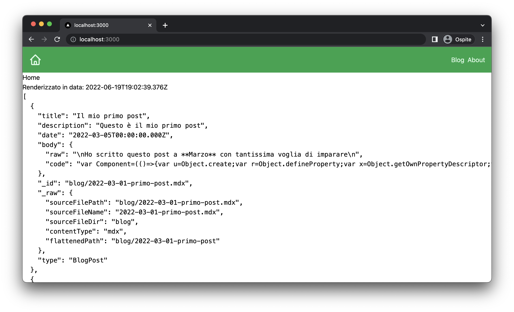

Nel capitolo precedente abbiamo visto come funzionano il modello di data loading di NextJS e
imparato ad usare `getStaticProps` per creare pagine generate staticamente (SSG) e abbiamo sfruttato
il potere dell'_Incremental Site Regeneration_ (ISR) di next tramite la proprietà `revalidate`.

L'esempio realizzato è stato molto utile per capire come funziona next sotto il cofano, ma ovviamente non
ha quasi nessuna utilità pratica.

In questo capitolo inizieremo invece a fruttare queste feature per costure un sito in grado di funzionare come
un blog. Quello che vedremo in queste pagina funziona sia per piccoli blog personali, come ad esempio il mio, ma
anche è alla base di blog molto più grandi che ricevono tantissimi visitatori e tantissimo traffico.

A partire da questo capitolo, e grazie ai due successivi, vedremo nel dettaglio come realizzare e mettere online
il nostro blog persona.

Partiamo subito!

#### Organizzazione del nostro blog

NextJS è agnostico dalla sorgente da cui arrivano i dati, che può essere sia interna (ad esempio una cartella contenente dei
file organizzati in certo modo), sia esterna, come può essere un database, o un CMS esterno (su questo punto ci arriveremo
in seguito, abbiate pazienza).

L'idea di base di un blog statico con NextJS è quella di utilizzare la repository del nostro progetto sia per
contenere il codice sorgente, sia per contenere i vari dati che compongono il nostro blog, cioè i file
con i contenuti e le immagini che andremo ad utilizzare all'interno del vari post che andremo a creare.

Adremo quindi a creare una nuova cartella `/content` all'intenro della quale mettere tutti i nostri blog post
organizzati in un certo modo.

Ovviamente abbiamo tantissime soluzioni per prendere i dati dalla nostra cartella e `/content` e farli arrivare
alla pagina tramite la funzione `getStaticProps`, in questo guida ho deciso di usare una dei progetti
che credo più interessanti al momento, che ci chiama [ContentLayer](https://www.contentlayer.dev/).

#### ContentLayer

ContentLayer è un'utilissima libreria che permette in modo semplice e veloce di avere i
contenuti provenienti da varie fonti (come markdown o mdx) e integrarli nel nostro sito.

Tra le funzionalità che offre troviamo:

1. Semplice accesso ai dati contenuti all'interno dei nostri file
2. Live reaload anche quando modifichiamo i contenuti
3. Supporto per i linguaggi di markup
4. TypeSafe e autocompletamente in base al tipo di contenuto

Considerate che il progetto è talmente tanto interessante e risolve talmente tanti problemi che
quando l'ho scoperto ho migrato il mio intero blog nel giro di un paio di giorni. E la migrazione
è stata quasi completamente indolore!

L'idea di base di ContentLayer è la seguente: inseriamo il nostri contenti all'interno di una specifica cartella,
nel nostro caso `/content`.

Parallelamente definiamo tramite ContentLayer la _shape_ dei nostri contenuti, cioè il formato (markdown, mdx, etc.)
e i metadati (titolo, descrizione, etc.) che ci aspettiamo per ogni singolo contenuto.

Content Layer andrà a monitorare i nostri contenuti e ci metterà a disposizione degli oggetti TypeScript per
caricalrli all'interno delle nostre pagine. A quel punto possiamo usare i dati come meglio crediamo senza troppi problemi.

Ah, e ci avvisa in caso di manzanza di dati o di errori in generale!

#### Markdown e MDX

Prima di lanciarci nella scrittura del codice e nello sviluppo del nostro progetto, dobbiamo definire un paio di cose
di cui ho parlato precedentemente in questo capitolo.

Cosa diavolo è il formato **Markdown** e cosa è **MDX**?

Markdown è un formato di markup molto semplice da usare pensato per essere veloci nella scrittura di contenuti
ma anche di permettere di avere facilmente organizzazione del testo ed è pensato per essere convertito in HTML.

Markdown permette facilmente la creazione di **Headings** all'interno del testo, l'inserimento di immagini e link
ipertestuali, la creazione di liste ed evidenziare il testo in grassetto e in italic.

**MDX** invece è unstensione del markdown che possiamo considerare simile a JSX per HTML. Permette di
creare file Markdown con la possibilità di inserire anche componenti dinamici JSX che creiamo da React.
Ecco quindi che all'interno del nostro file di testo possiamo inserire componenti dinamici come grafici,
interazioni avanzate con l'utente e in generare componenti custom in modo semplice e veloce.

All'intenro di un file Mardown (o MDX) possiamo anche inserire dei metadati, come ad esempio informazioni
sul titolo del post, la descrizione, la data di creazione e cose di questo tipo.

Ecco un esempio di file MDX, vedremo in seguito poi come utilizzarlo.

```md
---
title: un mio post
description: questa sezione è quella dei metadati, qui dentro possiamo mettere quello che vogliamo
date: 01-01-2020
---

# Questo è un heading (h1)

## Questo è un heading (h2)

Questo è il testo di un paragrafo, in cui possiamo mettere una parte in **grassetto** ed una in _corsivo_.

Posiamo creare liste:

- questa è la prima voce della lista
- questa è la seconda voce della lista

E anche liste numerate

1. questa è la prima voce della lista
2. questa è la seconda voce della lista

Per finire possiamo inserire un componente React

<MyChart year={2022} />
```

## Iniziamo a lavorare con ContentLayer

Content layer deve essere per prima cosa installato e configurato.

#### Installazione della libreria

Installiamo `contentlayer` è l'integrazione con next `next-contetlayer` con il seguente comando:

```bash
$ npm i contentlayer next-contentlayer

added 232 packages, and audited 569 packages in 42s

179 packages are looking for funding
  run `npm fund` for details

found 0 vulnerabilities
```

#### Integriamo contentlayer con NextJS

Per far funzionare l'integrazione dobbiamo modificare il file `next.config.js` in modo da dirgli di usare l'estensione
`next-contentlayer`:

```diff
+ const { withContentlayer } = require("next-contentlayer");

/** @type {import('next').NextConfig} */
const nextConfig = {
  reactStrictMode: true,
};

- module.exports = nextConfig;
+ module.exports = withContentlayer(nextConfig);
```

Quello che abbiamo fatto è stato wrappare l'oggetto `nextConfig` con la funzione `withContentlayer` che ci mette
a disposizione la libreria di integrazione.

Per finire, cosa molto importante, è andare a modificare il `tsconfig.json` in modo da inserire le seguenti
opzioni all'interno dell'oggetto `compilerOptions`.

```diff
{
  "compilerOptions": {
	...
+    "baseUrl": "./",
+ 	 "paths": {
+     "contentlayer/generated": ["./.contentlayer/generated"]
+   }
  },
  "include": ["next-env.d.ts", "**/*.ts", "**/*.tsx"],
  "exclude": ["node_modules"]
}
```

Questa operazione è **essenziale** per far funzioanre contentlayer.

#### Configurazione di contentlayer

A questo punto possiamo configurare contetlayer per definire i nostro contenuti.
Dobbiamo in particolare dare a contentlayer le seguenti informazioni:

1. Che tipo di contenuti aspettarsi.
2. Dove andarli a trovare.
3. Che tipo di dati troviamo all'interno dei nostri contenuti.

Per fare questo, dobbiamo creare un nuovo file nella root del nostro progetto chiamato `contentlayer.config.ts`:

All'interno di questo file dobbiamo esportare come default un oggetto contente la nostra `source`, cioè le informazioni
su come trovare e parsare i contenuti:

```ts
import { makeSource } from "contentlayer/source-files";

export default makeSource({
  contentDirPath: "content",
  documentTypes: [],
});
```

Come vedete quello che facciamo qui è dire a contentlayers che i nostri contenuti si trovano all'interno della cartella
`/content`, ma dobbiamo ancora specificare il tipo di contenuti che ci aspettiamo. Questo viene fatto passando degli
oggetti all'interno dell'array `documentTypes`.

È una lista perchè possiamo avere più tipi di dati, ma per il momento preoccupiamoci di inserire solamente dei blog post.

Per definire un nuovo tipo di contenuto andiamo a creare un oggetto utilizzando la funzione `makeDocumentType`:

```ts
import { defineDocumentType, makeSource } from "contentlayer/source-files";

export const BlogPost = defineDocumentType(() => ({
  name: "BlogPost",
  filePathPattern: `blog/**/*.mdx`,
  contentType: "mdx",
  fields: {
    title: {
      type: "string",
      description: "The title of the post",
      required: true,
    },
    description: {
      type: "string",
      description: "The description of the post",
      required: true,
    },
    date: {
      type: "date",
      description:
        "published date | if not set, the post is considered a draft",
      required: false,
    },
  },
}));

export default makeSource({
  contentDirPath: "content",
  documentTypes: [BlogPost],
});
```

All'intenro della funzione che abbiamo creato dobbiamo passare alcune informazioni:

- `name`: il nome del tipo di contenuto! Di solito è lo stesso del nome della variabile, ma non è necessario che sia così
- `filePathPattern`: le infromazioni su dove trovare questi contenuti, in questo caso la sintassi `blog/**/*.mdx` indica di cercare
  tutti i file con estensione `.mdx` all'iterno della cartella e di tutte le sottocartelle di `blog`. La cartella `blog` è,
  a sua volta, una sottocartella di `content` specificata in `makeSource`.
- `contentType`: il formato di contenuto che ci aspettiamo, in questo caso `md`.
- `fields`: un grouppo di metadati che dobbiamo aspettarci all'interno dei file markdonw, che in questo caso sono i seguenti:
  - `title`: il titolo del post
  - `description`: la descrizione del post
  - `date`: la data di pubblicazione del post, che è opzionale, e se non presente consideriamo il post come un draft

Perfetto, questo è quello che necessitiamo, per ora, per iniziare a lavorare con contentlayer. Vediamolo quindi all'opera.

## Creiamo i nostri post

Siamo pronti a creare dei post, creiamo la cartella `content/blog` ed iniziamo a creare due file dentro di essa, in modo da
avere due post all'interno del blog:

Il primo file si chiama `2022-03-01-primo-post.mdx` e contiene questo contenuto:

```md
---
title: "Il mio primo post"
description: "Questo è il mio primo post"
date: 2022-03-05
---

Ho scritto questo post a **Marzo** con tantissima voglia di imparare
```

Il secondo file si chiama `2022-04-01-primo-post.mdx` e contiene questo contenuto:

```md
---
title: "Il mio secondo post"
description: "Questo è il mio secondo post"
date: 2022-04-08
---

Ho scritto questo secondo post ad **Aprile**!
```

<InfoBox title="Naming dei file">
  
Se i file sono messi nel posto giusto, non abbiamo necessità a charmarli in un modo o in un'altro. Io
preferisco chiamare i file usando questa convenzione: `anno-mese-progrsessivo mese-slug.mdx`.

In questo modo ho i file organizzati in anno e mese e poi secondo una progressione nell'ordine di scrittura,
ed è molto semplice recuperarli quando serve.

</InfoBox>

## Lanciamo nextjs

Se abbiamo fatto tutto per bene, lanciando il nostro server in modalità dev dovremmo ricevere un nuovo
log che ci dice che contentlayer ha correttamente riconosciuto i nostri post.

```bash
$ npm run dev

> my-first-site@0.1.0 dev
> next dev

ready - started server on 0.0.0.0:3000, url: http://localhost:3000
Generated 2 documents in .contentlayer
wait  - compiling...
event - compiled client and server successfully in 303 ms (125 modules)
```

## Accdere ai nostri post

Accedere ai post è facilissimo, possiamo farlo all'interno di `getStaticsProps` di `index.tsx` in modo da
farli vedere all'interno della pagina:

Per farlo, basta importare l'oggetto `allPosts` da `contentlayer/generated`. Questo oggetto contiene tutti i dati
e metadati contenuti all'interno del nostro blog.

```tsx
import { InferGetStaticPropsType } from "next";
import { Footer } from "../components/footer";
import { Nav } from "../components/nav";
import { allBlogPosts } from "contentlayer/generated";

type HomeProps = InferGetStaticPropsType<typeof getStaticProps>;

const Home = ({ renderedTime, posts }: HomeProps) => {
  return (
    <div className="">
      <Nav />
      <h1> Home </h1>
      <p>Renderizzato in data: {renderedTime}</p>
      <pre>{JSON.stringify(posts, null, 2)}</pre>
      <Footer />
    </div>
  );
};

export default Home;

export const getStaticProps = async () => {
  const renderedTime = new Date();
  const posts = allBlogPosts;
  return {
    props: {
      renderedTime: renderedTime.toISOString(),
      posts,
    },
    revalidate: 10,
  };
};
```

In questo codice abbiamo definito ed esportato la lista di post da `getStaticProps` e poi li abbiamo renderizzati
come raw JSON all'interno della pagina. Ed ecco il risultato per me:



Come potete vedere all'interno dell'array `posts` troviamo i dati che abbiamo definito all'interno di
contentlayer e inserticome come metadata nei file markdown. Troviamo anche una sezione `body` contenente
il corpo del post in due formati

- `raw`: il testo originale che abbiamo inserito come stringa
- `code`: il testo parsato da mdx (ci arriveremo dopo)

Infine, troviamo una sezione `_raw` che contiene alcune informazioni originali del file, che possono essere
utili in alcuni casi.

## Ottimizziamo i dati

NextJS inserisce all'interno di un file json che salva come cache tutti i dati che esportiamo dalla funzioen `getStaticProps`,
anche se questi non vengono effettivamente utilizzati dalla pagina. Questo può essere un problema specialmente nel caso
di blog post molto lunghi, in quanto, per quello che abbiamo fatto ora, anche i corpi dei post sono inviati
al frontend.
