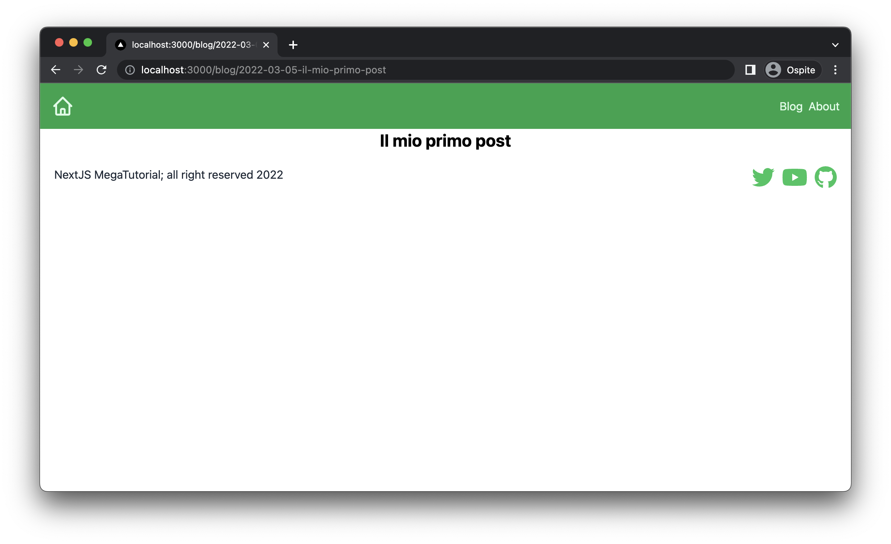
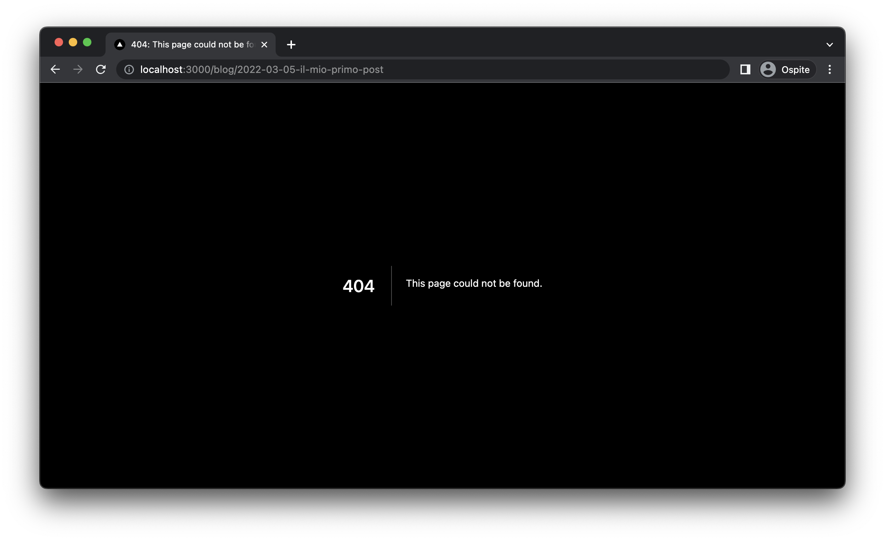
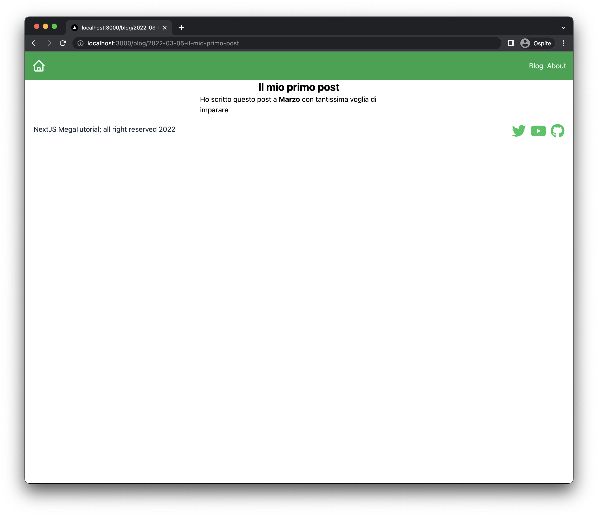

Nel capitolo precedente abbiamo visto come gestire i nostri blog post con ContentLayer e abbiamo iniziato a creare
le anteprima dei post all'interno della homepage del nostro blog.

Quello che però ancora non abbiamo fatto è creare delle pagine apposite per ogni blog in modo che l'utente possa
visualizzarli e leggere il proprio contenuto. Questa funzionalità, che implementiamo in questo capitolo, ci permetterà
di scoprire alcune feature interessanti di NextJS e ContentLayer, che sono:

1. NextJS dynamic routes, che ci permettono di creare delle pagine con path (cioè url) parametrizzabile.
2. Content Layer computed fields, che ci permette di creare delle proprietà calcolate in automatico dei nostri contenuti.

#### Quindi, che cosa faremo nel pratico?

Per prima cosa dobbiamo creare una path alla quale ogniuno dei nostri post dovrò rispondere. Ci sono vari modi per farlo, quella che ho
scelto io è nella seguente forma: `/blog/<yyyy>-<mm>-<dd>-<slug>`, che contiene la data di pubblicazione e il titolo del post sotto forma di slug.

Per slug si intende una stringa che contiene solo caratteri alfanumerici, trattini e trattini bassi, e che è quindi url friendly.

Per computare il path andremo ad usare le computed fields di ContentLayer, che ci permettono di precalcolare dei valori a partire dalle props
che passiamo al contenuto e di inserire come props nel contenuto stesso.

La seconda cosa che dobbiamo fare, invece, è quella di creare una pigina specifica in grado di renderizzare il contenuto del post. Questa pagina
sarà un componente unico che però renderizzerà informazioni diverse in base al post che si sta visualizzando.

## Calcolare il path con le computed fields di ContentLayer

Per calcolare il path di un post dobbiamo usare le computed fields di ContentLayer. Per definire un compute field
dobbbiamo definire la property `computeFields` dentro l'oggetto `BlogPost` nel file `contentlayer.config.ts`.
Questa property funziona come `fields`, con la differenza che dobbiamo passare ad ogni oggetto che definiamo qui
dentro una funzione `resolve` in cui mettiamo la logica per calcolare il valore della field che vogliamo.

Questa funzione resolve prende l'oggetto originale con le sue proprietà e deve ritornare il valore calcolato per
la nuova proprietà. Vediamo quindi come creare il field path:

```ts
export const BlogPost = defineDocumentType(() => ({
  name: "BlogPost",
  filePathPattern: `blog/**/*.(md|mdx)`,
  contentType: "mdx",
  fields: {
    // ...
  },
  computedFields: {
    path: {
      type: "string",
      resolve: (post) => {
        // calcolare qui il valore del path del blog
      },
    },
  },
}));
```

### Computed field `isDraft`

Vi ricordate che nel precedente articolo abbiamo detto che se non è presenta la proprietà `published` allora il post è una bozza.
Possiamo sfruttare computed field per creare un field `isDraft` che è più semplice da comprendere quando si guardano le proprietà
del post:

```ts
export const BlogPost = defineDocumentType(() => ({
  name: "BlogPost",
  filePathPattern: `blog/**/*.(md|mdx)`,
  contentType: "mdx",
  fields: {
    // ...
  },
  computedFields: {
    // ...
    isDraft: {
      type: "boolean",
      resolve: (post) => {
        return !post.date;
      },
    },
  },
}));
```

<InfoBox title="operator `!`">
  Ricordate che l'operatore `!` trasforma un valore in booleano (invertendolo).
  Quindi se la data non è stata impostata, `!post.date` vale `true`, altriment
  `false`.
</InfoBox>

Fatto questo possiamo usare questa nuova proprietà per filtrare dai post che visualizziamo
quelli che sono ancora draft, in questo modo:

```ts
// pages/index.tsx

// ...

export const getStaticProps = async () => {
  // ...
  const posts = allBlogPosts.filter((p) => !p.isDraft).map(getPostFrontmatter);
  return {
    // ...
  };
};
```

### Computed field `path`

Per calcolare il valore del path, ci servono due funzioni di supporto:

- Una funzione chiamiamo `slugify()` che ci calcoli lo slug a partire dal titolo del post,
- Una funzione `computeDate()` che ci calcola la data in formato `yyyy-mm-dd` a partire dalla data del post,

Iniziamo ad implementarle:

#### funzione `slugify`

Ho trovato questa implementazione su interent che sfrutta le [Regex](https://regex101.com/), non è ora molto
importante capire come funziona, in generale quello che fa è trasformare la stringa in caratteri minuscoli,
rimuovere i vari caratteri non alfanumerici e trasformare gli spazi in trattini.

```ts
function slugify(title: string) {
  return title
    .trim()
    .toLowerCase()
    .replace(/\s+/g, "-")
    .replace(/[^\w\-]+/g, "")
    .replace(/\-\-+/g, "-")
    .replace(/^-+/, "")
    .replace(/-+$/, "");
}
```

Ad esempio, se proviamo a lancaire `slugify` passandogli la stringa `Questo è un titolo!` otterremo la stringa `questo-e-un-titolo`.

#### funzione `computeDate`

Questa funzione è meno criptica, quindi vediamo come implementarla.

Il modo più semplice è sfruttare le funzioni `getFullYear()`, `getMonth()` e `getDate()` di Date per ottenere i valori di
anno, mese e giorno alla data che gli passiamo.

Una prima implementazione potrebbe essere questa:

```ts
function computeDate(date: Date) {
  const yyyy = date.getFullYear();
  const mm = date.getMonth();
  const dd = date.getDate();
  return `${yyyy}-${mm}-${dd}`;
}
```

Però qui abbiamo due problemi:

1. `getMonth()` parte da zero, quindi dobbiamo trasformala in `getMonth() + 1` in modo che Gennaio corrisponda a mese `1` ecc.
2. Per mesi e giorni minori di 10, otterremo una stringa nella come `2022-1-5` mentre noi vogliamo `2022-01-05`.

Per risolvere il secondo problema possiamo usare la funzione `padPrefix()` di stringe, che praticamente inseriscono un carattere di riempimento
all'inizio della stringa se questa è più corta di una lunghezza prestabilita. Quindi ad esempio:

```ts
"2".padStart(2, "0"); // "02"
"12".padStart(2, "0"); // "12"
```

Attenzione però che le funzioni ritornano un oggetto di tipo `number`, quindi prima di tutto dobbiamo trasformarlo in stringa con la funzione `String()`.

Ecco quindi la funzione completa

```ts
function computeDate(date: Date) {
  const yyyy = date.getFullYear();
  const mm = String(date.getMonth() + 1).padStart(2, "0");
  const dd = String(date.getDate()).padStart(2, "0");
  return `${yyyy}-${mm}-${dd}`;
}
```

#### `resolve()`

A questo punto abbiamo tutto quello che ci serve per la nostra funzione resolve. Se la data non è impostata restituiamo come path
il valore nella forma `draft-<slug>`, altrimenti quello che abbiamo visto prima `<yyyy>-<mm>-<dd>-<slug>`.

```ts
export const BlogPost = defineDocumentType(() => ({
  // ...
  computedFields: {
    // ...
    path: {
      type: "string",
      resolve: (post) => {
        if (!post.date) {
          return `draft-${post.title}`;
        }
        const date = computeDate(new Date(post.date));
        const slug = slugify(post.title);
        return `${date}-${slug}`;
      },
    },
  },
}));
```

<InfoBox
  type="warn"
  title="Non usare le compute property nelle funzioni `resolve()`"
>
  Attenzione che non possiamo usare la property `isDraft` nella funzione resolve
  (ed in generale non possiamo usare computed property all'interno dei metodi
  resolve perchè non abbiamo garantito il fatto che siano già stati calcolati).
</InfoBox>

## Dynamic Routes per i nostri Blog Post

Siamo pronti a creare la nostra pagina del blog, e per farlo possiamo usare la funzione **dynamic routes** di Next.js.

Iniziamo creando un nuovo file chiamato `pages/blog/[path].tsx`, dove la sintassi `[path]` indica che questa pagina non avrà
un url fisso come nel caso delle altre pagine, ma risponderà a tutti gli URL nella forma `/blog/[path]`.

All'interno di questo file dobbiamo, come al solito, creare una pagina nella forma di un componente React esportato come default,
e usare la funzione `getStaticProps` per ottenere i dati che vogliamo passare alla pagina.

Ci sono però due differenze rispetto ad una pagina statica normale che abbiamo visto fino ad adesso:

1. Dobbiamo esportare una seconda funzione chiamata `getStaticPaths`, che approfondiremo in seguito.
2. La funzione `getStaticProps` prende in ingresso un parametro che corrisponde al valore della stringa `path` della pagina.
   Ad esempio, all'url reale `/blog/post-slug`, il paramtro `path` passato a `getStaticProps` avrà come varlore `post-slug`.

Iniziamo quindi creando una semplice pagina di esempio che renderizza il titolo del post che stiamo visualizzando ottenuto tramite il
valore contenuto in `path`:

```tsx
import { Footer } from "components/footer";
import { Nav } from "components/nav";
import { allBlogPosts } from "contentlayer/generated";
import { GetStaticPropsContext, InferGetStaticPropsType } from "next";

const BlogPostPage = ({
  post,
}: InferGetStaticPropsType<typeof getStaticProps>) => {
  return (
    <div>
      <Nav />
      {post && (
        <article className="max-w-md m-auto">
          <h1>{post.title}</h1>
        </article>
      )}
      <Footer />
    </div>
  );
};

export default BlogPostPage;

export const getStaticPaths = async () => {
  return {
    paths: [],
    fallback: true,
  };
};

export const getStaticProps = async ({
  params,
}: GetStaticPropsContext<{ path: string }>) => {
  const path = params?.path!;
  const post = allBlogPosts.find((post) => post.path === path);
  return {
    props: {
      post: post,
    },
  };
};
```

Come vedete usiamo il parametro `path` per trovare il blog post che ha come `fields` la path che gli arriva dall'url.

Non è però garantito che `post` esista, quindi nel frontend facciamo un render condizionale e stampiamo il contenuto del post solo
in caso questa esista veramente.

Per provarlo, possiamo modificare il componente `PostPreview` realizzato nel precedente capitolo in modo da rimandare alla pagina
del post tramite un link.

```tsx
// ...
import Link from "next/link";

export const PostPreview = (frontmatter: BlogPostFrontMatter) => {
  return (
    <Link href={`/blog/${frontmatter.path}`}>
      <a>
        <div className="shadow-md p-2 hover:ring-2 rounded-md">
          <h2 className="text-lg font-semibold">{frontmatter.title}</h2>
          {frontmatter.date && (
            <time className="text-sm font-light" dateTime={frontmatter.date}>
              {formatDate(new Date(frontmatter.date))}
            </time>
          )}
          <p className="italic mt-2">{frontmatter.description}</p>
        </div>
      </a>
    </Link>
  );
};

// ...
```

A questo punto, dalla nostra homa page dovremmo poter navigare alla pagina del post cliccando sull'anteprima di ognuno, e vedere
visualizzato a video il relativo titolo.



### Come funziona `getStaticPaths()`

Abbiamo detto che in caso di pagine dinamiche, dobbiamo esportare la funzione `getStaticPaths` per permettere a next di funziona correttamente.
Ma a cosa serve questa funzione?

L'idea è di informare Next della lista di pagine statiche che deve renderizzare, in quanto queste vengono generate da dati a cui
il framework non ha direttamente accesso.

`getStaticPaths()` deve ritornare due informazioni:

1. Un array `paths`, che contiene la lista di tutti i parametri delle pagine da rendererizzare
2. Un flag `fallback` che indica a next, nel caso in cui la pagina che viene visualizzata a runtime non sia contenuta nell'array `paths`,
   se può comunque provare a renderizzare la pagina (a runtime, quindi non avremo più una pagina statica) o se deve semplicementer ritornare `404`.

Impostando `fallback` a `true`, come abbiamo fatto adesso, Next prova comunque a renderizzare la pagina, ed è il motivo per cui
riusciamo in ogni caso a vedere le pagine del post anche se `paths` è un array vuoto.

Se modifichiamo `getStaticPaths` come segue, infatti, vedrete che rimanderà a 404:

```ts
export const getStaticPaths = async () => {
  return {
    paths: [],
    fallback: false,
  };
};
```



Per risolvere questo problema, e avere le pagine dei post statiche, dobbiamo quindi riempire l'array `paths` con i valori
dei parametri che poi vogliamo passare a `getStaticProps`. L'output che vogliamo è una cosa del genere:

```ts
[
  { params: { path: "2022-03-05-il-mio-primo-post" } },
  { params: { path: "2022-04-08-il-mio-secondo-post" } },
];
```

Che possiamo facilmente ottenere facendo un loop su `allBlogPosts` in questo modo:

```ts
export const getStaticPaths = async () => {
  const paths = allBlogPosts.map((post) => ({
    params: {
      path: post.path,
    },
  }));
  return {
    paths: paths,
    fallback: false,
  };
};
```

Con questa implementazione, e settando `fallback` a `false`, siamo sicuri sempre di trovare un post esistente in `getStaticProps`.
Possiamo quindi forzare il post a essere un oggetto vero (con l'operatore `post!`) senza necessariamente fare un check a runtime
come facciamo adesso.

```diff
export const getStaticProps = async ({
  params,
}: GetStaticPropsContext<{ path: string }>) => {
  const path = params?.path!;
  const post = allBlogPosts.find((post) => post.path === path);
  return {
    props: {
-       post: post,
+       post: post!,
    },
  };
};
```

E possiamo quindi togliere il rendering condizionale nel frontend:

```tsx
const BlogPostPage = ({
  post,
}: InferGetStaticPropsType<typeof getStaticProps>) => {
  return (
    <div>
      <Nav />
      <article className="max-w-md m-auto">
        <h1 className="text-2xl text-center font-bold">{post.title}</h1>
      </article>
      <Footer />
    </div>
  );
};
```

### Renderizziamo il `body` del Post

Per renderizzare il `body` del blog possiamo utilizzare la funzione `useMDXComponent` che ci mette a disposizione
contentlayer nella libreria `next-contentlayer/hooks`. Questa funzione prende il body del post e lo renderizza in un
componente React che possiamo facilmente renderizzare nella nostra pagina:

```tsx
// ...
import { useMDXComponent } from "next-contentlayer/hooks";

const BlogPostPage = ({
  post,
}: InferGetStaticPropsType<typeof getStaticProps>) => {
  const Body = useMDXComponent(post.body.code);
  return (
    <div>
      <Nav />
      <article className="max-w-md m-auto">
        <h1 className="text-2xl text-center font-bold">{post.title}</h1>
        <div>
          <Body />
        </div>
      </article>
      <Footer />
    </div>
  );
};
```

Con il seguente risultato:



Semplice no?

## Cosa abbiamo imparato?

Questo capitolo è stato abbastanza impegnativo ed abbiamo visto alcune feature di contet layer e di NextJS, in particolare.

- come gestire i computed parameters in ContentLayer
- come creare pagine con i dynamic path
- come sfruttare la funzione `getStaticPaths` in NextJS
- come leggere parametri in `getStaticProps` in una pagina dinamica

A questo punto abbiamo tutto le conoscenze e gli strumenti necessari per creare il nostro blog in NextJS. Nel prossimo
capitolo ci concentreremo nell'aggiustare il blog che abbiamo realizzato in modo che sia bello da vedere e contenga tutti i dati
che ci interessano. E saremo quindi pronti a deployarlo.

Il codice scritto in questo capito è disponibile su [GitHub](https://github.com/ludusrusso/next-js-megatutorial/tree/c6)
