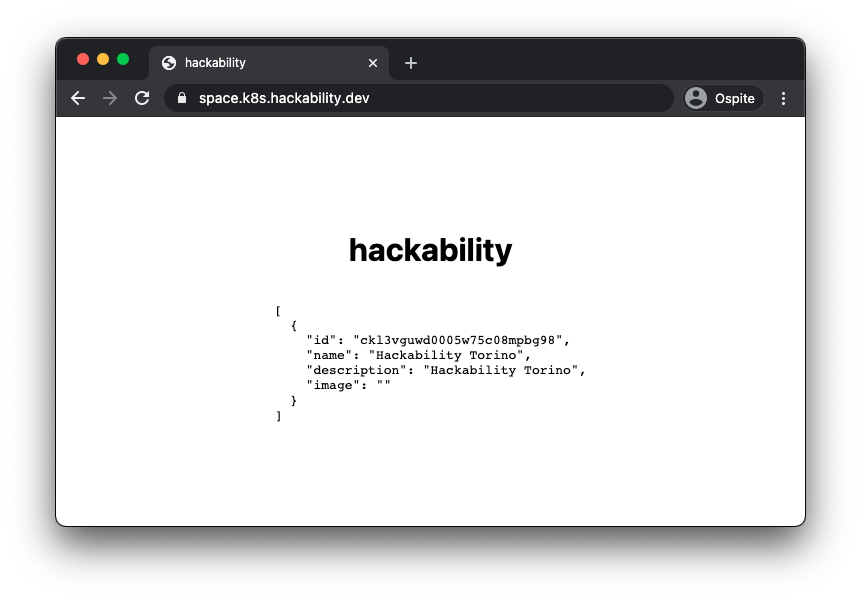

Da dove iniziamo? Space Hackability è un progetto ambizioso e abbiamo poco tempo per svilupparlo.
Quindi si parte alla grande! In questo primo vorremmo creare il progetto in [next.js](https://nextjs.org/),
aprire la repo GitHub, dockerizzare il server e fare un primo
deploy su #Kubernello!

## Cosa abbiamo fatto?

- Repo progetto -> https://github.com/hackability-dev/space.hackability
- Setup progetto con [nextjs](https://nextjs.org/)
- Connessione al DB tramite [Prisma](https://www.prisma.io/)
- Immagine Docker creata -> [hackabilitydev/space-hackability](https://hub.docker.com/repository/docker/hackabilitydev/space-hackability)
- Deploy su [Kubernello](https://github.com/livefun-dev/kubernello)
- Sito preview live -> [space.k8s.hackability.dev/](https://space.k8s.hackability.dev/)

