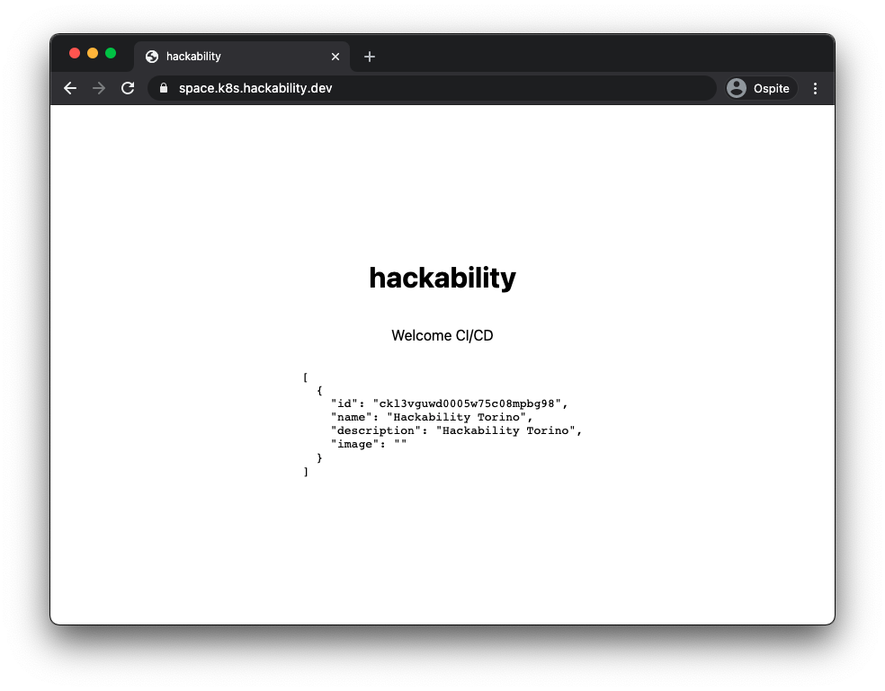

La prima bozza di space Hackablity è online! Ma prima di iniziare lo sviluppo vero e proprio
con Next.js abbiamo bisogno di implementare un sistema di Continous Integration and Deployment
fatto per bene.

Per questo motivo, con l'aiuto di Davide e Lorenzo, proviamo a setuppare una CI/CD usando le
seguenti tecnologie:

- [Github Actions](https://docs.github.com/en/actions)
- [Flux 2](https://github.com/fluxcd/flux2)

## Cosa abbiamo fatto!

Il live è stato pieno di roba insegnata da Lorenzo, in particolare ci siamo concentrati
su due attività principali.

### 1. Setup Flux2 su Kubernello

[Flux2](https://fluxcd.io/) è un sistema che implementa GitOps per Kubernetes.
In parole povere, questo tool permette di gestire la configurazione del cluster e delle
applicazioni che girano al suo interno sfruttando una repository git come unica
source of trouth. Questo ha enormi vantaggi rispetto al classico approccio CI/CD
(per approfondire questo [video spiega molto bene l'idea](https://www.youtube.com/watch?v=Mr_mbwsRDBI)),

Seguendo [questa guida](https://toolkit.fluxcd.io/get-started/) abbiamo eseguito il
bootstrap di Flux2 all'interno di Kubernello, usando il comando:

```bash
$ flux bootstrap github --owner=hackability-dev --repository=env-space-hackabilty-dev --private=false

### output

► connecting to github.com
✔ repository created
✔ repository cloned
✚ generating manifests
✔ components manifests pushed
I0220 15:22:20.434567   12847 request.go:655] Throttling request took 1.092061751s, request: GET:https://168.119.154.178:6443/apis/k3s.cattle.io/v1?timeout=32s
► installing components in flux-system namespace
namespace/flux-system created
customresourcedefinition.apiextensions.k8s.io/alerts.notification.toolkit.fluxcd.io created
customresourcedefinition.apiextensions.k8s.io/buckets.source.toolkit.fluxcd.io created
customresourcedefinition.apiextensions.k8s.io/gitrepositories.source.toolkit.fluxcd.io created
customresourcedefinition.apiextensions.k8s.io/helmcharts.source.toolkit.fluxcd.io created
customresourcedefinition.apiextensions.k8s.io/helmreleases.helm.toolkit.fluxcd.io created
customresourcedefinition.apiextensions.k8s.io/helmrepositories.source.toolkit.fluxcd.io created
customresourcedefinition.apiextensions.k8s.io/kustomizations.kustomize.toolkit.fluxcd.io created
customresourcedefinition.apiextensions.k8s.io/providers.notification.toolkit.fluxcd.io created
customresourcedefinition.apiextensions.k8s.io/receivers.notification.toolkit.fluxcd.io created
serviceaccount/helm-controller created
serviceaccount/kustomize-controller created
serviceaccount/notification-controller created
serviceaccount/source-controller created
clusterrole.rbac.authorization.k8s.io/crd-controller-flux-system created
clusterrolebinding.rbac.authorization.k8s.io/cluster-reconciler-flux-system created
clusterrolebinding.rbac.authorization.k8s.io/crd-controller-flux-system created
service/notification-controller created
service/source-controller created
service/webhook-receiver created
deployment.apps/helm-controller created
deployment.apps/kustomize-controller created
deployment.apps/notification-controller created
deployment.apps/source-controller created
networkpolicy.networking.k8s.io/allow-scraping created
networkpolicy.networking.k8s.io/allow-webhooks created
networkpolicy.networking.k8s.io/deny-ingress created
◎ verifying installation
✔ install completed
► configuring deploy key
✔ deploy key configured
► generating sync manifests
✔ sync manifests pushed
► applying sync manifests
◎ waiting for cluster sync
✔ bootstrap finished
```

Che ha creato la repository [env-space-hackabilty-dev](https://github.com/hackability-dev/env-space-hackabilty-dev)
su cui poi abbiamo deployato le varie configurazioni di kubernetes e space hackability.

All'interno del repo abbiamo copiato la cartella `k8s` contenente i file di configurazione
di kubernetes. In questo modo, ad ogni modifica di questi file Flux si occupa di
aggiornare lo stato di Kubernetes.

**gitrepo-hackability-dev.yaml** che si occupa di informare Flux di monitorare la
repo git.

```yaml
apiVersion: source.toolkit.fluxcd.io/v1beta1
kind: GitRepository
metadata:
  name: hackability-dev
  namespace: flux-system
spec:
  gitImplementation: go-git
  interval: 0m30s
  ref:
    branch: main
  secretRef:
    name: hackability-dev
  timeout: 20s
  url: ssh://git@github.com/hackability-dev/env-space-hackabilty-dev
```

### 2. Setup GitHub Action

Abbiamo quindi configurato una [github actions](https://github.com/hackability-dev/space.hackability/blob/main/.github/workflows/ci.yml) che ci permette di deployare le immagini in modo automatico
ad ogni push che facciamo.

```yaml
name: CI

on:
  push:
    branches:
      - "**"
    tags:
      - "v*"
jobs:
  docker:
    runs-on: ubuntu-latest
    steps:
      - name: Checkout
        uses: actions/checkout@v2
      - name: Docker meta
        id: docker_meta
        uses: crazy-max/ghaction-docker-meta@v1
        with:
          images: |
            hackabilitydev/space-hackability
          tag-sha: true
          tag-semver: |
            {{version}}
            {{major}}.{{minor}}
      - name: Set up Docker Buildx
        uses: docker/setup-buildx-action@v1
      - name: Login to DockerHub
        uses: docker/login-action@v1
        with:
          username: ${{ secrets.DOCKERHUB_USERNAME }}
          password: ${{ secrets.DOCKERHUB_TOKEN }}
      - name: Build and push
        id: docker_build
        uses: docker/build-push-action@v2
        with:
          context: .
          push: ${{ github.event_name != 'pull_request' }}
          tags: ${{ steps.docker_meta.outputs.tags }}
          labels: ${{ steps.docker_meta.outputs.labels }}
      - name: Image digest
        run: echo ${{ steps.docker_build.outputs.digest }}
```

Ad ogni push, questa action si occupa di compilare l'immagine, pusharla all'interno della repo [hackabilitydev/space-hackability](https://hub.docker.com/repository/docker/hackabilitydev/space-hackability)
utilizzando il tag di git (se presente) e la sha del commit git. Alcuni esempi creati ieri:

- [hackabilitydev/space-hackability:sha-44b50ad](https://hub.docker.com/layers/hackabilitydev/space-hackability/sha-44b50ad/images/sha256-9316402d65bddaf4258e2fc5c0c00721380f19808894c15813641223439d1888?context=repo) generato dal commit [44b50ad](https://github.com/hackability-dev/space.hackability/commit/44b50adaba9242ff12b4a0c55af3ccd643834784)
- [hackabilitydev/space-hackability:0.1](https://hub.docker.com/layers/hackabilitydev/space-hackability/0.1/images/sha256-9316402d65bddaf4258e2fc5c0c00721380f19808894c15813641223439d1888?context=explore) generato dal tag [v0.1.0](https://github.com/hackability-dev/space.hackability/tree/v0.1.0)

### 3. Flux Image Automation

Abbiamo aggiunto un'image automation sul repo flux. Questo soluzione consiste in 3 file yaml creati, e quindi
3 oggetti kubernetes.

[**space-hackability-image-repository.yaml**](https://github.com/hackability-dev/env-space-hackabilty-dev/blob/main/space-hackability-image-repository.yaml)
che dice a flux di monitorare la repository **hackabilitydev/space-hackability** su cui deployamo le nuove immagini

```yaml
---
apiVersion: image.toolkit.fluxcd.io/v1alpha1
kind: ImageRepository
metadata:
  name: space-hackability
  namespace: flux-system
spec:
  image: hackabilitydev/space-hackability
  interval: 0m30s
```

[**image-policy.yaml**](https://github.com/hackability-dev/env-space-hackabilty-dev/blob/main/image-policy.yaml)
che dice a Flux, in particolare, di monitorare la creazione di una nuova immagine con semver crescente

```yaml
---
apiVersion: image.toolkit.fluxcd.io/v1alpha1
kind: ImagePolicy
metadata:
  name: space-hackability
  namespace: flux-system
spec:
  imageRepositoryRef:
    name: space-hackability
  policy:
    semver:
      range: ">=0.0.0"
```

[**image-update-automation.yaml**](https://github.com/hackability-dev/env-space-hackabilty-dev/blob/main/image-update-automation.yaml)
che si attiva quando una nuova immagine viene trovata, ed esegue un push sulla repository aggiornando l'immagine
contenuta all'intero delle configurazioni kubernetes.

```yaml
---
apiVersion: image.toolkit.fluxcd.io/v1alpha1
kind: ImageUpdateAutomation
metadata:
  name: hackability-dev
  namespace: flux-system
spec:
  checkout:
    branch: main
    gitRepositoryRef:
      name: hackability-dev
  commit:
    authorEmail: fluxcdbot@users.noreply.github.com
    authorName: fluxcdbot
    messageTemplate: "[ci skip] update image"
  interval: 0m30s
```

Il sistema riesce a capire cosa motificare grazie al commenti ` # {"$imagepolicy": "flux-system:space-hackability"}`
aggiunto all'interno del file [**hackability-dev/deploy.yaml**](https://github.com/hackability-dev/env-space-hackabilty-dev/blob/main/hackability-dev/deploy.yaml).

```yaml
apiVersion: apps/v1
kind: Deployment
metadata:
  labels:
    app: hackability
  name: hackability
  namespace: hackability-dev
spec:
  replicas: 1
  selector:
    matchLabels:
      app: hackability
  strategy: {}
  template:
    metadata:
      labels:
        app: hackability
    spec:
      containers:
        - image: hackabilitydev/space-hackability:0.1.1 # {"$imagepolicy": "flux-system:space-hackability"}
          name: space-hackability
          envFrom:
            - secretRef:
                name: db-access
          ports:
            - containerPort: 3000
              name: http
              protocol: TCP
          resources:
            limits:
              cpu: 200m
              memory: 128Mi
```

Quindi, ogni volta che creiamo un nuovo tag nella forma `v0.1.1` dentro la repo originale, github actions si
attivano e creano una nuova immagine `hackabilitydev/space-hackability:0.1.1` che viene deployata su docker hub.

A quel punto la image policy automation si accorge della nuova immagine e aggiorna il file deploy.yaml facendo
un commit che aggiorna l'immagine. Infine, Flux si accorge della modifica su github e aggiorna lo stato di Kubernetes.

Abbiamo testato il tutto creado il tag [v0.1.1](https://github.com/hackability-dev/space.hackability/tree/v0.1.1)
che ha generato l'immagine `hackabilitydev/space-hackability:0.1.1` che è stata deployata correttamente.


