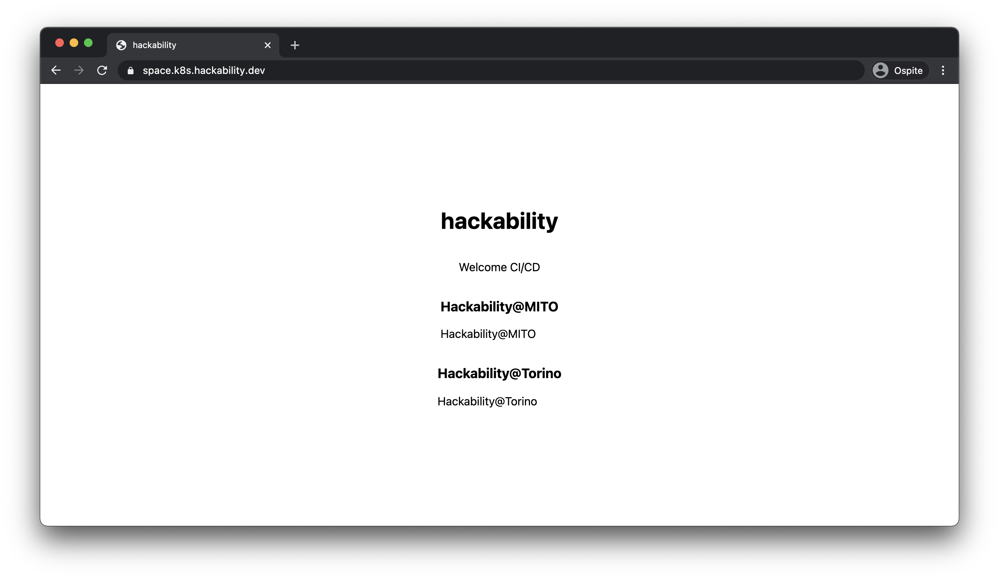

La CI/CD funziona alla grande grazie a FluxCD e Github Actions,
adesso ci possiamo lancaire nel mondo dello sviluppo vero e proprio
usando alcune tecnologie molto fighe:

- [React](https://it.reactjs.org/)
- [Next](https://nextjs.org/docs/api-routes/introduction)

## Cosa abbiamo fatto!

Siamo partiti con l'idea di fare principalmente React e ci siamo lanciati sul mondo
Graphql e backend iniziado ad implementare la struttura del db e creando un semplice
set di api Graphql.

- aggiunto un po' di modelli prisma per il database.
- creato delle API Graphql tramite [apollo server micro](https://www.apollographql.com/docs/apollo-server/v1/servers/micro/)
- reso l'index page di next generato staticamente grazie all'uso delle API
- iniziato ad integrare [graphql code generator](https://graphql-code-generator.com/) per avere i file delle api tipizzati

