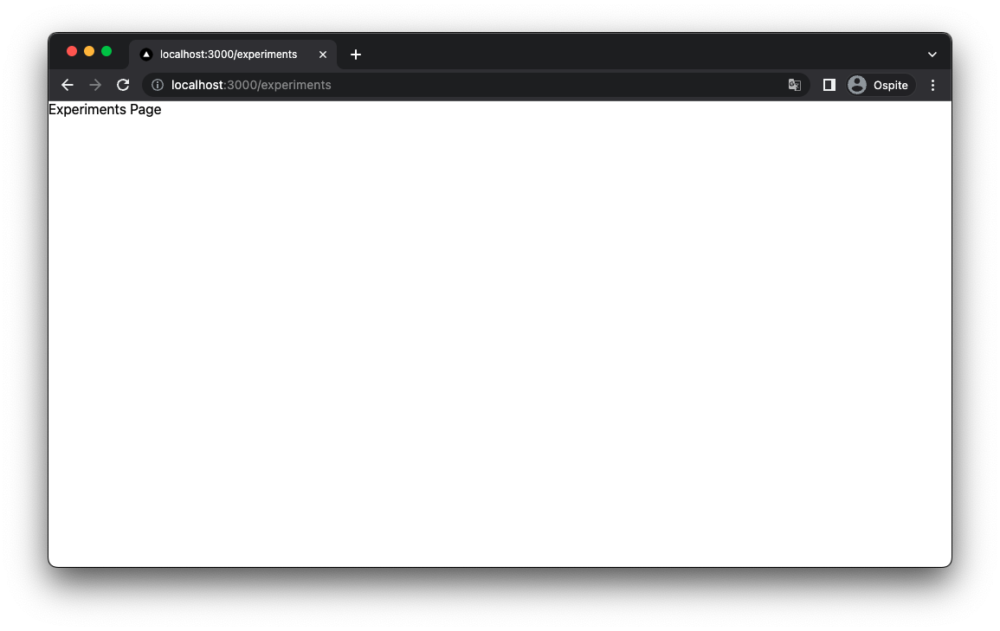
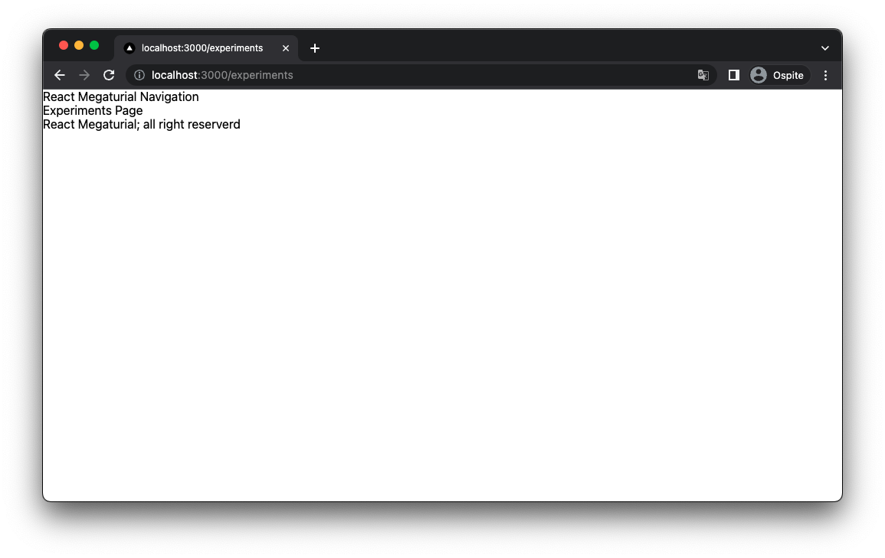
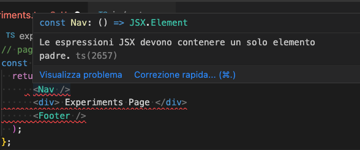
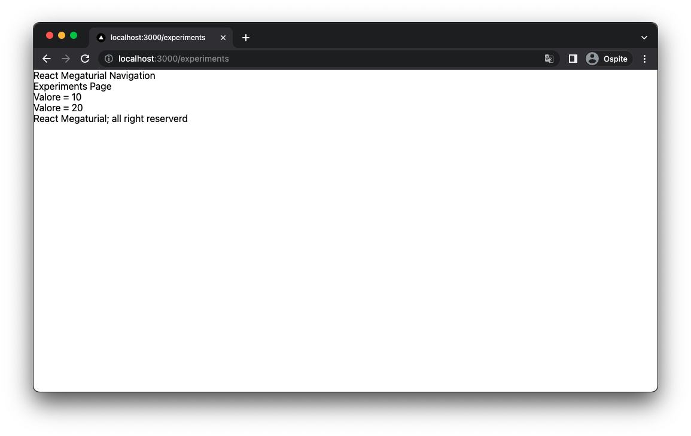
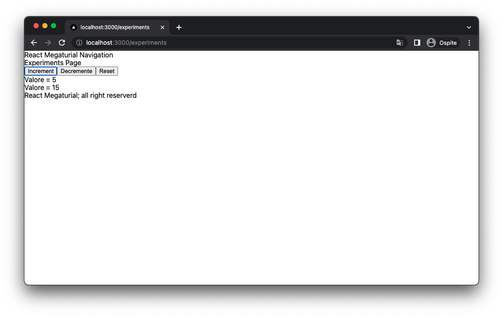
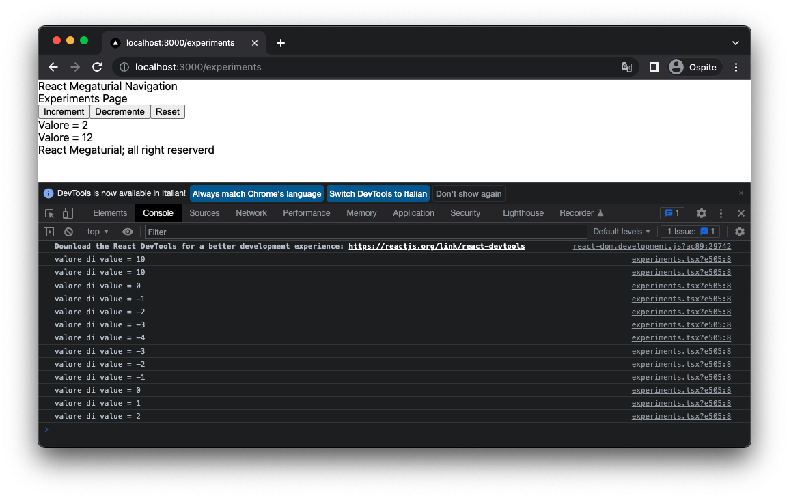
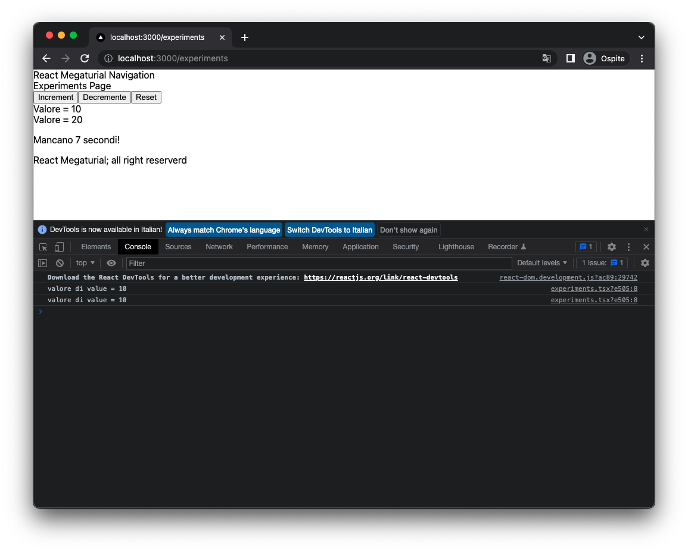
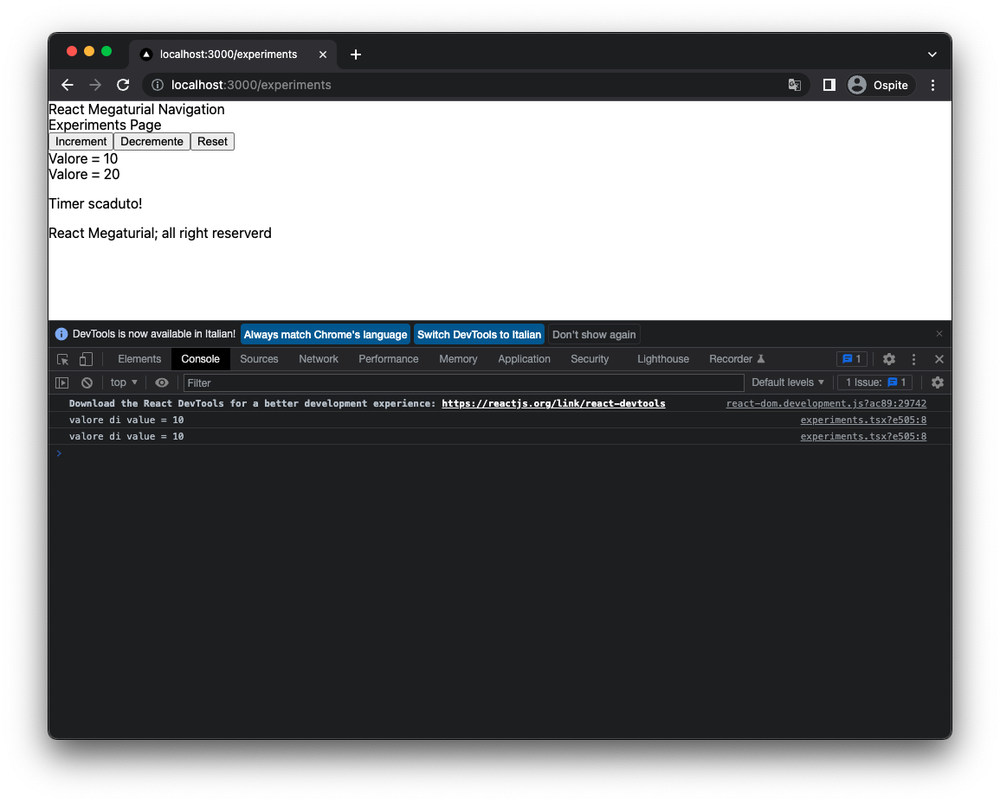
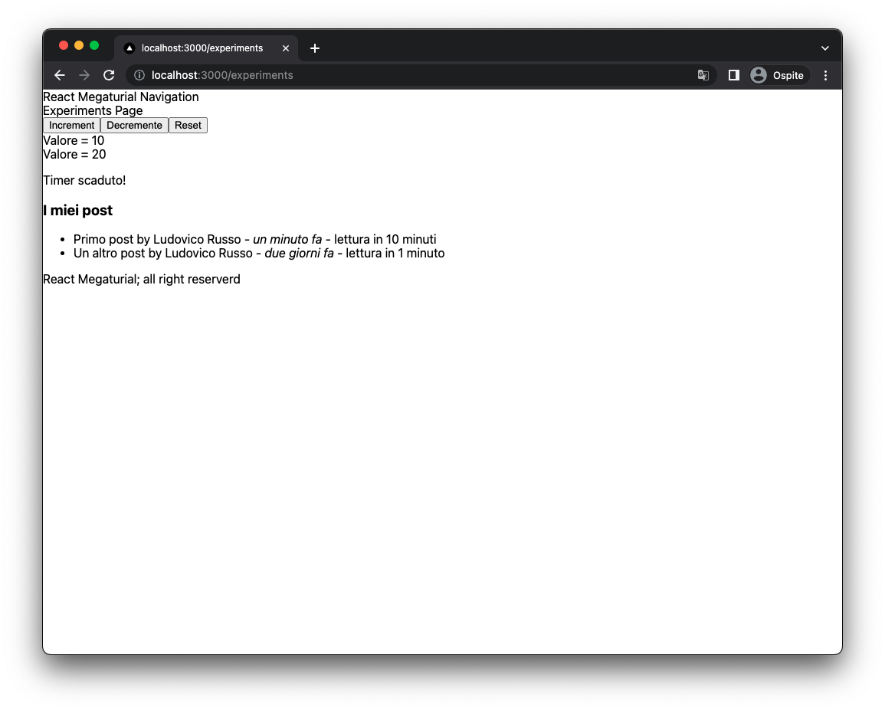

Il cuore di ogni progetto NextJS è React, ed il cuore di ogni progetto React sono i _React Components_.
Per capire meglio come muoverci all'interno dello sviluppo di un sito NextJS (o comunque di un'app React in generale)
dobbiamo sapere come funzionano e come possiamo usare i _React Compoents_. Questo capito è dedicato
a questo.

L'idea di _React_ è semplice. Invece di scrivere il nostro codice HTML interamente come un unico documento, possiamo
dividerlo in semplici componenti (i component appunto) che possono poi essere composti per
creare la nostra applicazione finale. In generale un component in React è una parte di UI (con le sue interazioni)
che può essere creato a partire da altri componenti (creati da noi o componenti HTML base come `<div>` e `<p>`).

React permette di definire un component in due modi. Utilizzando un **Class Component** (che modella il component)
come una classe, o utilizzando un **Fuctional Component**, che lo modella come una funzione.

I Class Component sono il modo originale che React usava per modellare i componenti. Attualmente il loro utilizzo è molto
limitato in quanto **Fuctional Component** sono molto più semplici da implementare ed utilizzare. In questa serie
useremo solamente i functional component.

Per definire un component, quindi, basta creare una funzione che ritorna del codice `HTML` o meglio `jsx`, come in questo caso:

```tsx
const MyComponent = () => {
  return <h1> Ciao </h1>;
};
```

Possiamo poi usare il nostro component da qualche altra parte in questo modo

```tsx
<MyComponent />
```

Possiamo chiamare un componente come vogliamo, ma React di mette un vincolo: deve iniziare con una lettera maiscuola.

I component possono ricevere in ingresso un oggetto, chiamato `Props`, che contiene delle variabili
che possono essere usate per renderizzare il componente stesso, ad esempio in questo modo:

```tsx
interface MyComponentProps {
  name: string;
}

const MyComponent = ({ name }: MyComponentProps) => {
  return <h1> Ciao, {name}! </h1>;
};

<MyComponent name="Ludovico" />;
// Render: <h1> Ciao, Ludovico! </h1>
```

In questo caso abbiamo usato una interfaccia `typescript`, che è il modo in typescript per definire
il tipo di un oggetto. Facendo così il compilatore ci informerà, anche in fase di rendering, che
dobbiamo passare come props al component la variabile `name` che è di tipo stringa.

La definizione precedente può essere abbreviata come segue:

```tsx
const MyComponent = ({ name }: { name: string }) => {
  return <h1> Ciao, {name}! </h1>;
};

<MyComponent name="Ludovico" />;
// Render: <h1> Ciao, Ludovico! </h1>
```

Ma per componenti con tante proprietà consiglio di usare il formato più esplicito, in quanto più semplice da leggere.

In react, i componenti possono avere una proprietà particolare chiamata children, che deve essere di tipo `ReactElement`.
All'interno della props `children` troveremo il contenuto `jsx` passato come figlio al componente in fase di utilizzo, come
in questo esempio.

```tsx
interface MyComponentProps {
  name: string;
  children: ReactElement;
}

const MyComponent = ({ name, children }: MyComponentProps) => {
  return (
    <div>
      <h1> Ciao, {name}! </h1>
      <div> {children} </div>
    </div>
  );
};

<MyComponent name="Ludovico">
  <h2> Sono un componente figlio </h2>
</MyComponent>;
// Render:
// <div>
//   <h1> Ciao, Ludovico! </h1>
//   <div> <h2> Sono un componente figlio </h2> </div>
// </div>
```

## Iniziamo ad usare i components

Per capire il funzionamento dei componenti e cosa possiamo farne, riprendiamo il nostro progetto
Next ed iniziamo a svilupparne subito qualcuno.

Per iniziare a lavorare, possiamo creare una nuova pagina bianca su cui fare un po' di esperimenti.
Iniamo quindi con un file vuoto chiamato `experiments.tsx` all'interno della cartella `pages/`.

Creiamo un componente da cui partire all'interno di questa pagina, ed esportiamolo con `export default`
in modo che NextJS sappia cosa renderizzare.

```tsx
// pages/experiments.tsx
const ExperimentsPage = () => {
  return <div> Experiments Page </div>;
};

export default ExperimentsPage;
```

> Potete dare al componente principale qualsiano nome preferite. In generale, il mio consiglio è usare il nome della pagina seguto da `Page`.

Lanciamo il server con il comando `npm run build` come visto nel capitolo precedente, e apriamo il browser sulla pagina
`http://localhost:3000/experiments`:

```bash
npm run dev

> my-first-site@0.1.0 dev
> next dev

ready - started server on 0.0.0.0:3000, url: http://localhost:3000
wait  - compiling...
event - compiled client and server successfully in 906 ms (125 modules)
```

Dovremmo ottenere questo:



Complimenti, avete implementato il vostro primo componente e la vostra prima pagina NextJS.

### Usare il live rendering di Next in modalità Dev!

NextJS (ma in generale React e tutti i progetti Web moderni), mettono a disposizione un live server in
modalità dev che ascolta le modifiche nei file e automaticamente aggiorna la pagina nel browser che stiamo
visualizzando.

Lasciando il server acceso, infatti, se provate a cambiare qualcosa all'interno della pagina vi accorgerete che
il browser automaticamente si rifresha per visualizzare le vostre modifiche. Una cosa molto comoda per avere
un feedback loop veloce quando sviluppiamo.

### Implementiamo ed usiamo un component React all'intenrno della pagina

Proviamo a sviluppare ed usare un componente. Ogni sito che si rispetti, solitamente,
ha un Nav e un Footer che vengono mostrati in ogni pagina, indipendentemente dal contenuto.
È una buona occasione ed opportunità sfruttare react per astrarre questi due oggetti in
due component per poi poterli riutilizzare facilmente.

Creiamo quindi all'interno dello stesso file (di solito si fa l'export default, i nostri component):

```tsx
const Nav = () => {
  return <nav>React Megaturial Navigation</nav>;
};

const Footer = () => {
  return <footer>React Megaturial; all right reserverd</footer>;
};
```

Che possono essere usati all'interno della pagina principale:

```tsx
// pages/experiments.tsx
const ExperimentsPage = () => {
  return (
    <>
      <Nav />
      <div> Experiments Page </div>
      <Footer />
    </>
  );
};
```

Che genera il seguente risultato:



Il sito è bruttino, lo so! Ma ci preoccuperemo in seguito di applicare un po' di stile CSS per renderlo accattivamente.
Per ora accountentiamoci di scrivere solo HTML.

### React Fragment

Avete notato una cosa strana nel codice? Abbiamo wrappato la nostro pagina principale all'interno di
un tag HTML vuoto `<></>`, che non è codice HTML valido.

Questo oggetto viene chiamato **React Fragment**, e semplicemente non viene renderizzato all'interno del nostro DOM.
L'uso del fragment è un semplice escamotage dovuto al fatto che, in React e JSX, non possiamo ritornare una lista
di tag HTML da un componente. In altre parole, una sintassi come la seguente:

```tsx
// pages/experiments.tsx
const ExperimentsPage = () => {
  return (
    <Nav />
    <div> Experiments Page </div>
    <Footer />
  );
};
```

semplicemente non è presta in JSX.



In casi di questo tipo si usa il fragment per evitare questo errore.

### Interazioni e stato di un componente con `useState`

Fin qui tutto bene, ma i componenti che abbiamo realizzato sono molto semplici e basilari. Come facciamo
a gestire un cambiamento di stato all'interno di un componente? In altre parole, come facciamo
a far si che il contenuto di un componente (e quindi la sua renderizzazione) cambia a comando?

Per fare questo possiamo utilizzare una serie di strumenti che React ci mette a disposizione
chiamata **Hooks**, che appunto ci servono per gestire lo stato del component e in generale il suo comportamento
durante il rendering. Ci sono tanti hooks che React ci mette a disposizione, quello che useremo adesso è uno dei più
comuni, e si chiama `useState`.

Quello che vogliamo fare è aggiungere un bottone nel componente principale che ci permette di incrementare
una variabile, ed usare un secondo componente per visualizzare questo valore.

Pariamo dal componente figlio: questo deve avere una props `num:number` e visualizzare a video il valore di num:

```tsx
const Visualizer = ({ num }: { num: number }) => {
  return <span>Valore = {num}</span>;
};
```

Che può essere usato in questo modo nel componente principale:

```tsx
const ExperimentsPage = () => {
  const value = 10;

  return (
    <>
      <Nav />
      <div> Experiments Page </div>
      <div>
        <Visualizer num={value} />
      </div>
      <div>
        <Visualizer num={value + 10} />
      </div>
      <Footer />
    </>
  );
};
```

Come potete vedere, stiamo renderizzando il componente in due modi, il primo passandogli il valore originale e
il secondo passandogli un nuovo valore ottenuto sommando a quello originale 10.



Quello che vogliamo fare però è rendere il nostro progetto dinamico. Per prima cosa,
dobbiamo definire la nostra variabile `value` come stato interno al componente, usando la funzione `useState()`:

```tsx
+ import { useState } from "react";

const ExperimentsPage = () => {
-  const value = 10;
+  const [value] = useState(10);

  return (
    <>
      <Nav />
      <div> Experiments Page </div>
      <div>
        <Visualizer num={value} />
      </div>
      <div>
        <Visualizer num={value + 10} />
      </div>
      <Footer />
    </>
  );
};
```

Questa modifica non cambierà nulla nella nostra parte grafica, ma informerà il componente che `value` è
uno stato e il suo valore può cambiare nel tempo.

La riga che abbiamo modificato:

```tsx
const [value] = useState(10);
```

funziona in questo modo: React inizializza il nostro stato al valore che passiamo alla funzione, in questo caso
10, e ritorna una tupla (cioè una specie di array i cui elementi sono di tipi diversi) di due elementi.

Il primo elemento è la variabile che contiene il valore dello stato, e fin qui nulla di strano. Il secnodo elemento, invece,
è una funzione che ci permette di settare un nuovo valore al nostro stato. Per estrapolare questa funzione
dobbiamo usare questo:

```tsx
const [value, setValue] = useState(10);
```

> Notare che stiamo usando l'unpacking degli array per prendere i valori che ci interessano.

`setValue` è una funzione particolare, in quanto oltre a cambiare il valore di `value` forza anche il
componente ad effettuare un rerendering. In questo modo sia il componente stesso che tutti i sottocomponenti
che usano il nostro stato nelle props verranno rirenderizzati, e vedremo a video dei cambiamenti.

`setValue` può essere usato in due modi. La prima è chiarla passando il nuovo valore che vogliamo dare al
nostro stato, ad esempio:

```jsx
setValue(20);
```

Il secondo modo è passare una funzione che, preso lo stato attuale come parametro, restituisce il nuovo stato,
ad esempio, se vogliamo incrementare il valore, possiamo fare così:

```jsx
setValue((s) => s + 1);
```

Da notare che, avendo accesso alla variabile `value`, potremmo fare lo stessa cosa in questo modo:

```jsx
setValue(value + 1);
```

Sebbena questa sintassi funzioni ed sia molto usata rispetto a quella funzionale, il team di React la sconsiglia
in quanto può portare a strani comportamenti in caso di chiamate contemporanee. In generale, preferisco usare quella
funzionale, sebbene ogni tanto mi "scappi" usare quest'ultima versione.

Per usare `setValue` dobbiamo pensare a quelche tipo di interazione con il componente. E la cosa più semplice è
metterci dei bottoni:

```jsx
<div>
  <button onClick={() => setValue((s) => s + 1)}>Increment</button>
  <button onClick={() => setValue((s) => s - 1)}>Decremente</button>
  <button onClick={() => setValue(0)}>Reset</button>
</div>
```

Che ci permetteranno di incrementare, decrementare e resettare il valore di `value`:



Abbiamo introdotto in questo esempio anche l'utilizzo del tag `<button>` in React. Questo oggetto JSX
prevede una props chiamata `onClick` che ci permette, appunto, di eseguire una funzione nel momento
in cui il bottone viene chiamato.

Se volete approfondire l'utilizzodo di `useState` potete dare un'occhiata alla [documentazione ufficiale](https://it.reactjs.org/docs/hooks-state.html).

### Eseguire codice dopo un rendering del component con `useEffect`

Abbiamo visto il funzionamento di `useState` e di come può essere utile per controllare il rerendering del
nostro componente react. Un altro hook molto usato ed importante è l'hook `useEffect`, che ci permette
di eseguire del codice dopo che il componente viene renderizzato, e di controllare in quali situazioni eseguire
questo codice.

Ad esempio, se volessimo stampare sulla console del browser il valore di `value` ogni volta che questo cambia,
possiamo aggiungere il seguente codice al nostro progetto:

```diff
- import { useState } from "react";
+ import { useEffect, useState } from "react";

const ExperimentsPage = () => {
  const [value, setValue] = useState(10);

+  useEffect(() => {
+    console.log(`valore di value = ${value}`)
+  }, [value]);

...
};
```

Dopo questa modifica, se proviamo ad aprire la console del browser (click destro dentro l'html e poi scegliamo "ispeziona", quindi
spostiamoci sul tab **console**), vedrete che ad ogni rerender la funzione passata a useEffect viene eseguita.



La sintassi di `useEffect` è un po' particolare, vediamo nel dettaglio come funziona. In particolare useEffect prende
due parametri, il primo è la funzione da eseguire, mentre il secondo è una tupla di _dipendeze_, che dice
allo `useEffect` quando eseguire la funzione. Ad esempio, in questo caso gli abbiamo passato `[value]` come
dipendenza, e quindi la funzione verrà eseguita solo nel momento in cui il valore di `value` cambia.

Possiamo creare `useEffect` che vengono esegiuti al primo rendering del componente passando `[]` come dipendenze.

Se volete approfondire l'utilizzodo di `useEffect` potete dare un'occhiata alla [documentazione ufficiale](https://it.reactjs.org/docs/hooks-effect.html).

### Creiamo un conto alla rovescia

Abbiamo tutti i componenti, adesso, per iniziare a fare qualcosa di leggermente più complesso: possiamo
sfruttare insieme lo `useState` e lo `useEffect` per creare un componente che si occupa di effettuare
un classico conto alla rovescia. Facciamolo insieme e poi vediamo di usarlo all'interno della nostra pagina.

```tsx
const Timer = () => {
  const [cnt, setCnt] = useState(10);

  useEffect(() => {
    if (cnt > 0) {
      setTimeout(() => {
        setCnt((s) => s - 1);
      }, 1000);
    }
  }, [cnt]);

  if (cnt > 0) {
    return <p>Mancano {cnt} secondi!</p>;
  }
  return <p>Timer scaduto!</p>;
};
```

Andiamo a vedere cosa abbiamo fatto.

Per prima cosa abbiamo creato una stato `cnt` inizializzato a 10. Questo conterrà il valore del nostro timer.

```jsx
const [cnt, setCnt] = useState(10);
```

A questo punto, usiamo `useEffect` insieme ad una funzione nativa del browser chiamata `setTimeout`, che ci permette
di eseguire una funzione, in questo caso quella che si occupa di decrementare lo stato `cnt`, dopo un certo intervallo
di tempo (in questo caso 1000 milli secondi, cioè 1 secondo).

```tsx
useEffect(() => {
  if (cnt > 0) {
    setTimeout(() => setCnt((s) => s - 1), 1000);
  }
}, [cnt]);
```

`setTimeout` viene chiamata solo se `cnt > 0`, altrimenti lo useEffect non fa nulla e il time si ferma.

Cerchiamo di capire cosa succede:

1. Al primo rendering, abbiamo `cnt = 10`. Lo `useEffect` imposta il timeout in modo che, dopo un secondo, la funzione
   `() => setCnt((s) => s - 1)` viene chiamata e setCnt modifica lo stato a `9`.
2. Quando lo stato passa a 9, `useEffect` viene di nuovo triggerato, e prepara il setTimeout a decrementare nuovamente
   `cnt`. Questo processo viene ripetuto fino a che `cnt` non assume valore `0`.
3. Quando `cnt` diventa zero, lo `useEffect` non farà nulla e il timer si fermerà.

Per finire, usiamo uno `if` statement per renderizzare cose diverse in base al valore di `cnt`:

```tsx
if (cnt > 0) {
  return <p>Mancano {cnt} secondi!</p>;
}
return <p>Timer scaduto!</p>;
```

Possiamo inserire il nostro `Timer` all'interno della pagina principale per vederlo funzionare:

```tsx
<div>
  <Timer />
</div>
```

E dovreste ottenere un risultato simile a questo:




## Componenti React Riutilizzabili

Fin qui abbiamo visto come possiamo utilizzare i componenti React per gestire diverse parti
della nostra applicazione che si ripetono (come nel caso di `Nav` e `Footer`), e come
usarli per avere un'applicazione in grado di interagire con l'utente (vedi `Timer`).

Un'altro uso molto comune dei component React è quello di creare parti dell'applicazione
che si ripetono, visualizzando dati diversi.

Un blog ad esempio, che ha bisogno di una lista di post da visualizzare, può facilmente
essere modellato in React tramite un component `PostPreview` che prende in
ingresso i metadati del post (titolo, autore, etc.). Una volta ottenuti i dati (tramite chiamata API al backend)
o in un altro modo (vedremo in seguito come), possiamo semplicemente, tramite un ciclo for, generare una
lista di `PostPreview` da renderizzare a partire dalla lista di post che abbiamo.

Andaimo ad implementare questa funzionalità con un compoent.

Per prima cosa abbiamo bisogno del modello (tipi di dati) che ci servono e che verranno passati al componente.
Dato che il nostro componente si chiama `PostPreview`, definiamo un'interfaccia `PostPreviewProps`

```tsx
interface PostPreviewProps {
  title: string;
  published: string;
  author: string;
  readTime: number;
}
```

A questo punto possiamo creare un component che renderizza queste informazioni:

```tsx
const PostPreview = (post: PostPreviewProps) => {
  let timeMin = 'minuti';
  if (post.readTime === 1) {
    timeMin = 'minuto'
  }
  return <span>{post.title} by {post.author} - <emph>{post.timestamp}</emtp> - lettura in {post.readTime} {timeMin}</span>;
};
```

Il nostro componente è finito. Sarà molto semplice (al solito) ma già implementa un po' di logica che ci permette di cambiare
leggermente il suo comportamento in base al contenuto `post.readTime`. In questo modo possiamo scrivere, in modo corretto,

- lettura in 10 minuti
- lettura in 1 minuto

Per utilizzarlo ci servono però una lista di post. Dato che non abbiamo ancora visto come prenderli (e da dove), usiamo dei dati
finti per il momento. Definiamo, all'interno del componente pagina, un array di post in questo modo:

```tsx
const posts: PostPreviewProps[] = [
  {
    title: "Primo post",
    timestamp: "un minuto fa",
    author: "Ludovico Russo",
    readTime: 10,
  },
  {
    title: "Un altro post",
    timestamp: "due giorni fa",
    author: "Ludovico Russo",
    readTime: 1,
  },
];
```

A questo punto, possiamo usare la funzione `posts.map()` (ve la ricordate, l'abbiamo già incontrotata), per
creare una lista di componenti `PostPreview` a partire dalla nostra lista di post:

```tsx
<div>
  <h3>I miei post</h3>
  <ul>
    {posts.map((post, idx) => (
      <li key={idx}>
        <PostPreview {...post} />
      </li>
    ))}
  </ul>
</div>
```

Cerchiamo di capire cosa abbiamo fatto:

```tsx
<ul>
  {posts.map((post, idx) => (
    <li key={idx}>
      <PostPreview {...post} />
    </li>
  ))}
</ul>
```

`<ul>` e `<li>` sono i tag html per creare delle liste. Abbiamo quindi creato una _unordered list_ `<ul>`
contenente un tag `<li>` per ogni post.

```tsx
posts.map((post, idx) => (
  <li key={idx}>
    <PostPreview {...post} />
  </li>
));
```

`posts.map()` ci permette di ciclare all'interno dei nostri `posts` e di ritornare un array di elementi JSX, ognuno contentente un tag `<li>`
con all'interno l'oggetto `PostPreview`. Notare che passiamo al tag `<li>` la prop `key={idx}`. Questa sintassi è necessaria a React
per distinguere tra diversi componenti uguali quando vengono definiti dentro un array. In generale, per non incorrere in bug nel rendering,
ogni volta che abbiamo un `.map()` che ritorna un componente JSX dobbiamo passare una key all'elemento padre che ritorniamo. Il contenuto della key non
è importante, ma deve essere univoco. Possiamo passargli la posizioen dell'oggetto nell'array (come in questo caso),
oppure un altro valore univoco (ad esempio avremmo potuto passare il `post.title`).
Normalmente, per dati che arrivano da un database e che contengono un identificativo univoco, solitamete si passa questo identificativo come key (lo vedremo sicuramente in seguito).

Per finire, renderizzaimo il nostro componente passandogli il post specifico:

```tsx
<PostPreview {...post} />
```

Da notare la sintassi `{...post}`, che non è altro che lo spread operator. Adremmo potuto anche scriverlo in forma non compatta in questo modo:

```tsx
<PostPreview
  title={post.title}
  timestamp={post.timestamp}
  author={post.author}
  readTime={post.readTime}
/>
```

Ed ecco il risultato:



## Organizzare i componenti in differenti file

Per il momento abbiamo scritto del codice molto disordinato, inserendo tutte le definizioni di componenti all'interno dello stesso file.
Spesso è una cosa utile e veloce da fare, ma in caso di componenti da usare in più punti (e diverse pagine) della nostra applicazione
dobbiamo pensare ad un modo per strutturare il progetto in modo più organizzato.

Il modo suggerito da NextJS, nonchè quello che io seguo principalmente, è quello di creare una cartella `components/` dentro il
quale definire un file per ognuno di questi componenti. Alcune programmatori sono molto seri nell'applicare questo principio, mentre io
proferisco essere più pigro e spostare i componenti all'interno di questa cartella solo quando so che mi serviranno in più di una pagina.

In generale, cerchiamo di tenere all'interno di questa cartella un componente per ogni file che definiamo.

Quindi, come possiamo migliorare l'organizzazione del codice? Per il momento siamo sicuri solo che i nostri componenti `Nav` e `Footer`
saranno usati più o meno da tutte le parti della nostra applicazione, quindi possiamo spostarli in file separati, rispettivamente in
`components/nav.tsx` e `components/footer.tsx`.

```tsx
// components/nav.tsx
export const Nav = () => {
  return <nav>React Megaturial Navigation</nav>;
};
```

```tsx
// components/footer.tsx
export const Footer = () => {
  return <footer>React Megaturial; all right reserverd</footer>;
};
```

A questo punto, ricordiamo di importarli nella nostra pagina per poterli utilizzare:

```diff
// pages/experiments.tsx
import { useEffect, useState } from "react";
+ import { Footer } from "../components/footer";
+ import { Nav } from "../components/nav";

// ...
```

## Cosa abbiamo imparato?

- Cosa sono i Componet React e come possono essere utilizzati;
- Come scomporre l'applicazione in diversi componenti indipendenti;
- Come usare manipolare lo stato dentro un componente tramite gli Hook `useState` e `useEffect`;
- Come usare le props di un componente per renderizzare dati diversi;
- Come organizzare i componenti riutilizzabili in file diversi;

Il codice di questo capitolo lo [trovate su github](https://github.com/ludusrusso/next-js-megatutorial/tree/c2).
