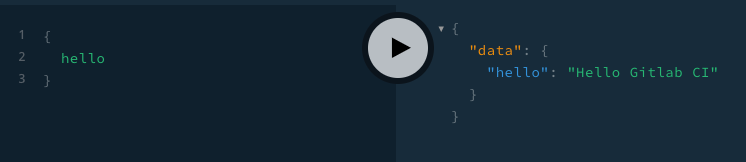
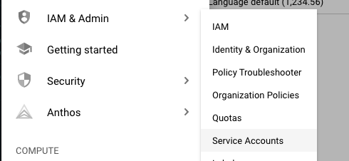
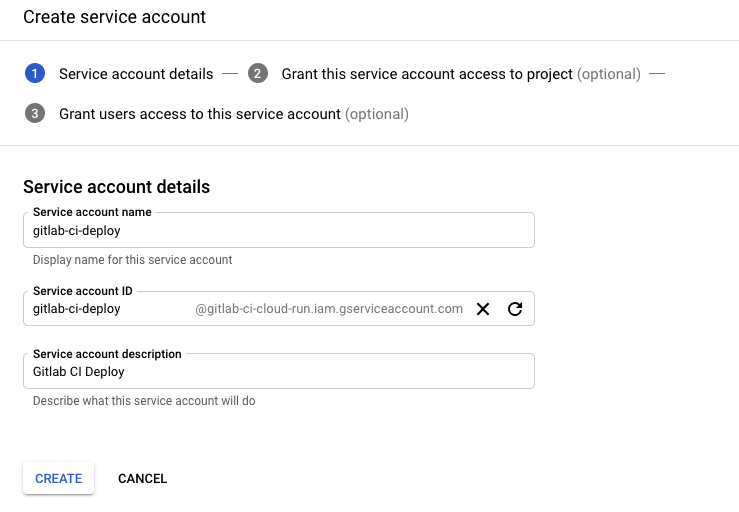
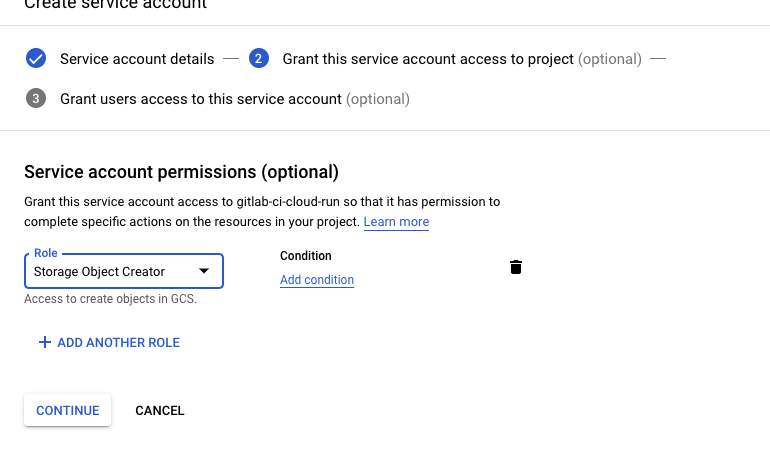
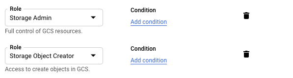
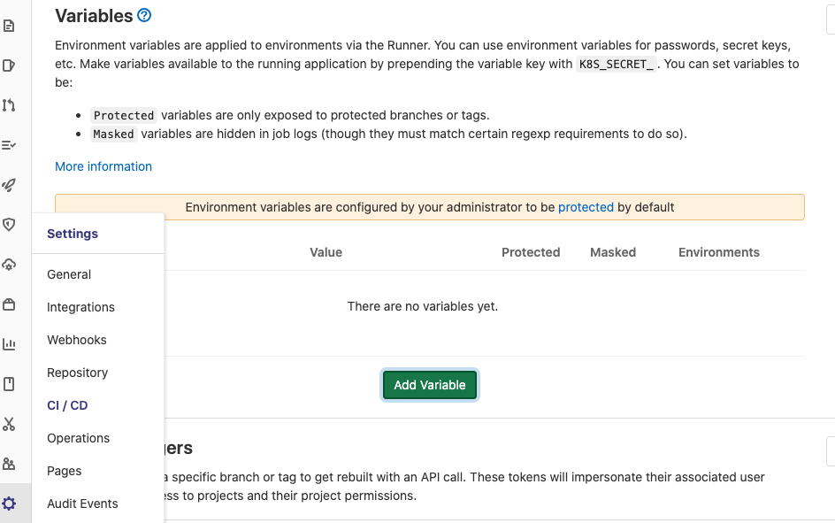
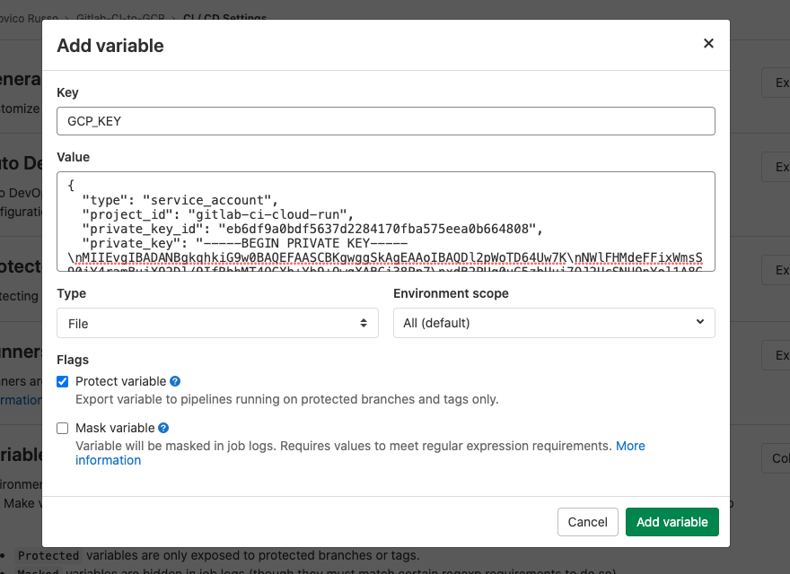
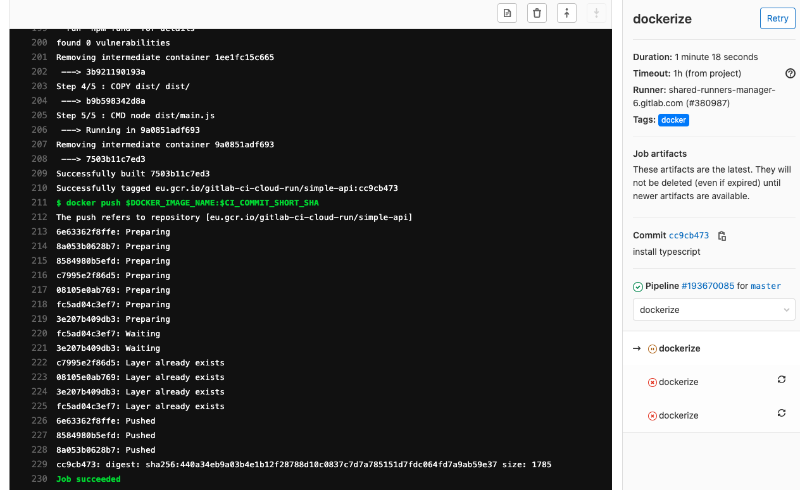
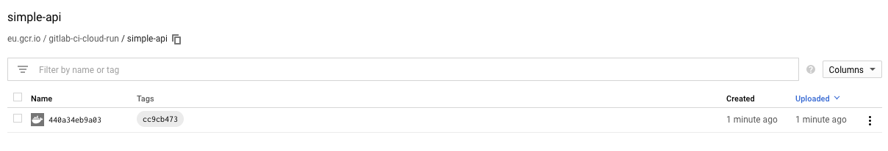

I love using **Gitlab CI** for my CI/CD operations, it provides a very
good integration with Kubernetes (expecially on big vendor k8s solution like Google GKE and AWS EKS),

Recently I stated working on [**GCP Cloud Run**](https://cloud.google.com/run) and I need to
directly deploy my docker images built with Gitlab CI on Google Container Registry (gcr),
since Cloud Run is able to pull images only from gcr.

In this blog post, we will see how to deploy a Docker image from Gitlab CI to GCR.

# A simple project to start

Build docker image with GitLab CI is easy, but, first of all,
we need a project on Gitlab CI and where to deploy your project.

For this tutorial, I've create a simple node project that exposes an `Hello World` graphql API
available [download here](https://gitlab.com/ludusrusso/gitlab-ci-to-gcr).

The server is implemented in typescript and consist in a simple file `src/main.ts`:

```typescript
import express from "express"
import { ApolloServer, gql } from "apollo-server-express"

const typeDefs = gql`
  type Query {
    hello: String!
  }
`

const resolvers = {
  Query: {
    hello: () => "Hello Gitlab CI",
  },
}

const server = new ApolloServer({ typeDefs, resolvers })

const app = express()
server.applyMiddleware({ app, path: "/graphql" })

app.listen({ port: 4000 }, () =>
  console.log(`🚀 Server ready at http://localhost:4000${server.graphqlPath}`)
)
```

To test locally, we can run it with `npm run start`, and open the browser on the url you
get on the console.

You should then be able to run a graphql query like this

```graphql
{
  hello
}
```

that will responde with

```json
{
  "data": {
    "hello": "Hello Gitlab CI"
  }
}
```



We can build the server with

```bash
$ npm run build
```

This will create a `dist/` folder with the compiled code inside.

# Dockerize the app

Dockerize this app is really simple, just create a `Dockerfile`
in the root of the project and add the following code

```Dockerfile
FROM node:12-alpine

COPY package*.json /
RUN npm install --production
COPY dist/ dist/

CMD node dist/main.js
```

> Note: I prefer to build the app separatelly from the dockerizing phase. But this is a my personal preference. You can also build the app direcly in docker!

We can now build the container with

```bash
$ docker build -t gitlab-ci-to-grc .
```

And run it with

```bash
$ docker run -p 4000:4000 -t gitlab-ci-to-grc .
```

# Create the Gitlab CI pipeline

We can now create a Gitlab CI pipeline that will build the code, create
the docker container and deploy it to GCR.

To do so, we need to create a file named `.gitlab-ci.yml` that contains the instructions
to run your CI/CD pipeline.

The gitlab CI will have two stages, the first (`build`) will run the `npm run build`
command to build the app, while the second `dockerize` will build the docker container
and deploy it to Google GCR.

```yml
stages:
  - build
  - dockerize
```

## Build stage

The build stage is simple, just start from a node docker image (I'll use `FROM node:12-alpine`) and run
execute the install and build command inside.

We need to add `node_modules/` forlder to gitlab cache (so packages are not reinstalled every time the stage runs).
We need to add the `dist/` folder to artifacts so it is available to next steps!

```yml
build:
  stage: build
  image: node:12
  script:
    - npm install
    - npm run build
  cache:
    key: ${CI_COMMIT_REF_SLUG}
    paths:
      - node_modules/
  artifacts:
    paths:
      - dist/
    expire_in: 30 day
```

## Dockerize stage

Also dockerize is simple, we need to run a container with docker installed.

We use the `docker:stable` image and we need to run it
with the `docker:dind` service (the _Docker in Docker_ (**DiD**) service provided by gitlab ci).

We also need to add `docker` to the `tags` section in order to force the stage to
run on a gitlab runner where **DiD** is available.

Then, we need to specify two environment varibles `DOCKER_HOST` and `DOCKER_DRIVER`
to allow docker client inside the container to connect to the **DiD** service.

Finally, we need to create a `DOCKER_IMAGE_NAME` variable to host the docker image name.

```yaml
dockerize:
  stage: dockerize
  image: docker:stable
  tags:
    - docker
  services:
    - docker:dind
  variables:
    DOCKER_HOST: tcp://docker:2375/
    DOCKER_DRIVER: overlay2
    DOCKER_IMAGE_NAME: docker-image
  script:
    - docker build --tag $DOCKER_IMAGE_NAME:$CI_COMMIT_SHORT_SHA .
    - docker push $DOCKER_IMAGE_NAME:$CI_COMMIT_SHORT_SHA
```

This, of course, is half of the story!

## Connect to GCP

The image will be build, but the `docker push` won't work,
since we need to connect and login with docker to a GCP project!

To do so, in our GPC project where we want to deploy the docker images,
we need to create a service account with `Google Storage Admin` role in order
to enable it to deploy to gcr, then, we need to docker login in the
dockerize stage with this new service account.

### Create a GPC Service Account with permission to push on gcr

We need to access the [GPC Console](https://console.cloud.google.com/) and select
the project we want to deploy the container, in my case `gitlab-ci-cloud-run`.

Select **IAM & Admin > Service Account** and the click on **create service account**.



We need to give a name and a description to the service!



The we need to add the role **Storage Object Creator** and **Storage Admin** to our service account
in order to enable it to deploy on Container Registry.




Finally, we can complete the procedure. Then, we need to click on
the new Service Account and create a JSON Key! This will download
a JSON file. This file will be used to login
with docker on GitLab CI!

### Deploy the Service Account Key on GitLab CI

Now, we need to deploy the service account key on Gitlab CI,
in order to use it on the deploy job. To do so, we have to save it
as file environment variable on Gitlab!

We access our repository page on Gitlab CI and the go to **Setting > CI/CD** and open
the **Variables** panel!



Then, click on **Add Variable** and create a new variable named
`GCP_KEY` and paste the content of the **json file** download from
the previous step in the value field. Then, se the variable type to **file**
and save!



Now we can use the key file in our gitlab CI stage!

### Login with docker on GCR and push the image on GCR

To login with docker, we can run the following command as a **prebuild script**:

```yaml
before_script:
  - cat $GCP_KEY | docker login -u _json_key --password-stdin https://eu.gcr.io
  - docker info
```

This will login docker on the `eu.gcr.io` repository with our service account!

> Note: google provide different regions on the GCP, like **us.gcr.io** or **eu.gcr.io**

Then, we need to tell to Docker to deploy the image on the repository
of GCR of our project. To do so, we need to tag the image with a name like this:

```
<repository hostname>/<project id>/<image name>
```

In my case:

- **repository hostname**: `eu.gcr.io`
- **project id**: `gitlab-ci-cloud-run`
- **image name** : `simple-api`

So, I'll set the `DOCKER_IMAGE_NAME` to `eu.gcr.io/gitlab-ci-cloud-run/simple-api`

```yaml
dockerize:
  stage: dockerize
  image: docker:stable
  tags:
    - docker
  services:
    - docker:dind
  variables:
    DOCKER_HOST: tcp://docker:2375/
    DOCKER_DRIVER: overlay2
    DOCKER_IMAGE_NAME: eu.gcr.io/gitlab-ci-cloud-run/simple-api
  before_script:
    - cat $GCP_KEY | docker login -u _json_key --password-stdin https://eu.gcr.io
    - docker info
  script:
    - docker build --tag $DOCKER_IMAGE_NAME:$CI_COMMIT_SHORT_SHA .
    - docker push $DOCKER_IMAGE_NAME:$CI_COMMIT_SHORT_SHA
```

# Run the pipeline

The pipeline is complete, the complete `.gitlab-ci.yml` file is

```yaml
stages:
  - build
  - dockerize

build:
  stage: build
  image: node:12
  script:
    - npm install
    - npm run build
  cache:
    key: ${CI_COMMIT_REF_SLUG}
    paths:
      - node_modules/
  artifacts:
    paths:
      - dist/
    expire_in: 30 days

dockerize:
  stage: dockerize
  image: docker:stable
  tags:
    - docker
  services:
    - docker:dind
  variables:
    DOCKER_HOST: tcp://docker:2375/
    DOCKER_DRIVER: overlay2
    DOCKER_IMAGE_NAME: eu.gcr.io/gitlab-ci-cloud-run/simple-api
  before_script:
    - cat $GCP_KEY | docker login -u _json_key --password-stdin https://eu.gcr.io
    - docker info
  script:
    - docker build --tag $DOCKER_IMAGE_NAME:$CI_COMMIT_SHORT_SHA .
    - docker push $DOCKER_IMAGE_NAME:$CI_COMMIT_SHORT_SHA
```

Once deployed on gitlab, it will trigger a Pipeline on Gitlab CI!




That, once completed, will create a new Docker image on your GCR repository!



# Conclusion

Deploy a Docker Image from Gitlab CI to GCR requires a bit of effort
in configuration but is quite simple to do! But why do we need it?

Gitlab CI Docker registry is great and free, but if you want to use **Cloud Run**
fully managed by Google you need to have your container images on GCR.

This is the first part of a two part blog post, in the next part, we will
add to our pipeline a third stage to deploy the image on Cloud Run!
