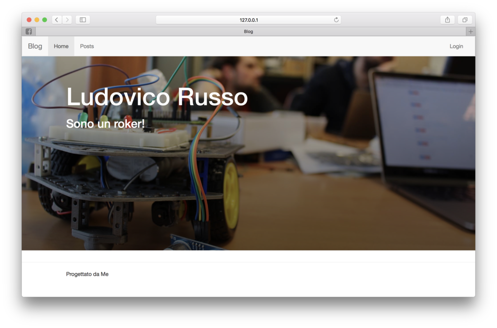

### Un Blog in Python e Flask

Ciao a tutti, mi chiamo Ludovico e sono un **maker** e un **imprenditore**. Sotto consiglio (molto assillante) di [Michele Maffucci](http://www.maffucci.it), ho deciso di aprire questo blog in cui racconterò quello che faccio e dei miei vari progetti.

Io sono cocciuto, e ho una gran voglia di sperimentare nuove tecnologie e imparare nuove cose. Per questo motivo, quando mi hanno convinto a scrivere un blog, ho preso la parola "scrivere" forse troppo alla lettera, e da buon programmatore me lo sono implementato quasi da zero! Sono un amante di Python, e questo sito, completamente sviluppato da me, è stato scritto in Python con una libreria chiamata **Flask**.
Vorrei utilizzare questo sito per condividere le cose che imparo, per questo motivo ho iniziato a scrivere dei tutorial su Flask e Python, che trovate al link sotto!

<http://www.ludusrusso.cc/tutorial/python/flask/intro.html>
