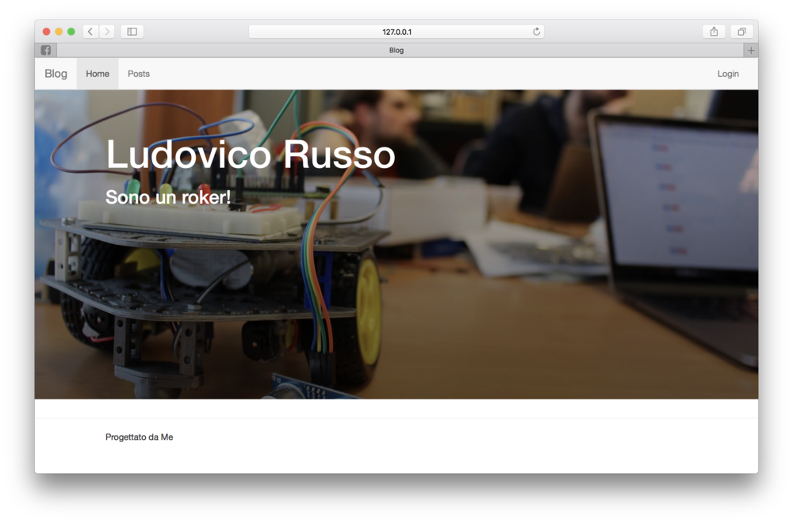

Prendendo spunta da [Miguel Grinberg](https://blog.miguelgrinberg.com), noto esperto di Flask da cui ho appreso molte delle cose che conosco di questo microframework, ho deciso di seguire, passo passo, in questo tutorial l'implementazione del sito che ho reallizato.

Quindi, questa guida seguirà, passo passo, i vari step che e le varie migliorie che implementerò sul mio stesso blog.

# 1. Setup ambiente di sviluppo

Per prima cosa, iniziamo a creare un [virtualenv](/2017/11/06/virtualenv/) (io lo chiamerò `ludoblog`) e installiamoci all'interno `flask`.

```bash
$ virtualenv ludoblog
$ cd ludoblog
$ source bin/activate
(ludoblog)$ pip install flask
(ludoblog)$ mkdir project && cd project
```

## Organizziamo il progetto

Per progetti grandi e per tenere il codice organizzato, conviene organizzare in modo organico il progetto all'interno di cartelle. Organizzerò il progetto seguendo delle [linee guida che si trovano su internet](http://flask.pocoo.org/docs/0.12/patterns/packages/).

La cartella `/project` sarà la cartella principale della nostra applicazione. Assicuriamoci di essere all'interno di questa cartella prima di iniziare a lavorare.

## Creiamo il modulo blog

Creiamo una cartella `blog` che conterrà la nostra applicazione, il file `blog/__init__.py` che sarà il core dell'applicazione.

```bash
(ludoblog)$ mkdir blog
(ludoblog)$ touch blog/__init__.py
```

Nota Bene: un file `__init__.py` in python assume un significato specifico: fa si che un progetto all'interno di una cartella sia considera un **modulo** python. Quindi ad ora in poi possiamo importare il modulo blog normalmente con la stringa `import blog`.

Aprimamo il file `blog/__init__.py` e andiamo ad implementare il seguente codice.

```python
from flask import Flask

def create_app():
    app = Flask(__name__)
    return app
```

## Creiamo il blueprint main

Flask permette di organizzare un'applicazione in sottoapplicazioni chiamate `blueprint`. I blueprint permettono di organizzare in modo organico la nostra app. Ad esempio, se un'applicazione contiene al proprio interno sia un blog che un forum, possiamo scorporarla in due `blueprint` per gestire, rispettivamente, il blog e il forum.

Personalmente, a me piace organizzare anche il core principale dell'applicazione (index, gestione errori, ecc.) all'interno di un blueprint chiamato `main`, che è quello che andremo a fare adesso. In questo modo, quando andremo a creare nuove applicazioni, possiamo fare un bel copia-incolla della cartella _main_ e avremo già pronto tutte le varie parti di gestione.

Dobbiamo quindi creare una cartella `main` organizzata come segue all'interno della cartella `blog`.

```
main/
├── __init__.py
├── errors.py
└── views.py
```

#### File \_\_init\_\_.py

Qui dentro inseriremo il codice generale del nostro modulo. Principalmente quello che farà questo file in ogni modulo blueprint deve essere:

- Inizializzare il Blueprint
- importare il file `views.py`

Implementiamo quindi il seguente codice centro il file

```python
from flask import Blueprint

main = Blueprint('main', __name__)

from . import views, errors
```

A che serve importare i file `views` e `errors` alla fine del file? In questo modo, qualsiasi file importerà il modulo `main`, importerà automaticamente anche tutti i moduli importati dal file `__init__.py`, e quindi, in questo caso, anche questi file.

#### File views.py

Questo file conterrà tutte le `views` che il nostro modulo esporterà. Per il modomento, accontentiamoci semplicemente di creare una view che risponde all'url `/` con semplice linea di testo.

Implementiamo il seguente codice nel file

```python
from . import main

@main.route('/')
def index():
    return '<h1>Benvenuti nel mio blog</h1>'
```

Si noti che, invece che usare direttamente l'oggetto `app`, utilizziamo l'oggetto blueprint `main` per generare il route dell'url.

#### File errors.py

Questo file è simile al file views, ma ha lo scopo di gestire le views da rilasciare nel momento in cui si verificano degli errori all'interno dell'applicazione.

Gli errori che andremo a gestire sono tre:

- `error 403 (permesso negato)`, che si verifica quando l'utente accede ad un percorso a cui non ha i permessi di accedere.
- `error 404 (file non trovato)`, che si verifica quando l'utente accede ad un percorso che non esiste.
- `error 500 (errore interno al server)`, che viene generato automaticamente quando si verifica un problema nel server.

In flask, possiamo settare delle views personalizzate in base al problema che si verifica. Per il momento, come su, accontentiamoci di ritornare semplicemente una linea di testo. Implementiamo il seguente codice nel file.

```python
from flask import render_template
from . import main

@main.app_errorhandler(403)
def forbidden(e):
    return 'errore 403 - Accesso Negato', 403

@main.app_errorhandler(404)
def page_not_found(e):
    return 'errore 404 - File non trovato', 404

@main.app_errorhandler(500)
def internal_server_error(e):
    return 'errore 500 - Errore interno al server', 500
```

### Colleghiamo il Blueprint all'applicazione principale

Il nostro modulo `main` è in una forma base per essere utilizzata. Apriamo il file `ludoblog/__init__.py` e aggiungiamo il seguente codice prima della riga `return app`.

```python
# ...
def create_app():
	# ...
	from .main import main as main_bp
	app.register_blueprint(main_bp)
	# ...
```

Con queste due linee di codice abbiamo registrato alla nostra applicazione il blueprint `main` appena creato.

## Utilizziamo flask-script per gestire l'applicazione

A questo punto, l'applicazione ha il minimo indispensabile per poter essere lanciata e funzionare. Per porterlo fare, però, abbiamo bisogno di creare fisicamente l'app (ricordiamo che abbiamo creato un metodo `create_app()` ma non un vero e proprio oggetto app. Per poter fare questo, basterebbe un semplice script con le seguenti linee di codice

```python
from blog import create_app
app = create_app()
app.run()
```

Tuttavia, cerchiamo di fare le cose per bene ed utiliziamo un'estensione di flask chiamata flask-script. Questa estensione fornisce un utilissimo set di script shell per gestire la nostra applicazioni, che permettono di lanciare l'app in varie modalità e gestire il database. Quest'estensione sarà utilissima in seguito quando l'app diventerà più grande, quindi è importante integrarla subito all'interno del nostro progetto.

Prima di tutto, installiamo flask-script come segue

```bash
(ludoblog)$ pip install flask-script
```

Ritorniamo nella cartella principale `/project` e creiamo un file `manage.py`. Implementiamo all'interno del file il seguente codice

```python
#!/usr/bin/env python

from blog import create_app
from flask_script import Manager

app = create_app()
manager = Manager(app)

if __name__ == '__main__':
    manager.run()
```

A questo punto, possiamo lanciare l'applicazione con il seguente comando

```bash
(ludoblog)$ python manage.py runserver
```

In alternativa, possiamo rendere il file `manage.py` eseguibile, con il comando

```bash
(ludoblog)$ chmod +x manage.py
```

E, da questo momento, possiamo lanciare l'applicazione semplicemente con il comando

```bash
(ludoblog)$ ./manage.py runserver
```

Una volta lanciata l'app, accediamo, da browser, all'indirizzo `http://127.0.0.1:5000` e il server risponderà come nella seguente immagine.


Notate che il sito realizzato sarà accessibile solo dal computer su cui il server è in funzione. Se volete fare in modo che questo sia accessibile anche dall'esterno, usate l'opzione `-h 0.0.0.0`, come sotto:

```bash
(ludoblog)$ ./manage.py runserver -h 0.0.0.0
```

Note

Trovate tutto il codice sviluppato fino ad ora al seguente link <https://github.com/ludusrusso/ludoblog/tree/p1>

# 2. Diamo una veste grafica all'applicazione

In questo secondo punto, organizzeremo la veste grafica della nostra app per poi iniziare a svilupparla.

## Templating

Per gestire graficamente l'app, utilizzeremo **Bootstrap**. **Bootstrap** è uno dei più popolari framework per lo sviluppo di interfacce grafiche web. Le sue peculiarità sono elencate qui sotto:

- _responsive_: cioè il framework si adatta automaticamente alle dimensioni dello schermo.
- _mobile first_: cioè è pensato principalmente per dispositivi mobili, ma funziona benissimo anche su classici desktop.
- _open source_.

### Configurazione Flask-Boostrap

Flask-Bootstrap è un'estensione di flask che automaticamente ed in modo semplice importa bootstrap nella nostra applicazione e permette subito di usarlo. Andiamo quindi a crearlo e configurarlo.

Per installare il pacchetto, utilizziamo (come al solito) il seguente comando.

```bash
(ludoblog)$ pip install flask-bootstrap
```

Perfetto, a questo punto andiamo ad inizializzarlo nella nostra applicazione.
Apriamo il file `blog/__init__.py` ed aggiungiamo le seguenti linee di codice

```python
# ...
from flask_bootstrap import Bootstrap

bootstrap = Bootstrap()

def create_app():
    app = Flask(__name__)
    # ...
    bootstrap.init_app(app)
    # ...
    return app
```

Perfetto, a questo punto siamo pronti per iniziare a sviluppare la nostra interfaccia grafica.

### Creiamo un Template Base

La prima cosa da fare è creare un template che useremo come base per tutte le nostre pagine. Questo template, quindi, deve contenere gli elementi principali che si ripeteranno poi in ogni pagina della nostra webapp, come il navbar o il footer. Iniziamo a creare adesso un template base essenziale e poi andremo, piano piano, ad arricchirlo. La cosa bella è che, una volta creato un template base e ricordandoci di far derivare ogni altra pagina web da questo template (vedremo dopo come fare), ogni aggiunta e miglioria al template base apparirà anche nelle altre pagine.

Creiamo due cartella `templates/main` all'interno del blueprint `main` e un file `base.html` all'interno di questa cartella

```bash
(ludoblog)$ mkdir blog/main/templates
(ludoblog)$ mkdir blog/main/templates/main
(ludoblog)$ touch blog/main/templates/main/base.html
```

Adesso andiamo ad implementare il template base, apriamo il file appena creato e mettiamo dentro il seguente codice.

```html
 Blog 
<div class="container">
  <div class="row">
    <div class="col-lg-12"> </div>
  </div>
</div>

```

Perfetto, addesso siamo pronti ad usare il nostro template per costruire le view dell'applicazione!

### Pagina principale

Per prima cosa, abbiamo bisogno di informare il blueprint `main` su dove trovare i template che andremo ad utilizzare. Per fare questo, modifichiamo, nel file `blog/main/__init__.py` la linea di codice

```python
main = Blueprint('main', __name__)
```

con la seguente

```python
main = Blueprint('main', __name__, template_folder="templates")
```

In questo modo, informiamo il blueprint di cercare i template all'interno della cartella `blog/main/templates`.

Adesso possiamo creare un semplice template da visualizzare nell'index. Creiamo un nuovo file `blog/main/templates/main/index.html` e andiamo ad implementare il seguente codice html

```html
 
<div class="page-header">
  <h1>Benvenuti nel mio blog!</h1>
</div>

```

Perfetto! A questo punto non ci resta che richiamare il template nella view `index`. Modifichiamo il file `views.py`, ed in particolare la funzione `index()` come segue

```python
from . import main
from flask import render_template

@main.route('/')
def index():
    return render_template('main/index.html')
```

Lanciamo l'applicazione e accediamo alla webapp da browser.


### Pagine di errore

Creiamo adesso un template simile per gestire le pagine di errore. Quello devono fare queste pagine sarà semplicemente visualizzare il codice di errore e le informazioni all'interno di una veste grafica ben costruita.

Siccome le 3 pagine di errore dovranno essere graficamente identiche, a parte le stringhe da visualizzare, ho pensato di creare una pagina unica per renderizzarle e di utilizzare delle variabili per visualizzare stringhe diverse in base all'errore generato. In particolare, la pagina dovrà visualizzare con il tag `h1` il codice di errore e con il tag `h2` il messaggio di errore. Andiamo quindi a creare un secondo template `blog/main/templates/main/error.html` e inseriamo dentro il seguente codice html

```html
 
<div class="page-header">
  <h1>Errore {{ error_code }}</h1>
  <h2>{{ error_msg }}</h2>
</div>

```

Perfetto, a questo punto non dobbiamo fare altro che passare le due variabili `error_code` e `error_msg` al nostro template per generare pagine diverse.

Modifichiamo il file `blog/main/errors.py` come segue

```python
from flask import render_template
from . import main

@main.app_errorhandler(403)
def forbidden(e):
    return render_template('main/error.html', error_code=403, error_msg="Accesso negato!"), 403

@main.app_errorhandler(404)
def page_not_found(e):
    return render_template('main/error.html', error_code=404, error_msg="File non trovato!"), 404

@main.app_errorhandler(500)
def internal_server_error(e):
    return render_template('main/error.html', error_code=500, error_msg="Errore interno al server!"), 500
```

Testiamo la nostra app accedendo ad un URL non esistente, ad esempio `/error` e dovremmo veder generaro l'errore 404.

## NavBar e Footer

La barra di navigazione e il footer sono due parti importanti di un qualsiasi sito web, e quindi anche della nostra webapp. Entrambi riguardano tutte le views del blog, quindi le implementermo nel template base.

### NavBar

Per implementare la navbar, ci viene in aiuto la comoda estensione di flask chiama flask-nav. Essenzialmente, flask-nav permette di creare NavBar in modo dinamico ogni volta che una view viene generata, ed si integra con flask-bootstrap per la visualizzazione.

Iniziamo ad installare il pacchetto flask-nav

```bash
pip install flask-nav
```

A questo punto, possiamo iniziare ad impostare la nostra navbar. Per prima cosa, inizializziamo il modulo all'interno del file `blog/__init__.py`:

```python
# ...
from flask_nav import Nav
# ...
nav = Nav()

def create_app():
    # ...
    nav.init_app(app)
    # ...
    return app
```

Creiamo quindi un file chiamato `blog/navbar.py` e inseriamoci il seguente codice

```python
from . import nav
from flask_nav.elements import *

@nav.navigation()
def main_nav():
    navbar = Navbar('Blog')
    navbar.items.append(View('Home', 'main.index'))
    return navbar
```

Ricordiamoci di aggiugnere la stringa

```python
from .navbar import main_nav
```

Alla fine del file `blog/__init__.py`. In modo che il file `blog/navbar.py` venga importato correttamente.

La navbar che abbiamo realizzato è molto semplice, la complicheremo quando andremo ad arricchire il blog. L'ultimo passo però consiste nel renderizzarla. Apriamo il file `blog/main/templates/main/base.html` e aggiungiamo queste linee di codice per renderizzare la barra.

```html
 {{nav.main_nav.render()}} 
```

Perfetto, a questo punto possiamo lanciare l'applicazione che mostrerà la nostra navbar!


### Footer

Come per la navbar, il footer deve essere visualizzato in tutte le views della nostra applicazione. Per questo motivo, anche questo va inserito all'interno del templeta base. A differenza della navbar che deve essere dinamica, il footer deve contenere semplicemente informazioni generali di un sito, come il nome dell'autore, le finalità, link a social networks e alla privacy policy, ecc. Per il momento, di nuovo, lo renderò minimale, ma ognuno può customizzarlo come vuole.

Per aggiungere il footer, modifichiamo il file `blog/main/templates/main/base.html` come segue

```html
#...  #...

<footer>
  <hr />
  <div class="container">
    <div class="row">
      <div class="col-lg-12">Progettato da Me</div>
    </div>
  </div>
</footer>

```

E riavviamo l'applicazione.


> Trovate tutto il codice sviluppato fino ad ora al seguente link <https://github.com/ludusrusso/ludoblog/tree/p2>

# 3. Configurazione e Database

Una volta impostata graficamente la nostra applicazione, siamo pronti a costruire un database per la gestione di utenti e post del blog. Ma prima di tutto, è importante impostare un file di configurazione per organizzare bene la configurazione della nostra applicazione.

## File di configurazione

Lo scopo del file di configurazione è duplice:

- inserire in un unico file tutte le variabili di configurazione della nostra applicazione
- permettere di avere differenti set di configurazione in base a dove viene lanciata l'applicazione. Possiamo ad esempio avere un set di configurazione di **sviluppo** e un set di configurazione **produzione**, come faremo in seguto.

Creiamo un file `/config.py` e implementiamo il seguente codice

```python
import os
basedir = os.path.abspath(os.path.dirname(__file__))

class Config:

    SECRET_KEY = os.environ.get('SECRET_KEY') or 'stringa difficile da indovinare'

    @staticmethod
    def init_app(app):
        pass

class DevelopmentConfig(Config):
    DEBUG = True

class ProductionConfig(Config):
    DEBUG = False

config = {
    'development': DevelopmentConfig,
    'production': ProductionConfig,
    'default': DevelopmentConfig
}
```

Questo sarà lo scheletro della nostra applicazione, in particolare abbiamo un oggetto `Config` da cui faremo derivare i vari set di configurazioni della nostra applicazione. Per ora useremo solo l'oggetto `DevelopmentConfig` in cui inseriremo i set di configurazione per la macchina su cui svilupperemo il blog. In futuro, popoleremo il file anche con altri oggetti (ad esempio per il testing) e popoleremo l'oggetto `ProductionConfig`.

Il dizionario `config`, invece, serve semplicemente ad associare un oggetto di configurazione ad una specifica stringa.

### SECRET_KEY

Per il momento, l'unico parametro di configuraizone utilizzato è `SECRET_KEY`. Questa variabile è importante in quanto è usata da `Flask` e da molte estensioni per criptare dati. Quindi è molto importante che sia sicura e che non venga divulgata.

```python
SECRET_KEY = os.environ.get('SECRET_KEY') or 'stringa difficile da indovinare'
```

Per ragioni di sicurezza e per evitare di scrivere la chiave direttamente nel file, sfruttiamo le variabili d'ambiente. In questo modo, python controllerà se la variabile d'ambienete `SECRET_KEY` è stata settata ed utilizzerà il suo valore. Se non è stata settata, utilizzerò come default `'stringa difficile da indovinare'`. In fase di sviluppo non è importante settare questa variabile, ma sarà essenziale farlo in fase di produzione.

### Usiamo il file per configurare l'app

Una volta creato il file e gli oggietti di configurazione, dobbiamo usare queste informazioni nella funzione `create_app`. Per farlo, modofichiamo il file `blog/__init__.py` come segue

```python
# ...
from config import config

#...

def create_app(config_name='default'):
    app = Flask(__name__)
    app.config.from_object(config[config_name])
    config[config_name].init_app(app)
	#...
#...
```

In questo modo, facciamo si che l'applicazione venga configurata in base alle varibabili contenute nell'oggetto di configurazione scelto.
Si noti che passiamo `'deafult'` come valore di default al parametro `config_name`. In quasto modo, se creiamo l'app senza passare esplicitamente il parametro, verrà automaticamente caricato il set di configurazione `DevelopmentConfig`.

## Configurazione del database con Flask-SQLAlchemy

A questo punto siamo pronti a configurare il nostro database. Per gestirlo, utilizzeremo due importantissime estensioni di Flask:

- **Flask-SQLAlchemy**, molto utile per la gestione del db, in particolare semplifica l'accesso e la creazione di nuove entries del db.
- **Flask-Migrate**, in accoppiata con flask-script, consente di automatizzare l'evoluzione del database stesso.

Inoltre, utilizzeremo fin da subito un'utilissima estensione chiamata **Flask-Security**, che servirà per gestire l'accesso e l'autenticazione agli utenti del blog. Siccome questa estensione è fortemente legata alla struttura del db, la installaremo e utilizzeremo fin da subito.

Per installare questi pacchetti, utilizziamo come al solito il comando

```
(blog)$ pip install flask-sqlalchemy flask-security flask-migrate
```

#### Configurazione di SQLAlchemy

Per prima cosa, dobbiamo inizializzare e configurare flask-sqlalchemy. Per inizializzarlo, modificando il file `blog/__init__.py` come segue

```python
#...
from flask_sqlalchemy import SQLAlchemy
#...
db = SQLAlchemy()


def create_app(config_name='default'):
	#...
    db.init_app(app)
    #...
#...

```

Inoltre, dobbiamo aggiungere alcune variabili di configurazione nel nostro file `/config.py`.

Modifichiamo l'oggetto `Config` come segue:

```python
class Config:
    SECRET_KEY = os.environ.get('SECRET_KEY') or 'stringa difficile da indovinare'
    SQLALCHEMY_COMMIT_ON_TEARDOWN = True

    @staticmethod
    def init_app(app):
        pass
```

`SQLALCHEMY_COMMIT_ON_TEARDOWN` abilita commit automatici del database ogni volta che gli oggetti vengono creati e modificati senza che questo venga esplicitamente forzato nel codice. Lo inseriamo nell'oggetto `Config` in modo che sia abilitato in ogni altra configurazione che creeremo.

Modifichiamo l'oggetto `Config` come segue:

```python
class DevelopmentConfig(Config):
    DEBUG = True
    SQLALCHEMY_DATABASE_URI = os.environ.get('DEV_DATABASE_URL') or 'sqlite:///' + os.path.join(basedir, 'data-dev.sqlite')
```

In questo modo abilitiamo la creazione del database (sqlite) di development nel file `data-dev.sqlite` all'interno della cartella in cui l'applicazione è lanciata. Sfruttiamo la variabile di ambiente `DEV_DATABASE_URL` per cambiare il percordo del db di development senza modificare il file.

### Creiamo i models del nostro DB

I _models_ di un database sono degli oggetti che rappresentano una table all'interno del nostro database, per ora costruiremo i due _models_ richiesti da flask-security per funzionare, cioè il model **User** e il model **Role**.

Creiamo un file `blog/models.py` in cui andremo a implementare i vari models come segue

```python
from . import db
from flask_security import UserMixin, RoleMixin
from datetime import datetime

roles_users = db.Table('roles_users',
        db.Column('user_id', db.Integer(), db.ForeignKey('users.id')),
        db.Column('role_id', db.Integer(), db.ForeignKey('roles.id')))

class Role(db.Model, RoleMixin):
    __tablename__ = 'roles'
    id = db.Column(db.Integer(), primary_key=True)
    name = db.Column(db.String(80), unique=True)
    description = db.Column(db.String(255))

    def __repr__(self):
        return "<Role %r>"%self.name


class User(db.Model, UserMixin):
    __tablename__ = 'users'
    id = db.Column(db.Integer, primary_key=True)
    email = db.Column(db.String(255), unique=True, required=True)
    password = db.Column(db.String(255))
    active = db.Column(db.Boolean())
    confirmed_at = db.Column(db.DateTime())
    username = db.Column(db.String(255))
    about = db.Column(db.Text())
    roles = db.relationship('Role', secondary=roles_users, backref=db.backref('users', lazy='dynamic'))

    def __repr__(self):
        return "<User %r>"%self.email


```

In questo modo abbiamo creato due models (**User** e **Role**) che sono collegati tra loro da una relazione _Molto a Molti_ (`roles_users`).
In altre parole, ogni utente può avere dei ruoli, e viceversa, ogni ruolo può essere associato a più di un utente. Abbiamo inoltre aggiunto le colonne `username` e `about` che non sono richiesti da `flask-security` ma saranno importanti per lo sviluppo del blog. Utilizzando questi due modelli, flask-security permette di gestire gli accessi al sito e anche alle singole pagine del sito stesso.

> > Nota: Se stai usando Python 3, probabilmente otterrai un errore legato al campo `required=True`. Questo è dovuto al fatto che le API di SQLAlchemy sono state recentemente cambiate, e il campo `required` è stato sostituito con `nullable` (che funziona al contrario), perchè più in linea con il linguaggio sql. In questo caso, basta sostituire `required=True` con `nullable=False` per risolvere l'errore. Ringrazione l'utente **Sonak** per avermi segnalato il problema!

### Configuriamo Flask-Security

Una volta creati models essenziali, possiamo inizializzare flask-security in modo da poter gestire in modo semplice l'accesso alla nostra applicazione. Per fare questo, modifichiamo il file `blog/__init__.py` come segue:

```python
#...

from flask_security import Security, SQLAlchemyUserDatastore
#...
security = Security()
#...

def create_app(config_name='default'):
    #...
    from .models import User, Role
    user_datastore = SQLAlchemyUserDatastore(db, User, Role)
    security.init_app(app, user_datastore)
    #...
```

In questo modo, abbiamo informato flask-security di utilizzare i due modelli per gestire la sicurezza del nostro blog.

### Inizializzazione del DB

Per poter utilizzare correttamente il blog con flask-security, è importante che esista almeno un utente attivo nel momento in cui viene lanciata l'applicazione. Per questo motivo, è essenziale automatizzare la nostra applicazione in modo da riempire il DB in fase di configurazione. Per fare questo, creeremo delle funzioni `static` all'interno dei due modelli che permettono di automatizzare il processo di inizializzazione dei ruoli e degli utenti.

In particolare, inizializzeremo il DB con due ruoli, `admin`, `publisher` e `user`. Inoltre, creeremo un utente admin con mail e password salvate dentro due variabili di configurazione `BLOG_ADMIN_MAIL` e `BLOG_ADMIN_PASSWORD`.

Andiamo prima di tutto a settare le due variabili nel file `config.py` ed in particolare nell'oggetto `Config`. Come al solito, utilizzeremo le variabili di ambiente per sovrascrivere queste variabili senza necessariamente riverarle nel file.

```python
class Config:
    #...
    BLOG_ADMIN_MAIL = os.environ.get('BLOG_ADMIN_MAIL') or 'admin@admin.com'
    BLOG_ADMIN_PASSWORD = os.environ.get('BLOG_ADMIN_PASSWORD') or 'admin'
    #...
```

A questo punto, creiamo la funzione per generare i ruoli, inserendola nell'oggetto `Role` del file `blog/models.py`

```python
class Role(db.Model, RoleMixin):
    #...
    @staticmethod
    def insert_roles():
        for role_name in "admin publisher user".split():
            if Role.query.filter_by(name=role_name).first() is None:
                role = Role(name = role_name)
                db.session.add(role)
        db.session.commit()
```

La funzione `insert_roles` controlla che ognuno dei tre ruoli esista nel db utilizzato e nel caso lo inserisce.

Allo stesso modo, creiamo una funzione all'interno dell'oggetto `User` che crea l'utente amministratore.

```python
class User(db.Model, UserMixin):
    #...
    @staticmethod
    def insert_admin():
        from flask import current_app
        if User.query.filter_by(email=current_app.config['BLOG_ADMIN_MAIL']).first() is None:
            user = User(
                email=current_app.config['BLOG_ADMIN_MAIL'],
                password=current_app.config['BLOG_ADMIN_PASSWORD'],
                active=True)
            user.roles.append(Role.query.filter_by(name='admin').first())
            db.session.add(user)
            db.session.commit()
```

Notare che accediamo all'oggetto `current_app` che mette a disposizione flask per indicare l'oggetto applicazione.

## Gezione del Database con Flask-Migrate e Flask-Script

Abbiamo scritto tutto il necessario per creare ed inizializzare il nostro database. A questo punto non resta altro da fare che creare fisicamente il database ed iniziare ad utilizzarlo.

Per fare questo, dobbiamo utilizzare **flask-migrate** per generare i comandi per la gestione del database. Inoltre, creeremo un nostro comando personalizzato per il deploy nel database di ruoli e amministratore.

### Configurazione e Utilizzo di Flask-Migrate

Per utilizzare Flask-Migrate, accediamo al file `/manage.py` e modifichiamolo come segue

```
#!/usr/bin/env python

from blog import create_app, db
from flask_script import Manager
from flask_migrate import Migrate, MigrateCommand

#...

migrate = Migrate(app, db)
manager.add_command('db', MigrateCommand)

#...
```

A questo punto, siamo pronti per utilizzare flask-migrate.
Per prima cosa, dobbiamo inizializzare la cartella di gestione delle migrazioni. Questa cartella conterrà tutti gli scripts generati automaticamente da flask-migrate che tengono traccia dell'evoluzione nel tempo dei _models_ del db stesso.

Per farlo, utilizziamo il comando

```
(blog)$ ./manage.py db init
```

che restituirà un output simile al seguente se tutto va bene

```
  Creating directory /Users/ludus/develop/tutorials/ludoblog/project/migrations ... done
  Creating directory /Users/ludus/develop/tutorials/ludoblog/project/migrations/versions ... done
  Generating /Users/ludus/develop/tutorials/ludoblog/project/migrations/alembic.ini ... done
  Generating /Users/ludus/develop/tutorials/ludoblog/project/migrations/env.py ... done
  Generating /Users/ludus/develop/tutorials/ludoblog/project/migrations/env.pyc ... done
  Generating /Users/ludus/develop/tutorials/ludoblog/project/migrations/README ... done
  Generating /Users/ludus/develop/tutorials/ludoblog/project/migrations/script.py.mako ... done
  Please edit configuration/connection/logging settings in '/Users/ludus/develop/tutorials/ludoblog/project/migrations/alembic.ini' before proceeding.
```

A questo punto, vedrete apparire una nuova cartella chiamata `migrations/` nella cartella principale. Qui verranno contenuti tutti i file di migrazione che generemo.

Per crare un file di configurazione, utilizziamo il comando

```
(blog)$ ./manage.py db migrate -m "creazione User Role"
```

che genererà un output simile al seguente

```python
INFO  [alembic.runtime.migration] Context impl SQLiteImpl.
INFO  [alembic.runtime.migration] Will assume non-transactional DDL.
INFO  [alembic.autogenerate.compare] Detected added table 'roles'
INFO  [alembic.autogenerate.compare] Detected added table 'users'
INFO  [alembic.autogenerate.compare] Detected added table 'roles_users'
  Generating /Users/ludus/develop/tutorials/ludoblog/project/migrations/versions/fbdace17c6b3_creazione_user_role.py ... done
```

A questo punto, non ci resta che applicare la migrazione appena generata al database, usando il comando

```
(blog)$ ./manage.py db upgrade
```

Il cui output sarà

```
INFO  [alembic.runtime.migration] Context impl SQLiteImpl.
INFO  [alembic.runtime.migration] Will assume non-transactional DDL.
INFO  [alembic.runtime.migration] Running upgrade  -> fbdace17c6b3, creazione User Role
```

Perfetto, addesso abbiamo creato un database (che al momento sarà vuoto). Se tutto va bene dovrebbe essere apparso un file chiama `data-dev.sqlite` nella cartella principale dell'applicazione.

### Creazione di uno script di Deploy

Prima di procedere, dobbiamo creare uno script che inizializzi il database, in modo da iniziare a popolarlo. Facciamo anche in modo che questo script esegua il comando `upgrade` del database in modo da non doverlo chiamare ogni volta a mano.

Per farlo, modifichiamo nuovamente il file `manage.py` come segue

```python
#...
@manager.command
def deploy():
    """Run deployment tasks."""
    from flask_migrate import upgrade
    from blog.models import Role, User

    print 'INFO  [deploy command] migrate database to latest revision'
    upgrade()

    print 'INFO  [deploy command] create user roles'
    Role.insert_roles()

    print 'INFO  [deploy command] create admin user'
    User.insert_admin()
#...
```

E potremmo quindi utilizzare il comando appena definito come segue

```
(blog)$ ./manage.py deploy
```

Che rilascerà il seguente output

```
INFO  [deploy command] migrate database to latest revision
INFO  [alembic.runtime.migration] Context impl SQLiteImpl.
INFO  [alembic.runtime.migration] Will assume non-transactional DDL.
INFO  [deploy command] create user roles
INFO  [deploy command] create admin user
```

## Creazione di barre di navigazione dinamiche

A questo punto, il database è pronto ed inizializzato, solo che, al momento, non esistono GUI nella nostra applicazione per gestirlo e visualizzarlo.

La prima cosa (quella più semplice) per verificare se siamo loggati o no è aggiungere un nuovo elemento nella NavBar che appare solo se l'utente ha correttamente eseguito il login nell'applicazione.

Per seguire lo standard di un po' tutti i siti, dobbiamo inserire questo elemento sulla destra della navbar. Purtroppo, flask-nav non gestisce nativamente gli elementi allineati a destra, ed è un po' complicato aggiungerli. Per questo motivo per il momento lasciamo questo elemento allineato sulla dinistra, e scriverò un tutorial per correggere questo problema in seguito.

Andiamo quindi a modificare il file `blog/navbar.py` come segue

```python
from . import nav
from flask_nav.elements import *

from flask_security import current_user

@nav.navigation()
def main_nav():
    navbar = Navbar('Blog')
    navbar.items.append(View('Home', 'main.index'))
    if current_user.is_authenticated:
        usergrp = []
        usergrp.append(current_user.email)
        usergrp.append(View('Logout', 'security.logout'))
        navbar.items.append(Subgroup(*usergrp))
    return navbar
```

A questo punto possiamo testare l'applicazione. Lanciamola e accediamo al solito link `http://127.0.0.1:5000`. Noteremo subito che niente è cambiato dall'ultima volta che abbiamo effettuato l'accesso. Infatti la navbar viene modificato solo se l'utente ha effettuato il login.

Accediamo quidni all'URL `http://127.0.0.1:5000/login`. Questa è una view generata automaticamente da flask-security che permette di gestire il login. Inseriamo nome utente e password (ricordo che di default abbiamo messo `admin@admin.com` e `admin`)


E potremmo verificare che il login è stato correttamente effettuato


## Flask-SuperAdmin per la gestione del Database

Verificato che il database funziona, vediamo come possiamo utilizzare un'utilissima estensione, chiamata **Flask-SuperAdmin** per la creazione di pannelli di amministrazione.

Prima di tutto, installiamo l'estensione

```python
(blog)$ pip install flask-superadmin
```

È importante notare che Flask-SuperAdmin non è nativamente integrato con Flask-Security. Questo vuol dire che normalmente le view generate da questa estensione sono visibili a tutti, cosa che noi vogliamo certamente evitare.

L'integrazione di Flask-SuperAdmin con Flask-Security da me trovata al momento è un po' macchinosa.

Per prima cosa, è necessario creare un nuovo file, chiamato `blog/adminviews.py` e insere il seguente codice all'interno

```python
from flask_superadmin import AdminIndexView as _AdminIndexView
from flask_superadmin.model import ModelAdmin as _ModelAdmin
from flask_security import current_user
from flask import abort

class ModelAdmin(_ModelAdmin):
    def is_accessible(self):
        return current_user.has_role('admin'):

    def _handle_view(self, name, *args, **kwargs):
        if not self.is_accessible():
            abort(403)


class AdminIndexView(_AdminIndexView):
    @expose('/')
    def index(self):
        if not current_user.has_role('admin'):
            abort(403)
        return super(AdminIndexView, self).index()
```

In questo modo estendiamo gli oggetti che gestiscono normalmente le view di Admin e gli diciamo di lasciare passare solo gli utenti che hanno il ruolo di amministratore.

Adesso possiamo configurare il modulo. Apriamo il file `blog/__init__.py` e modifichiamolo come segue

```python
#...
from flask_superadmin import Admin
#...
from .adminviews import ModelAdmin, AdminIndexView
admin=Admin(index_view=AdminIndexView())

def create_app(config_name='default'):
    #...
    admin.init_app(app)
    #...

    from .models import User, Role
    #...
    admin.register(User, admin_class=ModelAdmin, session=db.session)
    admin.register(Role, admin_class=ModelAdmin, session=db.session)
    #...
#...
```

Come ultimo aggiustamente, facciamo in modo che, se l'utente attuale è anche un amministratore, appaia la view admin nella sua navbar, modificando il file `blog/navbar.py` come segue

```python
#...
@nav.navigation()
def main_nav():
    #...
    if current_user.is_authenticated:
        #...
        if current_user.has_role('admin'):
            usergrp.append(View('Admin', 'admin.index'))
        #...
    return navbar
```

A questo punto possiamo testare l'app.
Dopo aver fatto il login, vedremo apparire un nuovo tab nel tab navbar relativa al nostro account


Che rimanda al link di Amministrazione da cui possiamo modificare aggiungere ed eliminare elementi del database.


Si noti che se proviamo ad accedere al link o sottolink senza aver fatto correttamente il login `http://127.0.0.1:5000/admin` otterremo l'errore di accesso negato.


### GitHub parte 3

Trovate la repo aggiornata con tutto il lavoro svolto finora al [link](https://github.com/ludusrusso/ludoblog/tree/p3).

# 4. Creazione dei Post

Perfetto, la nostra app adesso ha un database, gestisce gli accessi ed ha una sua veste grafica (non completa, ma direi accettabile).
Siamo pronti, finalmente, per arrivare al nocciolo dell'applicazione: un sistema per la creazione di contenuti: i **Post**.

Cosa fare quindi? Andremo ad aggiungere una nuova **Table** al nostro bellissimo database che conterrà i Post della nostra applicazione. Inoltre, creeremo un semplice webform per la creazione e la modifica dei post! Come al solito, facciamo le cose per step: creiamo il minimo indispensabile per far funzionare il nostro blog, e poi andremo a complicarlo a piacere :D!

## Post nel database

Come dice il titolo stesso, andiamo a prendere il nostro database e creiamo una nuova Table chiamata **Post**. Per farlo, aggiungiamo il seguente oggetto al file `blog/models.py`

```python
class Post(db.Model):
    __tablename__ = 'posts'
    id = db.Column(db.Integer, primary_key=True)
    title = db.Column(db.String(255), unique=True)
    body = db.Column(db.Text)
    created_at = db.Column(db.DateTime, index=True, default=datetime.utcnow)
    last_edit = db.Column(db.DateTime, index=True, onupdate=datetime.utcnow)
```

Vediamo nel dettaglio la table creato:

- `id` è un numero che identifica univocamente ogni istanza dell'oggetto all'interno della Table **Post**.
- `title` è una stringa contenente il titolo del post.
- `body` contiene il testo del post.
- `created_at` e `last_edit` contengono invece (rispettivamente) la data di creazione e l'ultima data di modifica del post. Notare che l'unica cosa che cambia sono gli argomenti `default` e `onupdate`. Il primo informa di settare la variabile al valore ritornato dalla funzione nel momento in cui viene inserita per la prima volta nel database. Il secondo funziona allo stesso modo ma viene aggiornata ogni volta che la colonna è modificata nel database.

### User Post Relationship

Vogliamo che i post vengano associati all'account dell'utente che effettivamente li crea, per questo motivo è importante creare una _relationship_ uno a molti tra le Table **User** e **Post**. Per farlo, modifichiamo i due oggetti come segue:

```python

class User(db.Model, UserMixin):
    #...
    posts = db.relationship('Post', backref='author', lazy='dynamic')


class Post(db.Model):
	#...
	author_id = db.Column(db.Integer, db.ForeignKey('users.id'))
```

In questo modo, informiamo il sistema di creare un collegameto tra le due tabelle, in partcolare, ogni utente avrà a disposizione una lista post a di cui è autore, mentre ogni post avrà associato la colonna del proprio autore.

Ok, abbiamo una configurazione minima per poter utilizzare i post. Ricordiamoci ora di fare una migrazione del nostro database in modo da includere le modifiche effettuate. Per fare cioè, utilizziamo i comandi visti precedentemente.

```
(blog)$ ./manage.py db migrate -m "add posts"
(blog)$ ./manage.py db upgrade
```

## Rendering del post

Per visualizzare il post, dobbiamo creare una pagina html da renderizzare con le informazioni in esso contenuto e una pagina html per l'inserimento (tramite form) dei contenuti.

### Flask-Misaka e Flask-WTF

Per far si che l'utente possa scrivere testi con sintassi ricca in modo semplice e veloce, utilizzeremo il linguaggio di markup [markdown](https://it.wikipedia.org/wiki/Markdown) per renderizzare le pagine. Markdown è un semplicissimo linguaggio che utilizzo tantissimo nella mia produttività (anche questo testo è scritto in markdown).
Per far questo, abbiamo bisogno di un'estensione di flask chiamata _flask-misaka_, che include un engine di rendering markdown molto semplice da utilizzare.

Per creare il form, ci viene in aiuto un secondo pacchetto noto come`flask-wtf`, nato appunto per la creazione dei form in Flask.

Installiamo i due pacchetti con il comando `pip`

```
(blog)$ pip install flask-misaka flask-wtf
```

e includiamola nel file `blog/__init__.py`

```python
#...
from flask_misaka import Misaka
#...
markdown = Misaka()
#...

def create_app(config_name='default'):
    #...
    markdown.init_app(app)
    #...
#...
```

Si noti che **flask-wtf** è già incluso all'interno di altre librerie che utilizziamo, come flask-security e flask-admin, inoltre, esso non richiede una configurazione esplicita quando si costruisce l'applicazione.

### Form

Per creare il form, definiamolo prima di tutto creando un nuovo file `blog/main/forms.py` ed implementando il seguente codice

```python
from flask_wtf import FlaskForm
from wtforms import StringField, TextAreaField, SubmitField
from wtforms.validators import DataRequired

class EditBlogPostForm(FlaskForm):
    title = StringField('Titolo',validators=[DataRequired()])
    body = TextAreaField('Testo', validators=[DataRequired()])
    submit = SubmitField('Ok')
```

In questo modo, abbiamo definito un form contenente due aree di testo per il titolo e il testo del post, più un pulsante per sottomettere il tutto.

### View per creare e visualizzare i post.

Per creare la pagina CSS per la renderizzazione del post, andiamo ad implementare in un nuovo file html `blog/main/templates/main/post.html` il seguente codice

```html
 {{post.title}}  {{super()}}

<style media="screen">
  .post-body img {
    max-width: 100%;
  }
</style>
 

<div class="page-header">
  <h1>{{ post.title }}</h1>
  <p>
    Autore <span class="label label-primary">{{post.author}}</span> Data
    <span class="label label-info">{{post.created_at.date()}}</span>
  </p>
</div>

<div class="post-body">{{ post.body|markdown }}</div>

```

Si noti la linea di codice `{{ post.body|markdown }}` che appunto informa di renderizzare con sintassi markdown la stringa contenuta dentro `post.body`.
Si noti inoltre che aggiungo lo stile CSS `max-width: 100%;` per le immagini, in modo da evitare che immagini troppo grosse vengano renderizzate più grandi della pagina stessa, creando un effetto grafico molto fastidioso!

La pagina che mostrerà il Form per la creazione del post, invece, andrà implementata nel file `blog/main/templates/main/edit_post.html`. Ecco il codice da inserire.

```html
  Edit Post 
<div class="post-body">{{ wtf.quick_form(form) }}</div>

```

Fortunatamente, in questo caso, ci viene in contro flask-bootstrap che ha già a disposizione un sistema per renderizzare automaticamente il form.

Una volta realizzati i due html, siamo pronti ad implementare il codice python per renderizzare le view.

Apriamo il file `blog/main/view.py` e implementiamo le seguenti view per la visualizzazione e la creazione dei post!

```
from . import main
from flask import render_template, abort, redirect, url_for

from flask_security import current_user, roles_accepted
from ..models import Post
from .forms import EditBlogPostForm
from .. import db

# ...

@main.route('/posts/id/<int:id>')
def post(id):
    post = Post.query.get_or_404(id)
    return render_template('main/post.html', post=post)

@main.route('/posts/new', methods=['post', 'get'])
@roles_accepted('admin', 'publisher')
def get_post():
    form = EditBlogPostForm()
    if form.validate_on_submit():
        post = Post(title=form.title.data, \
                    body=form.body.data)
        post.author = current_user
        try:
            db.session.add(post)
            db.session.commit()
            return redirect(url_for('main.post', id=post.id))
        except:
            abort(500)
    return render_template('main/edit_post.html', form=form)
```

Spieghiamo brevemente le parti più importanti del codice:

- la stringa `post = Post.query.get_or_404(id)` permette di ritrovare nel database l'oggetto `Post` con il valore `id` specificato, e genera automaticamente l'errore `404` (non trovato) nel caso in cui l'oggetto non esista nel database. Attenzione però, `get_or_404` accetta solamente la primary key di una table!

- `form.validate_on_submit()` permette di capire se l'utente ha solo aperto la pagina (con una `get` request) o ha effettuato una `post` request sul form. Nel primo caso, la view deve semplicemente renderizzare la pagina, nel secondo caso, dobbiamo creare un nuovo oggetto `Post` nel database e riempirlo!

## Testiamo l'app

A questo punto, è tutto pronto per provare la nostra applicazione. Lanciamo l'app e colleghiamoci al solito url `http://127.0.0.1:5000`. Ricordiamoci di fare il login se non siamo ancora entrati, e a quel punto, accedendo all'url `http://127.0.0.1:5000/posts/new` e compiliamo il form che abbiamo creato.


Una volta premuto il tasto _Submit_, verremo rimandati all'url di visualizzazione del post creato, che si chiamerà `http://127.0.0.1:5000/posts/id/1`.


## Conclusioni

Finalmente la nostra applicazioni inizia a funzionare, adesso possiamo creare e visualizzare post, ed è ormai piccolo il lavoro da fare per raggiungere l'obiettivo. Nel prossimo tutorial ci occuperemo di rendere più semplice l'utilizzo della nostra applicazione, a partire dalla navbar fino alla visualizzazione e navigazione nei post!

Come al solito, trovate il codice implementato su Github, a [questo link](https://github.com/ludusrusso/ludoblog/tree/p4).

# 5. Navigazione

Il nostro blog inizia a prendere forma, al momento siamo in grado di
creare nuovi post e visualizzarli, ma ancora l'utente non è semplificato
nella navigazione del sito. Ed è quello che andremo a migliorare in questo
tutorial.

Di seguito quindi miglioreremo il nostro prototipo di barra di navigazione in modo da rendere migliore la navigazione del sito sia per i lettori che per gli utenti abilitati
come amministratore.

### NavBar: aggiungere elementi a destra

Sfortunatamente, l'estensione Flask-Nav che abbiamo usato in questo tutorial non permette di default di creare elementi sulla parte destra della barra di navigazione.
Per questo motivo, dovremmo andare ad implementare un nuovo elemento custom che fa questo lavoro per noi. Una volta implementato, potremmo visualizzare il menù
utente (o il pulsante login) sulla parte destra della navbar, cosa comune nella
maggior parte delle webapp!

#### Creazione di Renderer Custom

Per far questo, purtroppo bisogna addentrarci nel codice di Flask-Nav e Flask-Bootstrap,
e le cose si complicano un pochettino.

Non è questo il momento di discutere nel dettaglio delle scelte fatte, ma vorrei dare
almeno un'idea a grandi linee di cosa succede prima di vedere il codice. Flask-Nav definisce due
oggetti molto diversi tra loro: l'oggetto `NavBar` e l'oggetto `Renderer`. Il primo
descrive la struttura della navbar, mentre il secondo descrive il modo in cui questo
deve essere visualizzato all'interno della pagina web.

Il pacchetto Flask-Bootstrap definisce un oggetto `BootstrapRenderer`, che è l'oggetto
che si occupa di disegnare la navbar. Attualmente, `BootstrapRenderer` non prevede elementi a
destra. Ed è questo renderer che dobbiamo modificare per aggiungere questa funzione.

Per far questo, andremo a creare un nuovo renderer come discendente di `BootstrapRenderer`.
L'unica differenza tra il nostro oggetto e l'oggetto originale sarà nel fatto che il primo
controlla la presenza dell'attributo `right` di ogni elemento della navbar, e, se presente, aggiunge questo
elemento sulla destra invece che sulla sinistra.

Apriamo il file `blog/navbar.py` e aggiungiamo questo codice alla fine del file

```python
class RightRenderer(BootstrapRenderer):
    def visit_Navbar(self, node):
        node_id = self.id or sha1(str(id(node)).encode()).hexdigest()

        root = tags.nav() if self.html5 else tags.div(role='navigation')

        if hasattr(node, '_class'):
            root['class'] = node._class
        else:
            root['class'] = 'navbar navbar-default'

        cont = root.add(tags.div(_class='container-fluid'))

        header = cont.add(tags.div(_class='navbar-header'))
        btn = header.add(tags.button())
        btn['type'] = 'button'
        btn['class'] = 'navbar-toggle collapsed'
        btn['data-toggle'] = 'collapse'
        btn['data-target'] = '#' + node_id
        btn['aria-expanded'] = 'false'
        btn['aria-controls'] = 'navbar'

        btn.add(tags.span('Toggle navigation', _class='sr-only'))
        btn.add(tags.span(_class='icon-bar'))
        btn.add(tags.span(_class='icon-bar'))
        btn.add(tags.span(_class='icon-bar'))

        if node.title is not None:
            if hasattr(node.title, 'get_url'):
                header.add(tags.a(node.title.text, _class='navbar-brand',
                                  href=node.title.get_url()))
            elif hasattr(node.title, 'image'):
                header.add(tags.span(tags.img(_src=node.title.image, _class='brand-img'), _class='navbar-brand'))
            else:
                header.add(tags.span(node.title, _class='navbar-brand'))

        bar = cont.add(tags.div(
            _class='navbar-collapse collapse',
            id=node_id,
        ))
        bar_list = bar.add(tags.ul(_class='nav navbar-nav'))
        bar_list_right = bar.add(tags.ul(_class='nav navbar-nav navbar-right'))

        for item in node.items:
            if hasattr(item, 'right'):
                bar_list_right.add(self.visit(item))
            else:
                bar_list.add(self.visit(item))
        return root
```

Nonostante questo codice sembri molto complicato, la parte che ho veramente scritto io sono le ultime 8 righe (il resto deriva da `BootstrapRenderer` originale).

```python
        bar_list = bar.add(tags.ul(_class='nav navbar-nav'))
        bar_list_right = bar.add(tags.ul(_class='nav navbar-nav navbar-right'))

        for item in node.items:
            if hasattr(item, 'right'):
                bar_list_right.add(self.visit(item))
            else:
                bar_list.add(self.visit(item))
```

In particolare, il codice crea due oggetti chiamati `bar_list` e `bar_list_right`:

- `bar_list` è l'oggetto originale, gestisce la lista di elementi nella navbar ed ha classe css `nav navbar-nav`
- `bar_list_right` è una nuova lista contenente tutti gli oggetti che vanno posizionati a destra, ed infatti ha classe `nav navbar-nav navbar-right`.

Successivamente, all'interno del `for`, ogni elemento da posizionare viene inserito all'interno di una delle due liste. La discriminante è la presenza di un attributo `right` dell'elemento: non è importante il valore, se l'attributo è stato definito allora l'oggetto è posizionato a destra, altrimenti a sinistra.

Si noti che, per far funzionare questo elemento, dobbiamo aggiungere i seguenti import all'interno del file:

```python
from flask_bootstrap.nav import BootstrapRenderer

from hashlib import sha1
from dominate import tags
from visitor import Visitor
```

#### Utilizzo del Renderer

A questo punto, possiamo aggiornare la navbar come segue, settando l'attributo `grp.right = True` al `Subgroup` prima di aggiungerlo alla navbar.
Oltre a questo, nel codice sottostante ho aggiunto il pulsante `Login` nel caso l'utente noi sia attivo. Questo viene visualizzato comunque sulla destra.

```python
@nav.navigation()
def main_nav():
    navbar = Navbar('Blog')
    navbar.items.append(View('Home', 'main.index'))
    if current_user.is_authenticated:
        usergrp = []
        usergrp.append(current_user.email)
        if current_user.has_role('admin'):
            usergrp.append(View('Admin', 'admin.index'))
        usergrp.append(View('Logout', 'security.logout'))
        grp = Subgroup(*usergrp)
        grp.right = True
        navbar.items.append(grp)
     else:
        login_view = View('Login', 'security.login')
        login_view.right = True
        navbar.items.append(login_view)
    return navbar
```

#### Registrazione del Renderer

Per far funzionare il nostro nuovo renderer, dobbiamo registrarlo e informare `flask_nav` di utilizzare il renderer sviluppato da noi invece che quello di default.

La registrazione serve a Flask-Nav per sapere che il nuovo renderer è disponibile. Per farla, apriamo il file `blog/__init__.py` e importiamo la funzione `register_renderer` da `flask_nav`, modificando la riga `from flask_nav import Nav` come segue:

```python
from flask_nav import Nav, register_renderer
```

A questo punto, all'interno della funzione `create_app`, aggiungiamo le seguenti righe di codice (prima del `return`):

```python
def create_app():
	# ...
    from .navbar import main_nav, RightRenderer
    register_renderer(app, 'right_rendered', RightRenderer)
	# ...
```

#### Utilizzo del Renderer

Una volta registrato il renderer, non ci resta che utilizzarlo. Questo viene fatto nel momento in cui utilizziamo la navbar all'interno del file `blog/main/templates/main/base.html`, modificando la linea

```html
{{nav.main_nav.render()}}
```

in questa:

```html
{{nav.main_nav.render(renderer='right_rendered')}}
```

In questo modo, forziamo **flask-nav** a usare `right_rendered` (il nome del renderer registrato in precedenza) per generare la navbar.

A questo punto, lanciando l'applicazione, il risutato sarà questo


### Conclusioni

La NavBar è finalmente pronta e funzionante. Nel prossimo tutorial ci dedicheremo alla navigazione attraverso i post.

Come sempre, trovate tutto su github. In partciolare, le modifiche implementate in questo tutorial sono disponibili [qui](https://github.com/ludusrusso/ludoblog/tree/p5).

## 6. Gestione dei Post

Sistemata la barra di navigazione, vediamo come semplificare la navigazione vera e propria agli utenti del blog, sviluppando una pagina che visualizza un'anteprima dei _post più recenti_ e rimanda (tramite link) alla pagina di ogniuno di questi post.

### Lista dei post recenti

La lista dei post recenti non è nient'altro che una pagina che mostra le anteprime degli ultimi N (da definire) post pubblicati nel blog. Ad ogni post dovrà essere associato il link rimandante al post completo, alcune informazioni generali del post e un'anteprima del post stesso.

#### Funzioni `url` e `preview`

Per migliorare la progettazione, implementiamo due metodi di supporto all'interno della classe `Post` che definisce il nostro modello nel database:

- il metodo `url()` ritornerà una stringa contenente il link che rimanda al post in questione;
- il metodo `preview(nlines)` ritornerà le prime `nlines` righe del nostro post.

Apriamo quindi il file `models.py` e aggiungiamo le due funzioni alla classe `Post`

```python
class Post(db.Model):
    #...

    def url(self):
        return '/posts/id/' + str(self.id)

    def preview(self, nlines=5):
        return '\n'.join(self.body.split('\n')[:nlines])
```

La funzione `url()` semplicemente ritorna una stringa nella forma `/posts/id/<id>`, che sappiamo essere l'url unico a cui è associato ogni post.

La funzione `preview()` è più complicata. Essenzialmente questa utilizza il metodo `split` per separare la stringa `body` in un vettore di stringhe contenente le righe della stringa di partenza (`self.body.split('\n')`), dopo di che, seleziona le prime `nlines` righe (`[:nlines]`) e reimpacchetta le stringhe selezionate utilizzando il metodo `'\n'.join()`.

Per chi avesse problemi a leggere il codice, riporto sotto una versione estesa della funzione `preview()` (sia chiaro che preferisco sempre scrivere codice impacchettato):

```
    def preview(self, nlines=5):
        lines = self.body.split('\n')
        preview_lines = lines[:nlines]
        preview = '\n'.join(preview_lines)
        return preview
```

#### Template posts

Una volta implementate le due funzioni, possiamo passare a sviluppare la pagina `posts.html`, che conterrà al suo interno una preview dei post più recenti del nostro blog.

Creiamo quindi un file `main/templates/main/posts.html` e apriamolo per iniziare a sviluppare la pagina.

Per prima cosa, sviluppiamo lo scheletro della pagina inserendo il seguente codice

```html
  Posts   {{super()}}

<style media="screen">
  .post-body img {
    max-width: 100%;
  }
</style>

  ... 
```

Essenzialmente, questo codice estende il template `main/base.html` come tutte le pagine che andremo a sviluppare, implementa un semplice stile css per far diventare _responsive_ le immagini che inseriremo nell'anteprima.

A questo punto, possiamo iniziare ad implementare il blocco `page_content`, il vero core della pagina `/posts`. All'interno di questo blocco, dovremmo implementare un ciclo `for` sulla lista `posts` (che passeremo da funzione al template). Per ogni `post` nella lista, inseriremo il titolo del post con un link alla pagina, l'anteprima del post, alcune informazioni come autore, data di pubblicazione, ecc... e un link **continua a leggere...** alla fine dell'anteprima.

Per generare il link e l'anteprima, utilizzeremo le funzioni `url()` e `preview()` precedentemente realizzate.

```html
 
<div class="post">
  <div class="page-header">
    <a href="{{post.url()}}"> <h1>{{ post.title }}</h1></a>
    Autore <span class="label label-primary">{{post.author}}</span> Data
    <span class="label label-info">{{post.created_at.date()}}</span>
  </div>
  <div class="post-body">{{ post.preview(10) | markdown }}</div>
  <a href="{{post.url()}}"> Continua a leggere ...</a>
</div>
 
```

Notare che genero un'anteprima di 10 righe per ogni post.

#### Usiamo il template

Una volta pronto, possiamo finalmente utlizzare il template e linkarlo, tramite flask, alla pagina `/blog/posts` per iniziare ad utlizzarlo.

Apriamo quindi il file `blog/main/views.py` e creiamo una nuova funzione `posts` che risponde al route `/blog/posts`. Questa funzione deve generare una lista `posts` contenente la lista degli ultimi N post e passarla al template.

```python
@main.route('/posts')
def posts():
    posts = # ...
    return render_template('main/posts.html', posts=posts)
```

Per generare la lista `posts`, dobbiamo effettuare una query su Posts in modo da:

1. Chiedere tutti i post nel database.
2. Ordinarli secondo il campo `created_at` in ordine decrescente.
3. Filtrare i primi N post.

Per farlo, possiamo usare le funzioni `order_by`, per ordinare la query e `paginate`:

- `order_by` prende in input il campo e l'ordine (crescente o decrescente) secondo il quale si vuole ordinare il campo (in questo caso `Post.created_at.desc()`).
- `paginate` è una funzione più generale che aiuta a paginare una lista, cioè dividerla in sottoliste di N elementi ciascuna (pagine). Prende in input tre parametri:
  - il numero di pagina (in questo caso deve essere 1, in quanto a noi interessano i primi N elementi, cioè la prima pagina).
  - il numero di elementi per pagina, che, per scelta, ho deciso di inserire all'interno dei parametri di configurazione dell'app: `current_app.config['PAGE_ELEM_NUMBER']` (che è il nostro N).
  - un booleano che, se `True`, genera automaticamente l'errore 404 se la pagina richiesta non estite (ad esempio, se chiediamo la quinta pagina di una lista di 3 pagine).

La variabile `posts`, quindi, è generata come segue:

```python
posts = Post.query.order_by(Post.created_at.desc()).paginate(1, current_app.config['PAGE_ELEM_NUMBER'], True).items
```

Si noti che, per far funzionare il codice, dobbiamo importare da `flask` l'oggetto `current_app`, per accedere alla configurazione dell'applicazione, aggiungendo l'oggetto `current_app` all'import dal modulo `flask` all'inizio del file.

```python
from flask import ..., current_app
```

Inoltre, all'interno del file `config.py`, dobbiamo definire il valore di `PAGE_ELEM_NUMBER`:

```python
class Config:
    # ...
    PAGE_ELEM_NUMBER = 5
```

Per concludere, generiamo un nuovo bottone sulla barra di navigazione che rimanda direttamente all'url dei post.
Apriamo quindi il file `blog/nav_bar.py` e modifichiamo la funzione `main_nav()` come segue:

```python
@nav.navigation()
def main_nav():
    navbar = Navbar('Blog')
    navbar.items.append(View('Home', 'main.index'))
    navbar.items.append(View('Posts', 'main.posts'))
    #...
    return navbar
```

Lanciamo il server, creiamo alcuni post (almeno 5). Il risultato (dell'URL `/posts`) dovrebbe essere come segue.


Vedrete che ogni anteprima avrà il link al post completo, sia tramite titolo in alto che tramite link _Continua a leggere ..._ (in blu).

### Piccoli aggiustamenti

A questo punto, è doveroso riprendere la nostra applicazione ed implementare alcune piccole migliorie per renderla più efficace.

#### Nome dell'autore del post

Come vedete, il mode dell'autore dei post non viene rapprensentato in modo _User Friendly_, ma con una stringa del tipo `<User u'admin@admin.com'>`.

Questo succede perchè, non avendo alternative, python usa il metodo `__repr__` della classe `User` per generare una stringa a partire dall'oggetto in questione. Noi abbiamo definito `__repr__` come segue:

```python
class User(db.Model, UserMixin):
    #...
    def __repr__(self):
        return "<User %r>"%self.email
```

La funzione `__repr__`, infatti, è pensata per generare una stringa a partire da un oggetto che serva per una rappresentazione per gli sviluppatori. Python richiede anche di implementare una secondo metodo, chiamata `__str__`, che viene utilizzata per generare una stringa per rappresentare genericamente l'oggetto.

Implementiamo questa funzione in modo che ritorni lo username dell'utente (modificando il file `blog/models.py`):

```python
class User(db.Model, UserMixin):
    def __str__(self):
        return "%s"%self.username
```

Noterete subito che il nome dell'autore di ogni post viene finalmente visualizzato in modo più user friendly.


#### Inseriamo la Table `Post` all'interno di Admin

Quando abbiamo aggiunto la Table `Post` nel database, ho dimenticato di inserirla nella view amministrazione. Per farlo, semplicemente modifichiamo il file `blog/__init__.py` come segue:

```python
#...

def create_app():
    #...
    from .models import User, Role, Post
    #...
    admin.register(Post, admin_class=ModelAdmin, session=db.session)
    #...

```

### Conclusioni

Come sempre, tutto il codice implementato in questo tutorial è disponibile su [github](https://github.com/ludusrusso/ludoblog/tree/p6).

## 7. Incorporare JavaScript in Flask

Ormai il blog ha preso forma ed è finalmente funzionante. Ci sono tantissime funzionalità che mi interessa implementare sul blog, ma siccome mi è stato chiesto aiuto sull'utilizzo di codice CSS e JavaScript in Flask, dedico questa settimana parte allo sviluppo di una pagina che include JavaScript al suo interno.

L'idea è di sviluppare una pagina iniziale per il nostro blog bella da vedere, lavorando un po' con i CSS e gestendo delle animazioni utlizzando JavaScript, ed in particolare la libreria [Typed JS](http://www.mattboldt.com/demos/typed-js/), che permette di creare elementi testuali animati con effetto di inserimento di testo da tastiera.

Ma partiamo subito a sviluppare la pagina!

### Cartella Static

_Flask_ permette la definizione di una cartella `static/` in cui inserire tutti i file statici da inviare al sito internet. Per file statici si intendono tutti i file che non sono templetizzati, principalmente immagini, stili `.css` e script `.js`.

Creiamo quindi una cartella `blog/static/` e, al suo interno, creiamo altre 4 cartelle, chiamate `img/` (in cui inserire le immaigni), `css/` (in cui inserire tutti i file `.css`), `js/` (in cui inserire i gli script `.js`), ed `external/` (in cui inserire file provieniente da terze parti).

### Creazione di una homepage con immagine di background

Per prima cosa, occupiamoci di dare uno stile più bello alla nostra homepage, che al momento è stata lasciata vuota.

Per farlo, iniziamo a scegliere un'immagine di copertina, che andremo ad inserire come copertina di homepage. Chiamiamo questa immagine con un nome semplice (io ho scelto `bg.jpg`) e salviamola nella cartella `blog/static/img/`.

A questo punto, occupiamoci della homepage. Apriamo il file `blog/main/templates/main/index.html` e rimpiazziamo l'intero codice al suo interno con il seguente

```html
 

<div class="jumbotron cover">
  <div class="container"></div>
</div>

<footer>
  <hr />
  <div class="container">
    <div class="row">
      <div class="col-lg-12">Progettato da Me</div>
    </div>
  </div>
</footer>


```

Come vedete, in questo caso non abbiamo più usato il blocco `page_content`, ma direttamente il blocco `content`. In questo modo, sovrascriviamo parte del template `main/base.html`. Ciò ci costringe a dover riscrivere parte del codice (come ad esempio il footer), ma ci da più libertà di movimento, perchè, come ricorderete, il blocco `page_content` viene renderizzato già all'interno di una row di un container.

Come potete vedere, il corpo della nostra pagina è una div (con classe `jumbotron cover`) completamente vuota. Andiamo a definire uno stile **css** per questa div in modo da inserire all'interno un'immagine di blackground. Per farlo, creiamo un file `blog/static/css/index.css` con il seguente codice all'interno:

```css
.navbar-default {
  margin-bottom: 0px;
}

.cover {
  width: 100%;
  height: 500px;
  background-image: url("/static/img/bg.jpg");
  background-repeat: no-repeat;
  background-size: cover;
  background-position: center;
  position: relative;
}
```

Il file contiene due stili. Il primo `.navbar-default` toglie il margine inferiore alla navbar, in modo da evitare di avere uno spazio tra la navbar stessa e la foto di copertina (che secondo me è brutto da vedere).

Il secondo, ridefinisce la classe `cover`, in modo imporgli dimensioni fisse ed un'immagine di background, che (come si può leggere), viene presa dal file `/static/img/bg.jpg`.

Una volta definito questo file, bisogna importarlo all'interno del template `index.html`. Per far questo, `flask_bootstrap` mette a disposizione un blocco chiamato `styles`, pensato proprio per inserire tutti gli stili del documento.

Ritoriamo al file `blog/main/templates/main/index.html` e aggiungiamo il seguete codice alla fine del file stesso:

```html
 {{ super() }}
<link rel="stylesheet" type="text/css" href="/static/css/index.css" />

```

Come vedete, in questo blocco, prima di importare effettivamente il file `index.css` appena creato, abbiamo usato la direttiva `{{ super() }}`, che renderizza il blocco `styles` del template che stiamo estendendo (cioè `main/base.html`), prima di aggiungere la riga `<link rel="stylesheet" type="text/css" href="/static/css/index.css">`. Questo è importante perchè il template `main/base.html` estende a sua volta il template `bootstrap/base.html`, che al suo interno importa gli stili di bootstrap. Se volete capire meglio, provate semplicemente a rimuovere la riga `{{ super() }}` e aprire la pagina.

Una volta completato il codice e lanciato il server, il risultato sarà simile a questo:


### Testo sull'immagine

A questo punto, possiamo pensare di inserire del testo sovrapposto all'immagine. Per farlo, basta aggiungere degli elementi html all'interno della div principale del file `blog/main/templates/main/index.html`:

```html
<div class="jumbotron cover">
  <div class="container">
    <div class="row">
      <div class="col-md-12">
        <h1>Ludovico Russo</h1>
        <h2>Sono un roker!</h2>
      </div>
    </div>
  </div>
</div>
```

Che predurrà un risultato certamente non bello da vedere


E' quindi necessario apportare alcuni cambiamenti allo stile `css` per migliorare la grafica. Ad esempio, possiamo creare un backgroud nero in trasparenza e cambiare il colore del testo in bianco. Per farlo, basta modificare lo stile `/static/css/index.css` come segue:

```css
/* ... */
.cover {
  width: 100%;
  height: 500px;
  background-image: linear-gradient(rgba(0, 0, 0, 0.2), rgba(0, 0, 0, 0.6)),
    url("/static/img/bg.jpg");
  color: white;
  background-repeat: no-repeat;
  background-size: cover;
  background-position: center;
  position: relative;
}
```

renderndo il risultato più soddisfacente.



### Animazioni con Typed.js

A questo punto, proviamo ad inserire del codice JavaScript per aggiungere delle semplicini animazioni alla pagina. In particolare, voglio che il testo dopo **Sono un** cambi dinamicamente come qualcuno stesse digitando del testo da tastiera. Per fortuna, ci aiuta la libreria JavaScript [Typed JS](http://www.mattboldt.com/demos/typed-js/) a sviluppare questa feature in modo semplice.

Per usarla, per prima cosa è necessario installare il file `typed.min.js` all'interno del nostro progetto. Il file è scaricabile [da GitHub](https://github.com/mattboldt/typed.js/blob/master/dist/typed.min.js). Dobbiamo salvarlo ed inserirlo nella cartella `/static/external/`, essendo un file di terze parti.

Una volta fatto questo, creiamo anche un secondo file `index.js` all'interno della cartella `/static/external/`. All'interno del file, inseriamo il seguente codice JavaScript:

```js
document.addEventListener("DOMContentLoaded", function () {
  Typed.new(". jobs", {
    strings: ["Maker", "Robotico", "Roker!"],
    typeSpeed: 0,
  })
})
```

Essenzialmente, questo script aspetta che la pagina sia completamente caricata. Una volta caricata, cerca l'elemento html con classe `.jobs` e ne modifica il contenuto con le parole all'interno della lista `["Maker", "Robotico", "Roker!"]`, aggiungendo l'effetto typing da tastiera.

Per utilizzare questo script, come per lo stile `css` visto su, dobbiamo importarlo (insieme al file `typed.min.js`), all'interno del file `index.html`. Per farlo, flask_bootstrap mette a disposizione un altro blocco chiamato `scripts`, in cui inserire tutti gli script JavaScript da renderizzare nel documento.

Apriamo quindi il file `blog/main/templates/main/index.html` e aggiungiamo il seguente codice alla fine del file:

```html
 {{ super() }}
<script src="/static/external/typed.min.js"></script>
<script src="/static/js/index.js"></script>

```

Come nel caso degli stili, prima di importare effettivamente i file, abbiamo usato la direttiva `{{ super() }}`, per renderizzare il blocco script del template che stiamo estendendo.

Per finire, per funzionare, il codice ha bisogno che sia definito un elemento di classe `jobs`. Modifichiamo la riga

```html
Sono un roker!
```

con

```html
Sono un <strong class="jobs"></strong>
```

e riapriamo il sito da browser. Se tutto va bene, vedrete il testo modificarsi come se qualcuno stesse digitando sulla tastiera.


### Conclusioni

Anche questo tutorial è completo. Il codice lo trovate come al solito su [github](https://github.com/ludusrusso/ludoblog/tree/p7).
