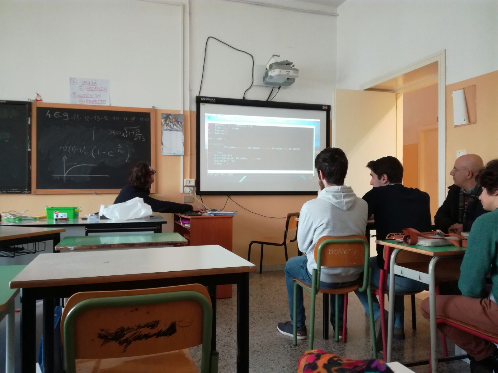
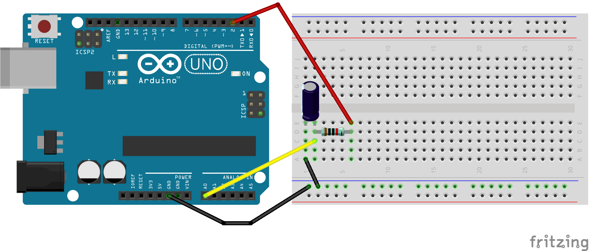
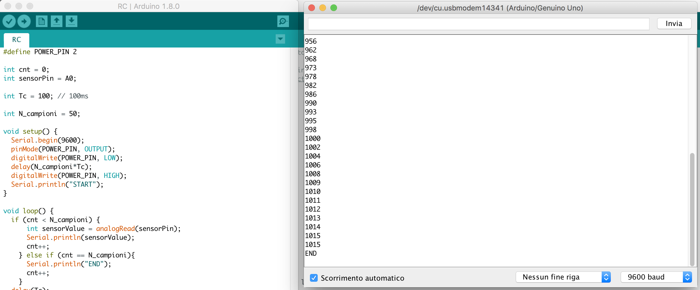
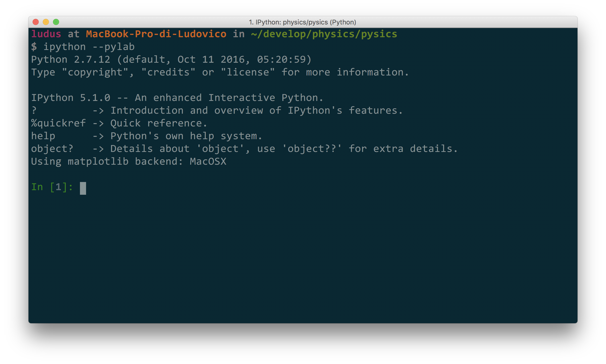
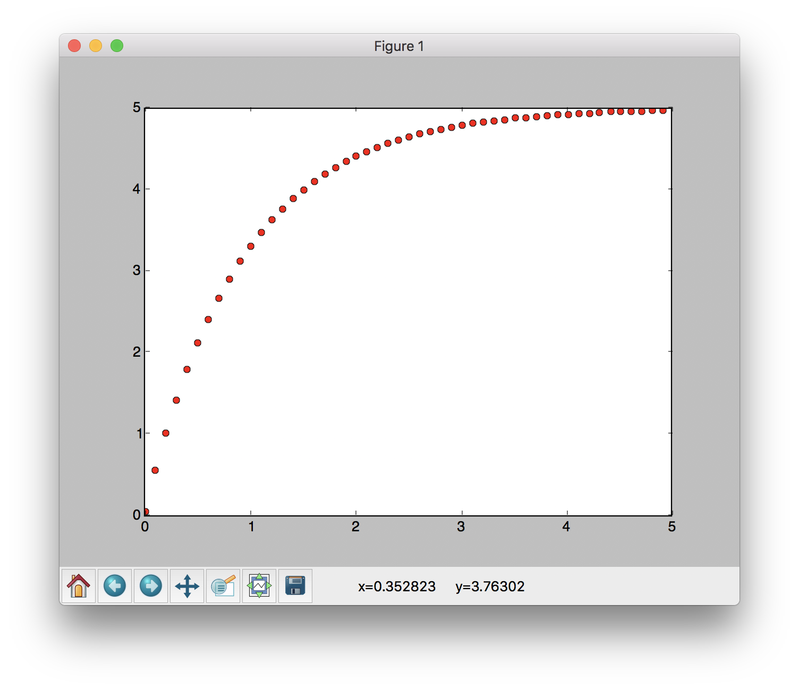
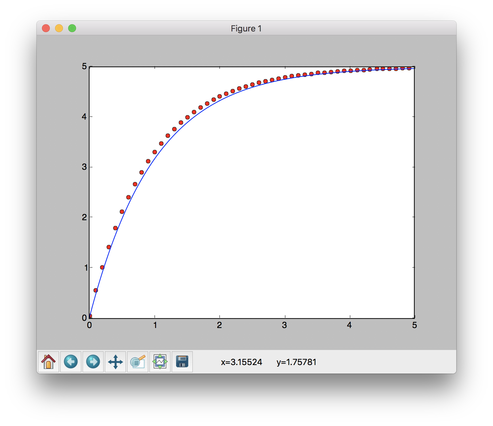

## Premessa

Recentemente sono stato contattato dalla mia ex scuola (Liceo G. Stampacchia di Tricase) per aiutare a creare un corso di robotica e automazione per i nuovi studenti del liceo. Ho preso molto a cuore l'iniziativa e sto supportando i professori e il preside nell'implementazione. Da questo progetto è nata, tra le varie cose, l'idea di iniziare a sperimentare l'accoppiata Python + Arduino (magari su un raspberry pi) per realizzare in modo semplice esperimenti di Fisica e Matematica. Dal mio punto di vista i vantaggi di questo approccio sono molteplici, ecco quelli che mi vengono in mente adesso:

- l'approccio è veramente multidisciplinare, invece del classico laboratorio di fisica, in cui gli studenti dovevano prendere ed elaborare a mano i dati, qui è richiesto allo studente di sviluppare il circuito di misura, scrivere codice Arduino a basso livello e utilizzare Python ad alto livello per l'elaborazione
- super divertente (almeno secondo me)
- molto economico da realizzare.

Come primo spunto, propongo un semplicissimo esperimento per la misura della carica di un condensatore in un circuito RC.

Nota: ho realizzato questo esperimento per dare alcuni spunti ai miei ex professori su cosa si può fare sfruttando queste tecnologie. Ancora non so se (e in che modo) si può proporre un'esperienza del genere agli studenti, ma credo fortemente che questi strumenti possano essere fortemente istruttivi!

## iPython e pyLab

**iPython** è un'interfaccia di comando per Python molto semplice da utilizzare e potente. In accoppiata con la libreria **matplotlib** permette di ottenere un perfetto tool di lavoro per l'analisi dei dati scientifico, comprendente tool per la visualizzazione grafica dei dati. Una volta installato, è possibile lanciare il tool con il comando bash

```
ipython --pylab
```

## Teoria sul circuito $RC$

Il circuito $RC$ è un semplice circuito elettronico composto da un condensatore (di capacità $C$) in serie ad una resistenza (di valore $R$). Lo scopo dell'esperimento è misurare l'evoluzione carica $Q$ del condensatore nel tempo, cioè l'andamento della differenza di potenziale $V$ ai terminali del condensatore quando il circuito viene alimentato. Si ricordi, infatti che $Q=CV$.

Noti i parametri $R$ e $C$, sappiamo che la differenza di potenziale $v(t)$ ai capi del consatore, al variare del tempo, è data da

$$
v(t) = V_\infty \cdot \left(1-e^{-\frac{t}{RC}}\right)
$$

dove $V_\infty$ è la tensione a cui viene alimentato il circuito $RC$, solitamente $V_\infty = 5V$.

## Implementazione

L'esperimento realizzato permette, sfruttando Arduino, di misurare l'andamento della tensione $v(t)$ ai due capi del condensatore e mandare (sfruttando la comunicazione seriale) a Python questi dati. Una volta acquisiti i dati possono venire elaborati sfruttando le potenzialità di **iPython**.

### Circuito

Il circuito sviluppato è mostrato nella figura seguente.
Materiale:

- Arduino UNO.
- Condensatore (nel mio caso un elettrolitico con $C=100\mu F$).
- Resistore (nel mio caso con $R=10k\Omega$).
- Breadboard.

Importante: dato che Arduino (specialmente quando comunica in seriale) non è capace di acquisire dati ad una frequenza molto elevata, per riuscire a prendere un numero adeguato di dati conviene scegliere valori di $R$ e $C$ abbastanza elevati, in modo da avere constanti di tempo dell'ordine di qualche di qualche secondo. Nel mio caso, ho scelto $\tau=RC=1s$ nominale.



Essendo il condensatore che ho utilizzato elettrolitico, i suoi terminali sono polarizzati, ossia è necessario collegare il terminale positivo (anodo) ad un punto del circuito avente potenziale più elevato rispetto al punto di collegamento del terminale negativo (catodo). Nel caso si utilizzi un condesatore ceramico, non è importante la polarità!

Colleghiamo quindi il catodo ($-$) del condensatore al PIN GND di Arduino ,e l'anodo ($+$) tramite breadboard al pin $A0$. Colleghiamo inoltre, per mezzo di una resistenza, l'anodo del condensatore al PIN $2$ di Arduino.

### Codice Arduino

Il codice Arduino che andremo ad implementare sfrutta il PIN $2$ per caricare e scaricare il condensatore. In fase di carica, utilizzando il PIN $A0$ misura il valore di carica sul considerare e invia i dati in seriale. Il codice che ho sviluppato raccoglie 50 campioni intervallati da un periodo di campionamento $Tc =100ms$.

È importante scegliere il tempo $Tc$ in modo da avere abbastanza campioni per valutare riuscire a ricostruire correttamente l'andamento del segnale.

Apro una piccola parantesi ingegneristica, esiste il [Teorema di Nyquist](https://it.wikipedia.org/wiki/Teorema_del_campionamento_di_Nyquist-Shannon) che impone che il tempo di campionamento di un qualisasi segnale temporale deve essere $T_c < \frac{1}{2}\tau_{min}$, dove $\tau_{min}$ è la più piccola costante di tempo di segnale stesso. In questo caso abbiamo una sola costante di tempo $\tau=RC=1s$, quindi dobbiamo scegliere $T_c< 0.5s$.

All'atto pratico, il mio consiglio è scegliere sempre $Tc =\frac{\tau}{10}$. Nel mio caso ho $\tau = 1s$ e quindi ho scelto $Tc = 100ms$.

Una volta scelto $Tc$ possiamo implementare il codice Arduino. Lo scopo del codice è:

- Scaricare il condensatore per un tempo appropriato $T=50\cdot Tc$.
- Iniziare il ciclo di carica.
- Campionare i dati di $v(t)$ e mandarli in seriale.

Il codice implementato è riportato di seguito.

```
# define POWER_PIN 2

int cnt = 0;
int sensorPin = A0;

int Tc = 100; // 100ms

int N_campioni = 50;

void setup() {
  Serial.begin(9600);
  pinMode(POWER_PIN, OUTPUT);
  digitalWrite(POWER_PIN, LOW);
  delay(N_campioni*Tc);
  digitalWrite(POWER_PIN, HIGH);
  Serial.println("START");
}

void loop() {
  if (cnt < N_campioni) {
      int sensorValue = analogRead(sensorPin);
      Serial.println(sensorValue);
      cnt++;
    } else if (cnt == N_campioni){
      Serial.println("END");
      cnt++;
    }
  delay(Tc);
}
```

#### Testiamo il codice

Una volta implementato e lanciato il codice in Arduino, possiamo testare il programma attraverso il serial monitor. Apriamo il serial monitor e resettiamo la scheda, il programma inizierà a scaricare il condensatore e poi a prendere i dati. Il tutto dovrebbe durare circa $10s$. Sul serial monitor dovreste vedere i valori misurati, come nella foto seguete



Se tutto funziona correttamente, possiamo passare all'utilizzo di Python per salvare i dati ed analizzarli.

### Utilizzo di Python e pyLab

Per utilizzare questi strumenti, è necessario installare sul computer le seguenti librerie

- iPython
- matplotlib
- pySerial

Le prime due servono per utilizzare in modo efficace e semplice tutta la potenza di pylab, l'ultima è una libreria che ci permette di sfruttare la comunicazione seriale per parlare con Arduino.

#### Scriviamo il codice per loggare i dati in seriale da Arduino

Creiamo un file chiamato `rc.py` in una cartella vuota, e implementiamo il seguente codice nel nuovo file.

```
from serial import Serial
import time

def get_data(port):
    print 'RESET CONDENSATORE....'
    times = []
    values = []
    ser = Serial(port)
    data = ser.readline().rstrip()
    while data != "START":
        data = ser.readline().rstrip()
    print 'STARTING....'
    while data != "END":
        data = ser.readline().rstrip()
        try:
            m = float(data)/1024.0 * 5
            times.append(time.time())
            values.append(m)
        except:
            continue
    print 'STOP....'
    ser.close()

    times = [t - times[0] for t in times]

    return times, values
```

Salviamo il file e apriamo la cartella all'interno del terminale.

#### Utilizzo di pyPlot

All'interno del terminale lanciamo iPython con PyLab utilizzando il seguente comando.

```
ipython --pylab
```

A questo punto, accedendo alla linea di comando di pyPlot, dovreste vedere una schermata simile alla seguente



#### Campionamento dei Dati

Perfetto, ora possiamo iniziare ad usare pyPlot in modo interattivo. Per prima cosa, bisogna importare il file `rc.py` ed utilizzarlo. Per farlo, eseguiamo i seguenti comandi:

Importiamo il file con il comando

```
import rc
```

Campioniamo i dati.

```
t_meas, v_meas = rc.get_data("/dev/ttyUSB0")
```

Nota 1: dobbiamo passare alla funzione `get_data` il nome della porta a cui Arduino è collegato. Per trovarla, basta verificare a quale porta è collegato Arduino sfruttando l'IDE di Arduino stesso.

Nota 2: Ricordate di chiudere il serial monitor dall'IDE di Arduino prima di eseguire il comando, altrimenti il canale di comunicazione risulterà occupato.

Una volta eseguita la funzione, dovremo aspettare la fine della procedura di acquisizione. A questo punto, troveremo i dati campionati all'interno delle due variabili `t_meas` e `v_meas`, che conterranno, rispettivamente, i tempi e i valori del dati campionati.

Per verificare che la procedura sia andata a buon fine, possiamo semplicemente digitare il nome di una delle due variabili e premere invio per stampare a schermo i valori contenuti all'interno.

#### Disegniamo i dati campionati

Per disegnare i dati possiamo eseguire il seguente comando

```
plot(t_meas, v_meas, 'ro')
```

A questo punto, dovrebbe apparire istantaneamente una nuova finestra con il grafico dei dati campionati



Nota: `plot` prende due parametri più un parametro opzionale. I primi due sono due vettori contenenti i dati da disegnare rispettivamente sull'asse $x$ e $y$. Il terzo parametro (opzionale) è una stringa che definisce lo stile del disegno. In questo caso `"ro"` significa "disegna i valori in rosso (r) con dei pallini (o)".

#### Verifichiamo la legge fisica

A questo punto, non ci resta che verificare la legge fisica che regola la carica del circuito $RC$. Per farlo, proviamo a simulare l'andamento della carica sfruttando la legge e sovrapponiamo la simulazione ai dati campionati, per vedere se combaciano.

Per farlo, creiamo prima di tutto una sequenza di valori di tempo da $0s$ a $5s$ abbastanza densa, con il comando

```
t_sim = arange(0,5,0.01)
```

Tramite il comando, abbiamo generato una sequenza di numeri da $0$ a $5$ a intervalli di $0.01$.

A questo punto, possiamo simulare l'equazione. Prima di tutto, bisogna definire le variabili $R$, $C$ e $V_\infty$.

Utilizzamo per farlo la notazione scientifica per definire i numeri.

```
R=10e3
C=100e-6
Vinf=5
```

A questo punto, possiamo implementare la legge e simulare i dati:

```
v_sim = Vinf*(1-exp(-t_sim/(R*C)))
```

Per finire, plottiamo i dati utilizzando il comando plot (questa volta su una linea continua di colore blu).

```
plot(t_sim, v_sim, 'b')
```

E, riaprendo la finestra dell'immagine, otterremo un grafico simile a questo



## Conclusioni

Ho ricevuto molti segnale interesse per questo esperimento da parte dei professori della mia scuola. Spero che questo tutorial, che non è perfetto e che andrà migliorato, possa aiutare qualcuno a fare didattica in modo più divertente.

Se avete suggerimenti, trovate errori o volete semplicemente contattarmi, mi trovate su [facebook](https://www.facebook.com/ludusrusso.cc/).

## Ringraziamenti

Alla stesura di questo documento hanno contribuito

- Prof. Michele Maffucci
- Prof. Giorgio de Nunzio
