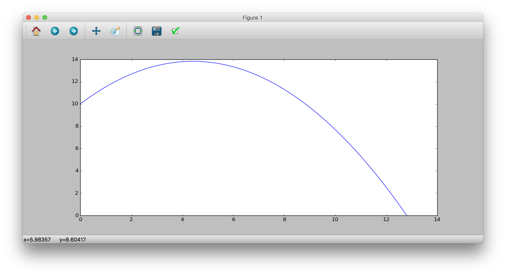
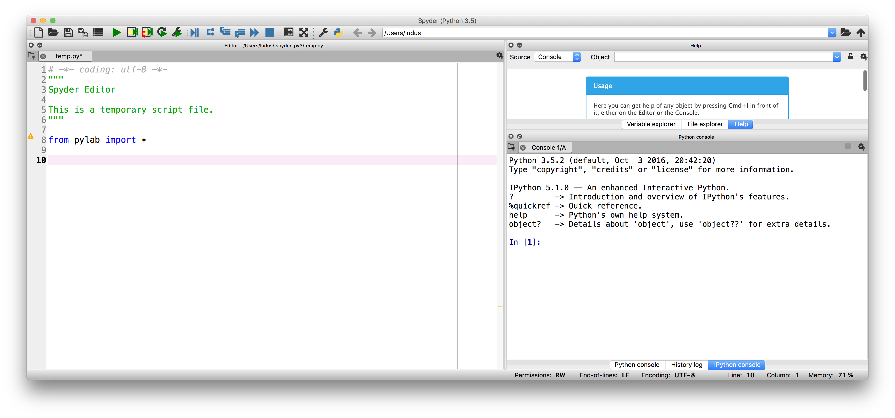
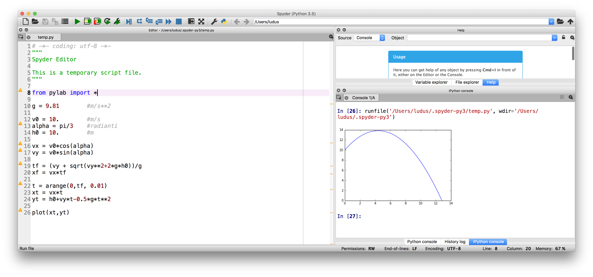

Eccomi qui con un brevissimo tutorial su come possiamo utilizzare [**Spyder**](http://www.ludusrusso.cc/posts/2017-01-12-spyder-un-altra-alternativa-in-python-a-matlab) per fare delle semplici simulazioni di fisica meccanica.

Come primo esperimento ho scelto di lavorare sul moto parabolico, classico problema di fisica del liceo che voglio provare a risolvere e simulare in Python utilizzando il tool **Spyder**.



## Scopo del tutorial

Quello che voglio fare, quindi, è scrivere un semplice e veloce programmino che permette di simulare il moto parabolico 2D, in particolare permettendo di

- calcolare gittata e tempo di volo;
- disegnare il grafico della traiettoria.

## Un po' di teoria

Si definisce _moto parabolico_ il moto bidimensionale di un corpo soggetto alla forza di gravità che percorre una traiettoria parabolica.

Se facciamo l'ipotesi che l'asse $X$ sia quello orizzontale e l'asse $Y$ quello verticale e che l'accelerazione di gravità agisca verso il basso, quindi nel verso negativo rispetto all'asse $Y$

Il moto parabolico è la composizione bidimensionale di due moti distinti:

- Un moto lineare uniforme $x(t) = v_x\cdot t$ lungo l'asse orizzontale $X$
- Un moto accelerato uniforme $y(t) = h_0 + v_y\cdot t - \frac{1}{2}gt^2$ lungo l'asse verticale $Y$

In forma vettoriale, scriveremo

$$
p(t) = \begin{pmatrix}x(t) \\ y(t)\end{pmatrix} = \begin{pmatrix} v_x\cdot t \\ h_0 + v_y\cdot t - \frac{1}{2}gt^2\end{pmatrix}
$$

Dove $g$ è l'accelerazione di gravità, $h_0$ è l'altezza iniziale a cui viene lanciato il grave e $v_x$ e $v_y$ sono le componenti della velocità iniziale lungo i due assi $X$ e $Y$.

$$
v_0 = \begin{pmatrix}v_x \\ v_y\end{pmatrix}
$$

Solitamente si considera $t_0=0$ come istante di partenza e $x_0=0$ come posizione di partenza lungo l'asse $x$.

Si noti che il moto parabolico termina quando si ha $y = 0$, si può quindi calcolare l'istante di tempo $t_f$ in cui il grave tocca terra ponendo

$$
y(t_f) = 0 \rightarrow h_0 + v_y\cdot t_f - \frac{1}{2}g t_f ^2 = 0
$$

che si risolve, in $t_f$, ottenendo

$$
t_f=\frac{v_y+\sqrt{v_y^2+2gh_0}}{g}
$$

Una volta calcolato $t_f$ possiamo calcolare la posizione $x_f = x(t_f)$ che corrisponde al punto sul terreno in cui il grave tocca terra:

$$
x_f = v_x\cdot t_f = v_x\frac{v_y+\sqrt{v_y^2+2gh_0}}{g}
$$

Non mi voglio addentrare su considerazioni fisiche e meccaniche e su semplificazioni della formula trovata, che si possono fare in casi particolari per cui $h_0=0$. Le soluzioni nella forma che abbiamo scritto fino ad ora bastano per poter risolvere il problema che ci siamo posti.

## Simulazione in Python e Spyder

Una volta scaricato e installato [**Spyder**](https://pythonhosted.org/spyder/installation.html) ci troveremo davanti ad una finestra simile a questa.



Nella finestra indicata come _Editor_ (a me è mostrata sulla destra), possiamo andare ad implementare il codice che poi verrà eseguito da python. Sulla finistra indicata come _Console_ potremo interagine utilizzando la console dinamica iPython. Per il momento, limitiamoci ad utilizzare l'editor di testo per rendere il programma più leggibile.

### Importiamo pyLab

Per prima cosa, è importante importare tutti gli elementi di pyLab. pyLab è una suit python che include utilissimi moduli per l'analisi dei dati, come funzioni e costati matematiche (ad esempio `sin` o la costante $\pi$ indicata con `pi`) o la libreria per plottare `plot`.

```
from pylab import *
```

A questo punto, possiamo definire alcune variabili e costanti che useremo nel codice. Prima di tutto, è importante definire l'accelerazione di gravità

### Definiamo variabili e costanti

```
g = 9.81        #m/s**2
```

e i valori numerici di velocità e altenzza iniziale.

```
v0 = 10.        #m/s
alpha = pi/3    #radianti
h0 = 10.        #m

```

Preferisco indicare la velocità iniziale utilizzando il suo modulo $v_0$ e l'angolo di inclinazione $\alpha$,
da cui possiamo calcolare le componenti $v_x$ e $v_y$ che useremo nel codice

```
vx = v0*cos(alpha)
vy = v0*sin(alpha)
```

### Calcoliamo tempo di volo e gittata

A questo punto, possiamo calcolare il tempo $t_f$ e la posizione $x_f$ finali del moto

```
tf = (vy + sqrt(vy**2+2*g*h0))/g
xf = vx*tf
```

### Simulazione

A questo punto, possiamo scrivere il codice per la simulazione ed il disegno. Notiamo che non ha senso far prolungare la simulazione oltre il tempo $t_f$. Per questo motivo, simuleremo solo nell'intervallo $t \in (0, t_f)$.

Per farlo, generiamo un `array` di campioni di tempo in questo intervallo ad un passo predefinito e piccolo, ad esempio $\Delta t = 0.01$ con il comando `arange`

```
t = arange(0,tf, 0.01)
```

Adesso possiamo calcolare i valori di $x(t)$ e $y(t)$ per ogni tempo nell'array definito implementando semplicemente le equazioni del moto

```
xt = vx*t
yt = h0+vy*t-0.5*g*t**2
```

Si noti che Python sa che `t` e un array, e quindi genera come risultato degli array contenenti i valori delle equazioni ad ogni elemento di `t`. Comodo, no?

A questo punto, possiamo finalmente _plottare_ (dall'inglese _plot_, cioè disegnare su un grafico) i due array.

```
plot(xt,yt)
```

### Codice completo

Qui sotto trovate il codice completo appena implementato

```python
# -*- coding: utf-8 -*-
"""
Spyder Editor

This is a temporary script file.
"""

from pylab import *

g = 9.81        #m/s**2

v0 = 10.        #m/s
alpha = pi/3    #radianti
h0 = 10.        #m

vx = v0*cos(alpha)
vy = v0*sin(alpha)

tf = (vy + sqrt(vy**2+2*g*h0))/g
xf = vx*tf

t = arange(0,tf, 0.01)
xt = vx*t
yt = h0+vy*t-0.5*g*t**2

plot(xt,yt)
```

### Lanciamo il programma

Una volta implementato il codice, possiamo lanciare il programma premento sulla freccina verde in alto all'editor **Spyder**. Una volta fatto, se non ci sono errori, vedremo apparire il grafico della simulazione sulla _console_ del nostro programma.



## Conclusioni

Come vedete, in pochissime linee di codice siamo riusciti a risolvere in moto automatico un classico problema di fisica meccanica di base. Essendo tutto calcolato dal programma, possiamo anche fare esperimenti cambiando l'angolo e il modulo della velocità iniziale e/o l'altezza $h_0$.

Buona sperimentazione a tutti!

## Ringraziamenti

Alla stesura di questo documento hanno partecipato:

- Prof. Basilio Bona
