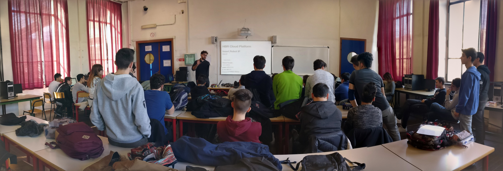

Vi presento la mia startup: ecco come riusciamo a insegnare la Cloud Robotics con Python e ROS.

Recentemente ho pochissimo tempo per scrivere articoli su questo blog. Non che non mi stia più interessando alla divulgazione, ma anzi, la mia attività di divulgazione si è fatta (e lo sarà per le prossime settimane) molto intensa in modalità offline.

Volevo condividere il mio lavoro con la startup che ho fondato insieme al mio socio Gabriele: HB Robotics.
**HB Robotics** ha una storia lunga che non vi racconterò in questa sede, se però qualcuno (che conosce l'inglese) è interessato può trovare tutti i dettagli [qui](http://mars42.org/blog/2017/1/4/hotblack-robotics-story).

## Che cosa facciamo?

Con HB Robotics, abbiamo sviluppato una piattaforma di Cloud Robotics che permette di programmare dei robot connessi ad internet in modo semplice e veloce! Il tutto si sviluppa sull'[idea (e sulla nostra idea) di **Cloud Robotics**](http://www.hotblackrobotics.com/blog/posts/2017-01-12-introduzione-e-visione-tecnologica-cloud-robotics-e-internet-delle-cose-l-internet-dei-robot).

Abbiamo iniziato un percorso di sperimentazione in una scuola di Torino: l'ITIS Avogadro, [in cui lavoreremo da qui fino a fine Aprile con 3 classi quarte](http://www.hotblackrobotics.com/blog/posts/2017-01-16-hb-robotics-allalternanza-scuola-lavoro-nellitis-avogadro).

Durante questo periodo, gli studenti potranno utilizzare la piattaforma di Cloud Robotics che sto sviluppando insieme al mio socio Gabriele. Abbiamo scelto come framework principale ROS (Robot Operating System) e come linguaggio di programmazione Python.

Se qualcuno è interessato a questo lavoro, trovate tutte le info [qui](http://www.hotblackrobotics.com/index).

Sto, inoltre, scrivendo un po' di tutorial che spiegano come utilizzare la piattaforma in accoppiata con Python. Trovate tutto [qui](http://www.hotblackrobotics.com/blog/categories/Tutorial/).
