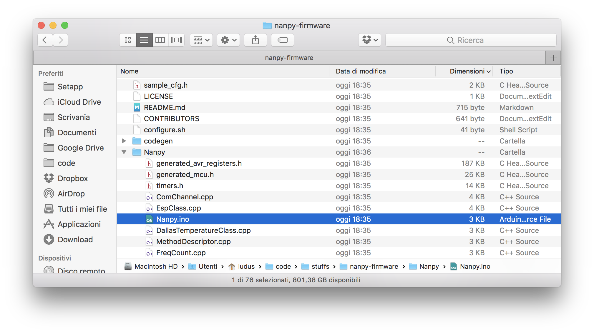
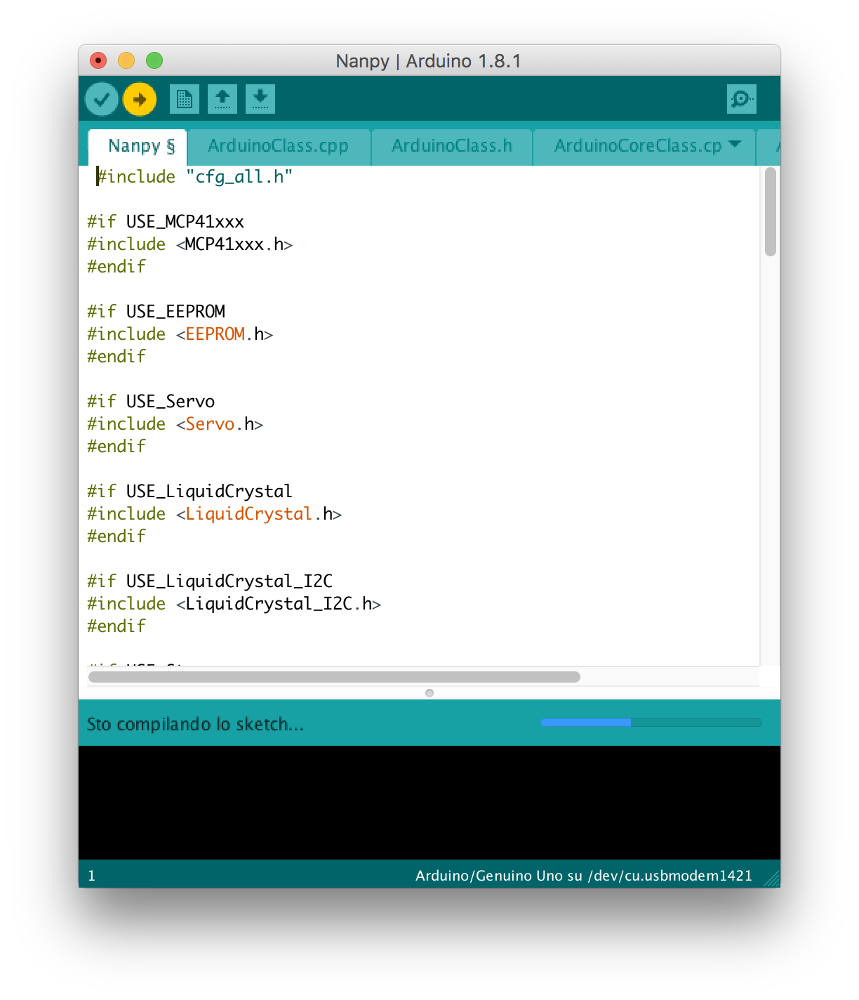
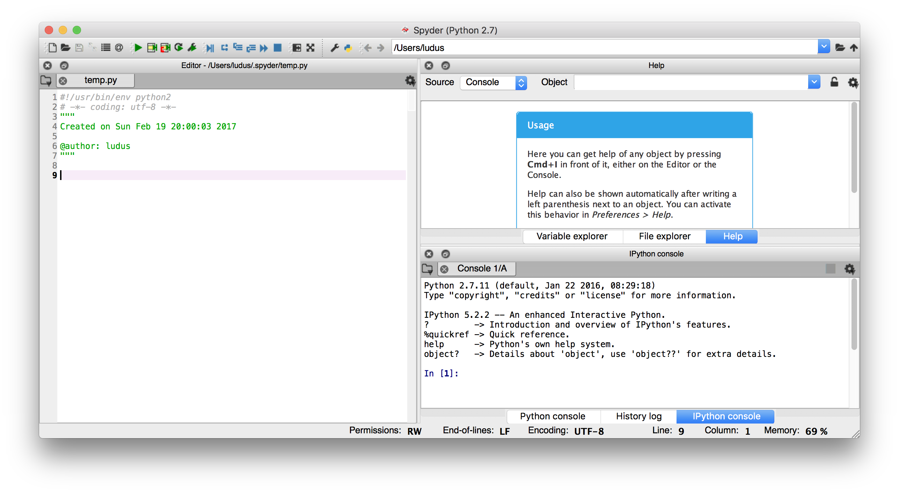
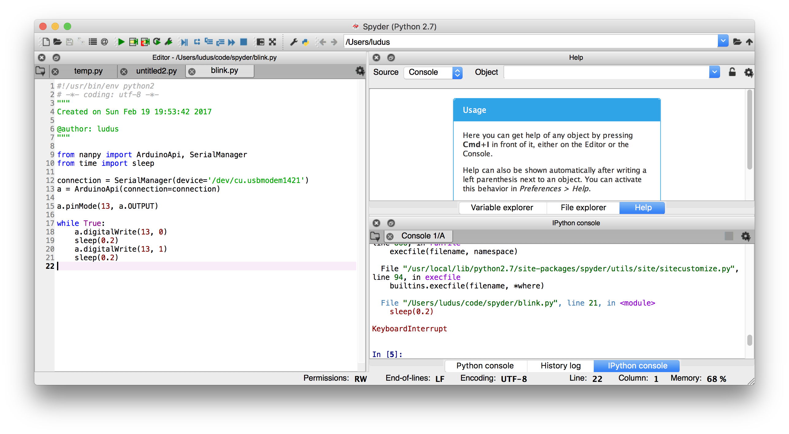

Ciao a tutti, finalmente riesco a trovare un po' di tempo per scrivere sul blog, che è stato trascurato a causa di vari impegni (tesi di PhD, StartUp, ecc.).


Durante la ricerca del sistema migliore per sviluppare la mia idea di laboratorio di fisica basata su Python e Arduino, mi sono imbattuto in un interessantissimo progetto chiamato [**nanpy**](https://github.com/nanpy/nanpy), che essenzialmente permette di programmare via Python un Arduino connesso in Seriale al Computer.

## Idea Base di Nanpy

Cerco brevemente di spiegare di cosa si tratta e coma funziona. Nanpy è l'insieme di due cose:

- un protocollo seriale che permette di inviare comandi ad Arduino
- una libreria Python che sfrutta questo protocollo

In poche parole, il nostro Arduino diventa uno _slave_, cioè non è più un dispositivo indipendente ma necessita di un computer vero e proprio che continuamente impartisce comandi che lui poi esegue! Questi comandi vengono mandati in Python.

Ovviamente questo metodo porta sia vantaggi che svantaggi. Gli svantaggi, come è ovvio, sono il fatto che non possiamo più utilizzare Arduino come un dispositivo separato dal computer. Nel nostro caso, questo non è un problema, in quanto il nostro scopo principale è quello di usare Arduino come scheda di acquisizione dati, che verranno comunque e sempre poi analizzati da un computer.

Un altro grosso svantaggio è il fatto che la comunicazione seriale fa da collo di bottiglia per la velocità del programma. Ma anche in questo caso, finchè non si ha la necessità di eseguire un programma molto velocemente, il problema è trascurabile.

I principali vantaggi sono che non dobbiamo più scrivere codice Arduino per ogni esperimento di fisica (a meno che questo non richieda dei compiti particolari, ma per il momento non succederà!) e possiamo sfruttare un singolo programma sviluppato in Python.

## Installazione del Firmware Nanpy su Arduino

**Nanpy-Firmware** è il programma che gira su Arduino in grado di comunicare via Seriale con la libreria Nanpy.

Per installarlo, prima di tutto è necessario scaricare il firmware da [questo link](https://github.com/nanpy/nanpy-firmware).

Una volta scaricata questa cartella, al suo interno troverete una cartella **Nanpy** con all'interno un file chiamato **Nanpy.ino**.



Aprite questo file nell'IDE di Arduino e lanciate il programma.



A me da un bel po' di warning di compilazione, ma l'installazione ed esecuzione su una scheda Arduino UNO non da nessun problema.

## Installazione della libreria Nanpy (su Spyder)

L'installazione della libreria **nampy** avviene tramite il package manager **pip** fornito da Python. Per installarla, quindi, basta eseguire, da linea di comando, l'istruzione

```bash
pip install nampy
```

Se volete installare Nanpy su **Spyder**, l'IDE Python open source per la programmazione scientifica, basta esegure l'istruzione

```python
!pip install nampy
```

all'interno della console iPython.

## Programma di esempio: Blink Arduino

Una volta installati libreria e firmware su Arduino, siamo pronti a scrivere il nostro primo programma Nanpy. Trattandosi di Arduino, come primo programma implementeremo un semplice programma che accende e spegne un LED (il classico Blink).

Come IDE, utilizzerò Spyder, ma ad ogni modo è possibilissimo implementare il programma con un qualsiasi IDE.



Una volta aperto Spyder, creiamo un nuovo file e implementiamo il seguente codice

```python
from nanpy import ArduinoApi, SerialManager
from time import sleep

connection = SerialManager(device='/dev/cu.usbmodem1421')
a = ArduinoApi(connection=connection)

a.pinMode(13, a.OUTPUT)

while True:
    a.digitalWrite(13, 0)
    sleep(0.2)
    a.digitalWrite(13, 1)
    sleep(0.2)
```



Salviamo il file dandogli il nome `blink.py` ed eseguiamolo. In fase di esecuzione, se tutto va bene, il vostro Arduino inizierà ad Accendere e Spegnere il led L (quello montato direttamente sulla scheda). Vedrete anche i led TX e RX lampeggiare, in quanto la comunicazione seriale sarà attiva, come spiegato sopra.

Per spegnere il programma, basta premere i tasti CTRL-C!

## Conclusioni

Ho fatto altri esperimenti con Nanpy che riporterò qui a breve. La mia idea, da qui in avanti, sarà di iniziare a sviluppare piccoli esperimenti di fisica utilizzando l'accoppiata Spyder e Arduino per mezzo della libreria Nanpy. Il primo esperimento (a cui sto già lavorando) che riporterò qui sarà lo stesso proposto in [questo post](http://www.ludusrusso.cc/posts/2017-01-04-arduino-python-lab-fisica-1) ma sviluppato sfruttando queste librerie!

Come al solito, per domande e suggerimenti contattatemi tramite [facebook](https://www.facebook.com/ludusrusso.cc/?fref=ts)!
