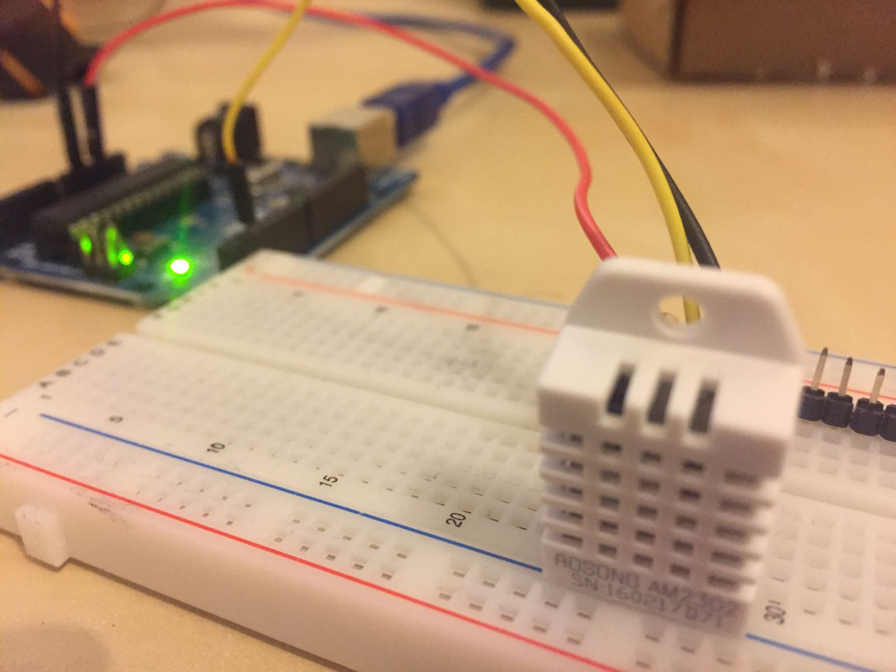
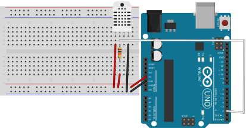

In attesa di trovare il tempo per finire la seconda parte del mio tutorial sui led,
scrivo questo breve tutorial per aiutare il mio amico Francesco a realizzare il suo progetto che prevede di utilizzare un Raspberry ed un Arduino per leggere dati di temperatura da un sensore DHT11.



Gli ho subito suggerito di utilizzare Nanpy per gestire la comunicazione tra Arduino e Raspberry, tuttavia è venuto fuori che la libreria Nanpy non gestisce il sensore in questione di default (anche se è abilitata a farlo). Bisogna quindi avere una attimo di pazienza per abilitare ed usare il sensore.

Vediamo insieme come fare!

##1. Scarichiamo nanpy-firmware

Per prima cosa, è necessario scaricare il firmware di Nanpy da [qui](https://github.com/nanpy/nanpy-firmware).

##2. Abilitiamo il sensore DHT

Una volta scaricato il firmware, apriamo la cartella ad editare il file `sample_cgf.h`

In particolare, modifichiamo la linea 65

```
#define USE_DHT                                     0
```

facendola diventare

```
#define USE_DHT                                     1
```

Una volta effettuata la modifica, copiamo questo file nella cartella `Nanpy` dandogli come nome `Nanpy/cfg.h` (per i più esperti, possiamo eseguire lo script `configure.sh`, che fa l'operazione di cui sopra).

##3. Importiamo le librerie in Arduino

A questo punto, non dobbiamo far altro che importare la cartella come libreria nell'IDE di Arduino. Insieme a questa, vanno anche importate due altre librerie da cui la gestione del sensore DHT deriva. Queste librerie sono

- [DHT Sensor Library](https://github.com/adafruit/DHT-sensor-library)
- [Adafruit Unified Sensor Driver](https://github.com/adafruit/Adafruit_Sensor)

Che devono essere scaricate dai link sopra e incluse come libreria di Arduino.

##4. Installiamo i Driver

Siamo pronti ad installare i driver! Per farlo, apriamo il file **Nanpy.ino** che si trova all'interno della libreria _nanpy-firmware_ ed eseguiamola su Arduino! Una volta installato, siamo pronti ad eseguire il nostro programma su Python!

##5. Circuito

Sviluppiamo un semplicissimo circuito per leggere i dati dal sensore. Io userò un sensore DHT22 (è uguale con un DHT11).



In particolare, dobbiamo collegare il PIN data del DHC (il secondo da sinistra) al PIN 2 di Arduino e all'alimentazione (5V) attraverso una resistenza da $10k\Omega$.

##6. Scriviamo un semplice programma Python

Perfetto, a questo punto, siamo pronti a scrivere il nostro programma python per leggere i sensori.

Ricordate, se non lo avete già fatto, di installare **Nanpy** come indicato [qui](http://www.ludusrusso.cc/posts/2017-02-19-python-arduino-nanpy).

A questo punto, possiamo implementare il codice. Sotto trovate un brevissimo esempio che vi mostra come leggere la temperatura dal Sensore.

```python
#!/usr/bin/env python

# Esempio di Utilizzo di DHT con Nanpy

from nanpy import DHT, SerialManager

# Creo una connessione sulla porta a cui è collegato Arduino
# e instanzio l'oggetto dht.
connection = SerialManager(device='/dev/cu.usbmodem1461')
dht = DHT(2, DHT.DHT22, connection=connection)

# DHT:
#	primo parametro: pin a cui è connesso
#  secondo parametro: tipo di sensore DHT.DHT22 o DHT.DHT11
#  terzo parametro: oggetto connection manager


# Con l'oggetto dht, posso leggere i valori di temperatura e umidità
# dht.readTemperature(False) ritorna la temperatura in Gradi Centigradi
# dht.readTemperature(True) ritorna la temperatura in Gradi Farenite
# dht.readHumidity() ritorna l'umidità

print("Temperatura: %.2f gradi Celcius" % dht.readTemperature(False))
print("Umidita': %.2f %%" % dht.readHumidity())
```

##7. Utilizzo delle altre funzioni della libreria Nanpy insieme a DHT.

Se volessimo utilizzare altre funzioni della libreria Nanpy, dobbiamo creare un secondo oggetto di tipo `ArduinoApi` e usarlo normalmente. Come nel programma sotto che accende e spegne un led e utilizza DHT per leggere l'umidità.

```python
from nanpy import DHT, SerialManager, ArduinoApi
from time import sleep

connection = SerialManager(device='/dev/cu.usbmodem1461')

dht = DHT(2, DHT.DHT22, connection=connection)
a = ArduinoApi(connection=connection)

a.pinMode(13, a.OUTPUT)


for i in range(1000):
    print("Umidita': %.2f %%" % dht.readHumidity())
    a.digitalWrite(13, (i + 1) % 2)
    sleep(0.2)
```
