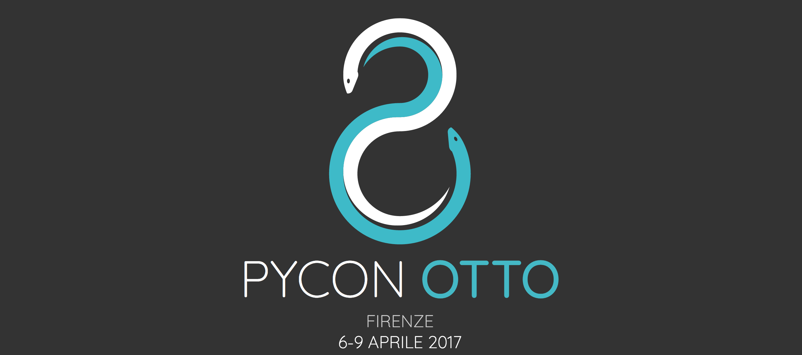

Chi mi segue, conosce la mia grande passione per il mondo dei Makers e per la programmazione (specialmente in Python).

Da un po' di tempo, sto cercando di fondere le mie passioni, aprendo il [mio blog](http://www.ludusrusso.cc/) e con la mia startup [HotBlack Robotics](http://www.hotblackrobotics.com/).
Cosa c'è di meglio quindi di una conferenza su Python per diffondere i miei interessi e per conoscerci?

Mi troverete quest'anno a [PyCon 8](http://www.pycon.it) con ben due trainig.

## Costruiamo un laboratorio di Fisica con Arduino e Python - Giovedì 6 Aprile, ore 15:30 - 18:30

Le recenti tecnologie utilizzate in ambito making (Arduino e Raspberry Pi) sono molto apprezzate in ambito didattico in quanto permettono, a bassissimo costo, di realizzare esperimenti di elettronica e di fisica in modo semplice. Inoltre, Python è sempre più apprezzato per l’elaborazione dei dati in ambito scientifico grazie alla sua semplicità e alla disponibilità di numerosi tool Open Source sviluppati per la programmazione scientifica.
Questo training si propone di utilizzare l’accoppiata Python e Arduino per sviluppare un laboratorio di fisica che possa essere utilizzato nelle scuole superiori per proporre esperimenti più o meno complessi in vari ambiti della fisica (meccanica, elettromagnetismo, ecc.). Questo lavoro nasce da un’esperienza fatta da me per il Liceo Scientifico G. Stampacchia di Tricase (LE). Liceo in cui ho studiato e con cui sto portando avanti alcune esperienze didattiche.

### Scopo del training

Il training è rivolto a insegnanti di fisica di scuole superiori e ad appassionati di fisica e programmazione. Il corso si propone di presentare alcuni esempi su come utilizzare la scheda Arduino e il linguaggio di programmazione Python per acquisire e analizzare dati dal mondo fisico. I partecipanti del training potranno progettare dei semplici esperimenti scientifici di fisica con tecnologie a basso costo.

### Materiale

I partecipanti del corso dovranno essere muniti di un PC o Mac con installato il software Spyder e l’IDE Arduino, che possono essere gratuitamente scaricati dai seguenti link:
Spyder: https://pythonhosted.org/spyder /installation.html
IDE Arduino: https://www.arduino.cc/en/Main/Software

### Programma:

Il programma del training è così organizzato:

- Introduzione
- Introduzione a Python e alla scheda di prototipazione Arduino
- Installazione dei Tool necessari
- Esperimento 1: circuito RC
- Esperimento 2: misura della costante di Plank con un LED
- Esperimento 3: Simuliamo un esopianeta
- Conclusioni e Domande

## Costruiamo L'Internet dei Robot - Domenica 9 Aprile - 9:00 - 13:00

La Cloud Robotics è una nuova tecnologia che parte dall’idea di connettere i robot ad internet. Grazie al Cloud, i robot sono più intelligenti ma anche più economici, in quanto possono demandare parte della loro “intelligenza” in remoto. La Cloud Robotics è legata al mondo dell’Internet of Things, e può essere vista come quella tecnologia che lega tra di loro la robotica e l’internet delle cose: da qui il nome Internet dei Robot.

Lo scopo del training è quello di introdurre i partecipanti alla programmazione di applicazioni robotiche connesse, sfruttando ROS (Robot Operating System) e la piattaforma HBR Cloud.

ROS, lo standard di fatto per lo sviluppo di applicazioni robotiche connesse, è un framework per la programmazione di Robot completamente Open Source. Offre API in Python che permettono, in modo semplice ed intuitivo, di mettere in comunicazione vari Robot tra di loro per mezzo di una connessione WiFi.
HBR Cloud è una piattaforma di cloud robotics sviluppata da HotBlack Robotics. Lo scopo è fornire un’infrastruttura per la gestione e sviluppo di applicazioni robotiche e permettere agli sviluppatori di programmare i robot in modo semplice.
Il workshop sarà incentrato sui DotBot, piccoli robottini Open Source che sono completamente compatibili con la piattaforma HBR. I robot (che verranno forniti dagli organizzatori) sono programmabili attraverso una WebApp sfruttando la libreria DotBot-ROS: una versione semplificata di ROS.

Il workshop è aperto a Makers e Appassionati di tecnologie interessati alla robotica ed all’hacking. Ad ogni partecipante verrà fornito un account gratuito come beta tester per l’utilizzo della piattaforma di HBR Cloud.

### Materiale:

- Un computer portatile con connessione Wi-Fi con installato Google Chrome.
- (Opzionale) un raspberry Pi con scheda SD su cui installare una propria versione di DotBot-Brain.

### Programma:

- Motivazioni (30min)
  - Cos’è l’Internet of Things e cosa vuol dire Cloud Robotics. Perché abbiamo coniato il termine Internet dei Robot?
  - Introduzione a ROS (Robot Operative System): scopo, finalità e funzionamento
  - Introduzione al Raspberry Pi
  - Perché progettare DotBot-R?
- Introduzione a DotBot-ROS (60min)
  - Utilizzo dell’IDE
  - libreria gpiozero
  - libreria DotBot-ROS
- Esperimenti su DotBot-ROS (2.5h)
  - Programmiamo un joystick via WebAPP!
  - Facciamo Intergire i Robot!
