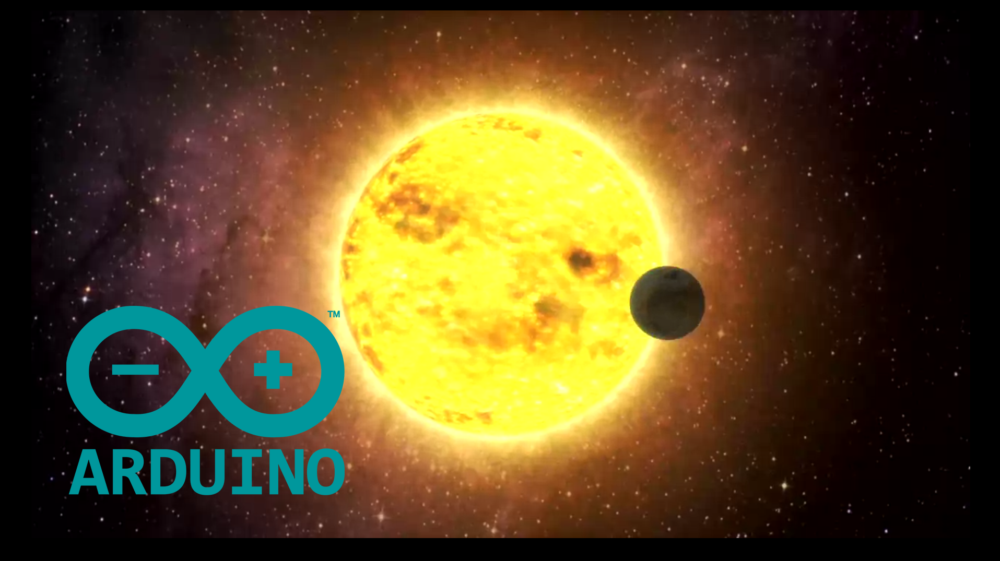
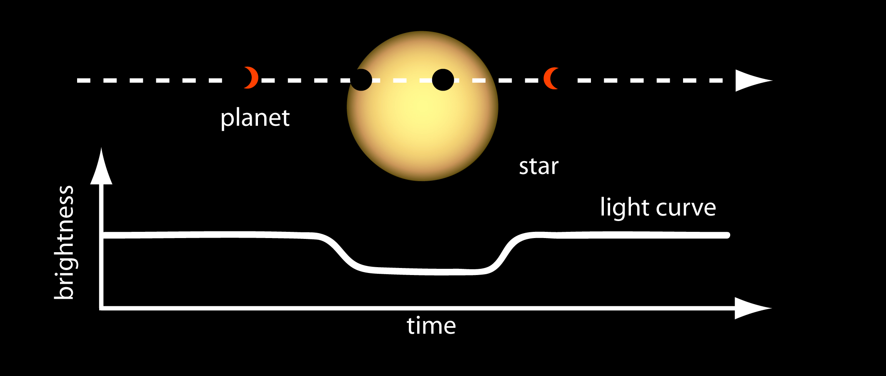
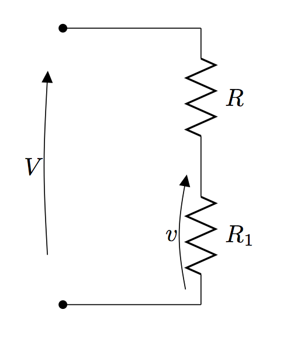
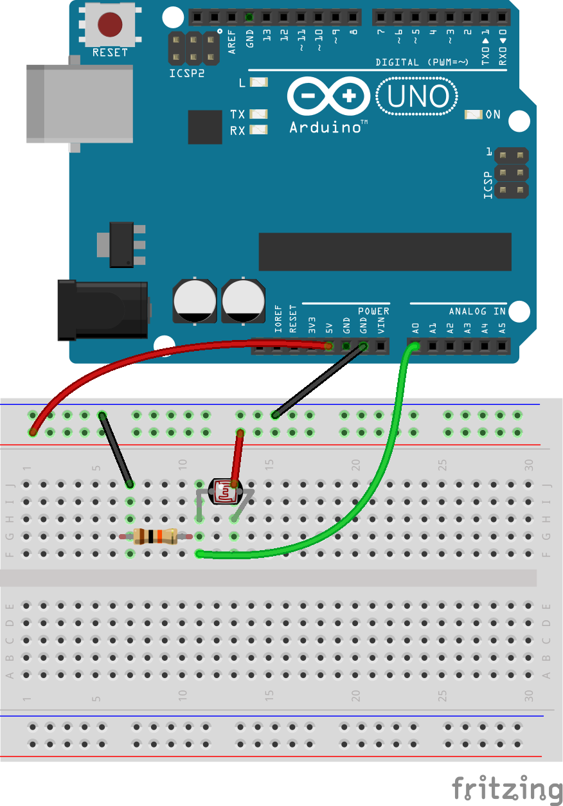
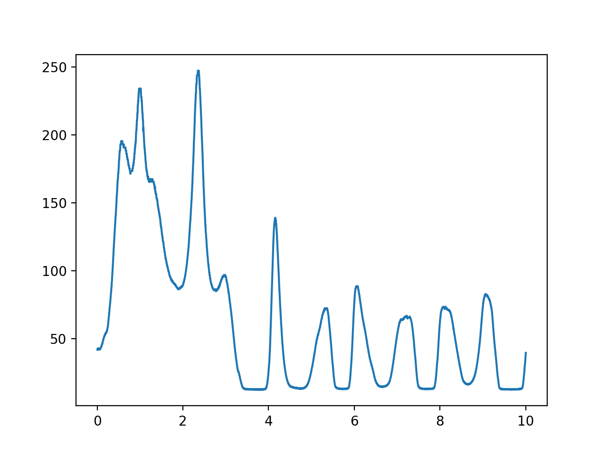
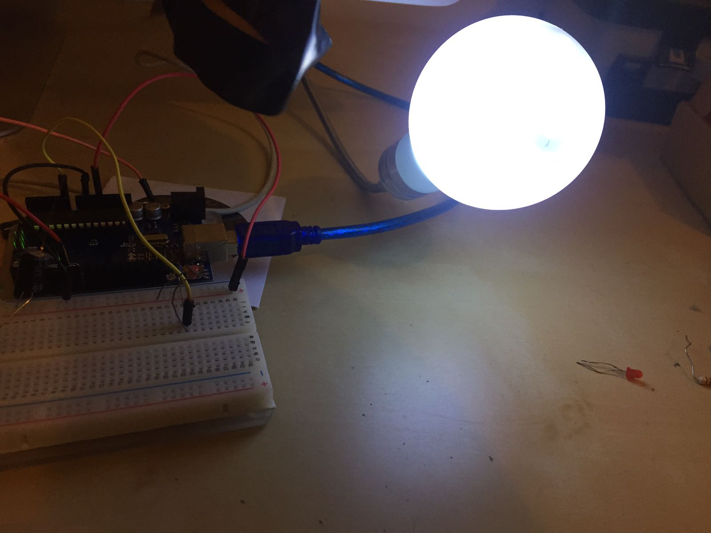
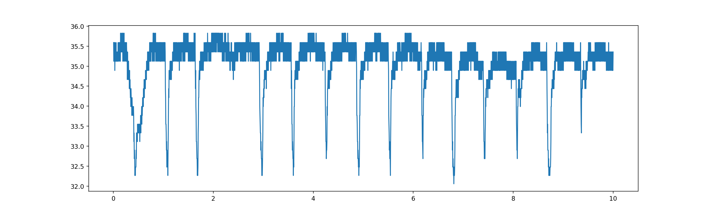
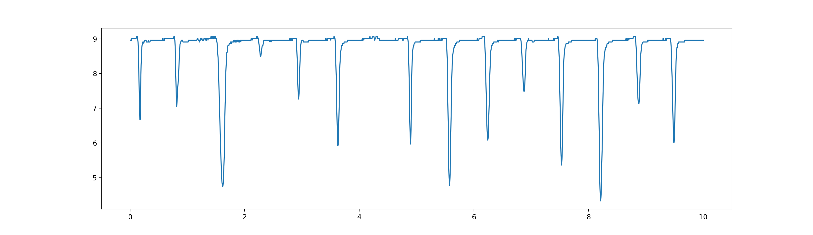

Un esopianeta (o pianeta extrasolare) è un pianeta che non appartiene al sistema solare, cioè un pianeta che orbita intorno ad una stella diversa dal sole.



Osserverare direttamente un esopianeta è quasi impossibile, a causa dell'elevata distanza che ci sapara dalle altre stelle. Infatti, dei circa 4 mila esopianeti attualmente conosciuti, solamente 22 sono stati osservati direttamente con il telescopio (trovate la lista completa [qui](https://en.wikipedia.org/wiki/List_of_directly_imaged_exoplanets)). E, in ogni caso, si tratta di pianeti molto grandi che orbitano molto distanti dalla loro stella madre.

Tutti gli altri pianeti sono stati scoperti grazie a metodi indiretti, cioè osservando gli effetti che la loro presenza causa sulla stella attorno a cui orbitano. Esistono veramente tantissimi metodi diversi di tipo indiretto, ma non è certamente lo scopo di questo articolo descriverli tutti (sono cose al di fuori delle mie competenze), ma per chi fosse interessato ad approfondire [Wikipedia offre una pagina molto approfondita sull'argomento](https://it.wikipedia.org/wiki/Metodi_di_individuazione_di_pianeti_extrasolari).

In questo articolo, prenderemo in esame il metodo di individuazione per **Transito**, che consiste semplicemente nel misurare un calo di luminosità della stella che si verifica quando il pianeta transita davanti alla stella stessa.
In seguito, con dei semplicissimi strumenti, riusciremo a ottenere dei dati molto simili a quelli che vengono ottenuti dai moderni telescopi quando misurano il transito di un pianeta.

## Individuare un Esopianeta con il metodo per Transito

Come già detto, questo metodo consiste nel misurare un piccolo calo di luminosità della stella dovuto al transito di un esopianeta davanti alla stella (rispetto al nostro punto di vista).



Ovviamente questo metodo ha molte limitazione, prima tra tutte, funziona solo se l'orbita del pianeta è esattamente perpendicolare al nostro punto di vista (ciò riduce di tantissimo il numero di esopianeti che possono essere scoperti con questa tecnica). Tuttavia, ha l'enorme vantaggio di poter funzionare anche a grandissime distanze ed essere utilizzato da semplici telescopi. È quindi possibile scansionare contemporaneamente grandi porzioni di cielo e poi concentrarsi sulle stelle su cui si osservano cali di luminosità.

La seconda grande limitazione deriva dal fatto che questo metodo è soggetto a tantissimi falsi positivi, in quanto questi cali possono avere molteplici cause. Ovvialmente è possibile misurare cali di luminosità periodici, però questo tipo di conferma non è praticamente applicabile per pianeti con orbita molto grande (che inpiegano decine o centinaia di anni per concludere un periodo). Per questo motivo, molto spesso questa tecnica viene utilizzata insieme ad altri metodi per avere la sicurezza che si tratti di un esopianeta.

## Misuratore di luminosità con Arduino e Python

Prima di iniziare l'esperimento vero e proprio, dobbiamo però costruire un semplice sensore di luminosità utilizzando Arduino, una resistenza ed un fotoresistenza.

### Fotoresistenza

Le fotoresistenze sono dispositivi molto semplici ed economici. Si comportano come normali resistenze elettriche, solo che cambiano il proprio valore di resistenza in base alla quantità di luce che incide la loro superficie. Possono quindi essere usati come sensori di luminosità, misurandone la resistenza e quindi ricavando la luminosità da essa.

Per ottenere una misura molto precisa della luminosità utilizzando una fotoresistenza è necessario calibrarla con un luxometro. Tuttavia, per l'esperimento che andrò qui a proporre, possiamo utilizzare i valori nominali (in quanto non è realmente importante la luminosità reale, ma solo la diminuzione della luminosità che andremo ad osservare).

In particolare, si può usare la seguente equazione per ottenere la luminosità (in lux) a partire dalla resitenza:

$$
L = b\cdot R^{-\alpha}
$$

Dove $b = 1.25\cdot 10^7$ e $\alpha = 1.5$.

### Costruiamo un Luxmetro con Arduino

Dalla equazione precente, siamo in grado di misurare la luminosità a partire dal valore della resistenza elettrica della fotoresistenza. Se riusciamo a misurare tale resistenza, siamo quindi in grado di misurare la luminosità!

Per fortuna, misurare una resistenza con Arduino è molto facile, e ci viene in auto un semplice circuito chiamato _partitore di tensione_, illustrato in figura.



Con questa configurazione, sappiamo che la tensione $v$ dipende da $R$ e $R_1$ secondo la seguente equazione

$$
v = \frac{R_1}{R+R_1}V
$$

Da cui, nota $R_1$ e misurando $v$ con Arduino, possiamo ricavare $R$ come segue

$$
R = \frac{V-v}{v}R_1
$$

#### Circuito

Implementiamo quindi il circuito con Arduino, utilizzando come resistenza $R_1$ una resistenza $R_1 = 10k\Omega$ e come resistenza $R$ il nostro fotoresistore. Alimentiamo il circuito con i $5V$ di Arduino (in questo modo avremo $V=5V$) e usiamo il PIN A0 per misurare la tensione $v$.



#### Codice

Andiamo quindi ad implementare una semplice funzione in Python per leggere il valore $v$ e ricavarne prima la resistenza $R$ e poi la luminosità $L$.
Come al solito, utilizzeremo la libreria **Nanpy**.

```python
from nanpy import ArduinoApi, SerialManager
from time import sleep

connection = SerialManager(device='/dev/cu.usbmodem1461')
a = ArduinoApi(connection=connection)

def luxmeter():
    v = a.analogRead(14) * 5.0/1023.0
    R = (5-v)/v*10e3

    alpha = 1.5
    b = 1.25e7

    L = b*R**(-alpha)
    return L, R
```

Come vedete, nella riga `v = a.analogRead(14) * 5.0/1023.0` leggo il valore di $v$ tramite il PIN A0, convertendo il valore letto da _bit_ in $V$.

A questo punto, posso calcolare il valore della resistenza $R$ e della luminosità $L$ con le equazioni viste sopra.

#### Test

Per verificare che tutto funzioni, eseguiamo il codice in _Spyder_ in modo da avere a disposizione la funzione `luxmeter` da linea di comando. A quel punto, possiamo provare a lanciare la funzione variando la luminosità della stanza dove ci troviamo, per verificare che i valori letti cambino.

Nel mio caso, ottengo i seguenti valori:

- Stanza buia: $R=383k\Omega$, $L=0.05lux$
- Stanza illuminata: $R=10.3k\Omega$, $L=12lux$
- Torcia del cellulare vicino alla fotoresistenza: $R=503\Omega$, $L=1107lux$

Non avendo un luxometro in casa, non ho modo di verificare la correttezza di tali valori, però, almeno qualitativamente, i dati sembrano tornare.

### Misuriamo l'andamento della luminosità nel tempo

Con la funzione `luxmeter` appena realizzata, possiamo anche misurare e disegnare l'andamento della luminosità nel tempo.

Implementiamo una seconda funzione che campiona i dati per un tempo $T$ (in secondi) definito come parametro, e plotta i dati nel tempo usando la funzione `plot`.

```python
def plot_lux(T):
    from datetime import datetime, timedelta
    start_time = datetime.now()
    stop_time = start_time + timedelta(0, T)

    times = []
    luxs = []

    while datetime.now() < stop_time:
        L, R = luxmeter()
        times.append((datetime.now() - start_time).total_seconds())
        luxs.append(L)

    plot(times, luxs)
```

Con questa funzione, possiamo quindi disegnare come varia la luminosità nella stanza. Questo è un esempio ottenuto lanciando la funzione `plot_lux(10)` (quindi campionando per $10$ secondi) e muovendo casualemtne la torcia del cellulare sopra il sensore.



## Simuliamo un esopianeta utilzzando una lampadina, una pallina ed un filo

Siamo pronti a tornare a parlare del metodo di transito da cui eravamo partiti: un modo molto semplice per simulare gli effetti del transito di un esopianeta sulla luminosità della stella madre, è quello di utilizzare una pallina legata con uno spago che "orbita" attorno ad una lampadina accesa.
In questo modo, ogni volta che la pallina passa davanti alla lampadina, si verificherà subito un calo di luminosità della stessa.



Utilizzando il luxometro appena costruito, possiamo quindi disegnare l'andamento della luminosità visto dalla fotoresistenza, e quindi visualizzare il calo di luminosità causato dal transito della pallina attorno alla lampadina. L'esperimento di per se è molto semplice:
nel mio caso, ho usato una lampadina USB (che si attacca direttamente al computer, molto comoda da utilizzare), e una pallina da pingpong legata con uno spago. Ho fatto girare la pallina intorno alla lampadina tenendola per una mano, e ho eseguito il campionamento con $T=10s$, ottenendo il grafico qui sotto.



Ho ripetuto lo stesso esperiendo però spegnendo la luce della camera, in modo da far risaltare meglio il transito:



Come potete vedere, nel primo caso il salto di luminosità nel momento di passaggio va da $35.5lux$ a $32.5lux$ (circa il $10%$), mentre nel secondo caso, il salto (in percentuale) è molto più elevato ($>50\%$) e la curva meno rumorosa. Ad ogni modo, da entrambi i grafici è possibilissimo stimare il periodo di rotazione della pallina.

Che ve ne pare di questo esperimento? Avete provato a farlo? Ci siete riusciti? Non avremo certamente scoperto un nuovo esopianeta, ma in poco tempo e con pochissimo materiale siamo certamente riusciti a creare un interessantissimo esperimento didattico.

Avete suggermienti/critiche? Mi trovate su facebook alla pagina [Ludus Russo](https://www.facebook.com/ludusrusso.cc/).
