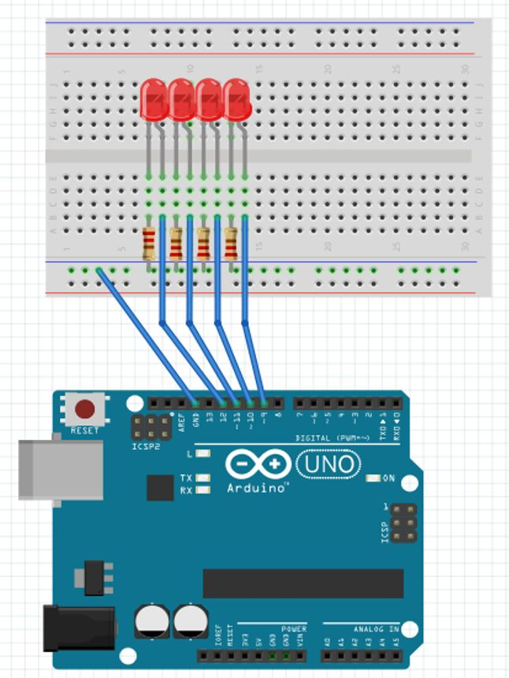

A poche ore dal corso che ho tenuto ieri al mio vecchio Liceo, già iniziano ad nascere progetti interessanti dei partecipanti. Alcuni ragazzi, in particolare, mi hanno stupito, in quanto in pochissimo tempo e con poco supporto sono riusciti a realizzare un bot telegram in grado di mandare comandi ad Arduino.

<iframe width="100%" height="400px" src="https://www.youtube-nocookie.com/embed/PHGNhq8j1JU" frameborder="0" allowfullscreen></iframe>

Ho chiesto loro di scrivere questo breve tutorial per realizzare il progetto.

## Tutorial: realizzare un bot telegram per controllare Arduino

Ormai sono veramente tanti i progetti realizzati con Arduino, e una delle cose a mio giudizio più interessanti è la possibilità di attivare Arduino a distanza tramite dispositivi mobili. Così, in occasione di un corso tenuto al liceo G. Stampacchia di Tricase da Ludovico Russo, ho iniziato a programmare un bot su Telegram che facesse accendere o spegnere vari led ad Arduino, perfezionandolo poi a casa.

Il risultato che ho ottenuto mi ha molto soddisfatto, anche perchè sono riuscito a rimediare a delle piccole imperfezioni che avevo riscontrato all'inizio e che non mi piacevano. Scriverò quindi questo tutorial per spiegarvi di preciso cosa e come ho fatto.

### 1. Cosa serve

- Arduino UNO
- cavo USB per Arduino
- breadboard
- 4 LED di colori diversi (blu, rosso, giallo, verde)
- 4 resistenze da 330Ω
- 5 jumper
- l'IDE Arduino, scaricabile da [qui](https://www.arduino.cc/en/main/software)
- la piattaforma Anaconda, scaricabile da [qui](https://www.continuum.io/downloads)
- il firmware nanpy di Ludovico, scaricabile da [qui](https://github.com/ludusrusso/nanpy-firmware)
- l'app Telegram

### 2. Come collegare le varie componenti

Lo schema per collegare tutte le componenti ad Arduino è il seguente:


### 3. Come preparare Arduino

Basta aprire il file nanpy-firmware-master/Nanpy/Nanpy.ino dalla cartella del firmware nanpy con l'IDE Arduino e caricarlo su Arduino UNO.

### 4. Come creare il bot di Telegram

Questa fase si divide in due parti: la prima va fatta dal dispositivo su cui c'è installata l'app di Telegram, la seconda dal computer su cui si è installato Anaconda.

#### 4.1 Da dispositivo

Bisogna cercare su Telegram il bot BotFather e avviarlo.

Tramite il comando `/newbot` si avvierà la procedura di creazione che consiste nel dare un nome ed uno username (quest'ultimo deve essere univoco) al bot. BotFather invierà quindi un codice, detto token, che noi potremmo in seguito usare per modificare il bot stesso.

#### 4.2 Da computer

Aprire Anaconda Navigator (che non useremo direttamente) e Spyder, su cui scriveremo il codice vero e proprio.
Se è la prima volta che si usa Spyder, bisogna installare la libreria nanpy. Per fare ciò è sufficiente inserire nella IPython console (in basso a destra) il codice

```sh
! pip install telepot nanpy
```

Una volta installata, viene la parte di vera e propria programmazione (in Python). Bisogna infatti scrivere nell'editor principale di Spyder il codice che detta il comportamento del bot. nel nostro caso il codice è questo:

```sh
import telepot
import time
from nanpy import ArduinoApi, SerialManager
from telepot.namedtuple import InlineKeyboardMarkup, InlineKeyboardButton


connection = SerialManager(device='COM3') #eventualmente cambiare la porta COM3
a = ArduinoApi(connection=connection)     #con quella effettivamente usata
a.pinMode(12, a.OUTPUT)
a.pinMode(11, a.OUTPUT)
a.pinMode(10, a.OUTPUT)
a.pinMode(9, a.OUTPUT)

def on_chat_message(msg): #crea la tastiera personalizzata
    content_type, chat_type, chat_id = telepot.glance(msg)

    keyboard = InlineKeyboardMarkup(inline_keyboard=[[InlineKeyboardButton(text="Blu", callback_data='/blu'), InlineKeyboardButton(text="Rosso", callback_data='/rosso')],
                                     [InlineKeyboardButton(text="Verde", callback_data='/verde'), InlineKeyboardButton(text="Giallo", callback_data='/giallo')]])

    bot.sendMessage(chat_id, 'Premi un pulsante per cambiare lo stato del led corrispondente', reply_markup=keyboard)


def on_callback_query(msg): #aziona i vari LED in base al pulsante toccato
    query_id, from_id, query_data = telepot.glance(msg, flavor='callback_query')
    print('Callback Query:', query_id, from_id, query_data)

    if query_data == '/blu':
         if a.digitalRead(12)==0:
                a.digitalWrite(12, 1)
                bot.answerCallbackQuery(query_id, text='Blu acceso')
         else:
                    a.digitalWrite(12, 0)
                    bot.answerCallbackQuery(query_id, text='Blu spento')
    elif query_data == '/rosso':
                        if a.digitalRead(11)==0:
                            a.digitalWrite(11, 1)
                            bot.answerCallbackQuery(query_id, text='Rosso acceso')
                        else:
                            a.digitalWrite(11, 0)
                            bot.answerCallbackQuery(query_id, text='Rosso spento')

    elif query_data == '/verde':
            if a.digitalRead(10)==0:
                a.digitalWrite(10, 1)
                bot.answerCallbackQuery(query_id, text='Verde acceso')
            else:
                a.digitalWrite(10, 0)
                bot.answerCallbackQuery(query_id, text='Verde spento')

    elif query_data == '/giallo':
            if a.digitalRead(9)==0:
                a.digitalWrite(9, 1)
                bot.answerCallbackQuery(query_id, text='Giallo acceso')
            else:
                a.digitalWrite(9, 0)
                bot.answerCallbackQuery(query_id, text='Giallo spento')


bot=telepot.Bot('*inserire il token del proprio bot*')
bot.message_loop({'chat': on_chat_message,
                  'callback_query': on_callback_query})
print ('Listening ...')

while 1:
    time.sleep(10)

```

A questo punto bisogna eseguire il file e, se tutto è andato bene, il bot di Telegram farà accendere e spegnere i LED che vogliamo notificandoci di volta in volta cosa è successo con l'ultima azione.

Ecco un esempio di chat il con bot


## Autori

- Matteo Protopapa
- Giuseppe Galilei
- Gianvito Marzo
