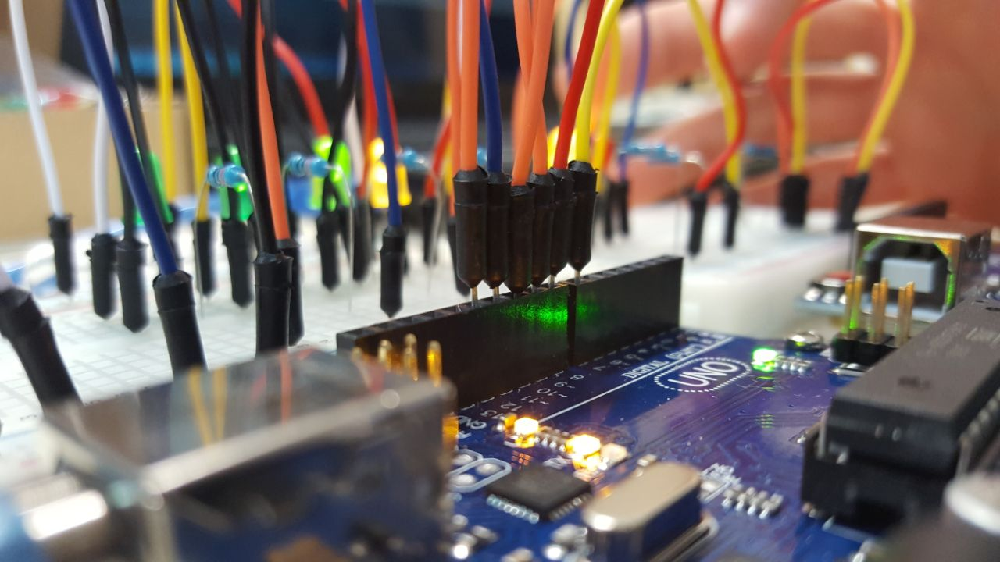

È stato veramente divertente aver organizzato e tenuto il mio primo corso di Arduino nella mia vecchia scuola, il Liceo G. Stampacchia di Tricase.

Tantissimo l'interesse e l'entusiamo dei partecipanti, non solo studenti ma anche professori sia del liceo che di scuola primaria.

Tantissimi anche i progetti e le idee dei partecipanti che, dopo poche ore di introduzione ad Arduino, sono riusciti in pochissimo tempo e realizzare!

Un grandissimo ringraziamento va al dirigente scolastico Mauro Polimeno, che ci ha dato l'opportunità e gli spazi per organizzare il corso, e ad Andrea Rizzo per avermi aiutato durante tutta la giornata di ieri.
E un grazie a tutti i partecipanti per l'entusiasmo dimostrato!!

